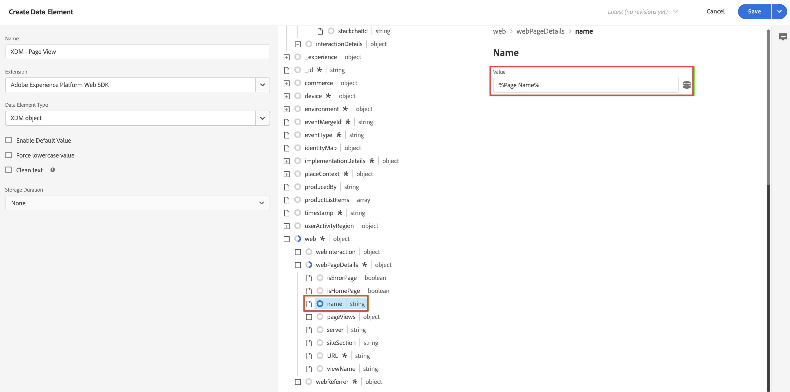

# Aggiungere la logica di raccolta dati XDM al tag

>[!NOTE]
> 
>Segui i passaggi descritti in questa pagina solo dopo aver completato tutti i passaggi di aggiornamento precedenti. Puoi seguire i [passaggi di aggiornamento consigliati](/help/getting-started/cja-upgrade/cja-upgrade-recommendations.md#recommended-upgrade-steps-for-most-organizations), oppure puoi seguire i passaggi di aggiornamento generati in modo dinamico per la tua organizzazione con il [questionario di aggiornamento da Adobe Analytics a Customer Journey Analytics](https://gigazelle.github.io/cja-ttv/).
>
>Dopo aver completato i passaggi descritti in questa pagina, continua seguendo i passaggi di aggiornamento consigliati o generati in modo dinamico.

Dopo la [creazione del tag e l&#39;aggiunta dell&#39;estensione Web SDK](/help/getting-started/cja-upgrade/cja-upgrade-tag-property.md), è necessario configurarlo con elementi dati e regole, in base alla modalità di tracciamento del sito e di invio dei dati a Adobe Experience Platform. Dopo aver configurato gli elementi dati e le regole per il tag, puoi generarlo e pubblicarlo.

## Configurare gli elementi dati

Gli elementi dati sono i blocchi costitutivi per il dizionario dati (o mappa dati). Utilizza elementi dati per raccogliere, organizzare e distribuire dati in tutta la tecnologia marketing e pubblicitaria. Puoi impostare elementi dati nel tag che leggono dal livello dati e possono essere utilizzati per inviare dati ad Adobe Experience Platform.

Esistono diversi tipi di elementi dati. Innanzitutto, imposta un elemento dati per acquisire il nome della pagina che le persone visualizzano sul tuo sito. Quindi, imposta un elemento dati che fa riferimento all’ID Experience Cloud. Infine, definisci un elemento dati dell’oggetto XDM.

### Elemento dati Nome pagina

Per definire un elemento dati nome pagina:

1. Accedi a experience.adobe.com utilizzando le credenziali Adobe ID.

1. In Adobe Experience Platform, vai a **[!UICONTROL Data Collection]** > **[!UICONTROL Tags]**.

1. Seleziona il tag appena creato dall’elenco [!UICONTROL Tag Properties] (Proprietà tag) per aprirlo.

1. Seleziona **[!UICONTROL Data Elements]** (Elementi dati) nella barra a sinistra.

1. Seleziona **[!UICONTROL Add Data Element]** (Aggiungi elemento dati).

1. Nella finestra di dialogo [!UICONTROL Create Data Element], specifica le seguenti informazioni:

   * **[!UICONTROL Name]**: nome dell&#39;elemento dati. Ad esempio `Page Name`.

   * **[!UICONTROL Extension]**: selezionare **[!UICONTROL Core]** dall&#39;elenco.

   * **[!UICONTROL Data Element Type]**: selezionare **[!UICONTROL Page Info]** dall&#39;elenco.

   * **[!UICONTROL Attribute]**: selezionare **[!UICONTROL Title]** dall&#39;elenco.

     

     In alternativa, puoi usare il valore da una variabile del livello dati, ad esempio `pageName` e il tipo di elemento dati [!UICONTROL JavaScript Variable] (Variabile JavaScript) per definire l’elemento dati.

     

1. Seleziona **[!UICONTROL Save]** (Salva).

   Ora immagina di voler impostare un elemento dati che faccia riferimento all’ID Experience Cloud fornito automaticamente dall’SDK per Web Adobe Experience Platform e disponibile tramite l’estensione Experience Cloud ID Service.

1. Continua con [elemento dati ECID](#ecid-data-element).

### Elemento dati ECID

Per definire un elemento dati ECID:

1. Accedi a experience.adobe.com utilizzando le credenziali Adobe ID.

1. In Adobe Experience Platform, vai a **[!UICONTROL Data Collection]** > **[!UICONTROL Tags]**.

1. Seleziona il tag appena creato dall’elenco [!UICONTROL Tag Properties] (Proprietà tag) per aprirlo.

1. Seleziona **[!UICONTROL Data Elements]** (Elementi dati) nella barra a sinistra.

1. Seleziona **[!UICONTROL Add Data Element]** (Aggiungi elemento dati).

1. Nella finestra di dialogo [!UICONTROL Create Data Element], specifica le seguenti informazioni:

   * **[!UICONTROL Name]**: nome dell&#39;elemento dati. Ad esempio `ECID`.

   * **[!UICONTROL Extension]**: selezionare **[!UICONTROL Experience Cloud ID Service]** dall&#39;elenco.

   * **[!UICONTROL Data Element Type]**: selezionare **[!UICONTROL ECID]** dall&#39;elenco.

     

1. Seleziona **[!UICONTROL Save]** (Salva).

1. Continua con [elemento dati oggetto XDM](#xdm-object-data-element).

### Elemento dati oggetto XDM

Infine, ora immagina di voler mappare uno qualsiasi degli elementi dati specifici allo schema definito in precedenza. Puoi definire un altro elemento dati che fornisce una rappresentazione dello schema XDM.

Per definire un elemento dati oggetto XDM:

1. Accedi a experience.adobe.com utilizzando le credenziali Adobe ID.

1. In Adobe Experience Platform, vai a **[!UICONTROL Data Collection]** > **[!UICONTROL Tags]**.

1. Seleziona il tag appena creato dall’elenco [!UICONTROL Tag Properties] (Proprietà tag) per aprirlo.

1. Seleziona **[!UICONTROL Data Elements]** (Elementi dati) nella barra a sinistra.

1. Seleziona **[!UICONTROL Add Data Element]** (Aggiungi elemento dati).

1. Nella finestra di dialogo [!UICONTROL Create Data Element], specifica le seguenti informazioni:

   * **[!UICONTROL Name]**: nome dell&#39;elemento dati. Ad esempio `XDM - Page View`.

   * **[!UICONTROL Extension]**: selezionare **[!UICONTROL Adobe Experience Platform Web SDK]** dall&#39;elenco.

   * **[!UICONTROL Data Element Type]**: selezionare **[!UICONTROL XDM Object]** dall&#39;elenco.

   * **[!UICONTROL Sandbox]**: seleziona la sandbox dall&#39;elenco.

   * **[!UICONTROL Schema]**: selezionare lo schema dall&#39;elenco.

1. Mappa l’attributo `identification > core > ecid` all’elemento dati ECID, definito nello schema. Seleziona l’icona del cilindro per scegliere facilmente l’elemento dati ECID dall’elenco degli elementi dati.

   

   

1. Mappa l’attributo `web > webPageDetails > name` all’elemento dati Page Name (Nome pagina), definito nello schema.

   

1. Seleziona **[!UICONTROL Save]** (Salva).

1. Continua con [Configura regole](#configure-rules).

## **Configura regole**

I tag in Adobe Experience Platform seguono un sistema basato su regole. Cercano le interazione degli utenti e i relativi dati. Quando i criteri descritti nelle tue regole vengono soddisfatti, la regola attiva l’estensione, lo script o il codice lato client identificato. Puoi utilizzare le regole per inviare dati (come un oggetto XDM) in Adobe Experience Platform utilizzando l’estensione Adobe Experience Platform Web SDK.

Per definire una regola:

>[!NOTE]
>
>I passaggi seguenti sono un esempio di definizione di una regola che invia a Adobe Experience Platform dati XDM, contenenti valori da altri elementi di dati.
>
>Puoi utilizzare le regole in vari modi nel tag per manipolare le variabili (utilizzando gli elementi dati).
>
>Per ulteriori informazioni, consulta la sezione [Regole](https://experienceleague.adobe.com/docs/experience-platform/tags/ui/rules.html?lang=it) per ulteriori informazioni.

1. Accedi a experience.adobe.com utilizzando le credenziali Adobe ID.

1. In Adobe Experience Platform, vai a **[!UICONTROL Data Collection]** > **[!UICONTROL Tags]**.

1. Seleziona il tag appena creato dall’elenco [!UICONTROL Tag Properties] (Proprietà tag) per aprirlo.

1. Seleziona **[!UICONTROL Rules]** (Elementi dati) nella barra a sinistra.

1. Seleziona **[!UICONTROL Create New Rule]** (Aggiungi elemento dati).

1. Nella finestra di dialogo [!UICONTROL Create Rule], specifica le seguenti informazioni:

   * **[!UICONTROL Name]**: nome della regola. Ad esempio `Page View`.

   * **[!UICONTROL Events]**: Selezionare **[!UICONTROL + Add]**. Quindi, nella finestra di dialogo [!UICONTROL Event Configuration], specifica le seguenti informazioni. Al termine, selezionare **[!UICONTROL Keep Changes]**.

      * **[!UICONTROL Extension]**: selezionare **[!UICONTROL Core]** dall&#39;elenco.

      * **[!UICONTROL Event Type]**: selezionare **[!UICONTROL Window Loaded]** dall&#39;elenco.

        

   * **[!UICONTROL Actions]**: Selezionare **[!UICONTROL + Add]**. Quindi, nella finestra di dialogo [!UICONTROL Action Configuration], specifica le seguenti informazioni. Al termine, selezionare **[!UICONTROL Keep Changes]**.

      * **[!UICONTROL Extension]**: selezionare **[!UICONTROL Adobe Experience Platform Web SDK]** dall&#39;elenco.

      * **[!UICONTROL Action Type]**: selezionare **[!UICONTROL Send Event]** dall&#39;elenco.

      * **[!UICONTROL Type]**: selezionare **[!UICONTROL web.webpagedetails.pageViews]** dall&#39;elenco.

      * **[!UICONTROL XDM data]**: selezionare l&#39;icona del cilindro, quindi selezionare **[!UICONTROL XDM - Page View]** dall&#39;elenco degli elementi dati.

        

        L’aspetto della regola dovrebbe essere il seguente:

        

1. Seleziona **[!UICONTROL Save]** (Salva).

## Creare e pubblicare il tag

Dopo aver definito elementi dati e regole, devi generare e pubblicare il tag. Quando crei una build della libreria, devi assegnarla a un ambiente. Le estensioni, le regole e gli elementi dati della build vengono quindi compilati e inseriti nell’ambiente assegnato. Ogni ambiente fornisce un codice di incorporamento univoco che consente di integrare la build assegnata nel sito.

I tag Adobe Experience Platform supportano flussi di lavoro di pubblicazione semplici o complessi che dovrebbero adattarsi alla distribuzione dell’SDK web per Adobe Experience Platform. Per ulteriori informazioni, consulta la sezione [Panoramica di pubblicazione](https://experienceleague.adobe.com/docs/experience-platform/tags/publish/overview.html?lang=it).

Per generare e pubblicare il tag:

1. Accedi a experience.adobe.com utilizzando le credenziali Adobe ID.

1. In Adobe Experience Platform, vai a **[!UICONTROL Data Collection]** > **[!UICONTROL Tags]**.

1. Seleziona il tag appena creato dall’elenco [!UICONTROL Tag Properties] (Proprietà tag) per aprirlo.

1. Seleziona **[!UICONTROL Publishing Flow]** (Flusso di pubblicazione) nella barra a sinistra.

1. Seleziona **[!UICONTROL Select a working library]** (Seleziona una libreria di lavoro) e poi **[!UICONTROL Add Library…]** (Aggiungi libreria...).

1. Nella finestra di dialogo [!UICONTROL Create Library], specifica le seguenti informazioni:

   * **[!UICONTROL Name]**: nome della libreria.

   * **[!UICONTROL Environment]**: selezionare **[!UICONTROL Development (development)]** dall&#39;elenco.

1. Seleziona **[!UICONTROL + Add All Changed Resources]** (Crea set di dati).

   

1. Seleziona **[!UICONTROL Save & Build to Development]** (Salva e crea per lo sviluppo).

   Il tag viene salvato e generato per l’ambiente di sviluppo. Un punto verde indica la corretta compilazione del tag nell’ambiente di sviluppo.

1. È possibile selezionare **[!UICONTROL ...]** per ricreare la libreria o spostarla in un ambiente di gestione temporanea o produzione.

   

