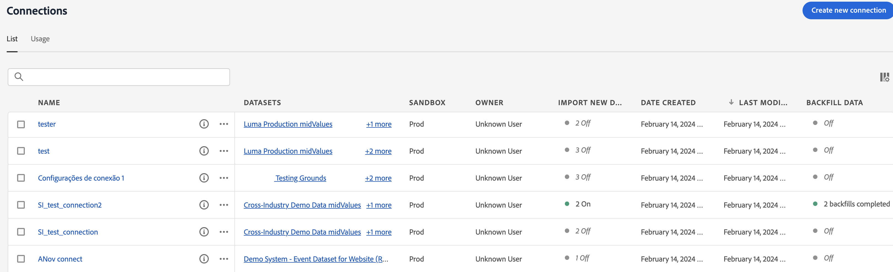

# Convalidare il flusso dei dati verso Customer Journey Analytics {#validate-data}

<!-- markdownlint-disable MD034 -->

>[!CONTEXTUALHELP]
>id="cja-upgrade-data-validate"
>title="Convalidare il flusso dei dati"
>abstract="Utilizza i dettagli di connessione per convalidare che i dati fluiscano in Customer Journey Analytics.  Se tutto è stato fatto correttamente e senza errori, questo passaggio può essere eseguito in meno di un giorno. In caso di più problemi di raccolta dati, risolverli può richiedere molto più tempo."

<!-- markdownlint-enable MD034 -->

{{upgrade-note-step}}

Puoi verificare che la connessione sia attiva e che i dati vengano trasmessi alle visualizzazioni dati in Customer Journey Analytics.

1. In Customer Journey Analytics, seleziona la scheda Connessioni.

   

1. Seleziona la [connessione che hai configurato](/help/getting-started/cja-upgrade/cja-upgrade-connection.md).

   

1. Per informazioni sui dettagli disponibili per ciascuna connessione, consulta [Dettagli connessione](/help/connections/manage-connections.md#manage-connections) in [Gestione connessioni](/help/connections/manage-connections.md).

{{upgrade-final-step}}

<!-- Should we duplicate the content here or single source it with /help/connections/manage-connections.md -->
