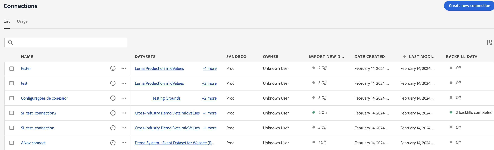

# Convalidare il flusso dei dati verso Customer Journey Analytics {#validate-data}

<!-- markdownlint-disable MD034 -->

>[!CONTEXTUALHELP]
>id="cja-upgrade-data-validate"
>title="Convalidare il flusso dei dati"
>abstract="Utilizza i dettagli di connessione per convalidare che il flusso di dati in Customer Journey Analytics.  Se tutto è risulta corretto e senza errori, questo passaggio può essere eseguito in meno di un giorno. In caso di più problemi di raccolta dati, risolverli può richiedere molto più tempo."

<!-- markdownlint-enable MD034 -->

>[!NOTE]
> 
>Segui i passaggi descritti in questa pagina solo dopo aver completato tutti i passaggi di aggiornamento precedenti. Puoi seguire i [passaggi di aggiornamento consigliati](/help/getting-started/cja-upgrade/cja-upgrade-recommendations.md#recommended-upgrade-steps-for-most-organizations) oppure i passaggi di aggiornamento generati in modo dinamico per la tua organizzazione con il [questionario di aggiornamento da Adobe Analytics a Customer Journey Analytics](https://gigazelle.github.io/cja-ttv/).
>
>Dopo aver completato i passaggi descritti in questa pagina, continua seguendo i passaggi di aggiornamento consigliati o generati in modo dinamico.

Puoi verificare che la connessione sia attiva e che i dati vengano trasmessi alle visualizzazioni dati in Customer Journey Analytics.

1. In Customer Journey Analytics, seleziona la scheda Connessioni.

   

1. Seleziona la [connessione configurata](/help/getting-started/cja-upgrade/cja-upgrade-connection.md).

   

1. Per informazioni sui dettagli disponibili per ciascuna connessione, vedere [Dettagli connessione](/help/connections/manage-connections.md#manage-connections) in [Gestione connessioni](/help/connections/manage-connections.md).

1. Continua seguendo i [passaggi di aggiornamento consigliati](/help/getting-started/cja-upgrade/cja-upgrade-recommendations.md#recommended-upgrade-steps-for-most-organizations) o i [passaggi di aggiornamento generati dinamicamente](https://gigazelle.github.io/cja-ttv/).

<!-- Should we duplicate the content here or single source it with /help/connections/manage-connections.md -->
