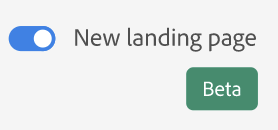

# Pagina di destinazione di Customer Journey Analytics

La pagina di destinazione di Customer Journey Analytics include una pagina home per project manager e una sezione di risorse di apprendimento per aiutarti a iniziare in modo più efficace.

>[!VIDEO](https://video.tv.adobe.com/v/334278/?quality=12)

## Accedere alla pagina di destinazione {#access-landing}

Dopo aver effettuato l’accesso ad Adobe Experience Cloud e Customer Journey Analytics, attiva il pulsante [!UICONTROL New landing page - Beta], in basso a sinistra. L’accesso a questo pulsante è specifico per l’utente in base all’organizzazione e non specifico per l’azienda.

È possibile eseguire le seguenti azioni:

* Espandere la tabella [!UICONTROL Projects] a schermo intero. Per espandere la tabella, fai clic sull’icona del menu con le tre linee orizzontali. Questa azione comprime le schede della barra a sinistra.
* Personalizzare la larghezza delle colonne, trascinando il separatore di colonne.
* Riordinare gli elementi bloccati. Per spostare gli elementi bloccati verso l’alto o il basso, fai clic sui tre puntini accanto all’elemento bloccato e seleziona **[!UICONTROL Move up]** o **[!UICONTROL Move down]**.

## Scheda [!UICONTROL Projects] {#navigate-projects}

[!UICONTROL Projects] funge da pagina home di [!UICONTROL Workspace]. Tutti i progetti Workspace vengono visualizzati qui, comprese le scorecard per dispositivi mobili. **[!UICONTROL Projects]** sono cose che hai creato o che un altro utente ha creato e condiviso con te. [!UICONTROL Projects] fa riferimento anche a progetti vuoti e scorecard per dispositivi mobili vuote.

>[!NOTE]
>
>Molte delle seguenti impostazioni persistono (vengono ricordate) sia durante la sessione che tra sessioni diverse. Esempi: scheda attiva, filtri selezionati, colonne selezionate e direzione dell’ordinamento delle colonne. Tuttavia, i risultati delle ricerche non vengono mantenuti.

| Elemento nell’interfaccia utente | Definizione |
| --- | --- |
| ... Altro | Consente di scegliere [!UICONTROL View Tutorials] e di [modificare le preferenze utente](/help/analysis-workspace/user-preferences.md). |
| È tornata la finestra modale **[!UICONTROL Create new]** | Quando fai clic su **[!UICONTROL Create new]** in Workspace, ora puoi di nuovo scegliere tra [!UICONTROL Blank project] e [!UICONTROL Blank mobile scorecard]. Puoi anche scegliere tra tutti i modelli creati dalla tua azienda. |
| [!UICONTROL Show less/more] | Consente di visualizzare o meno il banner:  |
| [!UICONTROL Blank project] | Crea un [progetto Workspace](https://experienceleague.adobe.com/docs/analytics/analyze/analysis-workspace/home.html?lang=it) vuoto da compilare. |
| [!UICONTROL Blank mobile scorecard] | Crea una [scorecard per dispositivi mobili](https://experienceleague.adobe.com/docs/analytics/analyze/mobapp/curator.html?lang=it) vuota da compilare. |
| [!UICONTROL Open Training Tutorial] | Apre il tutorial su Workspace che mostra ai nuovi utenti come creare un progetto, illustrando i vari passaggi. |
| [!UICONTROL Open release notes] | Apre le ultime note sulla versione di Adobe Experience Cloud. |
| Icona Filtro | Puoi filtrare in base a tag, suite di rapporti, proprietari, tipi e altri filtri (Personali, Condivisi con me, Preferiti e Approvati) |
| Barra di ricerca | La ricerca ora include tutte le colonne della tabella. |
| Casella di selezione | Fai clic su questa casella accanto a uno o più progetti per visualizzare le azioni di gestione del progetto eseguibili: Elimina, Assegna tag, Fissa, Approva, Condividi, Rinomina, Copia ed Esporta in CSV. Potresti non disporre delle autorizzazioni necessarie per eseguire tutte queste azioni. |
| [!UICONTROL Favorites] | Se imposti un progetto come Preferito, viene contrassegnato da una stella e verrà incluso tra i risultati del filtro Preferiti. |
| [!UICONTROL Name] | Nome del progetto. |
| Icona Info (i) | Fai clic sull’icona Informazioni per visualizzare i seguenti dati sul progetto: Tipo, Ruolo progetto, Proprietario, Descrizione e con chi è condiviso. Indica anche chi può [modificare o duplicare](/help/analysis-workspace/curate-share/share-projects.md) il progetto. |
| Puntini di sospensione (…) | Fai clic sui puntini di sospensione accanto a un progetto per visualizzare le azioni di gestione del progetto disponibili: Elimina, Assegna tag, Fissa, Approva, Condividi, Rinomina, Copia ed Esporta in CSV. Potresti non disporre delle autorizzazioni necessarie per eseguire tutte queste azioni. |
| [!UICONTROL Type] | Indica se si tratta di un progetto Workspace o di una scorecard per dispositivi mobili. |
| [!UICONTROL Tags] | Puoi assegnare tag ai rapporti per organizzarli in gruppi. |
| [!UICONTROL Project Role] | I ruoli di progetto indicano se sei il proprietario del progetto e se disponi delle autorizzazioni necessarie per modificarlo o duplicarlo. |
| [!UICONTROL Data View] | Le tabelle e le visualizzazioni all’interno di un pannello derivano i dati dalla visualizzazione dati selezionata in alto a destra nel pannello. La visualizzazione dati determina anche i componenti disponibili nella barra a sinistra. All’interno di un progetto, puoi utilizzare una o più visualizzazioni dati a seconda dei casi di utilizzo dell’analisi. L’elenco delle visualizzazioni dati è ordinato in base alla rilevanza. Adobe determina la rilevanza di una visualizzazione dati in base a quanto recentemente e con quale frequenza è stata utilizzata dall’utente corrente, e alla frequenza con cui viene utilizzata all’interno dell’organizzazione. |
| [!UICONTROL Owner] | Persona che ha creato il progetto. |
| [!UICONTROL Shared with] | Persone con cui il progetto è stato condiviso. |
| [!UICONTROL Last Modified] | Data dell’ultima modifica apportata al progetto. |
| [!UICONTROL Last opened] | Data dell’ultima volta che hai aperto il progetto. |
| [!UICONTROL Scheduled] | Impostato su [!UICONTROL On] se il progetto è pianificato, su **[!UICONTROL Off]** se non lo è. Fai clic sul collegamento **[!UICONTROL On]** per visualizzare informazioni sul progetto pianificato. Se sei il proprietario del progetto, puoi anche [modificare la pianificazione del progetto](/help/analysis-workspace/curate-share/t-schedule-report.md). |
| [!UICONTROL Project ID] | L’ID del progetto può essere utilizzato per il debug dei progetti. |
| [!UICONTROL Longest Date Range] | Intervalli di date più lunghi aumentano la complessità del progetto e possono comportare tempi di elaborazione e di caricamento più lunghi. |
| [!UICONTROL Number of Queries] | Numero totale di richieste effettuate ad Analytics quando il progetto viene caricato. Un numero elevato di query di progetto aumenta la complessità del progetto e può comportare tempi di elaborazione e di caricamento più lunghi. Questi dati sono disponibili solo dopo che un progetto è stato caricato o dopo che un progetto pianificato è stato inviato. |
| Icona Personalizza tabella | (In alto a destra) Per aggiungere o rimuovere colonne dall’elenco dei progetti, selezionale o deselezionale. |
| &lt; (pulsante Indietro) | Questo pulsante in un progetto Workspace ti riporta alla configurazione della pagina di destinazione più recente. Quando torni alla pagina di destinazione, ritrovi la stessa configurazione che era attiva al momento in cui hai lasciato la pagina. |

## Passare alla scheda Apprendimento {#navigate-learning}

La pagina Apprendimento contiene tutorial e presentazioni video pratiche, nonché collegamenti alla documentazione.

* La presentazione [!UICONTROL Workspace Fundamentals] porta direttamente a Workspace, descrive il layout di Workspace e mostra dove si possono trovare ed eseguire le azioni più comuni. Questa presentazione può essere riavviata in qualsiasi momento direttamente in Workspace tramite la descrizione a comparsa accessibile dall’intestazione del pannello.
* Quando si fa clic su un video o una presentazione, viene aggiunto un tag **[!UICONTROL Viewed]**. Questo tag consente di tenere traccia dei contenuti di apprendimento già visualizzati. Se non hai ancora completato il contenuto, puoi fare clic sul tag per rimuoverlo.
* Il pulsante **[!UICONTROL Learn more]** nella finestra modale del video apre una pagina della documentazione Adobe Experience League in cui puoi trovare ulteriori contenuti relativi al video appena guardato. **[!UICONTROL View more videos]** consente di accedere alla playlist YouTube completa su Analysis Workspace.

## Domande frequenti sulla pagina di destinazione {#landing-faq}

| Domanda | Risposta |
| --- | --- |
| Esiste un limite massimo al numero di progetti che è possibile fissare? | No, non esiste alcun limite al numero di progetti che è possibile fissare. |
| Gli amministratori possono designare questa pagina di destinazione per i loro utenti? | No, gli amministratori non possono designare la pagina di destinazione per conto degli utenti. I singoli utenti devono attivarla autonomamente. |
