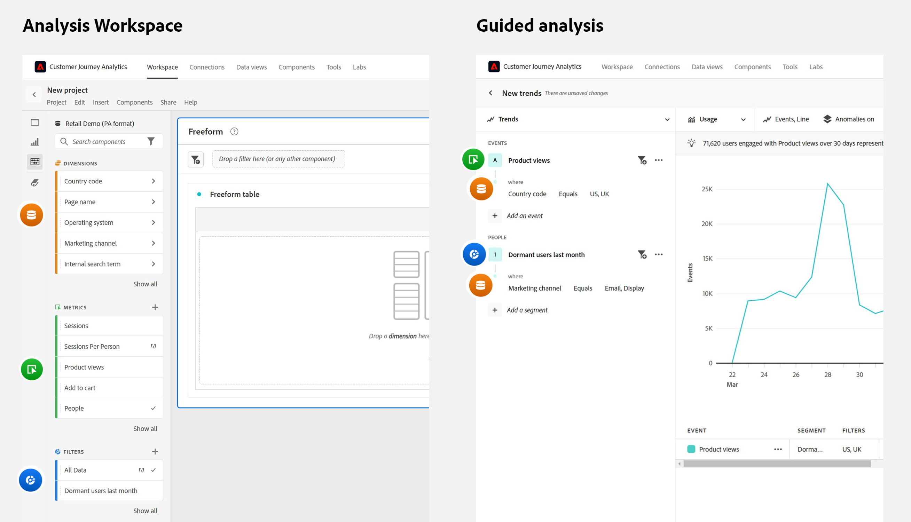
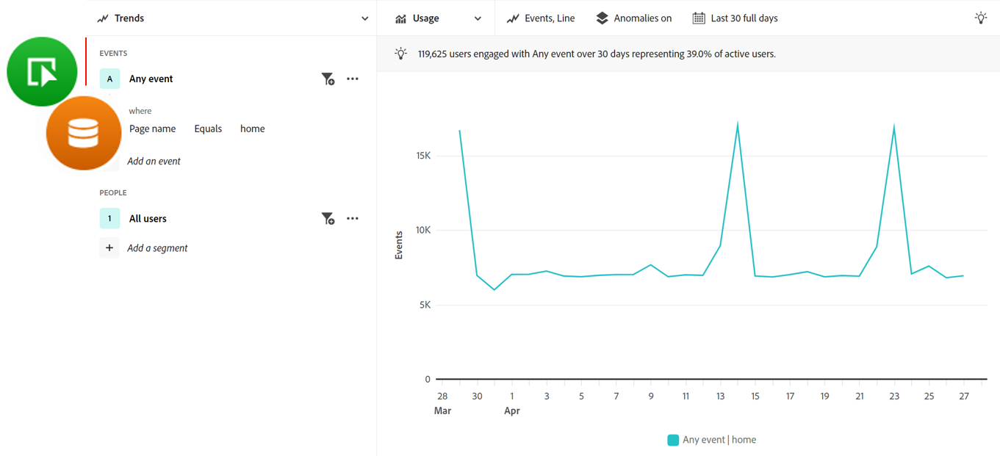

# Domande frequenti sull’analisi guidata

Domande frequenti sull’analisi guidata.

+++**La mia organizzazione ha accesso all’analisi guidata?**

Le visualizzazioni di analisi guidata sono incluse in tutti i pacchetti di Customer Journey Analytics. Per ulteriori informazioni sulle visualizzazioni sbloccate dal pacchetto CJA, consulta la sezione [provisioning](overview.md#provisioning) nella pagina della panoramica.

+++

+++**Quali modifiche di implementazione sono necessarie per utilizzare l’analisi guidata?**

Se già utilizzi Customer Journey Analytics, non sono necessarie ulteriori modifiche all’implementazione. L’analisi guidata utilizza le stesse [Visualizzazioni dati](../data-views/data-views.md) e [Connessioni](../connections/overview.md) di altre interfacce CJA come [Analysis Workspace](../analysis-workspace/home.md).

Per consentire agli utenti finali di utilizzare al meglio l’analisi guidata, è consigliabile mettere in atto uno schema degli eventi e di una strategia di gestione affidabili in Adobe Experience Platform e nelle [Visualizzazioni dati](../data-views/data-views.md).

+++

+++**Quando utilizzare l’analisi guidata o Analysis Workspace?**

L’**analisi guidata** può aiutare gli utenti a ottenere rapidamente informazioni approfondite di alta qualità. È utile per i team di prodotto, per gli utenti che desiderano lavorare in modo più affidabile con i dati e anche per gli analisti come punto di partenza per analisi più approfondite.

**[Analysis Workspace](../analysis-workspace/home.md)** è uno spazio a forma libera più ampio che consente di approfondire ulteriormente i dati per scoprire ulteriori informazioni. È utile per gli analisti e gli utenti esperti che hanno una buona comprensione dei dati e desiderano approfondirli.

+++

+++**Come si  confronta la terminologia tra l’analisi guidata e Analysis Workspace?**

L’analisi guidata e [Analysis Workspace](../analysis-workspace/home.md) si allineano alla maggior parte della terminologia chiave, con alcune piccole differenze.

| Termine di analisi guidata | Termine di Analysis Workspace |
| --- | --- |
| Evento (metrica binaria 1/0) | Metrica |
| Utenti | Persone |
| Dimensione | Dimensione |
| Elemento dimensione | Elemento dimensione |
| Segmento | Segmento |
| Filtro | Filtro rapporto |
| Metriche calcolate, metriche | Metrica calcolata |

{style="table-layout:auto"}

+++

+++**Quali sono le differenze nell’approccio di reporting tra l’analisi guidata e Analysis Workspace?**

Sebbene [Analysis Workspace](../analysis-workspace/home.md) e l’analisi guidata utilizzino gli stessi dati sottostanti, il modo in cui ciascuno strumento consente di creare query di tali dati è diverso.

* **Analysis Workspace è un&#39;esperienza incentrata sulle dimensioni.** Le tabelle sono in genere costituite da righe dimensionali, mentre le colonne sono in genere metriche. I segmenti possono essere applicati sia nelle righe che nelle colonne per ottenere i dati desiderati.

* **L&#39;analisi guidata è un evento e un&#39;esperienza incentrata sull&#39;utente.** Ogni analisi inizia selezionando gli eventi, quindi è possibile aggiungere dimensioni e segmenti per perfezionare i dati dell’evento.

{style="border:1px solid gray"}

Prendi in considerazione l’esempio seguente in cui puoi concentrarti sui dati relativi alla pagina Home del tuo sito web. I team pongono domande simili, ma l’approccio di analisi può essere diverso.

* Un tipico approccio di Analysis Workspace incentrato sulle dimensioni consisterebbe nell’esaminare la home page e vedere quante visualizzazioni di pagina ha ricevuto.

  {style="border:1px solid gray"}

* Un tipico approccio di analisi guidata incentrato sull’evento e sull’utente consisterebbe nell’esaminare quanti utenti hanno visitato la pagina Home

  {style="border:1px solid gray"}

+++
