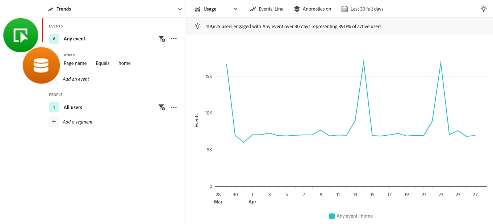

# Domande frequenti sull’analisi guidata

{{release-limited-testing}}

Domande frequenti sull’analisi guidata.

+++**L’analisi guidata è disponibile per tutti?**

No. L&#39;analisi guidata è un componente aggiuntivo a pagamento per il Customer Journey Analytics. Se desideri iniziare a utilizzare questo componente aggiuntivo, contatta il team del tuo account di Adobe.

+++

+++**Quali modifiche di implementazione sono necessarie per utilizzare l’analisi guidata?**

Se utilizzi già Analysis Workspace in Customer Journey Analytics, non sono necessarie ulteriori modifiche all’implementazione. L’analisi guidata utilizza le stesse visualizzazioni dati e connessioni di Analysis Workspace. La procedura per l’onboarding e l’utilizzo di qualsiasi tipo di progetto è identica per tutto il Customer Journey Analytics, inclusa l’analisi guidata.

+++

+++**In che modo i termini si relazionano tra loro all’interno e all’esterno dell’analisi guidata?**

L’analisi guidata utilizza termini utilizzati più frequentemente nel settore dell’analisi dei prodotti. Puoi fare riferimento a questa tabella quando passi da Analisi guidata a Analysis Workspace.

| Termine di analisi guidata | Termine Analysis Workspace |
| --- | --- |
| Evento | Metrica |
| Proprietà | Dimensione |
| Valore | Elemento Dimension |
| Segmento | Filtro |

{style="table-layout:auto"}

+++

+++**Quali sono alcune differenze nell’approccio di Analysis Workspace ai rapporti di analisi guidata?**

Anche se Analysis Workspace e l’analisi guidata utilizzano gli stessi dati sottostanti, il modo in cui ogni strumento interroga tali dati è diverso.

* **Analysis Workspace è un’esperienza incentrata sulle dimensioni.** Le tabelle sono in genere costituite da righe di elementi dimensionali, mentre le colonne sono in genere metriche. Puoi applicare filtri a per ottenere i dati desiderati.

* **L’analisi guidata è un’esperienza incentrata sugli eventi.** Le visualizzazioni si concentrano sugli eventi, utilizzando dimensioni e filtri per integrare tali dati.

Prendi in considerazione l’esempio seguente in cui ti concentri sui dati intorno alla pagina principale del tuo sito web. I team pongono domande simili, ma l’approccio di analisi può essere diverso.

* Un tipico approccio Analysis Workspace incentrato sulle dimensioni sarebbe: &quot;Quante visualizzazioni di pagina sono state ricevute dalla home page?&quot;

  

* Un tipico approccio di analisi guidata incentrata sugli eventi sarebbe: &quot;Quanti utenti hanno visualizzato la home page?&quot;

  

Queste istruzioni illustrano due metodi diversi per ottenere lo stesso rapporto, a seconda della strategia di gestione degli eventi.

+++
