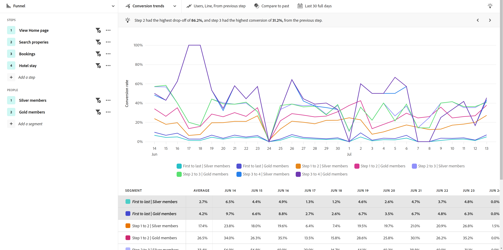
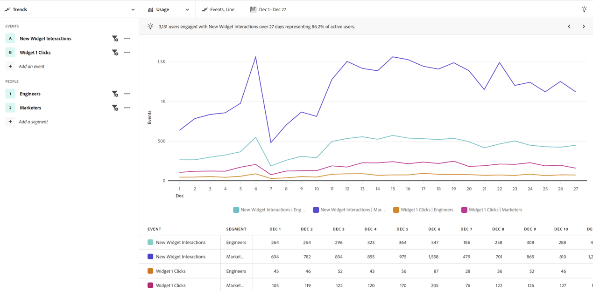

# Casi di utilizzo del settore

I casi di utilizzo per l’analisi guidata variano a seconda del settore. Questa pagina fornisce alcuni esempi illustrativi di ciò che i team di prodotto possono realizzare con le funzionalità di analisi guidata e di Adobe Product Analytics.

+++**Vendita al dettaglio**

| Caso d’uso | Esempio | Impatto | Analisi |
| --- | --- | --- | --- |
| **Ottimizzare l’app per acquisti su dispositivi mobili** | Molti clienti hanno scaricato la nostra app mobile ma non sono mai ritornati. Abbiamo scoperto che lo usavano solo per l&#39;offerta iniziale e abbiamo riassunto quei clienti inattivi. | **Aumentare l’LTV degli utenti di dispositivi mobili.** Misura e aumenta l’utilizzo dell’app per sviluppare un’esperienza utente più &quot;felice&quot;. | [Visualizzazione crescita utenti attivi](types/active.md) 

 [Visualizzazione della crescita netta](types/net-growth.md) |
| **Quantificare l&#39;impatto delle nuove funzioni di pagamento** | In qualità di drogheria testando il nostro modo di fare acquisti online, possiamo misurare rapidamente l&#39;impatto delle nuove funzioni di pagamento come &quot;Hai dimenticato il burro?&quot; consigli sui prodotti o nuovi metodi di pagamento, ad esempio Curbside Pickup. | **Aumentare i tassi di conversione.** Misura l’impatto aziendale invece dell’utilizzo delle sole funzioni. | [Vista impatto sulla versione](types/release.md) 

 [Vista primo utilizzo](types/first-use.md) |
| **Riduzione dell&#39;abbandono dei membri** | Abbiamo scoperto punti di attrito nei percorsi di clienti che causano l’abbandono dei clienti. Questo ci ha dato l&#39;opportunità di rivedere i programmi di adesione e analizzare i comportamenti e i segnali dei membri a rischio. | **Ridurre l&#39;abbandono.** Identifica modi per promuovere e sviluppare le relazioni con i clienti per prevenire l’attrito e ridurre l’abbandono. | [Visualizzazione crescita utenti attivi](types/active.md) 

 [Vista frizione](types/friction.md) |
| **Trovare percorsi di vendita inefficienti** | Abbiamo scoperto alcune inefficienze nel percorso dei nostri agenti di vendita in-store, dove venivano allontanati dai clienti. Abbiamo modificato il processo di acquisto, offrendo ai clienti un&#39;esperienza di acquisto più piacevole all&#39;interno del negozio. | **Migliorare la risposta alle vendite.** Migliorare i percorsi interni per ridurre i processi inefficienti, con conseguenti esperienze positive per i clienti. | [Vista frizione](types/friction.md) |

{style="table-layout:auto"}

+++

+++**Servizi finanziari**

| Caso d’uso | Esempio | Impatto | Analisi |
| --- | --- | --- | --- |
| **Quantificare l&#39;impatto delle nuove funzioni** | Di recente abbiamo introdotto i bonifici bancari con Zelle e dovevamo capire l’impatto della nuova funzione sul completamento dei bonifici. Ora che possiamo vedere come reagiscono i clienti, il team di marketing può implementarlo. | **Aumentare i tassi di conversione.** Misura l’impatto delle nuove funzioni sulle conversioni dei trasferimenti. | [Vista impatto sulla versione](types/release.md) 

 [Vista primo utilizzo](types/first-use.md) |
| **Deflettere le chiamate del call center** | La nostra procedura di richiesta di rimborso mobile in 5 fasi è stata quella di indirizzare le chiamate al call center. Abbiamo analizzato rapidamente il problema, creato un pubblico e inviato un messaggio e-mail ai clienti per comprenderne l&#39;esperienza&quot;. | **Isolare l’attrito nell’esperienza.** Migliora i percorsi &quot;Happy path&quot; e riduce le chiamate. | [Vista frizione](types/friction.md) 

 [Visualizzazione tendenze di conversione](types/conversion-trends.md) |
| **Ridurre l&#39;abbandono dei clienti** | Sappiamo che i clienti che accedono all’app mobile per il settore bancario con frequenza mensile rimangono clienti più a lungo. Quando visualizziamo la crescita degli utenti dell’app, identifichiamo i soggetti a rischio di abbandono e creiamo una strategia di recupero. | **Ridurre l&#39;abbandono.** Mantenere il livello dei clienti e al tempo stesso spendere per acquisire nuovi clienti effettivi. | [Visualizzazione crescita utenti attivi](types/active.md) 

 [Visualizzazione della crescita netta](types/net-growth.md) |
| **Consiglia nuove funzioni** | I prelievi digitali sono diminuiti nel tempo, invece di ricorrere a un consulente finanziario. Desideriamo ottimizzare il processo digitale e le tendenze dei dati ci aiutano a dare priorità alle ottimizzazioni con un comitato direttivo. | **Creare una roadmap basata sui dati.** Sfrutta i dati per pianificare e implementare le ottimizzazioni. | [Visualizzazione tendenze di utilizzo](types/usage.md) |

{style="table-layout:auto"}

+++

+++**Viaggi e ospitalità**

| Caso d’uso | Esempio | Impatto | Analisi |
| --- | --- | --- | --- |
| **Quantificare l’impatto delle nuove funzioni del flusso di prenotazione** | Abbiamo analizzato rapidamente l’impatto di una nuova funzione della fase di prenotazione sui tassi di conversione e identificato la parte dell’esperienza con i maggiori guadagni. | **Aumentare le tariffe di prenotazione.** Misura l’impatto aziendale invece dell’utilizzo delle sole funzioni. | [Vista impatto sulla versione](types/release.md) 

 [Vista frizione](types/friction.md) |
| **Ottimizzare l’esperienza dell’app mobile** | Siamo stati in grado di comprendere in modo rapido e semplice i nostri utenti attivi mensili di app (MAU) nel tempo e identificare l’impatto positivo per versione. | **Aumentare le MAU.** Misura e aumenta l’utilizzo dell’app, che è correlato alla felicità del cliente. | [Visualizzazione crescita utenti attivi](types/active.md) 

 [Visualizzazione della crescita netta](types/net-growth.md) |
| **Trova attrito nel flusso di check-in mobile** | La possibilità di individuare le persone che hanno successo o che hanno abbandonato il previsto processo di check-in su dispositivi mobili ci consente di identificare facilmente le aree per l’ottimizzazione dell’esperienza. | **Aumentare la CSAT e ridurre le IROP.** La rimozione degli attriti offre un’esperienza di &quot;giorno di viaggio&quot; più fluida. | [Vista frizione](types/friction.md) 

 [Visualizzazione tendenze di conversione](types/conversion-trends.md) |
| **Deflettere le chiamate del call center** | Vedendo la mia esperienza di utente in una vista funnel mi ha mostrato dove i nostri utenti stavano raggiungendo attriti, che stava portando a costosi volumi di call-center. Sapevamo dove dovevamo concentrarci. | **Riduzione dell&#39;utilizzo del call center.** Ottieni più esperienze utente con &quot;percorso felice&quot; e riduci i costi delle chiamate. | [Vista frizione](types/friction.md) 

 [Visualizzazione tendenze di conversione](types/conversion-trends.md) |

{style="table-layout:auto"}

+++

+++**Media e intrattenimento**

| Caso d’uso | Esempio | Impatto | Analisi |
| --- | --- | --- | --- |
| **Quantificare l&#39;impatto di nuovi programmi o serie** | Potremmo analizzare l’effetto sul pubblico dopo che gli utenti hanno guardato un nuovo spettacolo o una nuova serie e capire meglio quali contenuti stanno risuonando. | **Aumenta il pubblico.** Trova i contenuti che hanno il maggiore impatto sul pubblico. | [Vista primo utilizzo](types/first-use.md) |
| **Identificare il rischio di abbandono** | Abbiamo visto un alto tasso di ricambio di clienti che si sono iscritti alla nostra piattaforma per guardare un evento stagionale e poi cancellato non appena l&#39;evento era finito. L’identificazione rapida di questi utenti ci consente di mostrare consigli che li inducono a rimanere coinvolti con la piattaforma. | **Mantieni gli abbonati felici.** Trova contenuti che coinvolgano un segmento di crescita per intervenire con i consigli. | [Visualizzazione crescita utenti attivi](types/active.md) 

 [Visualizzazione della crescita netta](types/net-growth.md) |
| **Trova opportunità di upselling** | Grazie all&#39;aumento dei nostri profitti, siamo in grado di comprendere quali sono le offerte in-app più interessanti per i nostri tifosi, che si trovano allo stadio. | **Aumentare le entrate accessorie.** Comprendi l’impatto delle offerte in-app sulla guida dei comportamenti di acquisto. | [Vista primo utilizzo](types/first-use.md) 

 [Vista frizione](types/friction.md) |
| **Ottimizzare l’esperienza cross-device** | Voglio essere in grado di analizzare il modo in cui i miei abbonati interagiscono con più dispositivi/app in modo da comprendere i modelli di consumo dei contenuti e determinare dove è meglio effettuare il retargeting. | **Personalizza l’esperienza.** Scopri quali contenuti risuonano meglio con gli abbonati su ogni dispositivo. | [Visualizzazione tendenze di utilizzo](types/usage.md) |
| **Deflettere le chiamate del call center** | Sono riuscito a identificare un problema che impediva il funzionamento della funzione di pagamento automatico, che ha indotto i clienti frustrati a chiamare il nostro centro di assistenza per annullare il piano. | **Riduzione delle chiamate di supporto.** Crea una migliore esperienza del cliente e diminuisci le chiamate al servizio clienti. | [Vista frizione](types/friction.md) 

 [Visualizzazione tendenze di conversione](types/conversion-trends.md) |

{style="table-layout:auto"}

+++

+++**Settore sanitario**

| Caso d’uso | Esempio | Impatto | Analisi |
| --- | --- | --- | --- |
| **Migliorare i risultati sulla salute dei pazienti** | Non avevo una chiara comprensione di quanti membri del piano benessere alla settimana semplicemente smettevano di utilizzarlo del tutto. Ora disponiamo di dati che ci permettono di concentrare i nostri sforzi sulla crescita. | **Ridurre le visite dei medici.** Identifica rapidamente gli utenti inattivi da coinvolgere di nuovo. | [Visualizzazioni di crescita degli utenti attivi](types/active.md) |
| **Migliorare l’esperienza dei pazienti** | Avere una visibilità diretta sul numero di pazienti che chiamavano i nostri call center per reimpostare le password semplici ha rinnovato la mia passione di essere concentrato sul laser per ridurre i costi complessivi della nostra azienda per servire e rafforzare la nostra esperienza dei pazienti. | **Ridurre i costi complessivi di gestione.** Creare una migliore esperienza del paziente e ridurre le chiamate ai servizi per il paziente. | [Visualizzazione tendenze di utilizzo](types/usage.md) 

 [Vista frizione](types/friction.md) |
| **Identificare le azioni cross-channel ripetute per segmento** | Devo capire come sono attivi i membri idonei di Medicare con il loro utilizzo del piano per fornire loro messaggi specifici nei nostri prodotti digitali. I segnali di prodotto contribuiscono a rendere più efficace il marketing. | **Personalizzare le scelte di iscrizione a Medicare.** Confrontare le azioni sequenziali comuni dei membri del piano più attivi. | [Vista frizione](types/friction.md) 

 [Visualizzazione crescita utenti attivi](types/active.md) |
| **Mantieni i migliori talenti del settore** | Le nostre risorse di analisi sono a corto di tempo. Devo ottenere rapidamente i dati di utilizzo del prodotto necessari per le chiamate di aggiornamento della mia leadership. | **Ridurre il carico di lavoro degli analisti.** Risposte più rapide. Generazione di rapporti avvicinabili per i casi di maggiore necessità. | [Analisi guidata](overview.md) |

{style="table-layout:auto"}

+++

+++**High tech e B2B**

| Caso d’uso | Esempio | Impatto | Analisi |
| --- | --- | --- | --- |
| **Quantificare l&#39;impatto delle nuove funzioni** | Potremmo analizzare l’aumento di utilizzo di una nuova funzione del prodotto e determinare quali segmenti funzionavano meglio. Questo ci ha aiutato a definire le priorità dei casi in cui utilizziamo le risorse per massimizzare il coinvolgimento degli utenti e rafforzare la nostra partnership con il marketing. | **Priorità basata sui dati.** Prendere decisioni informate sull&#39;allocazione delle risorse. | [Vista impatto sulla versione](types/release.md) 

 [Vista primo utilizzo](types/first-use.md) |
| **Identificare i ruoli che non utilizzano il prodotto in modo ottimale** | Il nostro prodotto è progettato per essere utilizzato da ingegneri, Product Manager e Marketing. Le analisi hanno mostrato che, mentre PM e addetti al marketing lo utilizzavano quasi ogni giorno, lo staff tecnico non lo aveva adottato. | **Aumenta l’adozione dei prodotti.** Identificare rapidamente il comportamento degli utenti in diversi modi. | [Visualizzazione crescita utenti attivi](types/active.md) 

 [Visualizzazione della crescita netta](types/net-growth.md) |
| **Rimuovere i punti di attrito nel processo di conversione** | I dati utente hanno mostrato che la richiesta di un numero di ordine di acquisto nel flusso di acquisto impediva agli utenti che preferivano acquistare con una carta di credito di completare gli ordini. Rendendo questo campo facoltativo, le conversioni sono aumentate. | **Migliorare la customer experience.** Ridurre il rischio di abbandono. | [Vista frizione](types/friction.md) 

 [Visualizzazione tendenze di conversione](types/conversion-trends.md) |
| **Sblocca analisi self-service** | Cercare di accedere alle informazioni è difficile e i nostri utenti non sono addestrati per l’analisi. Devono essere in grado di ottenere risposte e sfruttare gli stessi dati utilizzati dall’intera organizzazione, in modo da creare partnership più solide e consentire decisioni basate su dati reali. | **Partnership più strette in tutta l&#39;organizzazione.** Consente ai responsabili di prodotto di accedere ai dati inseriti in silos in precedenza. | [Analisi guidata](overview.md) |

{style="table-layout:auto"}

+++
