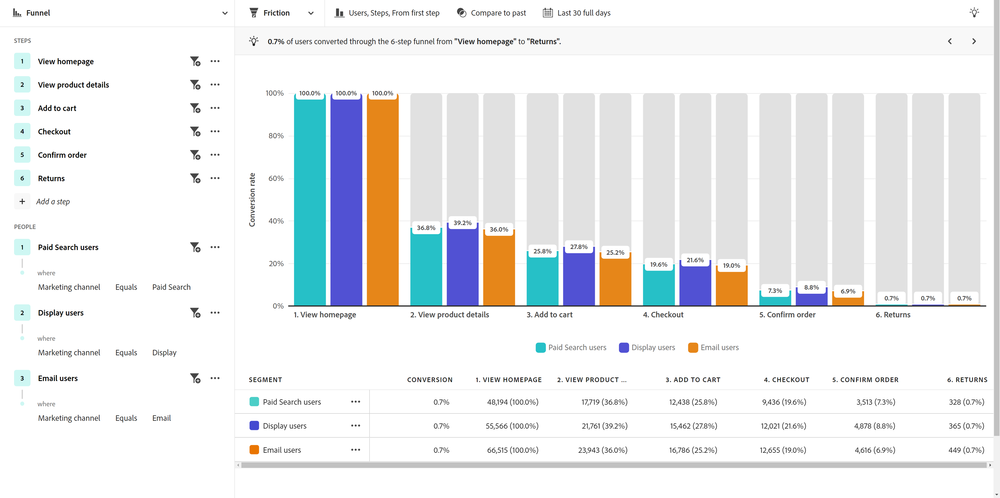
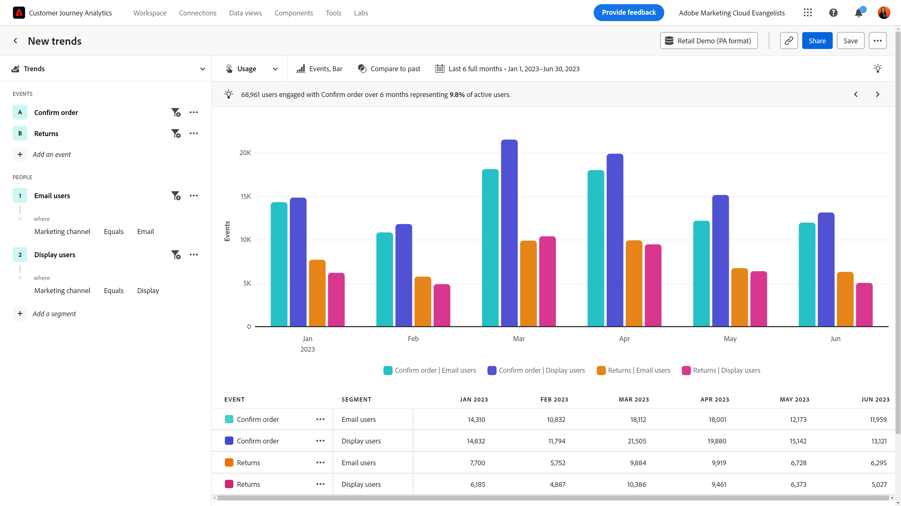
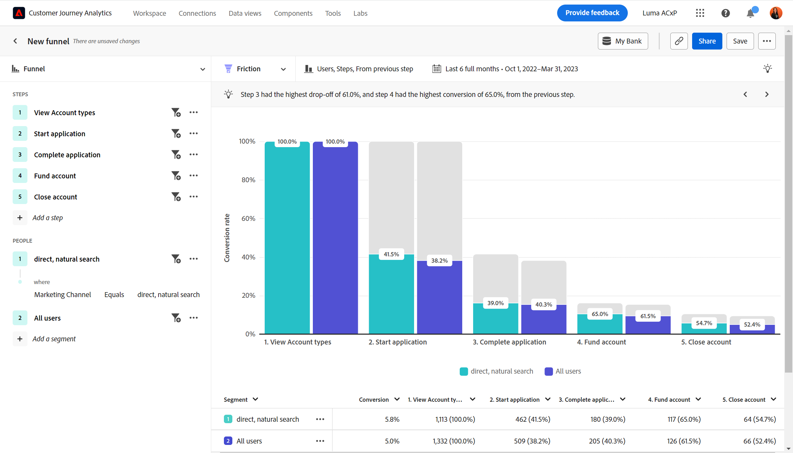
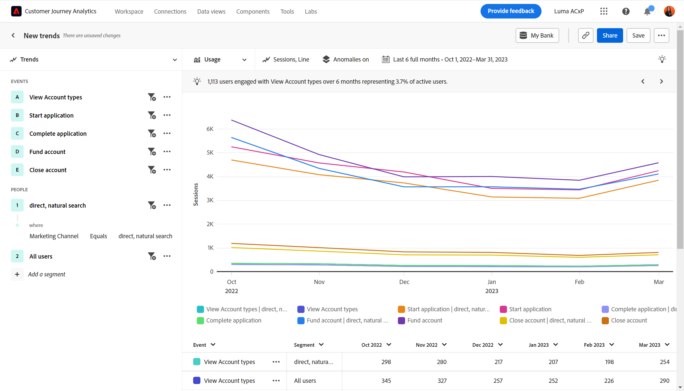
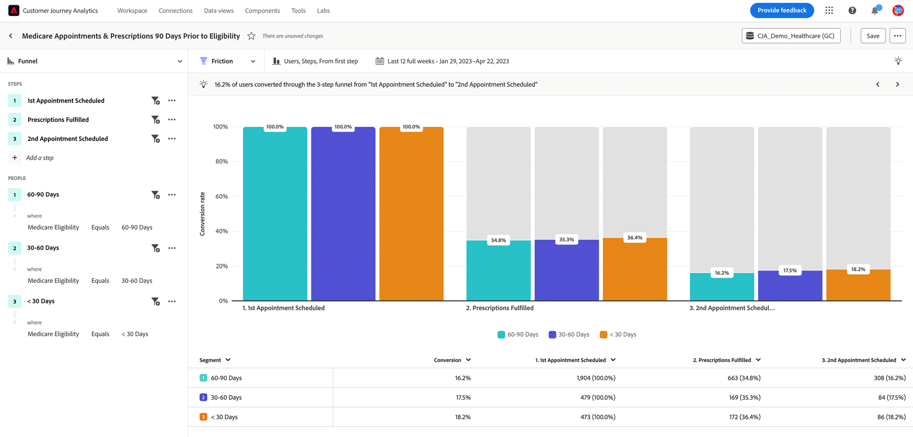
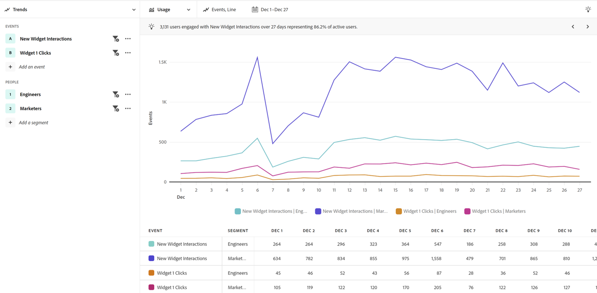

# Casi d’uso di settore

Questa pagina fornisce alcuni esempi illustrativi di settore di ciò che i team di customer experience, dagli analisti ai team di prodotto ai marketer, possono realizzare con l’analisi guidata.

+++**Vendita al dettaglio**

| Caso d’uso | Esempio | Impatto | Analisi |
| --- | --- | --- | --- |
| **Ottimizzare l’app per acquisti su dispositivi mobili** | Molti clienti hanno scaricato l’app mobile di un’azienda, ma non sono più ritornati. L’azienda scopre che i clienti la utilizzano solo per l’offerta iniziale. Sono stati coinvolti nuovamente questi clienti inattivi. | **Aumentare l&#39;LTV degli utenti di dispositivi mobili.** Misura e aumenta l’utilizzo dell’app per sviluppare un’esperienza utente più &quot;felice&quot;. | [Analisi della crescita attiva](types/active-growth.md) [Analisi della crescita netta](types/net-growth.md) |
| **Quantificare l’impatto delle nuove funzioni di pagamento** | Un negozio di alimentari esegue dei test per passare alla vendita online. Viene misurato rapidamente l’impatto delle nuove funzioni di pagamento, ad esempio consigli di prodotto o ritiro a domicilio. | **Aumentare i tassi di conversione.** Misura l’impatto aziendale invece dell’utilizzo delle sole funzioni. | [Analisi di impatto sulla versione](types/release-impact.md) [Analisi di impatto sul primo utilizzo](types/first-use-impact.md) |
| **Riduzione dell’abbandono dei membri** | Un’organizzazione rileva punti di attrito nei percorsi che causano l’abbandono dei clienti. È l’occasione per rivedere i programmi di iscrizione e analizzare i comportamenti dei membri a rischio. | **Riduci abbandono.** Identifica modi per promuovere e sviluppare le relazioni con i clienti per prevenire l’attrito e ridurre l’abbandono. | [Analisi della crescita attiva](types/active-growth.md) [Analisi funnel](types/funnel.md) |
| **Scoprire i percorsi di vendita inefficienti** | Un’organizzazione individua le inefficienze nel percorso degli agenti di vendita all’interno del punto vendita nel momento in cui vengono allontanati dalla clientela. Viene corretto il processo di acquisto, offrendo alla clientela un&#39;esperienza più piacevole all’interno del negozio. | **Miglioramento della risposta alle vendite.** Riduzione dei processi inefficienti, che si traducono in un miglioramento dei percorsi interni e in un&#39;esperienza positiva per il cliente. | [Analisi funnel](types/funnel.md) |

{style="table-layout:auto"}

{style="border:1px solid gray"}

{style="border:1px solid gray"}

+++

+++**Servizi finanziari**

| Caso d’uso | Esempio | Impatto | Analisi |
| --- | --- | --- | --- |
| **Quantificare l’impatto delle nuove funzioni** | Un istituto finanziario effettua i bonifici bancari con Zelle e vuole capire l’impatto della nuova funzione sul completamento dei bonifici. L’analisi guidata consente di scoprire come reagisce la clientela prima che il team di marketing possa distribuirla. | **Aumentare i tassi di conversione.** Misura l’impatto delle nuove funzioni sulle conversioni dei trasferimenti. | [Analisi di impatto sulla versione](types/release-impact.md) [Analisi di impatto sul primo utilizzo](types/first-use-impact.md) |
| **Deviare le chiamate del call center** | L’analisi guidata rivela che il processo di richiesta in cinque fasi per dispositivi mobili di un’organizzazione genera chiamate al call center. Viene creato un pubblico e inviata un’e-mail a tale clientela per comprendere meglio la loro esperienza. | **Isolare l&#39;attrito nell&#39;esperienza.** Migliora i percorsi &quot;Happy path&quot; e riduce le chiamate. | [Analisi funnel](types/funnel.md) [Analisi delle tendenze della conversione](types/conversion-trends.md) |
| **Ridurre l’abbandono dei clienti** | Un’organizzazione apprende che chi accede all’app mobile della banca con frequenza mensile rimane cliente per un periodo più lungo. L’analisi guidata consente di identificare i soggetti a rischio di abbandono e di creare una strategia di recupero. | **Riduci abbandono.** Mantenere il livello dei clienti e al tempo stesso spendere per acquisire nuovi clienti effettivi. | [Analisi della crescita attiva](types/active-growth.md) [Analisi della crescita netta](types/net-growth.md) |
| **Consigliare nuove funzioni** | Un’organizzazione nota che i prelievi digitali sono diminuiti negli ultimi mesi. Il numero di chiamate a un consulente finanziario è aumentato. L’analisi guidata aiuta l’organizzazione a dare priorità alle ottimizzazioni dei processi digitali con un comitato direttivo. | **Creare una roadmap basata sui dati.** Utilizza i dati per pianificare e implementare le ottimizzazioni. | [Analisi delle tendenze](types/trends.md) |

{style="table-layout:auto"}

{style="border:1px solid gray"}

{style="border:1px solid gray"}

{style="border:1px solid gray"}

+++

+++**Viaggi e ospitalità**

| Caso d’uso | Esempio | Impatto | Analisi |
| --- | --- | --- | --- |
| **Quantificare l’impatto delle nuove funzioni del flusso di prenotazione** | Un’organizzazione utilizza l’analisi guidata per visualizzare rapidamente l’impatto di una nuova funzione del passaggio di prenotazione sui tassi di conversione. Identifica la parte dell’esperienza con i maggiori guadagni. | **Aumentare le tariffe di prenotazione.** Misura l’impatto aziendale invece dell’utilizzo delle sole funzioni. | [Analisi dell’impatto sulla versione](types/release-impact.md) [Analisi funnel](types/funnel.md) |
| **Ottimizzare l’esperienza dell’app mobile** | Un’organizzazione conosce in modo rapido e semplice gli utenti mensili attivi dell’app nel tempo e identifica l’impatto positivo per versione. | **Aumenta MAU.** Misura e aumenta l’utilizzo dell’app, che è correlato alla felicità del cliente. | [Analisi della crescita attiva](types/active-growth.md) [Analisi della crescita netta](types/net-growth.md) |
| **Trovare attrito nel flusso di check-in per dispositivi mobili** | La possibilità di vedere dove le persone hanno utilizzato correttamente o dove hanno abbandonato il processo di check-in mobile previsto consente a un’organizzazione di identificare facilmente le aree per l’ottimizzazione dell’esperienza. | **Aumentare CSAT e ridurre IROP.** La rimozione degli attriti offre un’esperienza di &quot;giorno di viaggio&quot; più fluida. | [Analisi funnel](types/funnel.md) [Analisi delle tendenze della conversione](types/conversion-trends.md) |
| **Deviare le chiamate del call center** | Osservare l’esperienza utente in una analisi funnel mostra un utente dove i visitatori incontrano attrito, cosa che porta a un volume costoso del call center. I passaggi successivi su cui concentrarsi sono chiari. | **Riduci l&#39;utilizzo del call center.** Ottieni più esperienze utente con &quot;percorso felice&quot; e riduci i costi delle chiamate. | [Analisi funnel](types/funnel.md) [Analisi delle tendenze di conversione](types/conversion-trends.md) |

{style="table-layout:auto"}

{style="border:1px solid gray"}

{style="border:1px solid gray"}

{style="border:1px solid gray"}

+++

+++**Media e intrattenimento**

| Caso d’uso | Esempio | Impatto | Analisi |
| --- | --- | --- | --- |
| **Quantificare l’impatto di nuovi programmi o serie** | Un servizio di streaming può analizzare l’effetto sul pubblico dopo che gli utenti guardano un nuovo spettacolo o una nuova serie e capire meglio quale contenuto suscita interesse. | **Aumenta il numero di spettatori.** Trova i contenuti che hanno il maggiore impatto sul pubblico. | [Analisi dell’impatto sul primo utilizzo](types/first-use-impact.md) |
| **Identificare il rischio di abbandono** | Un’organizzazione vede un alto tasso di avvicendamento di clienti che si iscrivono alla piattaforma per guardare un evento stagionale e cancellano immediatamente l’abbonamento dopo la fine dell’evento. Identificare rapidamente questi utenti consente di mostrare consigli ai clienti per incitarli a rimanere coinvolti con la piattaforma. | **Mantieni sottoscrittori soddisfatti.** Trova contenuti che coinvolgano un segmento di crescita per intervenire con i consigli. | [Analisi della crescita attiva](types/active-growth.md) [Analisi della crescita netta](types/net-growth.md) |
| **Trovare opportunità di upselling** | Un aspetto fondamentale per l’aumento dei ricavi aziendali è comprendere le offerte in-app più interessanti per i tifosi che si trovano allo stadio. L’analisi guidata consente di vedere esattamente quali offerte sono più efficaci. | **Aumentare le entrate accessorie.** Comprendi l’impatto delle offerte in-app sulla guida dei comportamenti di acquisto. | [Analisi dell’impatto sul primo utilizzo](types/first-use-impact.md) [Analisi funnel](types/funnel.md) |
| **Ottimizzare l’esperienza cross-device** | Un’organizzazione desidera analizzare il modo in cui gli abbonati interagiscono con più dispositivi/app. Questa conoscenza consente di comprendere i modelli di consumo dei contenuti e di determinare dove sarebbe meglio eseguire il retargeting. | **Personalizza l&#39;esperienza.** Scopri quali contenuti risuonano meglio con gli abbonati su ogni dispositivo. | [Analisi delle tendenze](types/trends.md) |
| **Deviare le chiamate del call center** | Un’organizzazione utilizza l’analisi guidata per identificare un problema che impediva il funzionamento del pagamento automatico e che portava i clienti insoddisfatti a chiamare il centro di assistenza per annullare il piano. | **Riduci chiamate di supporto.** Crea una migliore esperienza del cliente e diminuisci le chiamate al servizio clienti. | [Analisi funnel](types/funnel.md) [Analisi delle tendenze di conversione](types/conversion-trends.md) |

{style="table-layout:auto"}

{style="border:1px solid gray"}

{style="border:1px solid gray"}

{style="border:1px solid gray"}

+++

+++**Assistenza sanitaria**

| Caso d’uso | Esempio | Impatto | Analisi |
| --- | --- | --- | --- |
| **Migliorare i risultati sanitari dei pazienti** | Un’organizzazione dispone dei dati necessari per concentrare i propri sforzi sulla crescita. Prima di utilizzare l’analisi guidata, l’organizzazione non aveva una chiara comprensione di quanti membri del programma di benessere smettevano completamente di utilizzarlo ogni settimana. | **Riduci le visite del medico.** Identifica rapidamente gli utenti inattivi da coinvolgere di nuovo. | [Analisi crescita attiva](types/active-growth.md) |
| **Migliorare l’esperienza dei pazienti** | La visibilità del numero di pazienti che contattano i call center per una semplice reimpostazione della password ha rinnovato la passione di un analista di concentrarsi sul consolidamento dell’esperienza dei pazienti. | **Ridurre i costi complessivi da sostenere.** Creare una migliore esperienza del paziente e ridurre le chiamate ai servizi per il paziente. | [Analisi delle tendenze](types/trends.md) [Analisi funnel](types/funnel.md) |
| **Identificare le azioni cross-channel ripetute per segmento** | Un’organizzazione vuole capire quanto sono attivi i membri idonei al programma Medicare nell’utilizzo del piano per fornire loro messaggi specifici nei rispettivi prodotti digitali. Le informazioni approfondite ottenute dall’analisi guidata contribuiscono a rendere il marketing più efficace. | **Personalizza le scelte di iscrizione Medicare.** Confrontare le azioni sequenziali comuni dei membri del piano più attivi. | [Analisi funnel](types/funnel.md) [Analisi crescita attiva](types/active-growth.md) |
| **Mantenere i migliori talenti del settore** | Il personale che si occupa delle analisi in un’organizzazione è sempre a corto di tempo. L’analisi guidata consente all’organizzazione di ottenere rapidamente i dati di utilizzo del prodotto necessari per le chiamate di aggiornamento della leadership. | **Riduzione del carico di lavoro degli analisti.** Risposte più rapide. Reporting accessibile per i casi in cui è più importante. | [Analisi guidata](overview.md) |

{style="table-layout:auto"}

{style="border:1px solid gray"}

+++

+++**High tech e B2B**

| Caso d’uso | Esempio | Impatto | Analisi |
| --- | --- | --- | --- |
| **Quantificare l’impatto delle nuove funzioni** | Un’organizzazione può analizzare la ripresa dell’utilizzo di una nuova funzione di prodotto e determinare quali segmenti risultano più efficaci. Questa analisi la aiuta ad assegnare la priorità alle aree in cui spendere risorse per ottimizzare il coinvolgimento dell’utente e rafforzare la partnership con il marketing. | **Priorità basata sui dati.** Prendere decisioni informate sull&#39;allocazione delle risorse. | [Analisi di impatto sulla versione](types/release-impact.md) [Analisi di impatto sul primo utilizzo](types/first-use-impact.md) |
| **Identificare i ruoli che non utilizzano il prodotto in modo ottimale** | Un’azienda progetta un prodotto che deve essere utilizzato da ingegneri, product manager e marketer. Dalle analisi guidate è emerso che, mentre i product manager e gli esperti di marketing utilizzano il sistema quasi quotidianamente, lo staff tecnico non lo ha adottato. | **Aumenta l&#39;adozione del prodotto.** Identificare rapidamente il comportamento dell’utente in vari modi. | [Analisi della crescita attiva](types/active-growth.md) [Analisi della crescita netta](types/net-growth.md) |
| **Rimozione dei punti di attrito nel processo di conversione** | La richiesta di un numero di ordine nel flusso di acquisto impedisce di completare gli ordini a chi preferisce utilizzare le carte di credito. Le conversioni sono aumentate quando quel campo è stato reso facoltativo. | **Miglioramento dell&#39;esperienza del cliente.** Ridurre il rischio di abbandono. | [Analisi funnel](types/funnel.md) [Analisi delle tendenze di conversione](types/conversion-trends.md) |
| **Sbloccare l’analisi self-service** | Ottenere l’accesso a informazioni approfondite è una sfida e alcuni utenti all’interno di un’organizzazione non hanno una formazione sull’analisi. L’analisi guidata consente loro di ottenere risposte e sfruttare gli stessi dati utilizzati dal resto dell’organizzazione, portando a partnership più solide e consentendo decisioni basate su dati reali. | **Relazioni più strette in tutta l&#39;organizzazione.** Consente ai responsabili di prodotto di accedere ai dati inseriti in silos in precedenza. | [Analisi guidata](overview.md) |

{style="table-layout:auto"}

{style="border:1px solid gray"}

+++
