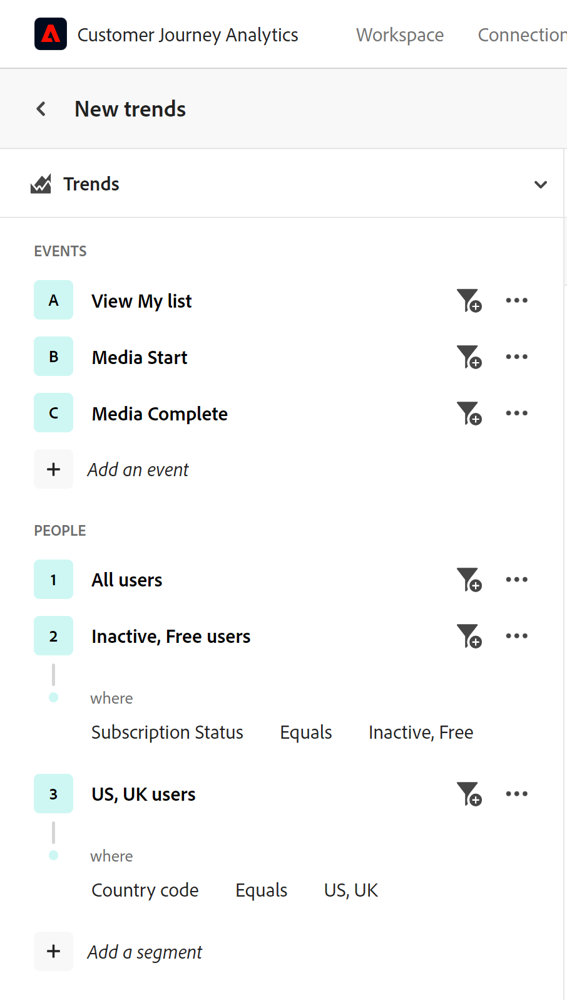

# Panoramica dell’analisi guidata

{{release-limited-testing}}

L’analisi guidata è un formato di reporting che consente ai team di prodotto di gestire autonomamente e rapidamente le esigenze di dati in modo da poter prendere decisioni sui prodotti più basate sui dati. I team cross-functional possono connettersi in tempo reale per utilizzare e comprendere questi rapporti.

Analogamente alle scorecard per dispositivi mobili e Analysis Workspace, un rapporto di analisi guidato utilizza dati provenienti da un [Visualizzazione dati](../data-views/data-views.md), che fa riferimento ai dati in Adobe Experience Platform tramite un [Connessione](../connections/overview.md). Tutti i rapporti creati nell’analisi guidata possono essere trasferiti facilmente ad Analysis Workspace per ulteriori ricerche.

L’analisi guidata offre diversi modi per analizzare i dati. Questi tipi di visualizzazione possono mostrare gli stessi dati in modi diversi, consentendo di ottenere informazioni diverse utilizzando gli stessi eventi e segmenti. Puoi ottenere diverse barre di query e opzioni di visualizzazione a seconda del tipo di visualizzazione scelto. Puoi passare liberamente da un tipo di visualizzazione all’altro e tutti i componenti della barra delle query applicabili verranno riportati, se il tipo di visualizzazione li supporta.

L&#39;analisi guidata categorizza i tipi di vista in **Tipi di analisi**. Sono disponibili i seguenti tipi di analisi e viste:

| Tipo di analisi | Tipo di visualizzazione | Descrizione |
| --- | --- | --- |
| Impatto | [del prossimo maggio (?)](types/release.md) | Confrontare le prestazioni in periodi uguali prima e dopo il rilascio. |
| Impatto | [Primo utilizzo](types/first-use.md) | Misura l’impatto del primo utilizzo delle funzioni sugli indicatori chiave. |
| Funnel | [Attrito](types/friction.md) | Confronta i tassi di conversione tra passaggi. |
| Funnel | [Tendenze di conversione](types/conversion-trends.md) | Tieni traccia delle modifiche nei tassi di conversione nel tempo. |
| Crescita degli utenti | [Attivo](types/active.md) | Misura la crescita della base di utenti. |
| Crescita degli utenti | [Crescita netta](types/net-growth.md) | Saldo degli utili e delle perdite degli utenti. |
| Tendenze | [Utilizzo](types/usage.md) | Misura il coinvolgimento degli utenti nel tempo. |

{style="table-layout:auto"}

## Interfaccia

L’interfaccia per l’analisi guidata, indipendentemente dal tipo di analisi, comprende i seguenti elementi principali dell’interfaccia utente:

1. **Barra delle query**: utilizza questa barra a sinistra per creare l’analisi.
1. **Grafico**: dopo aver selezionato gli eventi, le persone o i passaggi desiderati, a destra viene visualizzato un grafico che visualizza i dati.
1. **Tabella**: tabella sotto il grafico che mostra i numeri utilizzati nella visualizzazione.
1. **Impostazioni e informazioni**: diversi elementi dell’interfaccia utente sopra il grafico che consentono di personalizzare i dati restituiti.

[Schermata dell’interfaccia utente]

L&#39;analisi guidata contiene le seguenti parti dell&#39;interfaccia:

| Anteprima interfaccia | Elemento nell’interfaccia utente | Descrizione |
| --- | --- | --- |
|  | Barra delle query | Configura i componenti desiderati che compongono un rapporto. Diversi tipi di analisi condividono diverse opzioni di query; se due tipi di analisi condividono opzioni di query, queste vengono trasferite quando si cambiano tipi di analisi. |
|  | Grafico | Visualizzazione dei dati restituiti in base all’input proveniente dalla barra delle query e dalle impostazioni. La visualizzazione visualizzata dipende dal tipo di visualizzazione sopra il grafico. I tipi di visualizzazione disponibili dipendono dal tipo di analisi che si trova sopra la barra delle query. |
|  | Tabella | Una rappresentazione in tabella dei dati restituiti in base all’input proveniente dalla barra delle query e dalle impostazioni. Le colonne della tabella dipendono dal tipo di visualizzazione sopra il grafico. I tipi di visualizzazione disponibili dipendono dal tipo di analisi che si trova sopra la barra delle query. |
|  | Impostazioni di visualizzazione | Diverse opzioni sopra il grafico che consentono di personalizzare la modalità di restituzione dei dati da parte del grafico e della tabella.<ul><li>**Tipo di visualizzazione**: selettore a discesa che consente di presentare i dati per un determinato tipo di analisi in modo diverso. Ogni tipo di analisi dispone di almeno due tipi di vista.</li><li>**Impostazioni grafico**: ottimizzare l’aspetto del grafico e gli eventi da utilizzare. Le opzioni disponibili dipendono dal tipo di vista selezionato.</li><li>**Intervallo di date**: selettore calendario che consente di determinare l’intervallo di date del rapporto. Alcuni tipi di analisi consentono anche intervalli, ad esempio giornalieri, settimanali o mensili.</li><li>**Approfondimenti**: fornisce informazioni contestuali a seconda del rapporto visualizzato. Puoi mostrare o nascondere queste informazioni utilizzando l’icona della lampadina in alto a destra.</li></ul> |
|  | Menu Analisi | Comandi in alto a destra di Analisi guidata che forniscono azioni generali.<ul><li>**Selettore visualizzazione dati**: modifica la visualizzazione dati utilizzata dall’analisi. Quando modifichi la visualizzazione dati, cambiano anche i componenti disponibili nella barra delle query.</li><li>**Salva**: salva l&#39;analisi. Se stai salvando una nuova analisi, viene visualizzata una finestra modale che richiede un nome e una descrizione.</li><li>**Salva con nome**: salva l&#39;analisi separatamente dall&#39;analisi corrente, creando una copia. Viene visualizzata una finestra modale che richiede un nuovo nome e una nuova descrizione.</li><li>**Apri in Workspace**: ricrea l’analisi guidata corrente in Analysis Workspace. Il progetto Workspace viene creato in una nuova scheda, evitando interruzioni durante l’analisi guidata. Utilizza questo comando quando l’analisi guidata non offre la flessibilità o le informazioni specifiche che stai cercando. Ad esempio, desideri un [Utilizzo](types/usage.md) report che utilizza Sessioni per un segmento e Persone per un altro segmento.</li><li>**Scarica PNG**: scarica l&#39;elemento grafico come `.png`. La barra delle query e la tabella non sono incluse nell&#39;immagine.</li><li>**Scarica SVG**: scarica l&#39;elemento grafico come `.svg`. La barra delle query e la tabella non sono incluse nell&#39;immagine.</li></ul> |

{style="table-layout:auto"}

## Provisioning

L’analisi guidata fa parte di Adobe Product Analytics, un componente aggiuntivo a pagamento per il Customer Journey Analytics. Se la tua organizzazione desidera iniziare a utilizzare questa funzione, contatta il team del tuo account Adobe.

Una volta che la tua organizzazione dispone del provisioning per utilizzare l’analisi guidata, gli amministratori dei profili di prodotto possono concederle l’accesso in Adobe Admin Console.

1. Accedi a [Admin Console per Adobe](https://adminconsole.adobe.com).
1. Seleziona **[!UICONTROL Customer Journey Analytics]** nell’elenco dei prodotti.
1. Seleziona il profilo di prodotto desiderato per modificare le autorizzazioni.
1. Fai clic su **[!UICONTROL Permissions]** , quindi fai clic su **[!UICONTROL Edit]** in [!UICONTROL Reporting Tools].
1. Fai clic sull’icona più accanto a **[!UICONTROL Guided Analysis Access]** nell’elenco di [!UICONTROL Available Permission Items] per aggiungerlo all&#39;elenco di [!UICONTROL Included Permission Items].
1. Fai clic su **[!UICONTROL Save]** (Usa modello di attribuzione non predefinito).
