# Panoramica dell’analisi guidata

L’analisi guidata consente agli utenti, dagli addetti marketing e prodotti fino agli analisti, di gestire in autonomia dati e approfondimenti di alta qualità sul percorso del cliente tramite flussi di lavoro guidati, basati sui dati cross-channel di Customer Journey Analytics. Analogamente alle scorecard per Analysis Workspace e dispositivi mobili, l’analisi guidata utilizza dati provenienti da una [Visualizzazione dati](/help/data-views/data-views.md), che fa riferimento ai dati in Adobe Experience Platform tramite un [Connessione](../connections/overview.md). Molti rapporti creati nell’analisi guidata possono essere trasferiti facilmente in Analysis Workspace per ulteriori ricerche.

Sono disponibili le seguenti analisi guidate:

| Icona | Analisi | Descrizione |
| :----:|--- | --- |
|  | [Crescita attiva](types/active-growth.md) | Identifica gli utenti nuovi, mantenuti, che ritornano o inattivi. |
|  | [Tendenze di conversione](types/conversion-trends.md) | Tieni traccia delle modifiche nei tassi di conversione nel tempo. |
|  | [Coinvolgimento](types/engagement.md) | Comprendi l’ampiezza e la profondità del coinvolgimento delle funzioni. |
|  | [Analisi dell’impatto del primo utilizzo](types/first-use-impact.md) | Misura l’impatto del primo utilizzo delle funzioni sugli indicatori chiave. |
|  | [Frequenza](types/frequency.md) | Misura il coinvolgimento in base alla frequenza d’uso. |
|  | [Funnel](types/funnel.md) | Confronta i tassi di conversione tra passaggi. |
|  | [Crescita netta](types/net-growth.md) | Stai guadagnando o perdendo utenti? |
|  | [Impatto sulla versione](types/release-impact.md) | Confronta le prestazioni in periodi uguali prima e dopo il rilascio. |
|  | [Mantenimento](types/retention.md) | Misura le abitudini attuali riguardo il ritorno degli utenti. |
|  | [Timeline](types/timeline.md) | Esplora i pattern nell’attività della sessione. |
|  | [Tendenze](types/trends.md) | Misura il coinvolgimento degli utenti nel tempo. |

## Accesso

Puoi accedere all’Analisi guidata dalla pagina Home di Customer Journey Analytics.

1. Seleziona **[!UICONTROL Analisi guidata]** dalla home page, che ti porta direttamente all&#39;analisi delle tendenze [&#128279;](types/trends.md).

   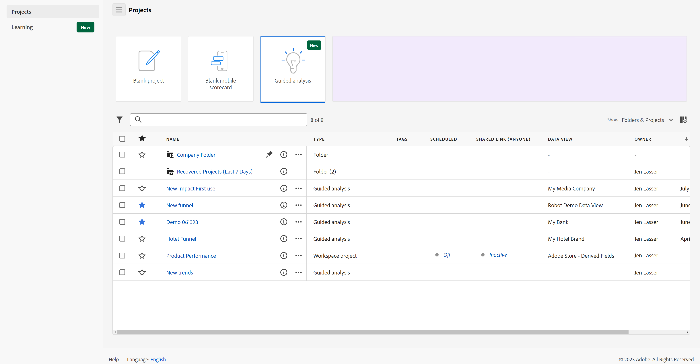{style="border:1px solid gray"}

1. Seleziona **[!UICONTROL Crea nuovo]** per visualizzare le diverse opzioni di visualizzazione e scegliere un diverso punto di partenza per l&#39;analisi.

   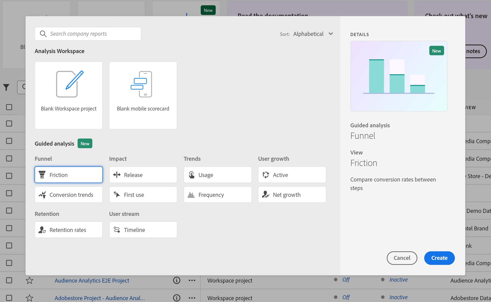{style="border:1px solid gray"}

Puoi accedere all’analisi guidata anche dall’interno di un progetto Analysis Workspace.

1. Selezionare **[!UICONTROL Progetto vuoto]** dalla home page per creare un progetto Workspace vuoto.

   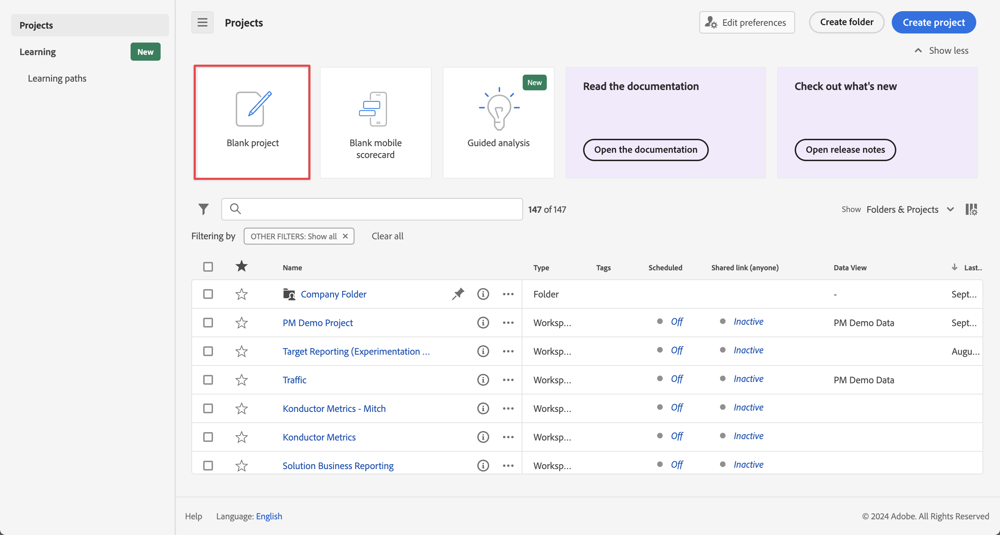{style="border:1px solid gray"}

1. Seleziona  **[!UICONTROL Analisi guidata]** nella barra a sinistra.

   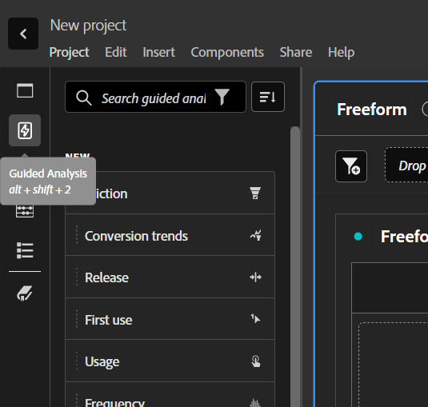{style="border:1px solid gray"}

1. Trascina una nuova analisi nell&#39;area di lavoro di Workspace, quindi seleziona **[!UICONTROL Crea]** per generare l&#39;analisi desiderata (ad esempio: **[!UICONTROL Crea tendenze]**). Puoi anche trascinare un&#39;analisi esistente nell&#39;area di lavoro di Workspace dalla sezione **[!UICONTROL Salvato]**.

   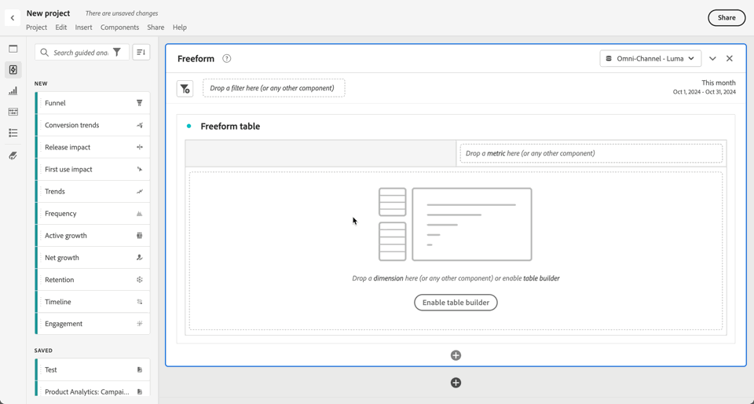

## Interfaccia

L’interfaccia per l’analisi guidata segue un formato di domanda e risposta. Crea una domanda nella barra delle query, quindi ottieni una risposta con un approfondimento scritto, un grafico e una tabella. A questo punto potrai rispondere alla domanda successiva con le impostazioni di visualizzazione e analisi.

L’analisi guidata utilizza i seguenti elementi dell’interfaccia utente:

| Anteprima interfaccia | Elemento nell’interfaccia utente | Descrizione |
| --- | --- | --- |
| 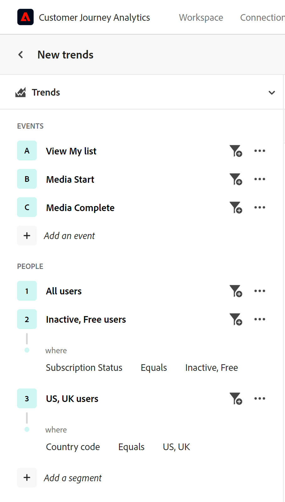{style="border:1px solid gray"} | **[!UICONTROL Barra delle query]** | Configura la *domanda* selezionando i componenti desiderati (eventi, proprietà e segmenti) che compongono un’analisi. Le seguenti opzioni sono disponibili per tutte le analisi, con impostazioni aggiuntive disponibili per singole visualizzazioni. <ul><li>**Visualizzazione**: seleziona una delle opzioni per passare a una nuova analisi. Le selezioni delle query vengono mantenute entro i limiti consentiti per il nuovo tipo di analisi.</li><li>**Eventi**: gli eventi che desideri misurare. Ogni analisi applica limiti diversi al numero di eventi che è possibile configurare.  Gli eventi sono talvolta etichettati come **[!UICONTROL eventi iniziali e di ritorno]**, **[!UICONTROL passaggi]** o **[!UICONTROL indicatori chiave]**. Gli eventi sono identificati nell&#39;analisi utilizzando 1, 2, ... Seleziona  **[!UICONTROL Aggiungi un evento]** per aggiungere nuovi eventi.</li><li>**[!UICONTROL Fattori]**: se disponibile, consente di specificare fattori quali data da e primo evento.</li><li>**Conteggiato come**: metodo di conteggio che desideri applicare agli eventi selezionati. Seleziona dal menu a discesa.</li><li>**Segmenti**: i segmenti che desideri misurare. Ogni analisi applica limiti diversi al numero di segmenti che è possibile configurare. I segmenti sono identificati nell&#39;analisi utilizzando A, B, ... Seleziona  **[!UICONTROL Aggiungi un segmento]** per aggiungere nuovi segmenti.</li><li>**[!UICONTROL Raggruppamento]**: se disponibile, il raggruppamento da applicare all&#39;analisi.</li></ul>In alcune impostazioni sono disponibili configurazioni aggiuntive.<ul><li>**Filtri**: utilizza  per limitare gli eventi o i segmenti in base a dimensioni specifiche. Quando è selezionata una dimensione, sono disponibili sia i criteri di filtro standard (ad esempio **[!UICONTROL Uguale a]**, **[!UICONTROL Contiene]** o **[!UICONTROL Termina con]**) che i primi 1000 valori di dimensione. Seleziona  per aggiungere altri filtri. Seleziona  per rimuovere un filtro.</li><li>**Altre azioni**: utilizza  per selezionare azioni come<ul><li> **[!UICONTROL Rinomina]**: per rinominare un evento o un segmento.</li><li> **[!UICONTROL Duplicato]**: per duplicare un evento o un segmento.</li><li> **[!UICONTROL Rimuovi]**: per rimuovere un evento, segmento o raggruppamento.</li><li> **[!UICONTROL Modifica segmento]**: per modificare un segmento nel [Generatore di segmenti](/help/components/segments/seg-builder.md).</li><li> **[!UICONTROL Aggiungi ai preferiti]**: per aggiungere il segmento all&#39;elenco dei segmenti preferiti nel [Gestore segmenti](/help/components/segments/seg-manage.md).</li><li> **[!UICONTROL Salva con nome]**: per salvare il segmento come nuovo componente. Nella finestra di dialogo **[!UICONTROL Salva segmenti nei componenti]**, puoi specificare un nome e una descrizione del segmento. Puoi selezionare  per contrassegnare il nuovo segmento come preferito. Seleziona **[!UICONTROL Salva]** per salvare il segmento come nuovo segmento.</li><li> **[!UICONTROL Collega eventi di inizio e di ritorno]**.: per collegare eventi di inizio e di ritorno in un&#39;analisi [Mantenimento](types/retention.md).</li><li> **[!UICONTROL Scollega eventi di inizio e di ritorno]**: per scollegare eventi di inizio e di ritorno in un&#39;analisi [Mantenimento](types/retention.md).</li></ul></li></ul> |
| 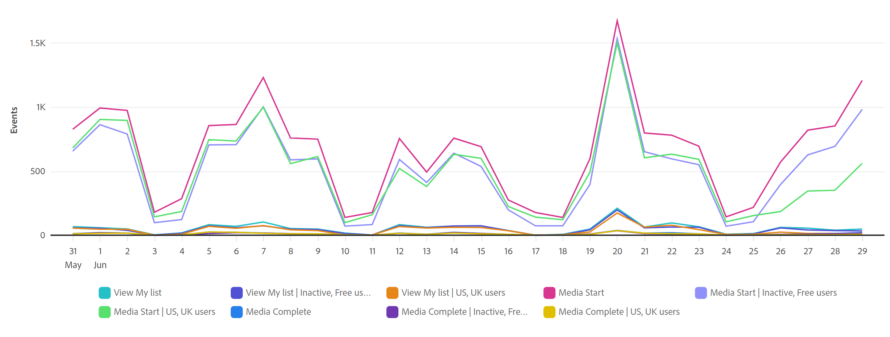{style="border:1px solid gray"} | **[!UICONTROL Grafico]** | Una visualizzazione dei dati restituiti in base all’input proveniente dalla barra delle query e dalle impostazioni. La visualizzazione che vedi dipende dalla vista e dalle impostazioni sopra il grafico. Il grafico include anche: <ul><li>**Descrizioni**: passa il puntatore su un punto dati del grafico per visualizzare una descrizione comando con ulteriori informazioni.</li><li>**Legenda**: passa il puntatore sulla serie di legende del grafico per visualizzare le definizioni, se disponibili, per concentrarti su tale serie e nasconderne temporaneamente altre. Seleziona una serie nella legenda per nasconderla.</li><li>**Annotazioni**: le [annotazioni](../components/annotations/overview.md) applicabili sono visibili tra la visualizzazione e la legenda. Vengono visualizzate come  nel colore configurato dell’annotazione. Le analisi che mostrano i dati nel tempo inseriscono l’ sotto la data o l’intervallo di date configurato. Le analisi che non mostrano dati nel tempo mostrano l’ nell’angolo inferiore a destra del grafico.</li><li>**Seleziona azioni**: per esporre le azioni successive disponibili selezionando un qualsiasi punto dati. Le opzioni includono **Salva segmento**.</li></ul> |
| 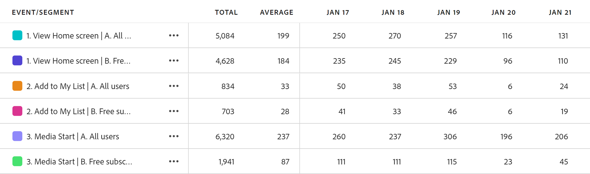{style="border:1px solid gray"} | **[!UICONTROL Tabella]** | Una rappresentazione in tabella dei dati restituiti in base all’input proveniente dalla barra delle query e dalle impostazioni. Righe nella tabella utilizzando l’evento (1, 2, ...) e gli identificatori del segmento (A, B, ...) per riferimento. Le colonne della tabella dipendono dall’analisi sopra il grafico. Per ogni riga la tabella include anche: <ul><li>**Seleziona azioni**: attiva o disattiva  per nascondere o esporre una serie di grafici per una riga. Seleziona  per ulteriori azioni. Le opzioni includono **Salva segmento**.</li></ul> |
| 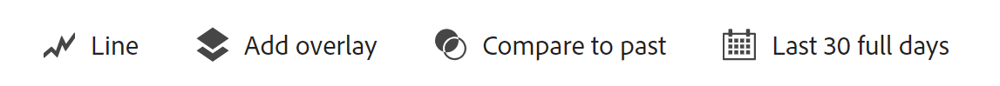{style="border:1px solid gray"} | **[!UICONTROL Impostazioni di visualizzazione]** | Opzioni sopra il grafico che consentono di porre la domanda successiva e personalizzare la modalità di restituzione dei dati del grafico e della tabella. Le seguenti opzioni sono disponibili per tutte le analisi, con impostazioni aggiuntive disponibili per singole analisi. <ul><li> **Impostazioni grafico**: regola con precisione la visualizzazione del grafico e della tabella. Le opzioni disponibili dipendono dall’analisi selezionata.</li><li> **Impostazioni sovrapposizione**: aggiungi una sovrapposizione. Le opzioni disponibili dipendono dall’analisi selezionata.</li><li> **[!UICONTROL Impostazioni bucket]**: impostazione bucket automatica o applicazione di impostazioni bucket personalizzate ai dati. Le opzioni disponibili dipendono dall’analisi selezionata.<li> **[!UICONTROL Confronta impostazioni]**: Confronta i dati con un intervallo di date specifico. Le opzioni disponibili dipendono dall’analisi selezionata.</li><li> **[!UICONTROL Impostazioni visualizzazione]**: selezionare la modalità di visualizzazione dei dati. Le opzioni disponibili dipendono dall’analisi selezionata.<li> **Intervallo di date**: selettore calendario che consente di determinare l’intervallo di date dell’analisi. È inoltre possibile selezionare un intervallo per le analisi con tendenze, ad esempio giornaliere, settimanali o mensili.</li><li> **Insight**: approfondimenti contestuali a seconda dell’analisi visualizzata. Queste informazioni approfondite forniscono osservazioni per l’analisi corrente. Se sono disponibili più informazioni, puoi visualizzarle utilizzando le frecce a destra. È possibile attivare o disattivare la visibilità di questa casella utilizzando l&#39;icona della lampadina in alto a destra.</li></ul> |
| 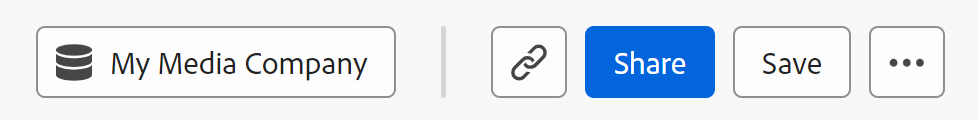{style="border:1px solid gray"} | **[!UICONTROL Menu]** Disponibile in un progetto di analisi guidata | Comandi in alto a destra del progetto di analisi guidata che forniscono azioni globali per l’analisi.<ul><li> ***Nome della visualizzazione dati***: per modificare la visualizzazione dati utilizzata dall’analisi. Quando modifichi la visualizzazione dati, cambiano anche i componenti disponibili nella barra delle query.</li><li> **Copia collegamento**: copia negli Appunti un collegamento all’analisi. Ti verrà richiesto di salvare prima della condivisione.</li><li>**Condividi**: apre la finestra modale di condivisione, con ulteriori opzioni per la condivisione a singoli utenti o gruppi. Puoi condividere un’analisi con altri utenti o generare un collegamento da condividere con chiunque.</li><li>**Salva**: salva l’analisi. Se salvi una nuova analisi, viene visualizzata la finestra di dialogo **[!UICONTROL Salva analisi]** che richiede un nome e una descrizione. Una volta salvata, una finestra di dialogo **[!UICONTROL Analisi salvata]** ti consente di condividere l&#39;analisi.</li><li> **[!UICONTROL Aggiungi a Workspace]**: mostra i progetti Workspace disponibili a cui è possibile aggiungere questa analisi. Quando selezioni un progetto Workspace, questo viene aperto in una nuova scheda e nella parte inferiore del progetto viene aggiunta l’analisi.</li></ul>Seleziona l’ per altre azioni, ad esempio:<ul><li>**[!UICONTROL Salva con nome]**: salva l’analisi separatamente da quella corrente, creando una copia. Viene visualizzata una finestra di dialogo che richiede un nuovo nome e una nuova descrizione.</li><li>**[!UICONTROL Esporta in Workspace]**: ricrea la query dell’analisi guidata corrente in Analysis Workspace. Il progetto Workspace viene creato in una nuova scheda, evitando interruzioni durante l’analisi guidata. È una copia dell’analisi e non rimane sincronizzata con l’analisi guidata originale una volta aperta. Utilizza questo comando per trasmetterla al team di analisti o per approfondire i dati oltre ai limiti consentiti dall’analisi.</li><li>**[!UICONTROL Copia grafico negli Appunti]**: copia l’elemento grafico negli Appunti per incollarlo in altre applicazioni. La barra delle query e la tabella non sono incluse nel grafico.</li><li>**[!UICONTROL Scarica PNG]**: scarica l’elemento grafico come `.png`. La barra delle query e la tabella non sono incluse nel grafico.</li><li>**[!UICONTROL Scarica CSV]**: scarica i dati della tabella come `.csv`. La barra delle query e il grafico non sono inclusi nel file.</li></ul> |
| 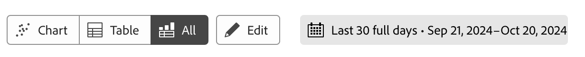{style="border:1px solid gray"} | **Menu**  Disponibile in una visualizzazione di analisi guidata in Analysis Workspace. | Comandi in una visualizzazione di analisi guidata in Analysis Workspace.<ul><li> **[!UICONTROL Grafico]**: per visualizzare solo il grafico dell&#39;analisi.</li><li> **[!UICONTROL Tabella]**: per visualizzare solo la tabella dell&#39;analisi.</li><li> **[!UICONTROL Tutto]**: per visualizzare il grafico e la tabella dell&#39;analisi.</li><li> **[!UICONTROL Modifica]**: per modificare la configurazione dell&#39;analisi</li><li> **[!UICONTROL *Intervallo date *]**: per configurare l’intervallo di date per l’analisi.</li></ul> |

## Provisioning

Le analisi guidate sono incluse nei pacchetti di Customer Journey Analytics nel modo seguente:

| Pacchetto | Analisi disponibili |
| --- | --- |
| [!UICONTROL Componenti aggiuntivi Customer Journey Analytics] | Crescita attiva, tendenze di conversione, frequenza, funnel, crescita netta, conservazione, tendenze |
| [!UICONTROL Customer Journey Analytics Foundation] | Tendenze |
| [!UICONTROL Selezione Customer Journey Analytics] | Visualizzazioni Foundation + crescita attiva, tendenze di conversione, frequenza, funnel, crescita netta, conservazione |
| [!UICONTROL Customer Journey Analytics Prime] | Seleziona visualizzazioni + Coinvolgimento, Impatto primo utilizzo, Impatto rilascio, Timeline |
| [!UICONTROL Customer Journey Analytics Ultimate] | Visualizzazioni Prime |

{style="table-layout:auto"}

Gli amministratori dei profili di prodotto possono aggiungere o rimuovere l’accesso all’analisi guidata in Adobe Admin Console.

1. Accedi ad [Adobe Admin Console](https://adminconsole.adobe.com).
1. Selezionare **[!UICONTROL Customer Journey Analytics]** nell&#39;elenco dei prodotti.
1. Seleziona il profilo di prodotto desiderato per le autorizzazioni da modificare.
1. Seleziona la scheda **[!UICONTROL Autorizzazioni]**, quindi fai clic su **[!UICONTROL Modifica]** in [!UICONTROL Strumenti di reporting].
1. Selezionare  accanto a **[!UICONTROL Accesso guidato alle analisi]** nell&#39;elenco di [!UICONTROL Elementi di autorizzazione disponibili], che lo aggiunge all&#39;elenco di [!UICONTROL Elementi di autorizzazione inclusi].
1. Seleziona **[!UICONTROL Salva]**.

Per ulteriori informazioni, consulta [Accesso a livello utente](/help/technotes/access-control.md#user-level-access).

>[!TIP]
>
>Alcuni amministratori preferiscono abilitare l’analisi guidata e disabilitare Analysis Workspace per i nuovi utenti di Customer Journey Analytics. Una volta che questi utenti avranno una maggiore conoscenza del prodotto e dei tuoi dati organizzativi, potrai abilitare l’accesso ad Analysis Workspace.
