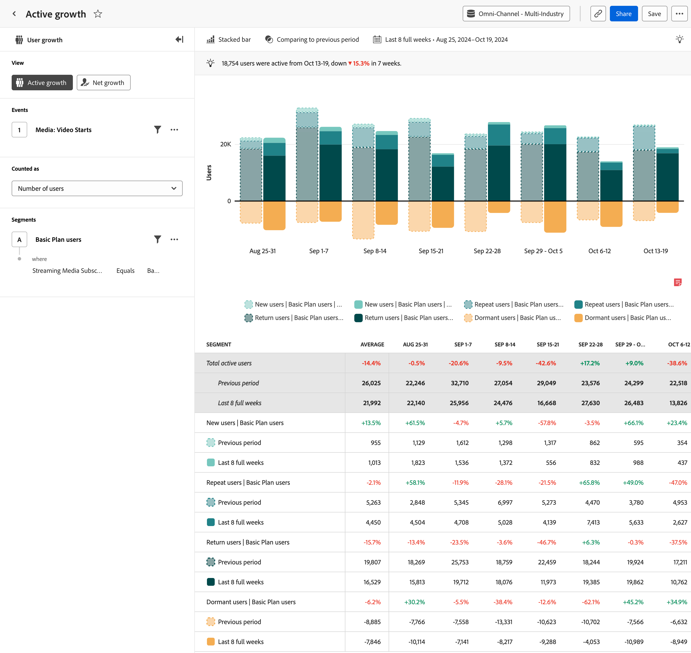

# Analisi della [!UICONTROL crescita attiva] {#active-growth}

>[!CONTEXTUALHELP]
>id="workspace_guidedanalysis_activegrowth_button"
>title="Crescita attiva"
>abstract="Identifica gli utenti nuovi, mantenuti, che ritornano o inattivi."

L&#39;analisi  **[!UICONTROL Active growth]** fornisce informazioni sulla crescita e l&#39;acquisizione degli utenti in un periodo specifico. L’asse orizzontale mostra un intervallo di tempo, mentre l’asse verticale indica la misura degli utenti. Gli utenti sono suddivisi in quattro categorie:

* **[!UICONTROL Nuovo]**: l&#39;utente era attivo durante il periodo corrente, ma non in precedenza. Osserva l&#39;analisi passando il cursore sopra _[!UICONTROL i nuovi utenti]_ nella legenda del grafico. L’intervallo di lookback viene determinato dinamicamente in base all’intervallo di date selezionato.
* **[!UICONTROL Ripeti]**: l&#39;utente era attivo nel periodo corrente e immediatamente precedente.
* **[!UICONTROL Invio]**: l&#39;utente era attivo nel periodo corrente e non nel periodo immediatamente precedente, ma prima era attivo. Controlla l&#39;analisi passando il cursore sopra _[!UICONTROL Utenti restituiti]_ nella legenda del grafico. L’intervallo di lookback viene determinato dinamicamente in base all’intervallo di date selezionato.
* **[!UICONTROL Inattivo]**: l&#39;utente era attivo nel periodo immediatamente precedente, ma non è attivo nel periodo corrente. Gli utenti inattivi non concorrono al numero totale degli utenti attivi.

Tutti gli utenti attivi (nuovi + ripetuti + di ritorno) vengono visualizzati in una tonalità di verde sopra l’asse orizzontale, mentre tutti gli utenti inattivi vengono visualizzati in arancione sotto l’asse orizzontale.

>[!VIDEO](https://experienceleague.adobe.com/en/docs/customer-journey-analytics-learn/tutorials/guided-analysis/active-growth)

## Casi d’uso

I casi d’uso per questa analisi includono:

* **Mantenimento e abbandono degli utenti:** fornisce una chiara visualizzazione dei periodi di maggiore o minore mantenimento degli utenti. Riconoscere questi periodi di maggiore o minore capacità di mantenimento può aiutare a prendere decisioni sui prodotti utili ad aumentare la fidelizzazione e ridurre al minimo l’abbandono.
* **Valutazione della campagna**: visualizzando una campagna specifica, potrai capire quanto traffico ha generato e quanto ha contribuito a tenere gli utenti coinvolti.
* **Analisi del ciclo di vita degli utenti**: l’analisi della crescita degli utenti attivi durante il relativo ciclo di vita consente di identificare le fasi specifiche in cui il loro coinvolgimento subisce un calo. Un’alta percentuale di utenti inattivi in una fase di onboarding, ad esempio, può indicare problemi di usabilità o la necessità di migliorare le indicazioni fornite all’interno del prodotto.

## Interfaccia

Per una panoramica dell’interfaccia dell’analisi guidata, consulta [Interfaccia](../overview.md#interface). Le seguenti impostazioni sono specifiche per questa analisi:

### Barra delle query

La barra delle query consente di configurare i seguenti componenti:

* **[!UICONTROL Visualizza]**: passa da questa analisi a [Crescita netta](net-growth.md).
* **[!UICONTROL Eventi]**: l&#39;evento che si desidera misurare. Poiché questa analisi è basata sull’utente, vengono conteggiati come utenti attivi anche coloro che interagiscono con l’evento una volta nell’arco del periodo. Puoi includere un evento in una query.
* **[!UICONTROL Conteggiato come]**: metodo di conteggio che desideri applicare agli eventi selezionati. <ul><li>**[!UICONTROL Le opzioni]** includono [!UICONTROL Numero di utenti] e [!UICONTROL Percentuale di utenti].</li><li>[!BADGE B2B edition]{type=Informative url="https://experienceleague.adobe.com/it/docs/analytics-platform/using/cja-overview/cja-b2b/cja-b2b-edition" newtab=true tooltip="Customer Journey Analytics B2B Edition"} Ulteriori **[!UICONTROL opzioni B2B]** sono disponibili per Customer Journey Analytics B2B edition: [!UICONTROL Account globali], [!UICONTROL Account], [!UICONTROL Gruppi acquisti], [!UICONTROL Opportunità], [!UICONTROL Percentuale di account globali], [!UICONTROL Percentuale di account], [!UICONTROL Percentuale di gruppi acquisti] e [!UICONTROL Percentuale di opportunità].</li></ul>
* **[!UICONTROL Segmenti]**: il segmento in base al quale si desidera segmentare i dati. Puoi includere un segmento in una query.

### Impostazioni del grafico

L&#39;analisi [!UICONTROL Crescita attiva] offre le seguenti impostazioni del grafico, che possono essere regolate nel menu sopra il grafico:

* **[!UICONTROL Tipo di grafico]**: tipo di visualizzazione che si desidera utilizzare. Le opzioni includono [!UICONTROL Barre in pila] e [!UICONTROL Area in pila].

### Confronto temporale

{{apply-time-comparison}}

### Intervallo date

L’intervallo di date desiderato per l’analisi. Questa impostazione è costituita da due componenti:

* **[!UICONTROL Intervallo]**: granularità della data in base alla quale visualizzare i dati con tendenze. Le opzioni valide includono: Oraria, Giornaliera, Settimanale, Mensile e Trimestrale. Lo stesso intervallo di date può avere una granularità diversa, da cui dipende il numero di punti dati nel grafico e il numero di colonne nella tabella. Nella visualizzazione di un’analisi di tre giorni con granularità giornaliera, ad esempio, saranno presenti solo tre punti dati, mentre in quella di un’analisi di tre giorni con granularità oraria ne saranno presenti 72.
* **[!UICONTROL Data]**: la data di inizio e di fine. Per comodità, sono disponibili intervalli di date continui predefiniti e intervalli personalizzati salvati in precedenza; in alternativa, puoi utilizzare il selettore del calendario per scegliere un intervallo di date fisso.

<!--
## Example

See below for an example of the analysis.

-->
