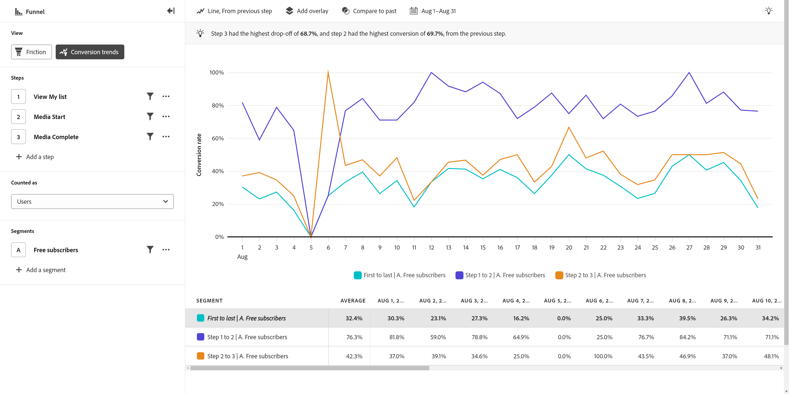

# Tendenze di conversione

{{release-limited-testing}}

Il **Tendenze di conversione** il tipo di visualizzazione fornisce una visualizzazione con tendenze sui tassi di conversione nel tempo. L’asse orizzontale è sempre una granularità data, mentre l’asse verticale rappresenta il tasso di conversione. Utilizzo di questo tipo di visualizzazione in combinazione con [Attrito](friction.md) consente di stabilire e perfezionare il funnel desiderato. Puoi quindi utilizzare questo tipo di visualizzazione per visualizzare i tassi di conversione per tale funnel nel tempo. I casi di utilizzo per questo tipo di visualizzazione includono:

* **Tracciare le attività di ottimizzazione**: dopo aver identificato i colli di bottiglia chiave da migliorare utilizzando [Attrito](friction.md), puoi utilizzare questo tipo di visualizzazione per monitorare in che modo tali ottimizzazioni influiscono sul tasso di conversione nel tempo.
* **Valutazione test A/B**: valuta l’efficacia dei test A/B o degli esperimenti condotti nel contesto di un funnel. Confrontando i tassi di conversione tra diverse varianti, puoi facilmente determinare quali test forniscono tassi di conversione più elevati, per cui puoi decidere in base ai dati su quali varianti implementare in modo permanente.
* **Valutazione della campagna nel tempo**: misura l’efficacia delle campagne di marketing nel tempo. Puoi creare un segmento che si concentra sugli utenti che hanno toccato una determinata campagna e confrontare i loro tassi di conversione con altre campagne. Puoi anche confrontare i tassi di conversione correnti con campagne simili eseguite in passato.

## Barra delle query

La barra delle query consente di configurare i seguenti componenti:

* **Passaggi**: i punti di contatto dell’evento di cui desideri tenere traccia. Ogni barra del grafico rappresenta un passo. Puoi includere fino a dieci passaggi.
* **Persone**: i segmenti in cui desideri confrontare il funnel. Ogni segmento selezionato suddivide ogni passaggio in più barre. Ogni colore rappresenta un segmento diverso. Puoi includere fino a tre segmenti.

## Impostazioni grafico

Funnel offre le seguenti impostazioni per i grafici. È possibile regolare le impostazioni del grafico utilizzando il menu tra il tipo di visualizzazione e il selettore del calendario.

* **Metrica**: la metrica da misurare. Le opzioni includono Sessioni e Utenti.
* **Tipo di grafico**: tipo di visualizzazione che desideri utilizzare. L&#39;unica opzione è Linea.
* **Conversione da**: determina il calcolo della percentuale da un passaggio all’altro. Le opzioni includono il calcolo della conversione dal primo passaggio o dal passaggio precedente.

## Applica confronto temporale

{{apply-time-comparison}}

## Intervallo date

L’intervallo di date desiderato. Questa impostazione è composta da due componenti importanti:

* **Interval**: granularità della data in cui desideri visualizzare i dati. Le opzioni valide includono Orario, Giornaliero, Settimanale, Mensile e Trimestrale. Lo stesso intervallo di date può avere intervalli diversi che influiscono sul numero di coordinate nel grafico e sul numero di colonne nella tabella. Ad esempio, la visualizzazione di un’analisi con granularità giornaliera della durata di tre giorni mostrerebbe solo tre punti di dati, mentre un’analisi con granularità oraria della durata di tre giorni mostrerebbe 72 punti di dati.
* **Data**: data di inizio e fine. Sono disponibili predefiniti per l’intervallo di date, oppure puoi utilizzare il selettore del calendario per impostare la data esatta desiderata.
