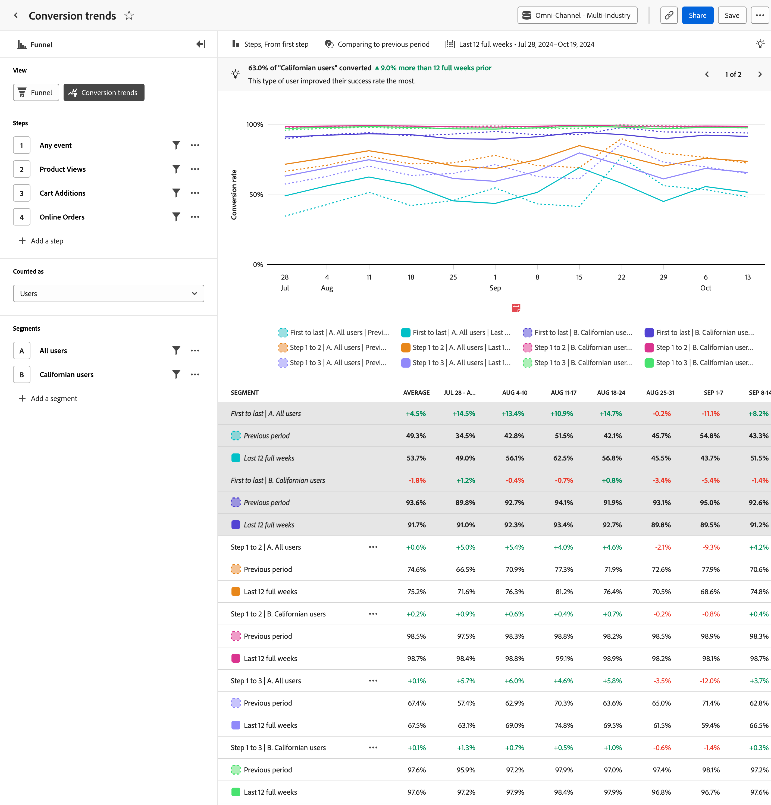

# Visualizzazione tendenze di conversione

Il **Tendenze di conversione** fornisce una visualizzazione con tendenze sui tassi di conversione nel tempo. L’asse orizzontale è un intervallo di tempo, mentre l’asse verticale rappresenta il tasso di conversione.

## Casi d’uso

I casi di utilizzo per questo tipo di visualizzazione includono:

* **Tracciare le attività di ottimizzazione**: dopo aver identificato i colli di bottiglia chiave da migliorare utilizzando [Attrito](friction.md), puoi utilizzare questa visualizzazione per tenere traccia di come queste ottimizzazioni influiscono sul tasso di conversione nel tempo.
* **Valutazione test A/B**: valuta l’efficacia dei test A/B o degli esperimenti condotti nel contesto di un funnel. Confrontando i tassi di conversione tra diverse varianti, puoi facilmente determinare quali test forniscono tassi di conversione più elevati, per cui puoi decidere in base ai dati su quali varianti implementare in modo permanente.
* **Valutazione della campagna nel tempo**: misura l’efficacia delle campagne di marketing nel tempo. Puoi creare un segmento che si concentra sugli utenti che hanno toccato una determinata campagna e confrontare i loro tassi di conversione con altre campagne. Puoi anche confrontare i tassi di conversione correnti con campagne simili eseguite in passato.

## Barra delle query

La barra delle query consente di configurare i seguenti componenti:

* **Passaggi**: i punti di contatto dell’evento di cui desideri tenere traccia. Ogni barra del grafico rappresenta un passo. Puoi includere fino a dieci passaggi.
* **Persone**: i segmenti in cui desideri confrontare il funnel. Ogni segmento selezionato suddivide ogni passaggio in più barre. Ogni colore rappresenta un segmento diverso. Puoi includere fino a tre segmenti.

## Impostazioni grafico

La vista Tendenze di conversione offre le seguenti impostazioni del grafico, che possono essere regolate nel menu sopra il grafico:

* **Metrica**: la metrica da misurare. Le opzioni includono Sessioni e Utenti.
* **Tipo di grafico**: tipo di visualizzazione che desideri utilizzare. Le opzioni includono Linea.
* **Conversione da**: determina il calcolo della percentuale da un passaggio all’altro. Le opzioni includono il calcolo della conversione dal primo passaggio o dal passaggio precedente.

## Applica confronto temporale

{{apply-time-comparison}}

## Intervallo date

L’intervallo di date desiderato per l’analisi. Questa impostazione è composta da due componenti:

* **Interval**: granularità della data in base alla quale visualizzare i dati con tendenze. Le opzioni valide includono Orario, Giornaliero, Settimanale, Mensile e Trimestrale. Lo stesso intervallo di date può avere intervalli diversi che influiscono sul numero di coordinate nel grafico e sul numero di colonne nella tabella. Ad esempio, la visualizzazione di un’analisi con granularità giornaliera della durata di tre giorni mostrerebbe solo tre punti di dati, mentre un’analisi con granularità oraria della durata di tre giorni mostrerebbe 72 punti di dati.
* **Data**: data di inizio e fine. Sono disponibili predefiniti per intervalli di date continui e intervalli personalizzati salvati in precedenza, oppure puoi utilizzare il selettore calendario per scegliere un intervallo di date fisso.
