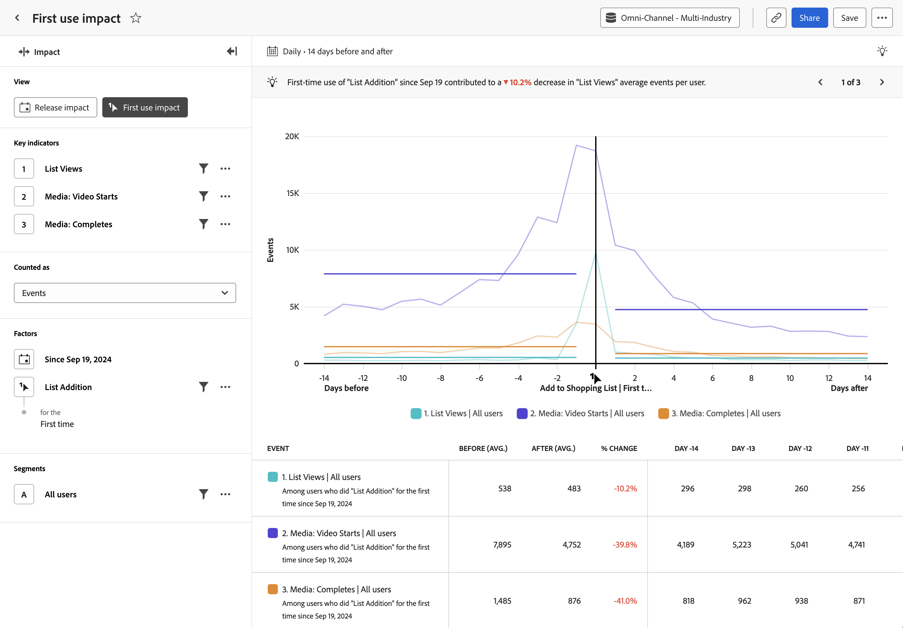

# Analisi dell’[!UICONTROL impatto sul primo utilizzo] {#first-use-impact}

<!-- markdownlint-disable MD034 -->

>[!CONTEXTUALHELP]
>id="workspace_guidedanalysis_firstuseimpact_button"
>title="Impatto sul primo utilizzo"
>abstract="Misura l’impatto del primo utilizzo delle funzioni sugli indicatori chiave."

<!-- markdownlint-enable MD034 -->

L&#39;analisi  **[!UICONTROL First use impact]** mostra un confronto tra le prestazioni degli indicatori chiave prima e dopo che un utente utilizza una funzione di prodotto per la prima volta. L’asse orizzontale di questo rapporto è un intervallo di tempo relativo prima e dopo l’evento, mentre l’asse verticale misura gli indicatori chiave desiderati. Una barra verticale al centro del grafico rappresenta il giorno 0 del primo utilizzo di una caratteristica da parte di un utente specifico. Poiché gli utenti non adottano sempre le funzioni nello stesso giorno e i rollout possono potenzialmente verificarsi in più giorni, il giorno 0 può avere un significato diverso per ogni singolo utente.

>[!VIDEO](https://experienceleague.adobe.com/it/docs/customer-journey-analytics-learn/tutorials/guided-analysis/first-use-impact)

## Casi d’uso

I casi d’uso per questa analisi includono:

* **Nuova analisi delle funzionalità**: se stai avviando una nuova funzionalità nel tuo prodotto, puoi confrontare il modo in cui gli indicatori chiave sono stati eseguiti prima e dopo che gli utenti sono stati esposti a quella nuova funzionalità per la prima volta.
* **Rollout graduali**: poiché l’analisi cerca il primo utilizzo della funzionalità anziché una data fissa, questa analisi è utile se si esegue il rollout graduale delle funzionalità nel tempo.
* **Analisi della versione del nuovo prodotto**: se stai avviando una nuova versione del prodotto, puoi confrontare le prestazioni degli indicatori chiave prima e dopo l’esposizione degli utenti alla nuova versione per la prima volta. Seleziona “qualsiasi evento” come evento di primo utilizzo e filtralo nella proprietà Numero versione.
* **Miglioramenti di funzionalità esistenti**: se stai apportando miglioramenti a una funzionalità esistente all’interno del prodotto, puoi confrontare le prestazioni degli indicatori chiave prima e dopo l’esposizione degli utenti a tali nuovi miglioramenti per la prima volta. Puoi eseguire questa analisi in uno o più modi, a seconda della strumentazione della funzionalità.
   * Seleziona un evento che rappresenta il miglioramento come evento di primo utilizzo
   * Seleziona la data in cui è iniziato il rollout delle modifiche
   * Segmenta l’analisi per il gruppo di persone esposte ai miglioramenti
* **Efficacia di una campagna**: quando un utente fa clic su una determinata campagna, puoi confrontare le prestazioni degli indicatori chiave prima e dopo l’interazione dell’utente con tale campagna.

## Interfaccia

Per una panoramica dell’interfaccia dell’analisi guidata, consulta [Interfaccia](../overview.md#interface). Le seguenti impostazioni sono specifiche per questa analisi:

### Barra delle query

La barra delle query consente di configurare i seguenti componenti:

* **[!UICONTROL Visualizza]**: passa da questa analisi alla [Versione](release-impact.md).
* **[!UICONTROL Indicatori chiave]**: gli eventi che si desidera misurare per utente. Ogni indicatore chiave selezionato viene rappresentato da una linea colorata. Alla tabella viene aggiunta una riga che rappresenta l’evento. Puoi includere fino a tre eventi.
* **[!UICONTROL Conteggiato come]**: metodo di conteggio che desideri applicare agli eventi selezionati. Le opzioni includono [!UICONTROL Eventi per utente], [!UICONTROL Eventi], [!UICONTROL Sessioni] e [!UICONTROL Utenti].
* **[!UICONTROL Fattori]**: per questa analisi sono disponibili due fattori:
   * **[!UICONTROL Data]**: quanto indietro vuoi iniziare a cercare il primo evento di utilizzo che si è verificato.
   * **[!UICONTROL Evento]**: l&#39;evento che si desidera cercare per il primo utilizzo, su cui basare l&#39;analisi.
* **[!UICONTROL Segmenti]**: il segmento che si desidera misurare. Il segmento selezionato filtra i dati in modo da concentrarti solo sui singoli utenti che corrispondono ai criteri del segmento. Per questa analisi è supportato un singolo segmento.

### Impostazioni del grafico

L&#39;analisi [!UICONTROL First use impact] offre le seguenti impostazioni del grafico, che possono essere regolate nel menu sopra il grafico:

* **[!UICONTROL Tipo di grafico]**: tipo di visualizzazione che si desidera utilizzare. Le opzioni includono Linea.

### Intervallo date

Le selezioni di date nell&#39;analisi [!UICONTROL Primo impatto utilizzo] funzionano in modo diverso rispetto ad altre analisi, in quanto l&#39;analisi ruota intorno alla data specificata nella barra delle query. Sono disponibili le seguenti opzioni:

* **[!UICONTROL Intervallo]**: granularità della data in base alla quale visualizzare i dati con tendenze. Le opzioni valide includono [!UICONTROL Giornaliero], [!UICONTROL Settimanale], [!UICONTROL Mensile] e [!UICONTROL Trimestrale]. La modifica dell’intervallo influisce sulle opzioni disponibili per il periodo Prima e Dopo.
* **[!UICONTROL Prima e dopo il periodo]**: tempo di analisi prima e dopo il primo evento di utilizzo specificato nella barra delle query. Le opzioni disponibili dipendono dalla selezione di [!UICONTROL Intervallo].

<!--
## Example

See below for an example of the analysis.

-->
