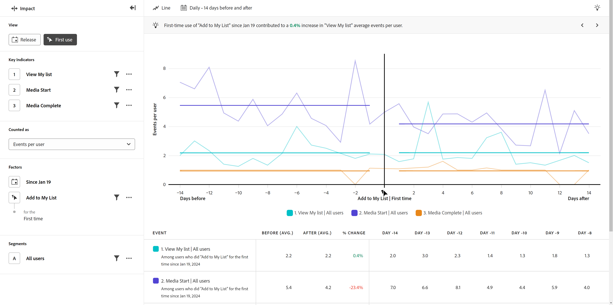

# Vista primo utilizzo

Il **Primo utilizzo** La vista mostra un confronto tra le prestazioni degli indicatori chiave prima e dopo che un utente utilizza una funzione del prodotto per la prima volta. L’asse orizzontale di questo rapporto è un intervallo di tempo relativo prima e dopo l’evento, mentre l’asse verticale misura gli indicatori chiave desiderati. Una barra verticale al centro del grafico rappresenta il giorno 0 del primo utilizzo di una caratteristica da parte di un utente specifico. Poiché gli utenti non adottano sempre le funzioni nello stesso giorno e i rollout possono verificarsi in più giorni, il giorno 0 avrà un significato diverso per ogni singolo utente.

## Casi d’uso

I casi di utilizzo per questo tipo di visualizzazione includono:

* **Nuova analisi delle feature**: se avvii una nuova funzione all’interno del prodotto, puoi confrontare il modo in cui gli indicatori chiave vengono eseguiti prima e dopo che gli utenti sono stati esposti a tale nuova funzione per la prima volta.
* **Rollout graduali**: poiché l’analisi cerca il primo utilizzo della funzione anziché una data fissa, questa visualizzazione è particolarmente utile se si esegue il rollout graduale delle funzioni in un periodo di tempo.
* **Analisi della versione del nuovo prodotto**: se avvii una nuova versione del prodotto, puoi confrontare il modo in cui gli indicatori chiave vengono eseguiti prima e dopo che gli utenti sono stati esposti a tale nuova versione per la prima volta. Seleziona &quot;qualsiasi evento&quot; come evento di primo utilizzo e filtralo nella proprietà Numero versione.
* **Miglioramenti delle funzioni esistenti**: se stai apportando miglioramenti a una funzione esistente nel tuo prodotto, puoi confrontare il modo in cui gli indicatori chiave venivano eseguiti prima e dopo che gli utenti erano stati esposti a tali nuovi miglioramenti per la prima volta. Potete eseguire questa analisi in diversi modi, a seconda della strumentazione della feature. 1) Seleziona un evento che rappresenta il miglioramento come primo evento di utilizzo e/o 2) Seleziona la data in cui è iniziato il rollout delle modifiche e/o 3) Segmenta l’analisi al gruppo di persone esposte ai miglioramenti.
* **Efficacia della campagna**: quando un utente fa clic su una determinata campagna, puoi confrontare il modo in cui gli indicatori chiave vengono eseguiti prima e dopo che l’utente ha interagito con tale campagna.

## Barra delle query

La barra delle query consente di configurare i seguenti componenti:

* **Indicatori chiave**: gli eventi che desideri misurare per utente. Ogni indicatore chiave selezionato viene rappresentato da una linea colorata. Alla tabella viene aggiunta una riga che rappresenta l’evento. Puoi includere fino a tre eventi.
* **Fattori**: ci sono due fattori per questa visualizzazione:
   * **Data**: quanto indietro vuoi iniziare a cercare il primo evento di utilizzo che si è verificato.
   * **Evento**: l’evento di cui desideri cercare il primo utilizzo, su cui centrare l’analisi.
* **Persone**: il segmento che desideri misurare. Il segmento selezionato filtra i dati in modo da concentrarti solo sui singoli utenti che corrispondono ai criteri del segmento.

## Impostazioni grafico

La vista Primo utilizzo offre le seguenti impostazioni del grafico, che possono essere regolate nel menu sopra il grafico:

* **Metrica**: la metrica da misurare. Le opzioni includono [!UICONTROL Events per user], [!UICONTROL Events], [!UICONTROL Sessions],  e [!UICONTROL Users].
* **Tipo di grafico**: tipo di visualizzazione che desideri utilizzare. Le opzioni includono Linea.

## Intervallo date

Le selezioni di date nell’analisi di impatto funzionano in modo diverso rispetto ad altri tipi di analisi, in quanto l’analisi ruota attorno alla data specificata nella barra delle query. Sono disponibili le seguenti opzioni:

* **Interval**: granularità della data in base alla quale visualizzare i dati con tendenze. Le opzioni valide includono [!UICONTROL Daily], [!UICONTROL Weekly], [!UICONTROL Monthly], e [!UICONTROL Quarterly]. La modifica dell’intervallo influisce sulle opzioni disponibili per il periodo Prima e Dopo.
* **Periodo prima e dopo**: tempo di analisi prima e dopo il primo evento di utilizzo specificato nella barra delle query. Le opzioni disponibili dipendono dal [!UICONTROL Interval] selezione.
