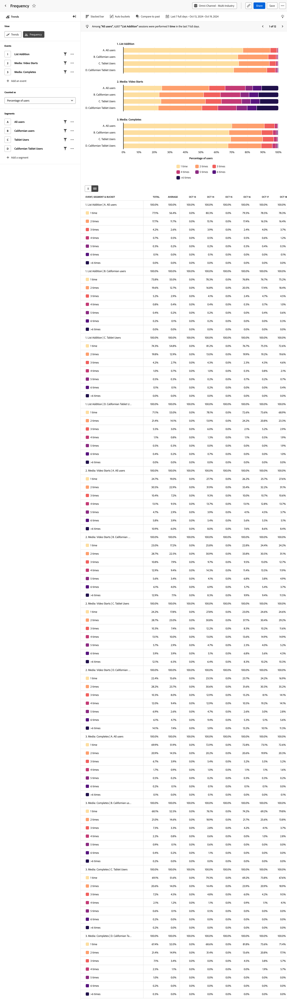

# Analisi della [!UICONTROL frequenza] {#frequency}

<!-- markdownlint-disable MD034 -->

>[!CONTEXTUALHELP]
>id="workspace_guidedanalysis_frequency_button"
>title="Frequenza"
>abstract="Visualizza la distribuzione delle attività degli utenti ripetuti per eventi specifici."

<!-- markdownlint-enable MD034 -->

L&#39;analisi  **[!UICONTROL Frequenza]** raggruppa i dati dell&#39;evento in base alla frequenza con cui si verificano gli eventi nel prodotto. L’asse verticale di questa analisi contiene bucket che rappresentano la frequenza dell’evento. L’asse orizzontale misura il numero di utenti o sessioni per ciascun bucket.

>[!VIDEO](https://experienceleague.adobe.com/it/docs/customer-journey-analytics-learn/tutorials/guided-analysis/frequency)

## Casi d’uso

I casi d’uso per questa analisi includono:

* **Coinvolgimento**: tieni traccia del livello di coinvolgimento degli utenti con qualsiasi evento del prodotto. Puoi fare clic su una parte qualsiasi del grafico a barre per salvarlo come segmento. I segmenti per bucket di coinvolgimento ridotti possono aiutarti a determinare il motivo per cui gli utenti non interagiscono con l’evento alla frequenza desiderata. I segmenti per bucket di coinvolgimento elevati possono aiutarti a capire perché gli utenti interagiscono spesso con l’evento. Da lì, puoi incoraggiare altri utenti ad adottare un comportamento simile.
* **Fedeltà del cliente**: imposta l’evento su Ordini e la metrica su Utenti. Questa analisi consente di raggruppare gli utenti in base al numero di volte in cui hanno effettuato un acquisto sul sito entro l’intervallo di date specificato.
* **Ottimizzazione del supporto**: visualizza il numero di chiamate al supporto o casi aperti per utente per ottenere informazioni approfondite su quali utenti riscontrano il maggior numero di problemi. Puoi quindi creare un segmento con focus sulla loro esperienza per aiutarli a identificare e risolvere i loro problemi.
* **Servizi in abbonamento**: gli utenti con un coinvolgimento basso hanno maggiori probabilità di abbandono. Comprendere il comportamento degli utenti altamente coinvolti può aiutare a incoraggiare un comportamento simile negli utenti meno coinvolti, rendendoli meno propensi ad annullare l’abbonamento.

## Interfaccia

Per una panoramica dell’interfaccia dell’analisi guidata, consulta [Interfaccia](../overview.md#interface). Le seguenti impostazioni sono specifiche per questa analisi:

### Barra delle query

La barra delle query consente di configurare i seguenti componenti:

* **[!UICONTROL Visualizzazione]**: passa da questa analisi a [Tendenze](trends.md).
* **[!UICONTROL Eventi]**: gli eventi che desideri misurare. Ogni evento selezionato viene rappresentato da un grafico separato. Alla tabella viene aggiunta una riga che rappresenta l’evento con tendenze. Puoi includere fino a cinque eventi.
* **[!UICONTROL Conteggiato come]**: metodo di conteggio che desideri applicare agli eventi selezionati. Le opzioni includono [!UICONTROL Utenti], [!UICONTROL Sessioni], [!UICONTROL Percentuale di utenti] e [!UICONTROL Percentuale di sessioni]. Il denominatore per le metriche basate sulle percentuali in questa analisi è rappresentato dagli utenti o dalle sessioni che hanno eseguito gli eventi selezionati, non tutti gli utenti attivi del prodotto.
* **[!UICONTROL Segmenti]**: i segmenti che desideri misurare. Ogni segmento selezionato raddoppia il numero di barre posizionate nel grafico e le righe nella tabella. Puoi includere fino a cinque segmenti.

### Impostazioni del grafico

L&#39;analisi [!UICONTROL Frequency] offre le seguenti impostazioni del grafico, che possono essere regolate nel menu sopra il grafico:

* **[!UICONTROL Tipo di grafico]**: tipo di visualizzazione che si desidera utilizzare. Le opzioni includono [!UICONTROL Barra orizzontale] e [!UICONTROL Barra sovrapposta].

### Impostazioni del bucket

Determina il modo in cui l’evento viene classificato in gruppi (bucket). Nella vista della tabella con tendenze, gli utenti vengono inseriti nei bucket in base alla frequenza di utilizzo in totale e in ogni intervallo, il che significa che 1 utente può essere contato in bucket diversi in intervalli diversi.

* **[!UICONTROL Bucket automatici]**: identifica automaticamente la dimensione ottimale del bucket in base alla distribuzione dei dati.
* **[!UICONTROL Bucket personalizzati]**: personalizzare il raggruppamento dei dati in bucket.
   * [!UICONTROL Da]: primo bucket. La frequenza inferiore a questo valore è esclusa dalla generazione dei rapporti.
   * [!UICONTROL A]: la frequenza maggiore di questo valore è raggruppata nell&#39;ultimo bucket.
   * [!UICONTROL Dimensione]: intervallo di bucket.

### Confronto temporale

{{apply-time-comparison}}

### Intervallo date

L’intervallo di date desiderato per l’analisi. Questa impostazione è costituita da due componenti:

* **[!UICONTROL Intervallo]**: granularità della data in base alla quale visualizzare i dati con tendenze. Il grafico e la tabella mostrano i dati aggregati per impostazione predefinita, con l’opzione di espandere la tabella a una vista delle tendenze. Nella vista delle tendenze, gli utenti vengono inseriti nei bucket in base alla frequenza di utilizzo in totale e in ogni intervallo, il che significa che 1 utente può essere contato in bucket diversi in intervalli diversi.
* **[!UICONTROL Data]**: la data di inizio e di fine. Per comodità, sono disponibili intervalli di date continui predefiniti e intervalli personalizzati salvati in precedenza; in alternativa, puoi utilizzare il selettore del calendario per scegliere un intervallo di date fisso.

<!--
## Example

See below foran example of the analysis.

-->
