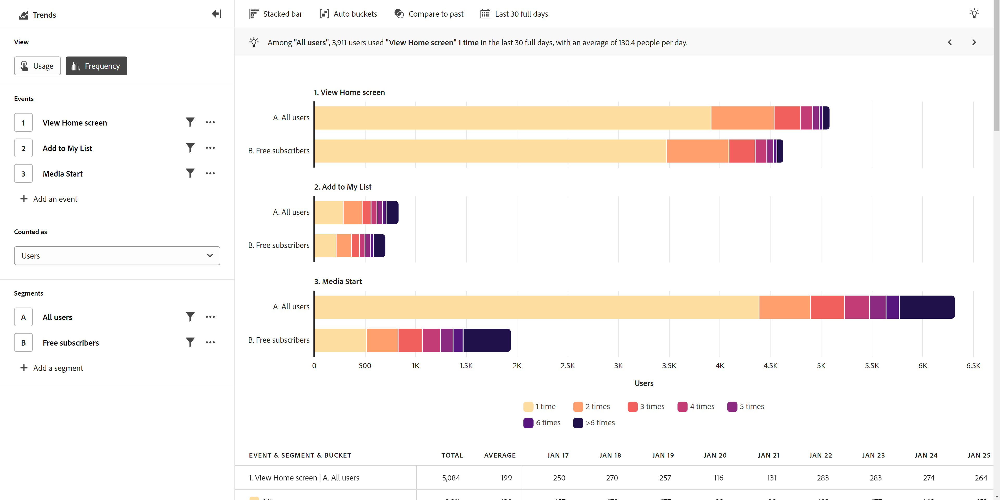

# [!UICONTROL Frequency] visualizza

Il **[!UICONTROL Frequency]** visualizzare i dati degli eventi dei gruppi in base alla frequenza con cui si verificano gli eventi nel prodotto. L’asse verticale di questa vista contiene contenitori che rappresentano la frequenza dell’evento. L’asse orizzontale misura il numero di utenti o sessioni per ciascun bucket.

## Casi d’uso

I casi di utilizzo per questo tipo di visualizzazione includono:

* **Coinvolgimento**: tieni traccia del livello di coinvolgimento degli utenti con qualsiasi evento del prodotto. Puoi fare clic su una parte qualsiasi del grafico a barre per salvarlo come segmento. I segmenti per bucket di coinvolgimento ridotti possono aiutarti a determinare il motivo per cui gli utenti non interagiscono con l’evento alla frequenza desiderata. I segmenti per bucket di coinvolgimento elevati possono aiutarti a capire perché gli utenti interagiscono spesso con l’evento. Da lì, puoi incoraggiare altri utenti ad adottare un comportamento simile.
* **Fedeltà del cliente**: imposta l’evento su Ordini e la metrica su Utenti. Questa visualizzazione consente di raggruppare gli utenti in base al numero di volte in cui hanno effettuato un acquisto sul sito entro l’intervallo di date specificato.
* **Ottimizzazione del supporto**: visualizza il numero di chiamate di supporto o casi aperti per utente per ottenere informazioni approfondite su quali utenti incontrano il maggior numero di problemi. Puoi quindi creare un segmento per concentrarti sulla loro esperienza per aiutarli a identificare e risolvere i loro problemi.
* **Servizi di abbonamento**: gli utenti con un coinvolgimento basso hanno maggiori probabilità di abbandono. Comprendere il comportamento degli utenti altamente coinvolti può aiutare a incoraggiare un comportamento simile per gli utenti meno coinvolti, rendendoli meno propensi ad annullare l’abbonamento.

## Barra delle query

La barra delle query consente di configurare i seguenti componenti:

* **[!UICONTROL Events]**: gli eventi che desideri misurare. Ogni evento selezionato viene rappresentato come un grafico separato. Alla tabella viene aggiunta una riga che rappresenta l’evento con tendenze. Puoi includere fino a cinque eventi.
* **[!UICONTROL People]**: i segmenti che desideri misurare. Ogni segmento selezionato raddoppia il numero di barre nel grafico e di righe nella tabella. Puoi includere fino a cinque segmenti.

## Impostazioni grafico

Il [!UICONTROL Frequency] visualizza offre le seguenti impostazioni del grafico, che possono essere regolate nel menu sopra il grafico:

* **[!UICONTROL Metric]**: la metrica da misurare. Le opzioni includono [!UICONTROL Users],  [!UICONTROL Sessions],  [!UICONTROL Percentage of users] e  [!UICONTROL Percentage of sessions]. Il denominatore per le metriche basate su percentuali in questa vista sono gli utenti o le sessioni che hanno eseguito gli eventi selezionati, non tutti gli utenti attivi del prodotto.
* **[!UICONTROL Chart type]**: tipo di visualizzazione che desideri utilizzare. Le opzioni includono [!UICONTROL Horizontal bar] e [!UICONTROL Stacked bar].

## Impostazioni bucket

Determina il modo in cui l’evento viene suddiviso in gruppi.

* **[!UICONTROL Auto buckets]**: identifica automaticamente la dimensione ottimale del bucket in base alla distribuzione dei dati.
* **[!UICONTROL Customized buckets]**: personalizza il modo in cui i dati vengono raggruppati in contenitori.
   * [!UICONTROL From]: primo bucket. La frequenza inferiore a questo valore è esclusa dal reporting.
   * [!UICONTROL To]: la frequenza maggiore di questo valore è raggruppata nell’ultimo bucket.
   * [!UICONTROL Size]: intervallo di bucket.

## Applica confronto temporale

{{apply-time-comparison}}

## Intervallo date

L’intervallo di date desiderato per l’analisi. Questa impostazione è composta da due componenti:

* **[!UICONTROL Interval]**: granularità della data in base alla quale visualizzare i dati sulle tendenze. Questa impostazione non influisce sulle visualizzazioni senza tendenze, ad esempio Frequenza.
* **[!UICONTROL Date]**: data di inizio e fine. Sono disponibili predefiniti per intervalli di date continui e intervalli personalizzati salvati in precedenza, oppure puoi utilizzare il selettore calendario per scegliere un intervallo di date fisso.
