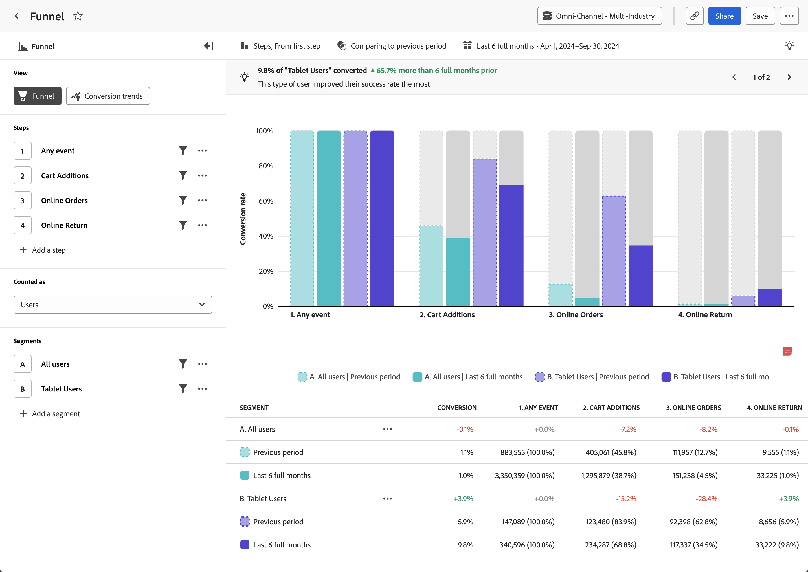

# Analisi [!UICONTROL Funnel]

L&#39;analisi **[!UICONTROL Funnel]**fornisce una rappresentazione visiva di un percorso di utenti critico nel prodotto. L’asse orizzontale rappresenta ogni passaggio che un utente deve attraversare. L’asse verticale rappresenta la percentuale di utenti o sessioni in ogni passaggio. Tutti i passaggi devono essere eseguiti nell’ordine finale, ma possono essere eseguiti in qualsiasi momento all’interno dell’intervallo di reporting.

>[!VIDEO](https://video.tv.adobe.com/v/3421663/?learn=on){width="90%"}

## Casi d’uso

I casi di utilizzo per questa analisi includono:

* **Analisi delle conversioni**: è possibile analizzare le conversioni in ogni fase del funnel, ad esempio un pagamento al dettaglio, l&#39;iscrizione all&#39;account, il flusso di abbonamento o altri percorsi critici all&#39;interno della propria esperienza di prodotto. Monitorando il numero di utenti che avanzano da un passaggio all’altro, puoi identificare i colli di bottiglia con tassi di conversione insoliti o indesiderati. Queste informazioni sono utili per capire dove è possibile migliorare il percorso di prodotti per ottenere risultati immediati.
* **Analisi della sperimentazione**: è possibile confrontare i tassi di conversione in un funnel con passaggi o passaggi facoltativi in cui viene eseguito un esperimento A/B. Queste informazioni possono aiutarti a determinare quale variante del funnel porta al tasso di conversione più alto, in modo da poter incoraggiare più utenti lungo quel percorso.
* **Ottimizzazione dell&#39;onboarding**: ottimizza il processo di onboarding del prodotto esaminando il comportamento degli utenti in relazione agli eventi chiave. Puoi identificare i passaggi con cui gli utenti hanno difficoltà o che non riescono a completare.
* **Adozione e coinvolgimento delle funzionalità**: scopri come gli utenti interagiscono con funzionalità specifiche del tuo prodotto. L’analisi della progressione degli utenti attraverso i passaggi relativi alle funzioni consente di visualizzare i tassi di adozione e identificare le aree in cui gli utenti potrebbero sottoutilizzare determinate funzioni. Puoi quindi utilizzare queste informazioni per concentrarti sui miglioramenti delle funzioni per aumentare i tassi di adozione.
* **Efficacia del canale di marketing**: misura l&#39;efficacia dei canali di marketing. Puoi creare un segmento che si concentra sugli utenti che hanno interagito con diversi canali di marketing, ad esempio ricerca a pagamento, visualizzazione, ricerca naturale o diretta. Puoi quindi confrontare i loro percorsi per vedere quale canale porta ai migliori risultati di prodotto.

## Interfaccia

Per una panoramica dell&#39;interfaccia di analisi guidata, vedere [Interfaccia](../overview.md#interface). Le seguenti impostazioni sono specifiche per questa analisi:

### Barra delle query

La barra delle query consente di configurare i seguenti componenti:

* **[!UICONTROL View]**: passa da questa analisi a [Tendenze di conversione](conversion-trends.md).
* **[!UICONTROL Steps]**: i punti di contatto dell&#39;evento di cui si desidera tenere traccia. Ogni barra del grafico rappresenta un passo. Puoi includere fino a dieci passaggi.
   * [!UICONTROL Compare]: ogni passaggio fornisce un&#39;opzione per confrontare più eventi in un singolo passaggio funnel, creando un &quot;funnel fork&quot;. Questa funzione consente di confrontare l&#39;attrito di due percorsi uno accanto all&#39;altro senza creare due analisi separate. È utile quando sono presenti opzioni di passaggio o quando un esperimento A/B viene eseguito all’interno dell’imbuto. Guarda [Funnel](https://experienceleague.adobe.com/en/docs/customer-journey-analytics-learn/tutorials/guided-analysis/funnel) nei tutorial di Customer Journey Analytics per un video che spiega come confrontare i funnel.
* **[!UICONTROL Counted as]**: ambito che si desidera applicare al funnel. Le opzioni includono [!UICONTROL Sessions] e [!UICONTROL Users].
   * [!UICONTROL Sessions]: per essere conteggiati, tutti i passaggi devono avvenire nella stessa sessione.
   * [!UICONTROL Users]: per essere conteggiati, tutti i passaggi devono avvenire nell&#39;intervallo di reporting selezionato.
* **[!UICONTROL Segments]**: i segmenti in cui si desidera confrontare il funnel. Ogni segmento selezionato suddivide ogni passaggio in più barre. Ogni colore rappresenta un segmento diverso. Puoi includere fino a tre segmenti.

### Impostazioni grafico

L&#39;analisi [!UICONTROL Funnel] offre le seguenti impostazioni del grafico, che possono essere regolate nel menu sopra il grafico:

* **[!UICONTROL Chart type]**: tipo di visualizzazione che si desidera utilizzare. Le opzioni includono [!UICONTROL Steps].
* **[!UICONTROL Conversion from]**: determina il calcolo della percentuale da un passaggio all&#39;altro. Le opzioni includono il calcolo della conversione da [!UICONTROL First step] o [!UICONTROL Previous step].

### Confronto temporale

{{apply-time-comparison}}

### Intervallo date

L’intervallo di date desiderato per l’analisi. Questa impostazione è composta da due componenti:

* **[!UICONTROL Interval]**: granularità della data in base alla quale visualizzare i dati con tendenze. Questa impostazione non influisce sulle analisi senza tendenze, ad esempio [Funnel](funnel.md).
* **[!UICONTROL Date]**: la data di inizio e di fine. Sono disponibili predefiniti per intervalli di date continui e intervalli personalizzati salvati in precedenza, oppure puoi utilizzare il selettore calendario per scegliere un intervallo di date fisso.

<!--
## Example

See below for an example of the analysis.

-->
