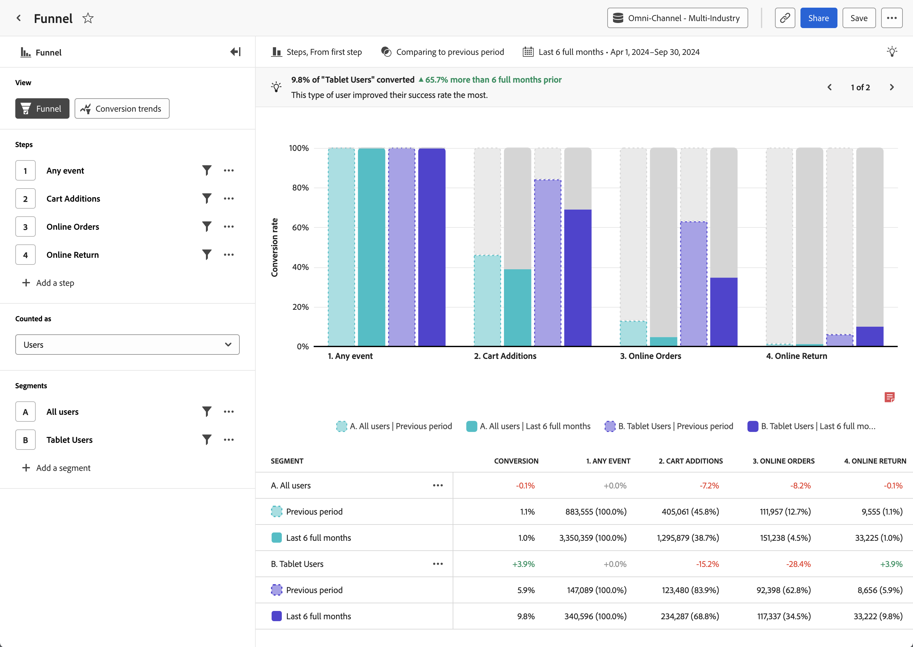

# Analisi del [!UICONTROL funnel] {#funnel}

<!-- markdownlint-disable MD034 -->

>[!CONTEXTUALHELP]
>id="workspace_guidedanalysis_funnel_button"
>title="Funnel"
>abstract="Confronta i tassi di conversione tra passaggi."

<!-- markdownlint-enable MD034 -->

L&#39;analisi **[!UICONTROL Funnel &#x200B;]**&#x200B;fornisce una rappresentazione visiva di un percorso di utenti critico nel prodotto. L’asse orizzontale rappresenta ogni passaggio che un utente deve attraversare. L’asse verticale rappresenta la percentuale di utenti o sessioni in ogni passaggio. Tutti i passaggi devono essere eseguiti in ordine finale, ma possono avvenire in qualsiasi momento all’interno dell’intervallo di reporting.

>[!VIDEO](https://video.tv.adobe.com/v/3421663/?quality=12&learn=on)

## Casi d’uso

I casi d’uso per questa analisi includono:

* **Analisi della conversione**: è possibile analizzare le conversioni in ogni fase del funnel, ad esempio un pagamento di una vendita al dettaglio, la registrazione di un account, il flusso per un abbonamento o altri percorsi critici all’interno dell’esperienza prodotto. Monitorando il numero di utenti che avanzano da un passaggio all’altro, puoi identificare i colli di bottiglia con tassi di conversione insoliti o indesiderati. Queste informazioni sono utili per capire dove è possibile migliorare il percorso prodotto per ottenere risultati immediati.
* **Analisi della sperimentazione**: è possibile confrontare i tassi di conversione in un funnel con passaggi facoltativi o passaggi in cui viene eseguito un esperimento A/B. Queste informazioni possono aiutarti a determinare quale variante del funnel porta al tasso di conversione più alto, in modo da poter incoraggiare più utenti lungo quel percorso.
* **Ottimizzazione dell’onboarding**: ottimizza il processo di onboarding del prodotto esaminando il comportamento dell’utente in relazione agli eventi chiave. Puoi identificare i passaggi con cui gli utenti hanno difficoltà o che non riescono a completare.
* **Adozione e coinvolgimento delle funzioni**: scopri come gli utenti interagiscono con funzioni specifiche del tuo prodotto. L’analisi della progressione degli utenti attraverso i passaggi relativi alle funzioni consente di visualizzare i tassi di adozione e di identificare le aree in cui gli utenti potrebbero utilizzare in maniera non adeguata determinate funzioni. Puoi quindi utilizzare queste informazioni per concentrarti sui miglioramenti delle funzioni per aumentare i tassi di adozione.
* **Efficacia del canale di marketing**: misura l’efficacia dei canali di marketing. Puoi creare un segmento incentrato sugli utenti che hanno interagito con diversi canali di marketing, ad esempio ricerca a pagamento, visualizzazione, ricerca naturale o diretta. Puoi quindi confrontare i percorsi di tali utenti per visualizzare quale canale porta ai migliori risultati di prodotto.

## Interfaccia

Per una panoramica dell’interfaccia dell’analisi guidata, consulta [Interfaccia](../overview.md#interface). Le seguenti impostazioni sono specifiche per questa analisi:

### Barra delle query

La barra delle query consente di configurare i seguenti componenti:

* **[!UICONTROL Visualizza]**: passa da questa analisi a [Tendenze di conversione](conversion-trends.md).
* **[!UICONTROL Passaggi]**: i punti di contatto dell&#39;evento di cui si desidera tenere traccia. Ogni barra del grafico rappresenta un passaggio. Puoi includere fino a dieci passaggi.
   * [!UICONTROL Confronta]: ogni passaggio fornisce un&#39;opzione per confrontare più eventi in un singolo passaggio di funnel, creando un &quot;fork funnel&quot;. Questa funzione consente di confrontare l’attrito di due percorsi uno accanto all’altro, senza creare due analisi separate. È utile quando sono presenti opzioni di passaggio o quando un esperimento A/B viene eseguito all’interno del funnel. Consulta [Funnel](https://experienceleague.adobe.com/it/docs/customer-journey-analytics-learn/tutorials/guided-analysis/funnel) nei tutorial di Customer Journey Analytics per un video che spiega come confrontare i funnel.
* **[!UICONTROL Conteggiato come]**: l&#39;ambito che si desidera applicare al funnel. Le opzioni includono [!UICONTROL Sessioni] e [!UICONTROL Utenti].
   * [!UICONTROL Sessioni]: per essere conteggiati, tutti i passaggi devono avvenire nella stessa sessione.
   * [!UICONTROL Utenti]: per essere conteggiati, tutti i passaggi devono essere eseguiti nell&#39;intervallo di reporting selezionato.
* **[!UICONTROL Segmenti]**: i segmenti in cui si desidera confrontare il funnel. Ogni segmento selezionato suddivide ogni passaggio in più barre. Ogni colore rappresenta un segmento diverso. Puoi includere fino a tre segmenti.

### Impostazioni del grafico

L&#39;analisi [!UICONTROL Funnel] offre le seguenti impostazioni del grafico, che possono essere regolate nel menu sopra il grafico:

* **[!UICONTROL Tipo di grafico]**: tipo di visualizzazione che si desidera utilizzare. Le opzioni includono [!UICONTROL Passaggi].
* **[!UICONTROL Conversione da]**: determina il calcolo percentuale da un passaggio all&#39;altro. Le opzioni includono il calcolo della conversione dal [!UICONTROL primo passaggio] o [!UICONTROL passaggio precedente].

### Confronto temporale

{{apply-time-comparison}}

### Intervallo date

L’intervallo di date desiderato per l’analisi. Questa impostazione è costituita da due componenti:

* **[!UICONTROL Intervallo]**: granularità della data in base alla quale visualizzare i dati con tendenze. Questa impostazione non influisce sulle analisi non di tendenza, ad esempio il [funnel](funnel.md).
* **[!UICONTROL Data]**: la data di inizio e di fine. Per comodità, sono disponibili intervalli di date continui predefiniti e intervalli personalizzati salvati in precedenza; in alternativa, puoi utilizzare il selettore del calendario per scegliere un intervallo di date fisso.

<!--
## Example

See below for an example of the analysis.

-->
