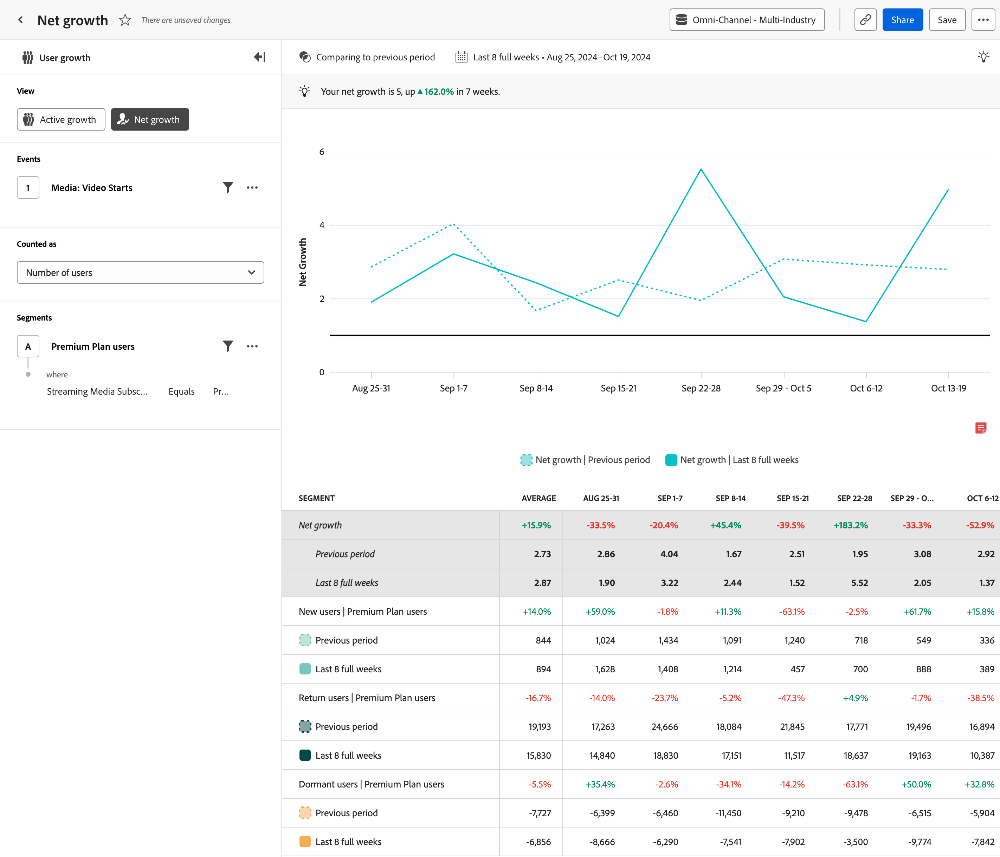

# Analisi della [!UICONTROL crescita netta] {#net-growth}

<!-- markdownlint-disable MD034 -->

>[!CONTEXTUALHELP]
>id="workspace_guidedanalysis_netgrowth_button"
>title="Crescita netta"
>abstract="Stai guadagnando o perdendo utenti?"

<!-- markdownlint-enable MD034 -->

L&#39;analisi  **[!UICONTROL Net growth]** fornisce informazioni sul tasso di guadagno o perdita di utenti in un periodo specifico. L’asse orizzontale mostra un intervallo di tempo, mentre l’asse verticale indica la misura della crescita.

Ogni punto dati rappresenta la crescita netta, calcolata con la formula seguente:

`([New users] + [Return users]) / [Dormant users]`

Il risultato di questa formula è un rapporto. Una crescita netta di `1` rappresenta un equilibrio; ovvero il numero di utenti guadaganti dal prodotto coincide con il numero di utenti persi. Una crescita netta superiore a `1` indica una crescita positiva, ovvero il numero complessivo di utenti nuovi e di ritorno è superiore a quello degli utenti inattivi. Analogamente, una crescita netta inferiore a `1` rappresenta una perdita; ovvero il numero di utenti nuovi + di ritorno è inferiore a quello degli utenti inattivi.

Come nell’analisi della crescita [attiva](active-growth.md), gli utenti vengono definiti come illustrato di seguito:

* **[!UICONTROL Nuovo]**: l&#39;utente era attivo durante il periodo corrente, ma non in precedenza. Osserva l&#39;intervallo di visualizzazione dell&#39;analisi per determinare un nuovo utente passando il cursore sopra &#39;[!UICONTROL Nuovi utenti]&#39; nella legenda del grafico. L’intervallo di lookback viene determinato dinamicamente in base all’intervallo di date selezionato.
* **[!UICONTROL Invio]**: l&#39;utente era attivo nel periodo corrente e non nel periodo immediatamente precedente, ma prima era attivo. Osserva l&#39;analisi per determinare un utente restituito passando il cursore sopra &#39;[!UICONTROL Utenti restituiti]&#39; nella legenda del grafico. L’intervallo di lookback viene determinato dinamicamente in base all’intervallo di date selezionato.
* **[!UICONTROL Inattivo]**: l&#39;utente era attivo nel periodo immediatamente precedente, ma non è attivo nel periodo corrente. Gli utenti inattivi non concorrono al numero totale degli utenti attivi.

>[!NOTE]
>
>Gli utenti ripetuti non vengono presi in considerazione in questo calcolo, poiché non appartengono né agli utenti acquisiti né a quelli persi.

>[!VIDEO](https://experienceleague.adobe.com/en/docs/customer-journey-analytics-learn/tutorials/guided-analysis/net-growth)

## Casi d’uso

I casi d’uso per questa analisi includono:

* **Valutazione delle prestazioni**: consente di valutare le prestazioni complessive del prodotto in termini di acquisizione di nuovi utenti. Tracciando le tendenze di crescita, puoi capire meglio se il prodotto attrae e mantiene gli utenti al ritmo desiderato.
* **Analisi di acquisizione utenti**: consente di valutare l’efficacia delle strategie di acquisizione degli utenti. Analizzando le origini da cui prende forma la crescita degli utenti, ad esempio motori di ricerca, campagne o altri canali di marketing, portrai identificare le origini di crescita più significative e allocare le risorse di conseguenza.
* **Analisi dell’abbandono**: nella formula della crescita netta viene incluso anche l’attrito (utenti inattivi). In questo modo, puoi valutare lo stato complessivo della tua base utenti nel tempo. Una crescita netta costantemente inferiore a `1`, ad esempio, indica un’elevata quantità di attrito e potrebbe quindi suggerire la necessità di implementare strategie di conservazione.

## Interfaccia

Per una panoramica dell’interfaccia dell’analisi guidata, consulta [Interfaccia](../overview.md#interface). Le seguenti impostazioni sono specifiche per questa analisi:

### Barra delle query

La barra delle query consente di configurare i seguenti componenti:

* **[!UICONTROL Visualizza]**: passa da questa analisi a [Crescita attiva](active-growth.md).
* **[!UICONTROL Eventi]**: l&#39;evento che si desidera misurare. Poiché questa analisi è basata sull’utente, vengono conteggiati come utenti attivi anche coloro che interagiscono con l’evento una volta nell’arco del periodo. Puoi includere un evento in una query.
* **[!UICONTROL Conteggiato come]**: metodo di conteggio che desideri applicare agli eventi selezionati. <ul><li>**[!UICONTROL Le opzioni]** includono [!UICONTROL Numero di utenti] e [!UICONTROL Percentuale di utenti].</li><li>[!BADGE B2B edition]{type=Informative url="https://experienceleague.adobe.com/it/docs/analytics-platform/using/cja-overview/cja-b2b/cja-b2b-edition" newtab=true tooltip="Customer Journey Analytics B2B Edition"} Ulteriori **[!UICONTROL opzioni B2B]** sono disponibili per Customer Journey Analytics B2B edition: [!UICONTROL Account globali], [!UICONTROL Account], [!UICONTROL Gruppi acquisti], [!UICONTROL Opportunità], [!UICONTROL Percentuale di account globali], [!UICONTROL Percentuale di account], [!UICONTROL Percentuale di gruppi acquisti] e [!UICONTROL Percentuale di opportunità].</li></ul>
* **[!UICONTROL Segmenti]**: il segmento che si desidera misurare. Puoi includere un segmento in una query.

### Confronto temporale

{{apply-time-comparison}}

### Intervallo date

L’intervallo di date desiderato per l’analisi. Questa impostazione è costituita da due componenti:

* **[!UICONTROL Intervallo]**: granularità della data in base alla quale visualizzare i dati con tendenze. Le opzioni valide includono: Oraria, Giornaliera, Settimanale, Mensile e Trimestrale. Lo stesso intervallo di date può avere una granularità diversa, da cui dipende il numero di punti dati nel grafico e il numero di colonne nella tabella. Nella visualizzazione di un’analisi di tre giorni con granularità giornaliera, ad esempio, saranno presenti solo tre punti dati, mentre in quella di un’analisi di tre giorni con granularità oraria ne saranno presenti 72.
* **[!UICONTROL Data]**: la data di inizio e di fine. Per comodità, sono disponibili intervalli di date continui predefiniti e intervalli personalizzati salvati in precedenza; in alternativa, puoi utilizzare il selettore del calendario per scegliere un intervallo di date fisso.

<!-- 
## Example

See below for an example of the analysis.

-->
