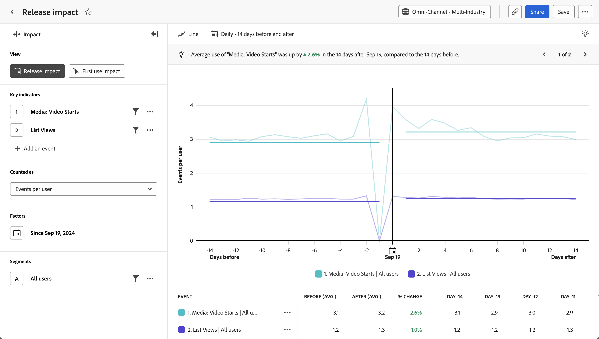

# Analisi sull’[!UICONTROL impatto della versione] {#release-impact}

<!-- markdownlint-disable MD034 -->

>[!CONTEXTUALHELP]
>id="workspace_guidedanalysis_releaseimpact_button"
>title="Impatto della versione"
>abstract="Confronta le prestazioni in periodi uguali prima e dopo la versione."

<!-- markdownlint-enable MD034 -->

L&#39;analisi dell&#39;impatto sulla versione  **[!UICONTROL Release]** mostra un confronto tra le prestazioni degli indicatori chiave prima e dopo una data specifica. L’asse orizzontale di questo rapporto è un intervallo di tempo, mentre l’asse verticale misura gli indicatori chiave desiderati. Una barra verticale al centro del grafico rappresenta la data che si desidera confrontare prima e dopo. In genere, questa data rappresenta una modifica rilevante del prodotto su cui desideri effettuare la misurazione, ad esempio un aggiornamento del prodotto o il lancio di una campagna.

>[!VIDEO](https://experienceleague.adobe.com/it/docs/customer-journey-analytics-learn/tutorials/guided-analysis/release-impact)

## Casi d’uso

I casi d’uso per questa analisi includono:

* **Valutazione complessiva delle prestazioni:** il confronto di indicatori chiave generali, come le misure di coinvolgimento, può aiutarti a determinare se una determinata versione ha avuto complessivamente esito positivo.
* **Monitoraggio**: tieni traccia delle metriche vitali che prevedi rimangano invariate quando vengono apportate modifiche, ad esempio il tempo di caricamento o il numero di accessi. Utilizza questa analisi per confrontarli prima e dopo una versione per assicurarti che non abbia avuto conseguenze indesiderate.
* **Adozione di funzione**: se un aggiornamento di prodotto è incentrato sul miglioramento di una determinata funzione, puoi utilizzare questa analisi per confrontare direttamente l’utilizzo di tale funzione prima e dopo l’aggiornamento del prodotto.
* **Rilevamento bug**: tracciare il numero di errori prima e dopo una versione può fornire un indicatore anticipato dei problemi della clientela. Se noti un aumento di errori subito dopo una versione, puoi collaborare con i team di progettazione o di sviluppo per identificare e correggere il problema, evitando un ulteriore impatto sulla clientela.

## Interfaccia

Per una panoramica dell’interfaccia dell’analisi guidata, consulta [Interfaccia](../overview.md#interface). Le seguenti impostazioni sono specifiche per questa analisi:

### Barra delle query

La barra delle query consente di configurare i seguenti componenti:

* **[!UICONTROL Visualizzazione]**: passa da questa analisi a [Impatto primo utilizzo](first-use-impact.md).
* **[!UICONTROL Indicatori chiave]**: gli eventi che si desidera misurare per utente. Ogni indicatore chiave selezionato viene rappresentato da una linea colorata. Alla tabella viene aggiunta una riga che rappresenta l’evento. Puoi includere fino a tre eventi.
* **[!UICONTROL Conteggiato come]**: metodo di conteggio che desideri applicare agli eventi selezionati. Le opzioni includono [!UICONTROL Eventi per utente], [!UICONTROL Percentuale di utenti], [!UICONTROL Eventi], [!UICONTROL Sessioni] e [!UICONTROL Utenti].
* **[!UICONTROL Fattori]**: la data che si desidera confrontare prima e dopo.
* **[!UICONTROL Segmenti]**: il segmento che si desidera misurare. Il segmento selezionato filtra i dati in modo da concentrarti solo sui singoli utenti che corrispondono ai criteri del segmento.

### Impostazioni del grafico

L&#39;analisi [!UICONTROL Impatto sulla versione] offre le seguenti impostazioni del grafico, che possono essere regolate nel menu sopra il grafico:

* **[!UICONTROL Tipo di grafico]**: tipo di visualizzazione che si desidera utilizzare. Le opzioni includono [!UICONTROL Riga] e [!UICONTROL Barra].

### Intervallo date

La selezione della data nell’analisi dell’impatto funziona in modo diverso rispetto ad altre analisi, in quanto il rapporto ruota attorno alla data specificata nella barra delle query. Sono disponibili le seguenti opzioni:

* **[!UICONTROL Intervallo]**: granularità della data in base alla quale visualizzare i dati con tendenze. Le opzioni valide includono [!UICONTROL Giornaliero], [!UICONTROL Settimanale], [!UICONTROL Mensile] e [!UICONTROL Trimestrale]. La modifica dell’intervallo influisce sulle opzioni disponibili per il periodo Prima e Dopo.
* **[!UICONTROL Prima e dopo il periodo]**: quantità di tempo da analizzare prima e dopo la data specificata nella barra delle query. Le opzioni disponibili dipendono dalla selezione di [!UICONTROL Intervallo].

<!--
## Example

See below for an example of the analysis.

-->
