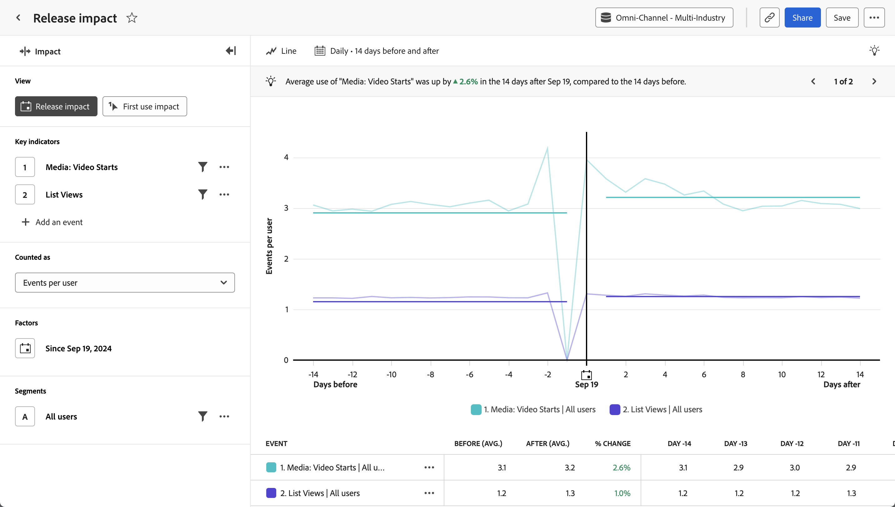

# Analisi [!UICONTROL Release impact]

L&#39;analisi  **[!UICONTROL Release impact]** mostra un confronto tra le prestazioni degli indicatori chiave prima e dopo una determinata data. L’asse orizzontale di questo rapporto è un intervallo di tempo, mentre l’asse verticale misura gli indicatori chiave desiderati. Una barra verticale al centro del grafico rappresenta la data che si desidera confrontare prima e dopo. In genere, questa data rappresenta una modifica rilevante del prodotto su cui desideri effettuare la misurazione, ad esempio un aggiornamento del prodotto o il lancio di una campagna.

+++ Video dimostrativo

>[!VIDEO](https://video.tv.adobe.com/v/3421665/?learn=on)

+++

## Casi d’uso

I casi di utilizzo per questa analisi includono:

* **Valutazione complessiva delle prestazioni:** Il confronto di indicatori chiave generali, come le misure di coinvolgimento, può aiutarti a determinare se una determinata versione ha avuto complessivamente esito positivo.
* **Monitoraggio**: tieni traccia delle metriche vitali che potresti rimanere invariate quando vengono apportate modifiche, ad esempio il tempo di caricamento o il numero di accessi. Utilizza questa analisi per confrontarli prima e dopo una versione per assicurarti che non abbia avuto conseguenze indesiderate.
* **Adozione di funzionalità**: se un aggiornamento di prodotto è incentrato sul miglioramento di una determinata funzionalità, puoi utilizzare questa analisi per confrontare direttamente l&#39;utilizzo di tale funzionalità prima e dopo l&#39;aggiornamento del prodotto.
* **Rilevamento bug**: il tracciamento del numero di errori prima e dopo una versione può fornire un indicatore anticipato dei problemi dei clienti. Se si nota un aumento di errori subito dopo una versione, è possibile collaborare con i team di progettazione o di sviluppo per identificare e correggere il problema, evitando un ulteriore impatto sui clienti.

## Interfaccia

Per una panoramica dell&#39;interfaccia di analisi guidata, vedere [Interfaccia](../overview.md#interface). Le seguenti impostazioni sono specifiche per questa analisi:

### Barra delle query

La barra delle query consente di configurare i seguenti componenti:

* **[!UICONTROL View]**: passa da questa analisi a [Impatto primo utilizzo](first-use-impact.md).
* **[!UICONTROL Key indicators]**: eventi che si desidera misurare per utente. Ogni indicatore chiave selezionato viene rappresentato da una linea colorata. Alla tabella viene aggiunta una riga che rappresenta l’evento. Puoi includere fino a tre eventi.
* **[!UICONTROL Counted as]**: metodo di conteggio da applicare agli eventi selezionati. Le opzioni includono [!UICONTROL Events per user], [!UICONTROL Percentage of users], [!UICONTROL Events], [!UICONTROL Sessions] e [!UICONTROL Users].
* **[!UICONTROL Factors]**: la data che si desidera confrontare prima e dopo.
* **[!UICONTROL Segments]**: il segmento che si desidera misurare. Il segmento selezionato filtra i dati in modo da concentrarti solo sui singoli utenti che corrispondono ai criteri del segmento.

### Impostazioni grafico

L&#39;analisi [!UICONTROL Release impact] offre le seguenti impostazioni del grafico, che possono essere regolate nel menu sopra il grafico:

* **[!UICONTROL Chart type]**: tipo di visualizzazione che si desidera utilizzare. Le opzioni includono [!UICONTROL Line] e [!UICONTROL Bar].

### Intervallo date

La selezione della data nell’analisi di impatto funziona in modo diverso rispetto ad altre analisi, in quanto il rapporto ruota attorno alla data specificata nella barra delle query. Sono disponibili le seguenti opzioni:

* **[!UICONTROL Interval]**: granularità della data in base alla quale visualizzare i dati con tendenze. Le opzioni valide includono [!UICONTROL Daily], [!UICONTROL Weekly], [!UICONTROL Monthly] e [!UICONTROL Quarterly]. La modifica dell’intervallo influisce sulle opzioni disponibili per il periodo Prima e Dopo.
* **[!UICONTROL Before and after period]**: quantità di tempo da analizzare prima e dopo la data specificata nella barra delle query. Le opzioni disponibili dipendono dalla selezione di [!UICONTROL Interval].
