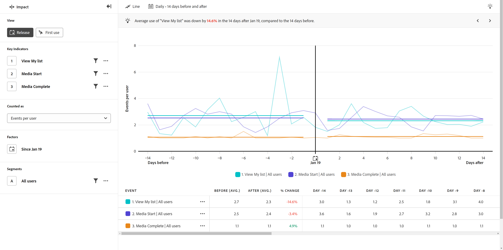

# Vista versione

{{release-limited-testing}}

Il **Versione** mostra un confronto tra le prestazioni degli indicatori chiave prima e dopo una determinata data. L’asse orizzontale di questo rapporto è un intervallo di tempo, mentre l’asse verticale misura gli indicatori chiave desiderati. Una barra verticale al centro del grafico rappresenta la data che si desidera confrontare prima e dopo. In genere, questa data rappresenta una modifica rilevante del prodotto su cui desideri effettuare la misurazione, ad esempio un aggiornamento del prodotto o il lancio di una campagna.

## Casi d’uso

I casi di utilizzo per questo tipo di visualizzazione includono:

* **Valutazione complessiva delle prestazioni:** Il confronto di indicatori chiave complessivi, come i ricavi, può aiutarti a determinare se una determinata versione è stata complessivamente corretta.
* **Adozione di funzioni**: se un aggiornamento del prodotto si concentra sul miglioramento di una determinata funzione, puoi utilizzare questa visualizzazione per confrontare direttamente l’utilizzo di tale funzione prima e dopo l’aggiornamento del prodotto.
* **Rilevamento di bug**: il tracciamento del numero di errori prima e dopo una versione può fornire un indicatore anticipato dei problemi dei clienti. Se si nota un aumento di errori subito dopo una versione, è possibile collaborare con i team di progettazione o di sviluppo per identificare e correggere il problema, evitando un ulteriore impatto sui clienti.

## Barra delle query

La barra delle query consente di configurare i seguenti componenti:

* **Indicatori chiave**: gli eventi che desideri misurare per utente. Ogni indicatore chiave selezionato viene rappresentato da una linea colorata. Alla tabella viene aggiunta una riga che rappresenta l’evento. Puoi includere fino a tre eventi.
* **Fattori**: data che desideri confrontare prima e dopo.
* **Persone**: il segmento che desideri misurare. Il segmento selezionato filtra i dati in modo da concentrarti solo sui singoli utenti che corrispondono ai criteri del segmento.

## Impostazioni grafico

La vista Rilascio offre le seguenti impostazioni del grafico, che possono essere regolate nel menu sopra il grafico:

* **Metrica**: la metrica da misurare. Le opzioni includono [!UICONTROL Events per user], [!UICONTROL Percentage of users], [!UICONTROL Events], [!UICONTROL Sessions], e [!UICONTROL Users].
* **Tipo di grafico**: tipo di visualizzazione che desideri utilizzare. Le opzioni includono Linea.

## Intervallo date

La selezione della data nei rapporti di impatto funziona in modo diverso rispetto ad altri tipi di analisi, in quanto il rapporto ruota attorno alla data specificata nella barra delle query. Sono disponibili le seguenti opzioni:

* **Interval**: granularità della data in base alla quale visualizzare i dati con tendenze. Le opzioni valide includono [!UICONTROL Daily], [!UICONTROL Weekly], [!UICONTROL Monthly], e [!UICONTROL Quarterly]. La modifica dell’intervallo influisce sulle opzioni disponibili per il periodo Prima e Dopo.
* **Periodo prima e dopo**: quantità di tempo da analizzare prima e dopo la data specificata nella barra delle query. Le opzioni disponibili dipendono dal [!UICONTROL Interval] selezione.
