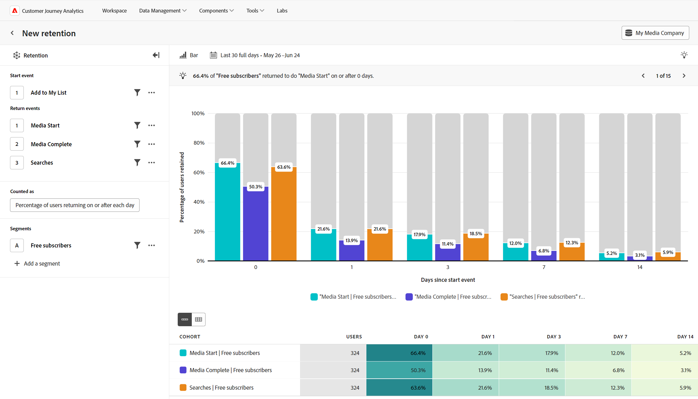

# Analisi conservazione {#retention}

<!-- markdownlint-disable MD034 -->

>[!CONTEXTUALHELP]
>id="workspace_guidedanalysis_retention_button"
>title="Conservazione"
>abstract="Misura quanti utenti continuano a utilizzare il prodotto."

<!-- markdownlint-enable MD034 -->

L&#39;analisi di  **[!UICONTROL Mantenimento]** misura il modo in cui gli utenti continuano a utilizzare il prodotto nel tempo, il che può aiutarti a comprendere meglio il tuo mercato del prodotto. L’analisi conta gli utenti in base a due eventi importanti:

* Evento iniziale: evento utilizzato per qualificare gli utenti da includere nell’analisi.
* Evento di ritorno: uno o più eventi con cui un utente deve interagire per essere considerato un utente di ritorno nell’analisi.

In questa analisi, l’asse x del grafico rappresenta il tempo trascorso dall’evento iniziale di un utente e l’asse y rappresenta la percentuale di utenti che interagiscono con uno o più eventi di ritorno. È possibile visualizzare sia la fidelizzazione che l’abbandono tra le diverse durate, e le durate visualizzate possono essere personalizzate tramite le impostazioni della query. Sotto il grafico, una tabella fornisce dati aggregati con l’opzione di mostrare le singole coorti, che sono un gruppo di persone che hanno attivato l’evento iniziale nella stessa data.

>[!VIDEO](https://experienceleague.adobe.com/en/docs/customer-journey-analytics-learn/tutorials/guided-analysis/retention)

## Casi d’uso

I casi d’uso per questa analisi includono:

* **Analisi per coorte**: raggruppa gli utenti in coorti in base alle azioni da loro intraprese, ad esempio iscrizioni o acquisti. Puoi confrontare il livello di conservazione di questi gruppi e determinare come affrontare il miglioramento dell’esperienza utente di ciascun gruppo.
* **Adattabilità del prodotto al mercato**: misura l’utilizzo regolare del prodotto e visualizza curve di fidelizzazione. Una maggiore fidelizzazione significa una maggiore adattabilità del prodotto al mercato e la posizione in cui la curva si appiattisce indica quanto tempo è necessario per raggiungerla. Puoi visualizzare questa analisi a livello generale o raggrupparla per singole funzioni del prodotto, per ottenere informazioni più approfondite.
* **Analisi del servizio in abbonamento**: se il prodotto utilizza un abbonamento o un altro tipo di modello di ricavi ricorrenti, puoi vedere la percentuale di utenti che lo stanno utilizzando al meglio. Puoi identificare alcune qualità e comportamenti che accomunano questi utenti.
* **Coinvolgimento utente**: valuta il modo in cui alcuni tipi di utenti interagiscono con il tuo prodotto e confrontalo con la frequenza con cui ritornano. Un dato segmento con una fidelizzazione inferiore rispetto ad altri può fornirti informazioni sul miglioramento di potenziali esperienze secondarie per gli utenti.

## Interfaccia

Per una panoramica dell’interfaccia dell’analisi guidata, consulta [Interfaccia](../overview.md#interface). Le seguenti impostazioni sono specifiche per questa analisi:

### Barra delle query

La barra delle query consente di configurare i seguenti componenti:

* **[!UICONTROL Evento iniziale]**: i criteri dell&#39;evento che un utente deve utilizzare per essere idoneo all&#39;inclusione nell&#39;analisi. Gli utenti che interagiscono con l’evento di inizio vengono conteggiati nella colonna &quot;Utenti&quot; della tabella. Questo evento funge da denominatore per i tassi di fidelizzazione visualizzati. È supportato un evento e puoi applicare i filtri di proprietà in base alle esigenze. Per impostazione predefinita, l’evento di inizio e l’evento di ritorno sono collegati, il che significa che l’utente deve intraprendere l’evento selezionato una volta per essere incluso nella coorte e un’altra volta per essere conteggiato come utente di ritorno. Nel menu Altro, puoi scollegare gli eventi di inizio e di ritorno se desideri che l’azione di ritorno sia diversa dall’azione di inclusione.
* **[!UICONTROL Eventi restituiti]**: i criteri di evento che un utente deve utilizzare per essere considerato come un utente di ritorno nei bucket di durata. Puoi selezionare fino a tre eventi di ritorno tra cui confrontare la fidelizzazione.
* **[!UICONTROL Conteggiato come]**: metodo di conteggio che si desidera applicare agli utenti mantenuti. Le opzioni includono:
   * **[!UICONTROL Metrica]**: mostra il numero di [!UICONTROL Utenti] o la [!UICONTROL Percentuale di utenti] mantenuti. Il denominatore per la percentuale di utenti fidelizzati è rappresentato dagli utenti inclusi nella coorte ed è lo stesso per tutti i bucket di durata.
   * **[!UICONTROL Restituzione]**: consente di controllare il conteggio degli utenti di ritorno. Le opzioni includono:
      * **[!UICONTROL Il o dopo]**: spesso definita conservazione &quot;non limitata&quot;, questa opzione conta un utente se ritorna alla durata specificata o dopo di essa. Ad esempio, il giorno 7 o in qualsiasi momento dopo il giorno 7. Questa opzione è utile per mostrare in che modo gli utenti continuano a interagire e genera di conseguenza una curva di fidelizzazione più uniforme.
      * **[!UICONTROL Su esattamente]**: spesso indicata come conservazione &quot;limitata&quot;, questa opzione conta un utente se restituisce esattamente la durata specificata. Ad esempio, esattamente il giorno 7. Questa opzione è utile per mostrare in che modo gli utenti ritornano entro intervalli di tempo specifici e genera una curva di fidelizzazione con conseguente maggiore ondulazione. Nota: l’analisi per coorte in Analysis Workspace utilizza il conteggio &quot;esattamente&quot; come base per l’analisi.
   * **[!UICONTROL Ogni]**: il periodo di tempo desiderato per ogni bucket di durata. Le opzioni includono:
      * **[!UICONTROL Giorno/Settimana/Mese]**: le opzioni disponibili dipendono dall&#39;intervallo di date selezionato. Queste opzioni sono identiche all&#39;impostazione **[!UICONTROL Intervallo]** quando si seleziona l&#39;intervallo di date e si aggiorna automaticamente tale impostazione.
      * **[!UICONTROL Parentesi graffe personalizzate]**: questa opzione è disponibile solo per l&#39;impostazione &quot;Su ogni&quot;. Consente di contare gli utenti in un arco temporale più ampio, ad esempio Giorno 7-10, anziché solo Giorno 7.
   * **[!UICONTROL Impostazioni durata]**: consente di controllare i bucket di durata visualizzati nel grafico e nella tabella. Una durata è il periodo di tempo successivo all’evento di inizio in cui si è verificato l’evento di ritorno. Nota: gli utenti idonei per i bucket di durata si basano sul tempo trascorso e non sui giorni del calendario. Ad esempio, se un utente è idoneo per un evento alle 23:00 del 6 settembre e poi per un evento di ritorno alle 00:00 del 7 settembre, non verrà visualizzato nel bucket di durata di 1 giorno. :55:05 Devono trascorrere 24 ore prima che l’utente possa qualificarsi per il bucket di durata di 1 giorno. I bucket di durata disponibili dipendono dall’intervallo di date impostato.
      * **[!UICONTROL Durate automatiche]** definisce automaticamente i periodi fissi di durata in base alla lunghezza dell&#39;intervallo di date e alla vicinanza al giorno corrente in cui si trova l&#39;intervallo di date.
      * **[!UICONTROL Le durate personalizzate]** ti consentono di personalizzare i quattro bucket di durata visualizzati nel grafico e nella tabella.
* **[!UICONTROL Segmenti]**: i segmenti che desideri misurare. Ogni segmento selezionato aggiunge una riga alla tabella coorte. Puoi includere fino a tre segmenti.

### Impostazioni del grafico

L&#39;analisi [!UICONTROL Mantenimento] offre le seguenti impostazioni del grafico, che possono essere regolate nel menu sopra il grafico:

* **[!UICONTROL Tipo di grafico]**: tipo di visualizzazione che si desidera utilizzare. Le opzioni includono [!UICONTROL Bar] e [!UICONTROL Line].

### Intervallo date

L’intervallo di date desiderato per l’analisi. Questa impostazione è costituita da due componenti:

* **[!UICONTROL Intervallo]**: granularità della data in base alla quale si desidera visualizzare i dati di conservazione. Le opzioni valide includono Giornaliero, Settimanale e Mensile. Lo stesso intervallo di date può avere intervalli diversi, che influiscono sulle opzioni di bucket di durata.
* **[!UICONTROL Data]**: la data di inizio e di fine. Per comodità, sono disponibili intervalli di date continui predefiniti e intervalli personalizzati salvati in precedenza; in alternativa, puoi utilizzare il selettore del calendario per scegliere un intervallo di date fisso.

Se selezioni un intervallo di date vicino al giorno corrente, gli utenti che inizialmente si impegnano troppo vicino al giorno corrente non vengono inclusi. Questa analisi offre sempre a tutti gli utenti la possibilità di essere inclusi in tutti i bucket di durata. Un messaggio sotto il selettore calendario fornisce informazioni sull’intervallo di date in cui gli utenti interagiscono e sull’intervallo riservato solo agli utenti di ritorno:

* **[!UICONTROL Analisi degli utenti che hanno eseguito l&#39;evento di inizio in [Intervallo date]]**: se un utente è coinvolto nell&#39;evento entro questo intervallo di date, viene incluso nell&#39;analisi. Questo intervallo di date garantisce a tutti gli utenti un tempo sufficiente per qualificarsi per tutti i bucket di durata. Questo intervallo di date può essere diverso dalla selezione se è vicino al giorno corrente.
* **[!UICONTROL I dati di [Intervallo date] sono riservati per il completamento dell&#39;analisi]**: se un utente si impegna per la prima volta in questo periodo, sono **non** inclusi nell&#39;analisi. Per gli intervalli di date recenti, questi utenti non avrebbero l’opportunità di qualificarsi per tutti bucket di durata. Per gli intervalli di date passati, questi utenti erano attivi al di fuori dell’intervallo di date selezionato.

<!--
## Example

See below for an example of the analysis.

-->