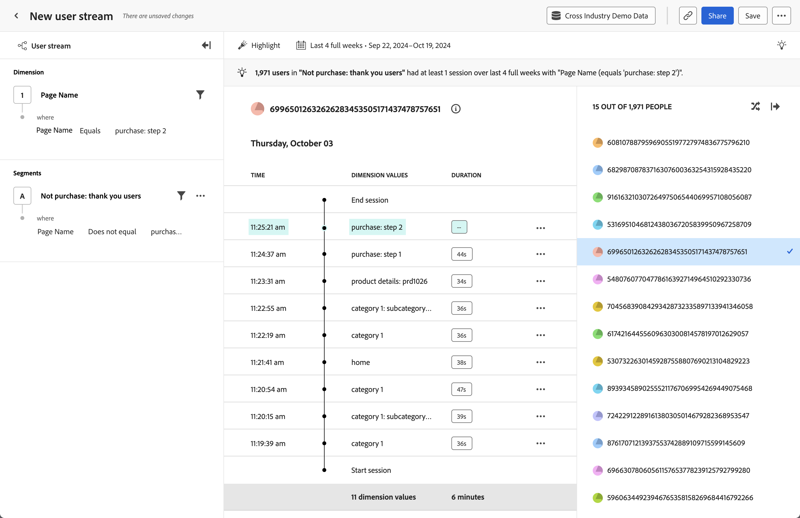

# Analisi della [!UICONTROL timeline] {#timeline}

<!-- markdownlint-disable MD034 -->

>[!CONTEXTUALHELP]
>id="workspace_guidedanalysis_timeline_button"
>title="Timeline"
>abstract="Osserva gli eventi della sessione a livello di utente nel tempo."

<!-- markdownlint-enable MD034 -->

L&#39;analisi della  **[!UICONTROL Timeline]** consente di osservare gli eventi della sessione a livello di utente nel tempo per trovare modelli di esperienza e raccontare storie utente migliori. La barra a sinistra ti consente di filtrare il flusso per valori di proprietà e segmenti. La barra a destra ti consente di selezionare da un elenco randomizzato di utenti che corrispondono ai criteri di filtro. L’area centrale mostra il flusso dell’utente selezionato per sessione, costituito da marca temporale, valori di proprietà e durata. La durata non è disponibile per l’ultimo evento di una determinata sessione.

>[!NOTE]
>
>L&#39;analisi [!UICONTROL Timeline] richiede che il componente standard **[!UICONTROL ID persona]** sia disponibile nella [visualizzazione dati](/help/data-views/component-reference.md#optional). L’inclusione dell’ID persona in una visualizzazione dati viene gestita dall’amministratore di Customer Journey Analytics, consentendo all’organizzazione di controllare completamente la privacy degli utenti che possono accedere a tali dati.
> Se a una visualizzazione dati non è stato aggiunto il componente [!UICONTROL ID persona], viene visualizzato il seguente messaggio:
>
>* **Amministratori**: *per questa analisi è necessaria la proprietà PersonID. Aggiungi l’ID persona alla visualizzazione dati.*
>* **Non amministratori**: *per questa analisi è necessaria la proprietà PersonID. Collabora con l’amministratore di Customer Journey Analytics per aggiungere l’ID persona alla visualizzazione dati.*

>[!VIDEO](https://video.tv.adobe.com/v/3427810/?quality=12&learn=on)

## Casi d’uso

I casi d’uso per questa analisi includono:

* **Esplorazione attrito**: se nell’analisi [Analisi funnel](funnel.md) riscontri un calo significativo, puoi creare un segmento di tali utenti e applicarlo in questa analisi per indagare le possibili cause.
* **Comportamento errore**: se gli utenti riscontrano un errore di prodotto, puoi esplorare le operazioni eseguite dagli utenti prima o dopo la visualizzazione dell’errore.
* **Convalida raccolta dati**: gli amministratori dei dati possono filtrare questa analisi sul proprio ID persona per verificare che l’implementazione della propria organizzazione funzioni come previsto.

## Interfaccia

Per una panoramica dell’interfaccia dell’analisi guidata, consulta [Interfaccia](../overview.md#interface). Le seguenti impostazioni sono specifiche per questa analisi:

### Barra delle query

La barra delle query consente di configurare i seguenti componenti:

* **[!UICONTROL Dimension]**: dimensione per la quale si desidera visualizzare i valori in streaming. Il flusso al centro mostra i valori per la dimensione selezionata. Puoi anche applicare filtri per restringere il flusso a dati più pertinenti. Gli operatori validi per il filtro includono [!UICONTROL Uguale a], [!UICONTROL Non uguale a], [!UICONTROL Inizia con], [!UICONTROL Termina con], [!UICONTROL Contiene], [!UICONTROL Non contiene], [!UICONTROL Esiste] e [!UICONTROL Non esiste].
* **[!UICONTROL Segmenti]**: il segmento che si desidera analizzare. Il segmento selezionato filtra i dati in modo da concentrarti solo sui singoli utenti che corrispondono ai criteri del segmento. Se desideri limitare l’analisi a un ID persona specifico, puoi filtrarla per questo ID persona nel pannello a destra. Per questa analisi è supportato un segmento.

### Impostazioni del grafico

L&#39;analisi [!UICONTROL Timeline] offre le seguenti impostazioni del grafico, che possono essere regolate nel menu sopra il grafico:

* **[!UICONTROL Mostra come]**: mostra i valori di proprietà desiderati.
   * [!UICONTROL Mostra tutto]: mostra tutti i valori delle proprietà in una sessione.
   * [!UICONTROL Evidenzia]: evidenzia visivamente i valori delle proprietà in una sessione che corrispondono ai filtri della query.
   * [!UICONTROL Visualizza solo]: mostra solo i valori delle proprietà in una sessione che corrispondono ai filtri della query.

### Intervallo date

L’intervallo di date desiderato per l’analisi. Questa impostazione è costituita da due componenti:

* **[!UICONTROL Intervallo]**: granularità della data in base alla quale visualizzare i dati delle tendenze. Questa impostazione non influisce sull’analisi senza tendenze, ad esempio Timeline.
* **[!UICONTROL Data]**: la data di inizio e di fine. Per comodità, sono disponibili intervalli di date continui predefiniti e intervalli personalizzati salvati in precedenza; in alternativa, puoi utilizzare il selettore del calendario per scegliere un intervallo di date fisso.

<!--

## Example

See below for an example of the analysis.

-->
