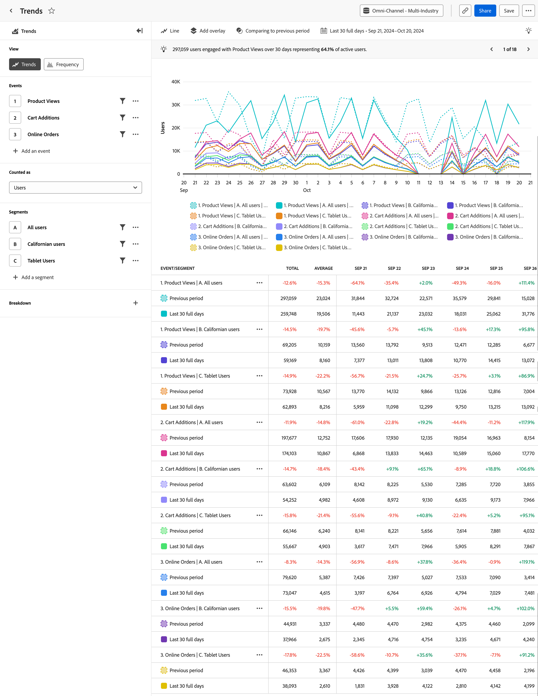

# Analisi [!UICONTROL Trends] {#trends}

<!-- markdownlint-disable MD034 -->

>[!CONTEXTUALHELP]
>id="cja_workspace_guidedanalysis_trends_button"
>title="Tendenze"
>abstract="Misura il coinvolgimento degli utenti nel tempo."

<!-- markdownlint-enable MD034 -->

L&#39;analisi  **[!UICONTROL Trends]** fornisce informazioni utili sulle prestazioni del prodotto o sul comportamento degli utenti nel tempo. L’asse orizzontale di questo rapporto è un intervallo di tempo, mentre l’asse verticale misura gli eventi desiderati.

>[!VIDEO](https://video.tv.adobe.com/v/3421666/?learn=on)

## Casi d’uso

I casi di utilizzo per questa analisi includono:

* **Valutazione delle prestazioni del prodotto**: le tendenze consentono di valutare le prestazioni complessive del prodotto in un determinato periodo. Analizzando metriche quali coinvolgimento degli utenti, tassi di adozione o di conversione, puoi verificare se le prestazioni del prodotto stanno migliorando, stagnando o diminuendo.
* **Adozione di funzionalità**: le tendenze consentono di comprendere in che modo gli utenti adottano nuove funzionalità o aggiornamenti rilasciati. È possibile determinare quali feature sono popolari e quali feature richiedono miglioramenti. Queste informazioni ti consentono di prendere decisioni basate sui dati sulle funzioni per dare priorità alle tue attività di sviluppo.
* **Comportamento utente**: le tendenze possono fornire informazioni sul comportamento degli utenti nel tempo. Esaminando le azioni specifiche intraprese dagli utenti, è possibile identificare i pattern in cui gli utenti potrebbero abbandonarsi. Puoi combinare le informazioni provenienti da questa analisi con [Funnel](funnel.md) per ottenere ulteriori informazioni sul comportamento.
* **Test A/B e sperimentazione**: se esegui test A/B all&#39;interno del prodotto, puoi utilizzare Tendenze per determinare quali test hanno più successo nel tempo.

## Interfaccia

Per una panoramica dell&#39;interfaccia di analisi guidata, vedere [Interfaccia](../overview.md#interface). Le seguenti impostazioni sono specifiche per questa analisi:

### Barra delle query

La barra delle query consente di configurare i seguenti componenti:

* **[!UICONTROL View]**: passa da questa analisi a [Frequenza](frequency.md).
* **[!UICONTROL Events & Metrics]**: eventi o metriche da misurare. Ogni selezione è rappresentata da una serie di grafici e da una riga di tabella. Non è possibile combinare eventi e metriche nella query. Dopo aver effettuato la prima selezione, le altre selezioni della query devono essere dello stesso tipo. Puoi includere fino a cinque selezioni.
* **[!UICONTROL Counted as]**: metodo di conteggio da applicare agli eventi selezionati. Le opzioni includono Eventi, Sessioni, Utenti, Percentuale di utenti, Eventi per sessione ed Eventi per utente. Le opzioni conteggiate come sono applicabili solo alle query evento e vengono rimosse per le query metriche.
* **[!UICONTROL Segments]**: i segmenti che si desidera misurare. Ogni segmento selezionato raddoppia il numero delle serie del grafico e delle righe della tabella. Puoi includere fino a cinque segmenti.
* **[!UICONTROL Breakdown property]**: suddivide le serie del grafico e le righe della tabella in base ai valori della proprietà selezionata. È supportata una singola proprietà di suddivisione. Nella tabella vengono visualizzati i primi 20 valori e nel grafico è possibile visualizzare fino a dieci valori. È possibile nascondere o esporre una riga nel grafico attivando l&#39;icona .

### Impostazioni grafico

L&#39;analisi [!UICONTROL Trends] offre le seguenti impostazioni del grafico, che possono essere regolate nel menu sopra il grafico:

* **[!UICONTROL Chart type]**: tipo di visualizzazione che si desidera utilizzare. Le opzioni disponibili sono Linea, Barre, Barre sovrapposte e Area sovrapposta.

### Sovrapposizioni

Aggiungi dati aggiuntivi al grafico. Quando sul grafico sono visibili più serie, le sovrapposizioni vengono visualizzate solo al passaggio del mouse.

* **[!UICONTROL Anomaly detection]**: esegue [il rilevamento delle anomalie](/help/analysis-workspace/c-anomaly-detection/anomaly-detection.md) nell&#39;analisi con tendenze. I valori anomali vengono visualizzati sotto forma di punti su cui è possibile passare il cursore del mouse per ottenere ulteriori informazioni.
* **[!UICONTROL Trendline overlay]**: aggiunge una linea di tendenza al grafico per meglio rappresentare un pattern più chiaro nei dati.
   * [!UICONTROL Linear]: crea una linea di regressione retta. Consigliato per dati lineari semplici che aumentano o diminuiscono a una velocità costante. Equazione: `y = a + b * x`
   * [!UICONTROL Logarithmic]: crea una linea di regressione curva. Consigliato per i dati che aumentano o diminuiscono rapidamente, quindi diventano di più livello. Equazione: `y = a + b * log(x)`
   * [!UICONTROL Moving average]: crea una linea di tendenza uniforme basata su un insieme di medie. Anche nota come media continua, la media mobile utilizza un numero specifico di punti di dati precedenti (determinati dalla selezione), ne calcola la media e utilizza tale media come punto sulla linea. Alcuni esempi includono la media mobile di sette giorni o di quattro settimane. Le opzioni disponibili per la media mobile dipendono dall’intervallo e dall’intervallo di date selezionati.

### Confronto temporale

{{apply-time-comparison}}

### Intervallo date

L’intervallo di date desiderato per l’analisi. Questa impostazione è composta da due componenti:

* **[!UICONTROL Interval]**: granularità della data in base alla quale visualizzare i dati con tendenze. Le opzioni valide includono Orario, Giornaliero, Settimanale, Mensile e Trimestrale. Lo stesso intervallo di date può avere intervalli diversi che influiscono sul numero di coordinate nel grafico e sul numero di colonne nella tabella. Ad esempio, la visualizzazione di un’analisi con granularità giornaliera della durata di tre giorni mostrerebbe solo tre punti di dati, mentre un’analisi con granularità oraria della durata di tre giorni mostrerebbe 72 punti di dati.
* **[!UICONTROL Date]**: la data di inizio e di fine. Sono disponibili predefiniti per intervalli di date continui e intervalli personalizzati salvati in precedenza, oppure puoi utilizzare il selettore calendario per scegliere un intervallo di date fisso.

<!--

## Example

See below for an example of the analysis.

-->