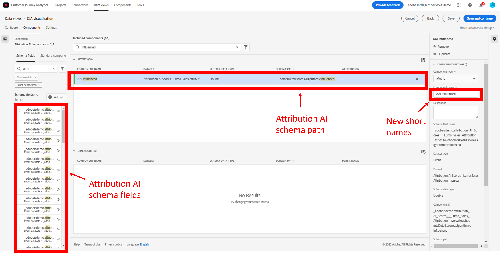

# Integrare Attribution AI con CJA

[Attribution AI](https://experienceleague.adobe.com/docs/experience-platform/intelligent-services/attribution-ai/overview.html?lang=en), parte di Adobe Experience Platform Intelligent Services, è un servizio di attribuzione algoritmica multicanale che calcola l’influenza e l’impatto incrementale delle interazioni dei clienti rispetto a risultati specifici. Con Attribution AI, gli addetti al marketing possono misurare e ottimizzare le spese di marketing e pubblicitarie comprendendo l’impatto di ogni singola interazione con i clienti in ogni fase dei percorsi dei clienti.

Attribution AI si integra con Customer Journey Analytics (CJA) nella misura in cui Attribution AI esegue modelli rispetto ai punti di contatto marketing e alle origini dati di conversione dei clienti. CJA importa quindi l’output di tali modelli come set di dati, oppure può essere integrato con il resto dei set di dati di CJA. I set di dati abilitati per Attribution AI possono quindi essere utilizzati nelle visualizzazioni dati e nei rapporti in CJA.

Attribution AI supporta 3 schemi di Experience Platform: Evento esperienza, Adobe Analytics ed evento esperienza di consumo.

Attribution AI supporta due categorie di punteggi: algoritmico e basato su regole.

## Punteggi algoritmici

I punteggi algoritmici includono punteggi incrementali e influenzati.

* **[!UICONTROL Influenced]punteggio** divide il 100% del credito di conversione tra i canali di marketing.
* **[!UICONTROL Incremental]punteggio** per prima cosa, prendi in considerazione una linea di base di conversione che avresti ottenuto anche senza il marketing. Questa linea di base dipende dalle osservazioni AI di pattern, stagionalità e così via, dovute al riconoscimento del marchio esistente, alla lealtà e al passaparola. Il credito rimanente è suddiviso tra i canali di marketing.

## Punteggi basati su regole

I punteggi basati su regole includono

* **[!UICONTROL First touch]** attribuisce il 100% del valore al punto di contatto visualizzato per la prima volta nell’intervallo di lookback dell’attribuzione.
* **[!UICONTROL Last touch]** attribuisce il 100% del valore al punto di contatto che si verifica più di recente prima della conversione.
* **[!UICONTROL Linear]** attribuisce lo stesso credito a ogni punto di contatto che porta a una conversione.
* **[!UICONTROL U-shaped]** attribuisce il 40% del valore alla prima interazione, il 40% del valore all’ultima interazione e divide il restante 20% in qualsiasi punto di contatto intermedio. Per le conversioni con un singolo punto di contatto, viene assegnato un credito del 100%. Per le conversioni con due punti di contatto, viene assegnato un credito del 50% a entrambi.
* **[!UICONTROL Time-Decay]** segue un decadimento esponenziale con un parametro di emivita personalizzato, dove il valore predefinito è 7 giorni. Il valore di ciascun canale dipende dalla quantità di tempo trascorsa tra l’avvio del punto di contatto e l’eventuale conversione. La formula utilizzata per determinare il credito è `2^(-t/halflife)`, dove `t` è il tempo tra un punto di contatto e una conversione. Tutti i punti di contatto vengono quindi normalizzati al 100%.

## Flusso di lavoro

Alcuni dei passaggi vengono eseguiti in Adobe Experience Platform prima di lavorare con l’output in CJA. L’output è costituito da un set di dati con un modello di Attribution AI applicato.

### Passaggio 1: Creare un’istanza di Attribution AI

Ad Experience Platform, crea un’istanza Attribution AI selezionando e mappando i dati, definendo gli eventi e addestrando i dati, come descritto [qui](https://experienceleague.adobe.com/docs/experience-platform/intelligent-services/attribution-ai/user-guide.html).

### Passaggio 2: Configurare una connessione CJA ai set di dati di Attribution AI

In CJA, ora puoi [creare una o più connessioni](/help/connections/create-connection.md) Experience Platform di set di dati che sono stati strumentalizzati per Attribution AI. Questi set di dati vengono visualizzati con il prefisso &quot;Punteggi Attribution AI&quot;, come mostrato di seguito:

### Passaggio 3: Crea visualizzazioni dati in base a queste connessioni

In CJA, [creare una o più visualizzazioni dati](/help/data-views/create-dataview.md) che contengono i campi XDM di Attribution AI.

Di seguito sono riportati i campi dello schema XDM per i punti di contatto:

Ed ecco i campi dello schema XDM da convertire:

### Passaggio 4: Report sui dati AAI in CJA Workspace

In un progetto di CJA Workspace, puoi inserire metriche quali &quot;Ordini AAI&quot; e dimensioni quali, ad esempio, &quot;Nome campagna AAI&quot; o &quot;Canale marketing AAI&quot;.

>[!IMPORTANT]
>
>Queste dimensioni e metriche non vengono denominate in modo nativo in questo modo. Questi sono &quot;nomi amichevoli&quot;. La [convenzione di denominazione in Attribution AI](https://experienceleague.adobe.com/docs/experience-platform/intelligent-services/attribution-ai/input-output.html?lang=en#attribution-ai-output-data) segue il percorso dello schema. È consigliabile rinominare i nomi dei percorsi lunghi dello schema AAI in nomi brevi e più descrittivi (dimensioni/metriche) in CJA. Puoi farlo in **[!UICONTROL Data views]** > **[!UICONTROL Edit data view]** > **[!UICONTROL Components]** scheda > **[!UICONTROL Schema fields]** -> Fare clic su un campo schema -> **[!UICONTROL Component name]**.

**Ordini con punteggi influenzati e incrementali**

Qui vediamo un progetto Workspace con dati AAI che mostra gli ordini con punteggi influenzati e incrementali. Approfondisci qualsiasi dimensione per comprendere l’attribuzione tramite: campagna, gruppo di prodotti, segmento utente, area geografica e così via.

**Prestazioni di marketing**

Confrontare e contrastare l’attribuzione di punti di contatto tra diversi modelli di attribuzione:

**Interazione canale**

Comprendere l&#39;interazione del canale per vedere quale canale può essere utilizzato più efficacemente con altri canali, utilizzando un diagramma di Venn:

**Percorsi principali per la conversione**

Questa tabella mostra i percorsi principali di conversione (deduplicati) per facilitarti la progettazione e l’ottimizzazione dei punti di contatto:

**Lead time per la conversione**

In questo caso, si verifica il lead time di conversione quando un punto di contatto è nel mix. Consente di ottimizzare il lead time:

## Differenze tra Attribution AI e Attribution IQ

Quindi quando utilizzare i dati di Attribution AI rispetto a [Attribution IQ](/help/analysis-workspace/attribution/overview.md), una funzionalità CJA nativa? Questa tabella mostra alcune delle differenze di funzionalità:

| Funzionalità | Attribution AI | Attribution IQ |
| --- | --- | --- |
| Attribuzione incrementale | Sì | No |
| Consente agli utenti di regolare il modello | Sì | Sì |
| Attribuzione tra canali diversi (Nota: AAI non utilizza gli stessi dati uniti utilizzati da CJA.) | Sì | Sì |
| Include punteggi influenzati | Sì | Sì |
| Modellazione ML | Sì | Sì |
| Modelli di attribuzione basati su aree geografiche | Sì | Sì |
| Può configurare punti di contatto di marketing nel modello | Sì | No |

{style=&quot;table-layout:auto&quot;}
