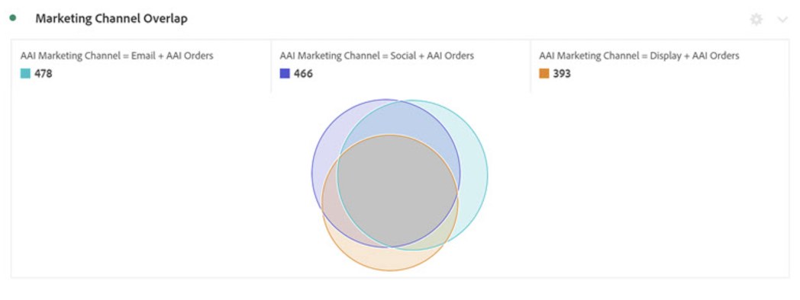

# Integrare IA per l’attribuzione con CJA

[IA per l’attribuzione](https://experienceleague.adobe.com/docs/experience-platform/intelligent-services/attribution-ai/overview.html?lang=it), parte di Adobe Experience Platform Intelligent Services, è un servizio di attribuzione algoritmica multicanale che calcola l’influenza e l’impatto incrementale delle interazioni dei clienti rispetto a risultati specifici. Con IA per l’attribuzione, gli esperti di marketing possono misurare e ottimizzare le spese di marketing e pubblicitarie comprendendo l’impatto di ogni singola interazione con i clienti in ogni fase del percorso del cliente.

IA per l’attribuzione si integra con Customer Journey Analytics (CJA) nella misura in cui IA per l’attribuzione esegue modelli rispetto alle origini dati di conversione e ai punti di contatto di marketing dei clienti. CJA importa quindi l’output di tali modelli come set di dati, oppure può essere integrato con il resto dei set di dati di CJA. I set di dati abilitati per Attribution AI possono quindi essere utilizzati nelle visualizzazioni dati e nel reporting in CJA.

IA per l’attribuzione supporta 3 schemi di Experience Platform: Experience Event, Adobe Analytics e Consumer Experience Event.

IA per l’attribuzione supporta due categorie di punteggi: algoritmico e basato su regole.

## Punteggi algoritmici

I punteggi algoritmici includono punteggi incrementali e influenzati.

* I **[!UICONTROL Influenced]punteggi** dividono il 100% del credito di conversione tra i canali di marketing.
* I **[!UICONTROL Incremental]punteggi** per prima cosa prendono in considerazione una linea di base di conversione che avresti ottenuto anche senza il marketing. Questa linea di base dipende dalle osservazioni di IA di pattern, stagionalità e così via, basate sul riconoscimento del brand, sulla fedeltà e sul passaparola esistenti. Il credito rimanente è suddiviso tra i canali di marketing.

## Punteggi basati su regole

I punteggi basati su regole includono i seguenti:

* **[!UICONTROL First touch]** attribuisce un credito del 100% al punto di contatto visualizzato per la prima volta nella finestra di lookback dell’attribuzione.
* **[!UICONTROL Last touch]** attribuisce un credito del 100% al punto di contatto che si verifica più di recente prima della conversione.
* **[!UICONTROL Linear]** attribuisce lo stesso credito a ogni punto di contatto che porta a una conversione.
* **[!UICONTROL U-shaped]** attribuisce il 40% di credito alla prima interazione, il 40% di credito all’ultima interazione e divide il restante 20% in qualsiasi punto di contatto intermedio. Per le conversioni con un singolo punto di contatto, viene assegnato un credito del 100%. Per le conversioni con due punti di contatto, viene assegnato un credito del 50% a entrambi.
* **[!UICONTROL Time-Decay]** segue un decadimento esponenziale con un parametro di mezza durata personalizzato, dove il valore predefinito è 7 giorni. Il valore di ciascun canale dipende dalla quantità di tempo trascorsa tra l’avvio del punto di contatto e l’eventuale conversione. La formula utilizzata per determinare il credito è `2^(-t/halflife)`, dove `t` è il tempo tra un punto di contatto e una conversione. Tutti i punti di contatto vengono quindi normalizzati al 100%.

## Flusso di lavoro

Alcuni dei passaggi vengono eseguiti in Adobe Experience Platform prima di lavorare sull’output in CJA. L’output è costituito da un set di dati con un modello di IA per l’attribuzione applicato.

### Passaggio 1: creare un’istanza di IA per l’attribuzione

In Experience Platform, crea un’istanza di IA per l’attribuzione selezionando e mappando i dati, definendo gli eventi e addestrando i dati, come descritto [qui](https://experienceleague.adobe.com/docs/experience-platform/intelligent-services/attribution-ai/user-guide.html?lang=it).

### Passaggio 2: configurare una connessione CJA ai set di dati di IA per l’attribuzione

In CJA, ora puoi [creare una o più connessioni](/help/connections/create-connection.md) ai set di dati di Experience Platform che sono stati instrumentati per IA per l’attribuzione. Questi set di dati vengono visualizzati con il prefisso “Attribution AI Scores” (Punteggi di IA per l’attribuzione) come mostrato di seguito:

### Passaggio 3: creare visualizzazioni dati in base a queste connessioni

In CJA, [crea una o più visualizzazioni dati](/help/data-views/create-dataview.md) che contengano i campi XDM di IA per l’attribuzione.

Di seguito sono riportati i campi di schema XDM dei punti di contatto:

Ecco i campi di schema XDM per la conversione:

### Passaggio 4: rapporto sui dati di IA per l’attribuzione in CJA Workspace

In un progetto di CJA Workspace, puoi inserire metriche quali “AAI Orders” (Ordini IA per l’attribuzione) e dimensioni quali, ad esempio, “AAI Campaign Name” (Nome campagna IA per l’attribuzione) o “AAI Marketing Channel” (Canale di marketing IA per l’attribuzione).

L’output del punteggio non elaborato in AAI ha uno schema nidificato, in cui la lunghezza del percorso dei campi può occupare la maggior parte degli spazi nelle tabelle o nelle visualizzazioni. Per brevità, [!UICONTROL Display Name] viene generato automaticamente e utilizzato in CJA secondo le regole riportate di seguito:

* Tutti i campi hanno un prefisso “AAI”
* Per i campi dei punti di contatto:
   * I campi che fanno parte del punteggio XDM vengono visualizzati in CJA come `AAI T {field name}`
   * I campi inclusi come colonna passThrough vengno visualizzati in CJA come `AAI T PT {field name}`
* Per i campi di conversione:
   * I campi che fanno parte del punteggio XDM vengono visualizzati in CJA come `AAI C {field name}`
   * I campi inclusi come colonna passThrough vengono visualizzati in CJA come `AAI C PT {field name}`

**Ordini con punteggi influenzati e incrementali**

Qui vediamo un progetto Workspace con dati di IA per l’attribuzione che mostra gli ordini con punteggi influenzati e incrementali. Approfondisci qualsiasi dimensione per comprendere l’attribuzione in base a: campagna, gruppo di prodotti, segmento utente, posizione geografica e così via.

**Prestazioni di marketing**

Confronta e contrasta l’attribuzione di punti di contatto tra diversi modelli di attribuzione:

**Interazione dei canali**

Comprendi l’interazione dei canali per vedere quale canale può essere utilizzato più efficacemente con altri canali, utilizzando un diagramma di Venn:

**Percorsi principali per la conversione**

Questa tabella mostra i percorsi principali di conversione (deduplicati) per facilitare la progettazione e l’ottimizzazione dei punti di contatto:

**Lead time per la conversione**

In questo caso, vediamo il lead time di conversione quando è incluso un punto di contatto. Consente di ottimizzare il lead time:

## Differenze tra le funzionalità di attribuzione di Attribution AI e CJA

Nella tabella seguente sono illustrate alcune delle differenze di funzionalità:

| Funzionalità | IA per l’attribuzione | Attribuzione CJA |
| --- | --- | --- |
| Attribuzione incrementale | Sì | No |
| Possibilità di regolare il modello | Sì | Sì |
| Attribuzione tra canali diversi (nota: IA per l’attribuzione non utilizza gli stessi dati uniti utilizzati da CJA) | Sì | Sì |
| Punteggi influenzati inclusi | Sì | Sì |
| Modellazione basata su Machine Learning | Sì | Sì |
| Modelli di attribuzione basati su aree geografiche | Sì | Sì |
| Configurazione dei punti di contatto di marketing nel modello | Sì | No |

{style="table-layout:auto"}
