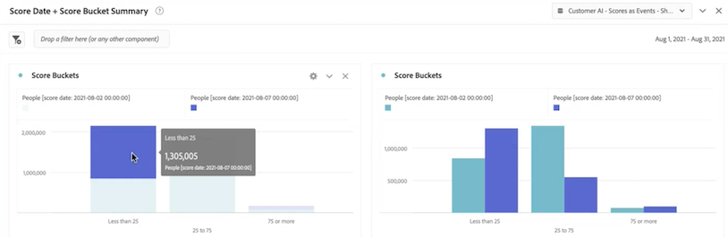

# Integrare i dati di IA per l’analisi dei clienti con Adobe Customer Journey Analytics

{{release-limited-testing}}

[IA per l’analisi dei clienti](https://experienceleague.adobe.com/docs/experience-platform/intelligent-services/customer-ai/overview.html?lang=it), parte di Adobe Experience Platform Intelligent Services, offre agli esperti marketing la possibilità di generare previsioni sui clienti a livello individuale.

Con l’aiuto di fattori di influenza, IA per l’analisi dei clienti può dirti cosa potrebbe fare un cliente e perché. Inoltre, gli esperti marketing possono trarre vantaggio dalle previsioni e dalle informazioni di IA per l’analisi dei clienti per personalizzare le customer experience fornendo le offerte e i messaggi più appropriati.

IA per l’analisi dei clienti si basa su dati comportamentali individuali e dati di profilo per il punteggio di tendenza. IA per l’analisi dei clienti è flessibile in quanto può accogliere più origini di dati, tra cui Adobe Analytics, Adobe Audience Manager, dati di Consumer Experience Event e di Experience Event. Se utilizzi il connettore di origine di Experience Platform per inserire i dati di Adobe Audience Manager e Adobe Analytics, il modello raccoglie automaticamente i tipi di evento standard per addestrare e valutare il modello. Se inserisci un set di dati di Experience Event senza tipi di evento standard, tutti i campi pertinenti dovranno essere mappati come eventi personalizzati o attributi di profilo se desideri utilizzarlo nel modello. Questo può essere fatto nel passaggio di configurazione di IA per l’analisi dei clienti in Experience Platform.

IA per l’analisi dei clienti può integrarsi con Customer Journey Analytics nella misura in cui i set di dati abilitati per IA per l’analisi dei clienti possono essere utilizzati nelle visualizzazioni dati e nel reporting in Customer Journey Analytics. È possibile:

* **Tracciare i punteggi di tendenza di un segmento di utenti nel tempo**.
   * Caso d’uso: comprendere la probabilità di conversione dei clienti in un segmento specifico.
   * Esempio: un addetto al marketing di una catena alberghiera vuole comprendere la probabilità che un cliente acquisti un biglietto per lo spettacolo presso la sala concerti dell’hotel.
* **Analizzare gli eventi di successo o gli attributi associati ai punteggi di tendenza**.
   * Caso d’uso: scopri gli attributi o gli eventi di successo associati ai punteggi di tendenza.
   * Esempio: un addetto al marketing di una catena alberghiera vuole capire come gli acquisti di biglietti per lo spettacolo presso la sala concerti di un hotel sono associati ai punteggi di tendenza.
* **Seguire il flusso di entrata della tendenza del cliente su diverse esecuzioni di punteggio**.
   * Caso d’uso: comprendere le persone che inizialmente erano utenti a bassa tendenza e, nel tempo, sono diventate utenti ad alta tendenza.
   * Esempio: un addetto al marketing di una catena alberghiera vuole capire quali clienti dell’hotel sono stati inizialmente identificati come clienti con una bassa propensione ad acquistare un biglietto per lo spettacolo, ma nel tempo sono diventati clienti con un’elevata propensione ad acquistare un biglietto per lo spettacolo.
* **Osservare la distribuzione della tendenza**.
   * Caso d’uso: scopri la distribuzione dei punteggi di tendenza per definirli in modo più preciso.
   * Esempio: un rivenditore desidera effettuare una promozione specifica di $ 50 di sconto su un prodotto. Potrebbe voler gestire solo una promozione molto limitata per questioni di budget, ecc. Analizza i dati e decide di eseguire il targeting solo dell’80%+ dei suoi clienti.
* **Osservare la tendenza a eseguire un’azione per una particolare coorte nel tempo**.
   * Caso d’uso: tenere traccia di una coorte specifica nel tempo.
   * Esempio: un addetto al marketing di una catena alberghiera vuole tenere traccia del suo livello bronzo rispetto al suo livello argento, o del livello argento rispetto al livello oro, nel tempo. Possono osservare la tendenza di ogni coorte a prenotare l’hotel nel tempo.

Per integrare effettivamente i dati di IA per l’analisi dei clienti con il Customer Journey Analytics, segui questi passaggi:

>[!NOTE]
>
>Alcuni dei passaggi vengono eseguiti in Adobe Experience Platform prima di lavorare con l’output in Customer Journey Analytics.

## Passaggio 1: configurare un’istanza di IA per l’analisi dei clienti

Dopo aver preparato i dati e aver impostato tutte le credenziali e gli schemi, inizia seguendo la guida [Configure a Customer AI Instance](https://experienceleague.adobe.com/docs/experience-platform/intelligent-services/customer-ai/user-guide/configure.html?lang=it) (Configurare un’istanza di IA per l’analisi dei clienti) in Adobe Experience Platform.

## Passaggio 2: configurare una connessione di Customer Journey Analytics ai set di dati di IA per l’analisi dei clienti

In Customer Journey Analytics, ora puoi [creare una o più connessioni](/help/connections/create-connection.md) per Experience Platform di set di dati instrumentati per IA per l’analisi dei clienti. Ogni previsione, ad esempio “Likelihood to upgrade account” (Probabilità di aggiornamento dell’account), equivale a un set di dati. Questi set di dati vengono visualizzati con il prefisso “Customer AI Scores in EE Format – name_of_application” (Punteggi di IA per l’analisi dei clienti in formato EE, name_of_application).

>[!IMPORTANT]
>
>Ogni istanza di IA per l’analisi dei clienti dispone di due set di dati di output se l’interruttore è attivato per abilitare i punteggi di Customer Journey Analytics durante la configurazione del passaggio 1. Un set di dati di output viene visualizzato in formato XDM di Profilo e uno in formato XDM di Experience Event.

Di seguito è riportato un esempio di schema XDM che il Customer Journey Analytics inserirebbe come parte di un set di dati esistente o nuovo:

L’esempio è un set di dati di profilo; lo stesso set di oggetti di schema farebbe parte di un set di dati Experience Event che il Customer Journey Analytics acquisirebbe. Il set di dati di Experience Event includerebbe marche temporali come la data di punteggio. Ogni cliente valutato in questo modello avrebbe un punteggio, una data di punteggio e altri dati a lui associati.

## Passaggio 3: creare visualizzazioni dati in base a queste connessioni

In Customer Journey Analytics, ora puoi passare a [creare visualizzazioni dati](/help/data-views/create-dataview.md) con le dimensioni (come punteggio, data del punteggio, probabilità e così via) e le metriche inserite come parte della connessione stabilita.

## Passaggio 4: rapporto sui punteggi di IA per l’analisi dei clienti in Workspace

In Customer Journey Analytics Workspace, crea un nuovo progetto e richiama le visualizzazioni.

### Generare punteggi di tendenza

Ecco un esempio di un progetto Workspace con i dati di IA per l’analisi dei clienti che genera un punteggio di tendenza per un segmento di utenti nel tempo, in un grafico a barre in pila:

### Tabella con codici motivo

Ecco una tabella che mostra i codici del motivo per cui un segmento ha una tendenza alta o bassa:

### Flusso di ingresso della tendenza del cliente

Questo diagramma di flusso mostra il flusso di ingresso della tendenza del cliente su diverse esecuzioni di punteggio:

### Distribuzione dei punteggi di tendenza

Questo grafico a barre mostra la distribuzione dei punteggi di tendenza:

### Sovrapposizioni delle tendenze

Questo diagramma di Venn mostra la sovrapposizione delle tendenze su diverse esecuzioni di punteggio:

