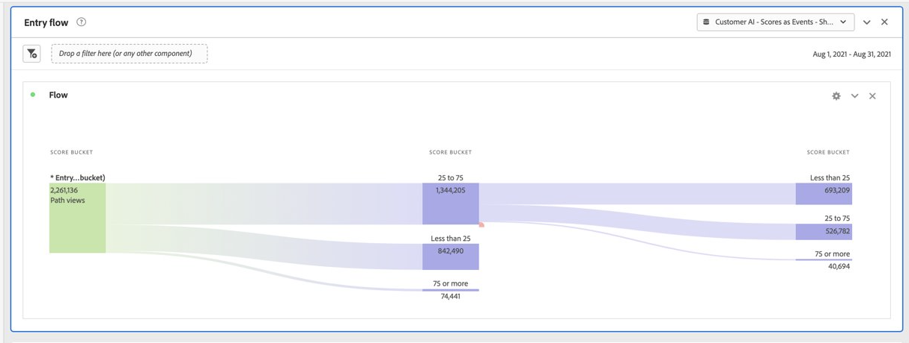

# Integrare la funzione IA per l’analisi dei clienti con CJA

>[!NOTE]
>
>Questa funzionalità è attualmente in [fase di test](/help/release-notes/releases.md) e non è disponibile a livello generale.

[IA per l’analisi dei clienti](https://experienceleague.adobe.com/docs/experience-platform/intelligent-services/customer-ai/overview.html?lang=it), parte di Adobe Experience Platform Intelligent Services, offre agli esperti marketing la possibilità di generare previsioni sui clienti a livello individuale.

Con l’aiuto di fattori di influenza, IA per l’analisi dei clienti può dirti cosa potrebbe fare un cliente e perché. Inoltre, gli esperti marketing possono trarre vantaggio dalle previsioni e dalle informazioni di IA per l’analisi dei clienti per personalizzare le customer experience fornendo le offerte e i messaggi più appropriati.

IA per l’analisi dei clienti si basa su dati comportamentali individuali e dati di profilo per il punteggio di tendenza. IA per l’analisi dei clienti è flessibile in quanto può accogliere più origini di dati, tra cui Adobe Analytics, Adobe Audience Manager, dati di Consumer Experience Event e di Experience Event. Se utilizzi il connettore di origine di Experience Platform per inserire i dati di Adobe Audience Manager e Adobe Analytics, il modello raccoglie automaticamente i tipi di evento standard per addestrare e valutare il modello. Se inserisci un set di dati di Experience Event senza tipi di evento standard, tutti i campi pertinenti dovranno essere mappati come eventi personalizzati o attributi di profilo se desideri utilizzarlo nel modello. Questo può essere fatto nel passaggio di configurazione di Customer AI in Experience Platform.

Customer AI può integrarsi con il Customer Journey Analytics (CJA) nella misura in cui i set di dati abilitati per Customer AI possono essere utilizzati nelle visualizzazioni dati e nel reporting in CJA. È possibile:

* **Tracciare i punteggi di tendenza di un segmento di utenti nel tempo**.
   * Caso di utilizzo: comprendere la probabilità che i clienti si trovino in un segmento specifico da convertire.
   * Esempio: Un addetto al marketing di una catena alberghiera vuole capire quale sia la probabilità che un cliente dell&#39;hotel acquisti un biglietto per lo show presso la sede del concerto dell&#39;hotel.
* **Analizzare gli eventi di successo o gli attributi associati ai punteggi di propensione**.
   * Caso di utilizzo: comprendere gli attributi o gli eventi di successo associati ai punteggi di propensione.
   * Esempio: Un addetto al marketing di una catena alberghiera vuole capire come gli acquisti di biglietti per lo show nel luogo del concerto di un hotel sono associati ai punteggi di propensione.
* **Seguire il flusso di entrata della tendenza del cliente su diverse esecuzioni di punteggio**.
   * Caso di utilizzo: comprendere le persone che inizialmente erano utenti a bassa propensione e, nel tempo, sono diventati utenti ad alta propensione.
   * Esempio: Un addetto al marketing di una catena alberghiera vuole capire quali clienti sono stati inizialmente identificati come clienti con bassa propensione all&#39;acquisto di un biglietto per lo show, ma nel tempo sono diventati clienti con elevata propensione all&#39;acquisto di un biglietto per lo show.
* **Osservare la distribuzione della tendenza**.
   * Caso di utilizzo: comprendere la distribuzione dei punteggi di propensione per essere più precisi nella definizione dei segmenti.
   * Esempio: Un rivenditore desidera effettuare una promozione specifica per 50 $ su un prodotto. Potrebbe voler gestire solo una promozione molto limitata per questioni di budget, ecc. Analizzano i dati e decidono di eseguire il targeting solo dell’80% in più dei loro clienti principali.
* **Osservare la tendenza a eseguire un’azione per una particolare coorte nel tempo**.
   * Caso di utilizzo: tiene traccia di una coorte specifica nel tempo.
   * Esempio: Un addetto al marketing di una catena alberghiera vuole rintracciare il loro livello bronzo rispetto al loro livello argento, o livello argento rispetto al loro livello oro, nel tempo. Così possono vedere la propensione di ogni coorte a prenotare l&#39;hotel nel tempo.

Per integrare effettivamente i dati di Customer AI con CJA, effettua le seguenti operazioni:

>[!NOTE]
>
>Alcuni dei passaggi vengono eseguiti in Adobe Experience Platform prima di utilizzare l’output in CJA.

## Passaggio 1: configurare un’istanza di IA per l’analisi dei clienti

Dopo aver preparato i dati e aver impostato tutte le credenziali e gli schemi, inizia seguendo la guida [Configure a Customer AI Instance](https://experienceleague.adobe.com/docs/experience-platform/intelligent-services/customer-ai/user-guide/configure.html?lang=it) (Configurare un’istanza di IA per l’analisi dei clienti) in Adobe Experience Platform.

## Passaggio 2: configurare una connessione CJA ai set di dati di IA per l’analisi dei clienti

In CJA, ora puoi [creare una o più connessioni](/help/connections/create-connection.md) ai set di dati di Experience Platform che sono stati instrumentati per IA per l’analisi dei clienti. Ogni previsione, ad esempio “Likelihood to upgrade account” (Probabilità di aggiornamento dell’account), equivale a un set di dati. Questi set di dati vengono visualizzati con il prefisso “Customer AI Scores in EE Format – name_of_application” (Punteggi di IA per l’analisi dei clienti in formato EE, name_of_application).

>[!IMPORTANT]
>
>Ogni istanza di IA per l’analisi dei clienti dispone di due set di dati di output se l’interruttore è attivato per l’abilitazione dei punteggi per CJA durante la configurazione del passaggio 1. Un set di dati di output viene visualizzato in formato XDM di Profilo e uno in formato XDM di Experience Event.

Di seguito è riportato un esempio di schema XDM che CJA inserirebbe come parte di un set di dati esistente o nuovo:

L’esempio è un set di dati di profilo; lo stesso set di oggetti di schema farebbe parte di un set di dati di Experience Event che CJA acquisirebbe. Il set di dati di Experience Event includerebbe marche temporali come la data di punteggio. Ogni cliente valutato in questo modello avrebbe un punteggio, una data di punteggio e altri dati a lui associati.

## Passaggio 3: creare visualizzazioni dati in base a queste connessioni

In CJA, ora puoi [creare visualizzazioni dati](/help/data-views/create-dataview.md) con le dimensioni (come punteggio, data del punteggio, probabilità e così via) e le metriche inserite come parte della connessione stabilita.

## Passaggio 4: rapporto sui punteggi di IA per l’analisi dei clienti in Workspace

In CJA Workspace, ora puoi creare un nuovo progetto e richiamare le visualizzazioni.

### Generare punteggi di tendenza

Ecco un esempio di un progetto Workspace con i dati di IA per l’analisi dei clienti che genera un punteggio di tendenza per un segmento di utenti nel tempo, in un grafico a barre in pila:

### Tabella con codici motivo

Ecco una tabella che mostra i codici del motivo per cui un segmento ha una tendenza alta o bassa:

### Flusso di ingresso della tendenza del cliente

Questo diagramma di flusso mostra il flusso di ingresso della tendenza del cliente su diverse esecuzioni di punteggio:

### Distribuzione dei punteggi di tendenza

Questo grafico a barre mostra la distribuzione dei punteggi di tendenza:

### Sovrapposizioni delle tendenze

Questo diagramma di Venn mostra la sovrapposizione delle tendenze su diverse esecuzioni di punteggio:

