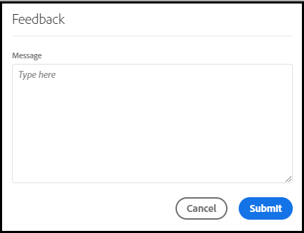
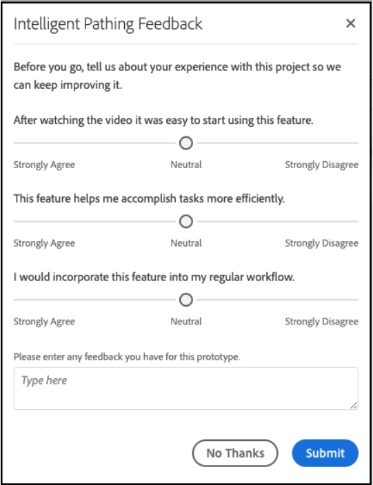

# Guida utente di [!UICONTROL Labs]

[!UICONTROL Labs] consente una prototipazione più rapida delle idee in fase iniziale. Si tratta di una combinazione di strumenti e processi che accelerano lo sviluppo in modo trasparente, con un focus sul cliente. Consente agli utenti di avvicinarsi alle tecnologie emergenti, scoprire informazioni importanti e influenzare le priorità e lo sviluppo delle funzioni future. Puoi utilizzare Labs per accedere in anteprima alle innovazioni di Adobe Customer Journey Analytics e per valutare le prossime funzionalità nel contesto dei tuoi casi d’uso aziendali e dei tuoi dati.

>[!IMPORTANT]
>
>Customer Journey Analytics Labs non è un servizio compatibile con HIPAA e non può essere utilizzato per elaborare dati personali riservati, inclusi i dati sanitari consentiti (come informazioni sanitarie personali o PHI) che l’organizzazione potrebbe altrimenti utilizzare in Customer Journey Analytics.

## Requisiti

[!UICONTROL Labs] è abilitato automaticamente per tutti gli amministratori. Gli altri membri del team possono richiederne l’accesso contattando gli amministratori del prodotto.

Se non lo hai già fatto, leggi e firma i moduli Contratto di non divulgazione e Termini e condizioni applicabili.

## Accedi al portale [!UICONTROL Labs]

Per accedere a [!UICONTROL Labs]:

1. Se non disponi già dell&#39;accesso a [!UICONTROL Workspace] e [!UICONTROL Labs], chiedi all&#39;amministratore le autorizzazioni necessarie.

1. In Customer Journey Analytics, fai clic sulla scheda **[!UICONTROL Labs]**.

## Valutare un prototipo

Per avviare e valutare un prototipo:

1. Nella schermata [!UICONTROL Labs], fai clic su **[!UICONTROL Launch]** per il prototipo che desideri visualizzare. Quando il prototipo viene avviato, il suo nome verrà visualizzato in alto a sinistra nell’ambiente del prototipo.

   aggiungere schermata qui

1. Per guardare un video che evidenzia il prototipo, fai clic su **[!UICONTROL Guarda video]** in alto a destra. Al termine del video, fai clic su **[!UICONTROL Chiudi]**.

   aggiungere schermata qui

1. Lavora con il prototipo. Quando si lavora nell’ambiente del prototipo:

* I progetti creati nell’ambiente del prototipo non possono essere salvati né condivisi.

* In un prototipo, puoi valutare i dati con qualsiasi dimensione, metrica, segmento e visualizzazione a cui hai normalmente accesso in Workspace.

* Eventuali modifiche apportate all’interno di un prototipo non influiranno sulla raccolta o sull’elaborazione dei dati.

* Le modifiche apportate tramite la creazione o la modifica di segmenti, metriche calcolate e avvisi persistono al di fuori dell’ambiente del prototipo.

## Lasciare un feedback

1. Fai clic su **[!UICONTROL Invia feedback]** per fornire un feedback nella finestra del messaggio in qualsiasi momento durante l&#39;utilizzo del prototipo.

   

1. Fai clic su **[!UICONTROL Invia]** per inviare il tuo feedback.

1. Per provare un prototipo diverso o per uscire dall&#39;ambiente del prototipo, fare clic su **[!UICONTROL Lascia prototipo]** in alto a destra e completare il breve sondaggio relativo al prototipo. Tutte le modifiche apportate a un progetto prototipo vengono perse quando si esce dall’ambiente del prototipo.

   

1. Fai clic su **[!UICONTROL Invia]** per tornare al portale principale delle anteprime.

## Informazioni aggiuntive

* Alcuni prototipi all&#39;interno di [!UICONTROL Labs] diventano funzionalità di Customer Journey Analytics, altri no. Il tuo feedback contribuisce al processo decisionale: ti invitiamo quindi a prendere visione dei prototipi e a far sapere ad Adobe se li trovi utili.
* Labs è disponibile per tutte le adesioni SKU.
