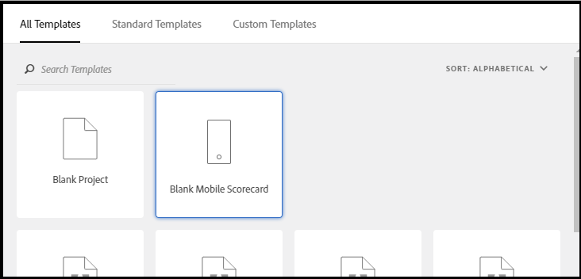
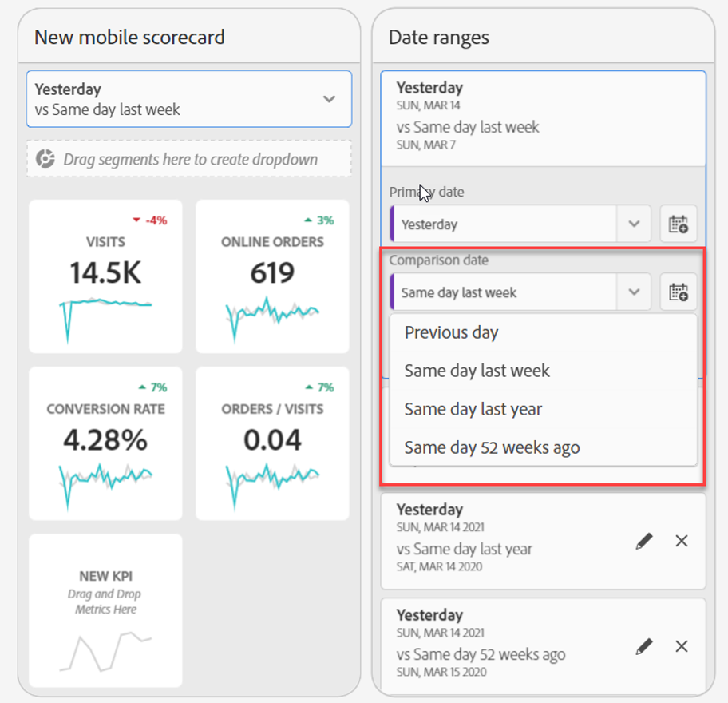
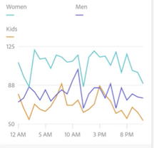
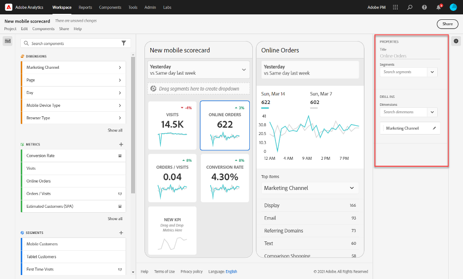

# Creare una scorecard per dispositivi mobili

Le informazioni riportate di seguito spiegano ai curatori di dati di Adobe Analytics come configurare e presentare dashboard per gli utenti direzionali. Per iniziare, puoi visualizzare il video Creazione di scorecard per le dashboard di Adobe Analytics:

>[!VIDEO](https://video.tv.adobe.com/v/34544)

>[!NOTE]
>Le schermate delle scorecard per questa pagina sono state riprese dall’interfaccia di Adobe Analytics, non da CJA. Tuttavia le due interfacce utente sono quasi identiche.

Una scorecard Adobe Analytics mostra le visualizzazioni dei dati chiave per gli utenti direzionali in un layout a sezioni affiancate, come mostrato di seguito:

In qualità di curatore di questa scorecard, puoi usare la funzione di creazione scorecard per configurare le sezioni da presentare all’utente direzionale sulla scorecard. Puoi anche configurare il modo in cui le viste dettagliate, o i raggruppamenti, possono essere regolati una volta che le sezioni vengono toccate. L’interfaccia del Creatore di scorecard è mostrata di seguito:

Per creare la scorecard, dovrai procedere in questo modo:

1. Accedi al modello [!UICONTROL Blank Mobile Scorecard].
2. Configura la scorecard con i dati e salvala.

## Accedi al modello [!UICONTROL Blank Mobile Scorecard] {#template}

Puoi accedere al modello [!UICONTROL Blank Mobile Scorecard] creando un nuovo progetto o dal menu degli strumenti.

### Creare un nuovo progetto {#create}

1. Apri Adobe Analytics e fai clic sulla scheda **[!UICONTROL Workspace]**.
1. Fai clic sul pulsante **[!UICONTROL Create project]** e seleziona il modello di progetto **[!UICONTROL Blank mobile scorecard]**.
1. Fai clic su **[!UICONTROL Create]**.

### Menu Strumenti

1. Dal menu **[!UICONTROL Tools]**, seleziona **[!UICONTROL Analytics dashboards (Mobile App)]**.
1. Nella schermata successiva, fai clic su **[!UICONTROL Create new scorecard]**.

## Configurare la scorecard con i dati e salvarla {#configure}

Per implementare il template della scorecard:

1. Alla voce **[!UICONTROL Properties]** (nella barra a destra), specifica la **[!UICONTROL Project report suite]** della quale desideri utilizzare i dati.

   

1. Per aggiungere una nuova sezione alla scorecard, trascina una metrica dal pannello a sinistra e rilasciala nella zona **[!UICONTROL Drag and Drop Metrics Here]**. È anche possibile inserire una metrica tra due sezioni utilizzando un flusso di lavoro simile.

   

1. Da ogni sezione, è possibile accedere a una vista dettagliata che visualizza informazioni aggiuntive sulla metrica, come gli elementi principali di un elenco di dimensioni correlate.

## Aggiungere dimensioni o metriche (#dimsmetrics)

Per aggiungere una dimensione correlata a una metrica, trascina una dimensione dal pannello di sinistra e rilasciala su una sezione.

Ad esempio, puoi aggiungere dimensioni appropriate (come **[!DNL Marketing Channel]**, in questo esempio) alla metrica **[!UICONTROL Unique Visitors]** trascinandola e rilasciandola sulla sezione. Le suddivisioni delle singole dimensioni vengono visualizzate nell’area [!UICONTROL Drill Ins] (Approfondimenti) delle **[!UICONTROL Properties]** della sezione. Puoi aggiungere più dimensioni a ogni sezione.

## Applicare i segmenti {#segments}

Per applicare segmenti alle singole sezioni, trascina un segmento dal pannello di sinistra e rilascialo direttamente sulla sezione.

Se vuoi applicare il segmento a tutte le sezioni della scorecard, rilascia la sezione sopra la scorecard. Oppure, puoi anche applicare i segmenti selezionandoli nel menu del filtro sotto gli intervalli di date. Puoi [configurare e applicare filtri per le scorecard](https://experienceleague.adobe.com/docs/analytics-learn/tutorials/analysis-workspace/using-panels/using-drop-down-filters.html?lang=it) nello stesso modo che utilizzeresti in Adobe Analytics Workspace.

## Aggiungere intervalli di date {#dates}

Aggiungi e rimuovi combinazioni di intervalli di date che possono essere selezionate nella scorecard mediante il menu a discesa dell’intervallo di date.

Ogni nuova scorecard inizia con 6 combinazioni di intervalli di date incentrate sui dati di oggi e ieri. Per rimuovere gli intervalli di date di cui non hai bisogno, fai clic sulla x. Per modificare una combinazione di intervalli di date, fai clic sull’icona della matita.

Per creare o modificare una data primaria, utilizza il menu a discesa per selezionare uno degli intervalli di date disponibili oppure trascina un componente data dalla barra a destra fino alla zona di rilascio.

Per creare una data di confronto, puoi scegliere tra i pratici predefiniti per i confronti temporali più comuni, disponibili nel menu a discesa. Puoi anche trascinare un componente data dalla barra a destra.

Se l’intervallo di date desiderato non è ancora stato creato, puoi crearne uno nuovo facendo clic sull’icona Calendario.

Viene visualizzato il generatore di intervalli di date, in cui è possibile creare e salvare un nuovo componente Intervallo di date.

## Applicare visualizzazioni {#viz}

Le dashboard di Analytics offrono quattro visualizzazioni che consentono di ottenere informazioni approfondite su elementi e metriche delle dimensioni. Applica una visualizzazione diversa modificando l’area [!UICONTROL chart type] delle [!UICONTROL Properties] di una sezione. Seleziona la sezione destra e modifica il tipo di grafico.

Oppure, fai clic sull’icona [!UICONTROL Visualizations] nella barra a sinistra, quindi trascina la visualizzazione a destra sulla sezione:

### [!UICONTROL Summary Number]

Utilizza la visualizzazione Numero di riepilogo per evidenziare un numero elevato importante in un progetto.

### [!UICONTROL Donut]

Questa visualizzazione è simile al grafico a torta e presenta i dati come parti o segmenti di un intero. Puoi utilizzare un grafico ad anello per confrontare le percentuali di un totale. Ad esempio, per capire quale piattaforma di annunci ha contribuito al numero totale di visitatori univoci:

### [!UICONTROL Line]

La visualizzazione a linee rappresenta le metriche con linee che mostrano come cambiano i valori nel tempo. Un grafico a linee mostra le dimensioni nel tempo, ma funziona con qualsiasi visualizzazione. Questo esempio presenta la dimensione della categoria di prodotto.

### [!UICONTROL Horizontal Bar]

Questa visualizzazione mostra barre orizzontali che rappresentano diversi valori per una o più metriche. Ad esempio, per vedere facilmente quali sono i tuoi prodotti migliori, utilizza la visualizzazione [!UICONTROL Horizontal Bar].

### Rimuovere l’elemento di dimensione [!UICONTROL Unspecified]

Se desideri rimuovere dai dati gli elementi di dimensione [!UICONTROL Unspecified], effettua le seguenti operazioni:

1. Seleziona la sezione corretta.
1. Nella barra a destra, sotto **[!UICONTROL Drill ins]**, seleziona la freccia destra accanto all’elemento di dimensione di cui vuoi rimuovere gli elementi **[!UICONTROL Unspecified]**.

   

1. Fai clic sull’icona accanto a **[!UICONTROL Unspecified]** per rimuovere i dati non specificati dalle attività di reporting. È inoltre possibile rimuovere qualsiasi altro elemento di dimensione.

## Visualizzare e configurare le proprietà delle sezioni {#tiles}

Quando fai clic su una sezione nel generatore di scorecard, la barra di destra mostra le proprietà e le caratteristiche associate a quella sezione. In questa barra puoi assegnare un nuovo **[!UICONTROL Title]** alla sezione e, in alternativa, configurarla specificando i componenti invece di trascinarli dalla barra di sinistra.

## Visualizzare gli approfondimenti (raggruppamenti) {#breakdowns}

Quando si fa clic su una sezione, un riquadro a comparsa dinamico mostra la vista di approfondimento (Raggruppamento) che verrà presentata nell’app agli utenti direzionali. Puoi suddividere dimensioni e gli elementi dimensionali per raggruppare i dati in base a esigenze specifiche. Se non è stata applicata alcuna dimensione alla sezione, la dimensione del raggruppamento sarà **ore** o **giorni**, a seconda dell’intervallo di date predefinito.

I raggruppamenti consentono di perfezionare l’analisi suddividendo letteralmente le dimensioni per altre metriche e dimensioni, come in questo esempio di vendita al dettaglio:

* Metrica Visitatori univoci suddivisa per piattaforma di annunci (AMO ID)
* Visite suddivise per categoria di prodotto (al dettaglio)
* Entrate totali suddivise per nome prodotto

Ogni dimensione aggiunta alla sezione viene visualizzata in un elenco a discesa nella vista dettagliata dell’app. L’utente direzionale può quindi scegliere tra le opzioni elencate nell’elenco a discesa.

## Rimuovere i componenti {#remove}

Allo stesso modo, per rimuovere un componente applicato all’intera scorecard, fai clic sulla scorecard al di fuori delle sezioni, quindi fai clic sulla **x** che compare quando passi il puntatore sul componente, come mostrato di seguito per il segmento **Nuovo visitatore**:

## Anteprima delle scorecard {#preview}

Puoi visualizzare in anteprima come si presenterà e funzionerà una scorecard una volta pubblicata nell’app delle dashboard di Analytics.

1. Fai clic su **[!UICONTROL Preview]** in alto a destra.

   

1. Per visualizzare come si presenta la scorecard su dispositivi diversi, seleziona un dispositivo dal menu a discesa [!UICONTROL Device preview].

   

1. Per interagire con l’anteprima:

   * Fai clic con il pulsante sinistro del mouse per simulare il tocco sullo schermo del telefono.

   * Utilizza la funzione di scorrimento del computer per simulare lo scorrimento dello schermo del telefono con un dito.

   * Fai clic e tieni premuto per simulare la pressione del dito sullo schermo del telefono. Questo è utile per interagire con le visualizzazioni nella vista dettagliata.

## Assegnare un nome a una scorecard {#name}

Per dare un nome alla scorecard, fai clic sullo spazio del nome in alto a sinistra dello schermo e digita il nuovo nome.

## Condividere una scorecard {#share}

Per condividere la scorecard con un direzionale:

1. Fai clic sul menu **[!UICONTROL Share]** e seleziona **[!UICONTROL Share scorecard]**.

1. Nel modulo **[!UICONTROL Share mobile scorecard]**, compila i campi:

   * Inserimento del nome della scorecard
   * Inserimento di una descrizione della scorecard
   * Aggiungendo tag rilevanti
   * Specificare i destinatari della scorecard

1. Fai clic su **[!UICONTROL Share]**.

Dopo che hai condiviso una scorecard, i destinatari possono accedervi sulle loro dashboard di Analytics. Se apporti successive modifiche alla scorecard nel Creatore di scorecard, queste verranno automaticamente aggiornate nella scorecard condivisa. Gli utenti direzionali vedranno poi i cambiamenti dopo aver aggiornato la scorecard nella loro app.

Se aggiorni la scorecard aggiungendo nuovi componenti, ti consigliamo di condividerla nuovamente (e di selezionare l’opzione **[!UICONTROL Share embedded components]**) per assicurarti che gli utenti direzionali abbiano accesso a queste modifiche.
