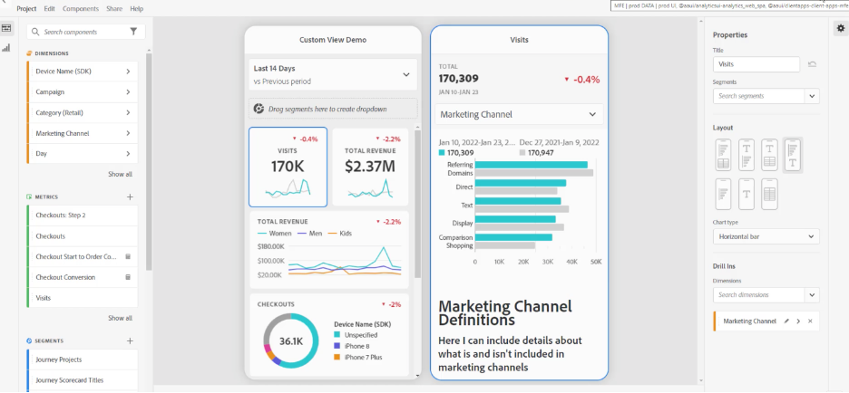
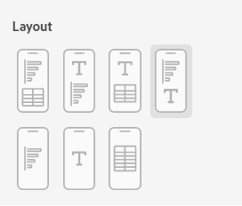
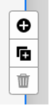
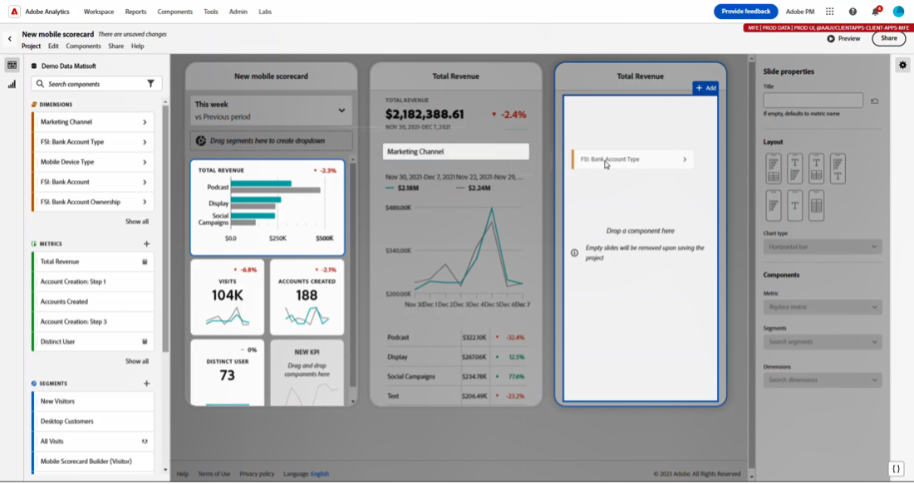

# Gestire le scorecard

Questo argomento spiega ai curatori di dati di Customer Journey Analytics come visualizzare e gestire gli elementi delle scorecard.

## Visualizzare e configurare le proprietà delle sezioni {#tiles}

Quando fai clic su una sezione nel generatore di scorecard, la barra di destra mostra le proprietà e le caratteristiche associate a quella sezione e alla relativa diapositiva di dettaglio. In questa barra puoi fornire un nuovo **Titolo** per il riquadro e in alternativa configurare il riquadro applicando dei filtri. I segmenti sono filtri nel Customer Journey Analytics.

## Visualizza diapositive di dettaglio {#view-detail-slides}

Quando si fa clic su un riquadro, un pop-up dinamico mostra come la diapositiva di dettaglio apparirà all’utente esecutivo nell’app. Puoi aggiungere dimensioni per suddividere i dati in base alle tue esigenze specifiche. Se non è stata applicata alcuna dimensione, la dimensione del raggruppamento sarà di **ore** o **giorni**, a seconda dell’intervallo date predefinito.

I raggruppamenti consentono di perfezionare l’analisi suddividendo le metriche per elementi dimensionali come i seguenti:

* Metrica Visitatori univoci suddivisa per piattaforma di annunci (AMO ID)
* Visite suddivise per categoria di prodotto (al dettaglio)
* Entrate totali suddivise per nome prodotto

Ogni dimensione aggiunta alla sezione viene visualizzata in un elenco a discesa nella vista dettagliata dell’app. L’utente esecutivo può quindi scegliere tra le opzioni elencate nell’elenco a discesa.

## Personalizzare le diapositive di dettaglio {#customize-detail-slide}

Le diapositive di dettaglio personalizzate consentono di essere ancora più mirati sulle informazioni condivise con il pubblico.

>[!VIDEO](https://video.tv.adobe.com/v/3410002)

È possibile modificare il layout di ogni diapositiva di dettaglio e aggiungere un testo per spiegare meglio ciò che l’utente finale può visualizzare nei dati. È inoltre possibile modificare il tipo di grafico utilizzando il menu a discesa.

### Modificare il layout della diapositiva

Puoi modificare il layout della diapositiva per concentrarti sulle informazioni più importanti. Ad esempio, puoi modificare il layout per visualizzare solo un grafico o una tabella. Per modificare il layout della diapositiva, seleziona uno dei formati predefiniti.

Puoi anche modificare il layout della diapositiva trascinando i componenti per la visualizzazione dalla barra a sinistra nell’area di lavoro. Ciascuna diapositiva di dettaglio può contenere solo due visualizzazioni alla volta.

### Aggiungere testo descrittivo a una diapositiva

È possibile aggiungere un testo per fornire informazioni significative su ciò che è contenuto nei grafici oppure dettagli sui dati.

Per aggiungere testo a una diapositiva di dettaglio, seleziona un layout che mostri il simbolo `T` oppure trascina il componente della Visualizzazione testo dalla barra a sinistra. Quando si aggiunge una nuova visualizzazione di testo oppure si sceglie un layout di diapositiva con testo, l’editor di testo si apre automaticamente. L’editor di testo fornisce tutte le opzioni standard per la formattazione del testo. È possibile applicare stili di testo quali paragrafi, intestazioni e sottotitoli e applicare font in grassetto e corsivo. È possibile giustificare il testo, aggiungere elenchi puntati e numerati e aggiungere collegamenti. Al termine della modifica, seleziona il pulsante Riduci a icona nell’angolo superiore a destra dell’editor di testo per chiuderlo. Per modificare il testo già aggiunto, seleziona l’icona a forma di matita per aprire nuovamente l’editor di testo.

## Rimuovere i componenti {#remove}

Allo stesso modo, per rimuovere un componente applicato all’intera scorecard, fai clic in qualsiasi punto della scorecard al di fuori delle tessere, quindi fai clic su **x** che viene visualizzato quando passi il cursore sul componente, come mostrato di seguito per **Prime visite**:

## Creare presentazioni di dati {#create-data-story}

Una presentazione di dati è una raccolta di punti dati di supporto, contesto aziendale e metriche correlate basata su un tema o una metrica centrale.

Ad esempio, se ti concentri sul traffico web, la metrica più importante può essere costituita dalle visite, ma potresti anche essere interessato a nuove persone e a persone univoche, e potresti voler visualizzare i dati suddivisi per pagina web o per tipo di dispositivo da cui proviene il traffico. Le presentazioni di dati nei progetti di scorecard per dispositivi mobili ti consentono di mettere le metriche più importanti al centro e in primo piano presentando il significato complessivo dietro le metriche con più diapositive di dettaglio.

Per ulteriori informazioni sulla creazione di presentazioni di dati nei progetti di scorecard per dispositivi mobili in Analysis Workspace, guarda questo video.

>[!VIDEO](https://video.tv.adobe.com/v/3416392/?quality=12&learn=on)

**Per creare una storia di dati** {#data-story-create}

Crea la presentazione di dati aggiungendo più diapositive di dettaglio a una sezione.

1. Inizia con un progetto di scorecard per dispositivi mobili.
1. Seleziona una sezione da cui desideri creare una presentazione.
   
   {width=".50%"}
1. Aggiungi le diapositive per creare una presentazione di dati personale. La prima diapositiva viene generata per impostazione predefinita.
Per aggiungere nuove diapositive, passa il cursore del mouse oppure fai clic su una diapositiva, quindi seleziona una delle opzioni disponibili:
   * Tocca il segno + per creare una nuova diapositiva.
   * Tocca l’icona Duplica per duplicare la diapositiva esistente.
1. Se crei una diapositiva vuota, trascina i componenti dalla barra a sinistra oppure scegli un layout per popolare automaticamente la diapositiva con i dati della sezione.
   
Per eliminare una diapositiva, tocca l’icona del cestino.

### Personalizzare una presentazione di dati {#customize-data-story}

Le presentazioni di dati sono interamente personalizzabili, per condividere le informazioni che desideri ed escludere tutto quello che non ti serve. Puoi personalizzare le sezioni e le singole diapositive per aggiungere filtri, mostrare suddivisioni, modificare il layout e cambiare le visualizzazioni.

**Personalizzazione delle sezioni**

1. Tocca una sezione. La sezione selezionata è evidenziata in blu e il pannello a destra mostra le Proprietà della sezione.
1. Modifica il titolo, il tipo di grafico e altre opzioni della sezione.
1. Trascina un componente sulla sezione.
   
Quando trascini un componente, ad esempio una visualizzazione, su una sezione, il componente viene applicato a tutte le diapositive della presentazione di dati.
1. Per applicare una modifica solo al titolo, tieni premuto il tasto Maiusc per applicarla.
   

>[!NOTE]
>Le diapositive ereditano i componenti dalla sezione, ma le sezioni non ereditano i componenti dalle diapositive.

**Personalizzazione di singole diapositive**

È possibile modificare la visualizzazione per singole diapositive di una presentazione di dati. Ad esempio, puoi trasformare una barra orizzontale in un grafico ad anello per una diapositiva specifica. Puoi anche modificare il layout. Consulta [Personalizzare le diapositive in dettaglio](#customize-detail-slide).

### Anteprima di una presentazione di dati {#preview-data-story}

Dopo aver creato una presentazione di dati, utilizza il pulsante **Anteprima** per visualizzare e interagire con essa come se fossi un utente dell’app. Per informazioni sull’anteprima della presentazione di dati, consulta [Anteprima di una scorecard](#preview)

### Spostarsi tra sezioni e diapositive {#navigate-tiles-slides}

Nella barra di navigazione sono visualizzate icone che rappresentano gli elementi presenti in ciascuna diapositiva. La barra di navigazione facilita il passaggio a una diapositiva specifica se sono presenti molte diapositive.

Per spostarsi tra la sezione e le diapositive, tocca la barra di navigazione.

{width="45%"}

Puoi anche spostarti avanti e indietro utilizzando le frecce sulla tastiera oppure selezionando un componente e tenendolo a sinistra o a destra dello schermo per scorrere.

## Anteprima scorecard {#preview}

Puoi visualizzare in anteprima come si presenterà e funzionerà una scorecard una volta pubblicata nell’app delle dashboard di Adobe Analytics.

1. Fai clic su **[!UICONTROL Preview]** in alto a destra.

   

1. Per visualizzare come si presenta la scorecard su dispositivi diversi, seleziona un dispositivo dal menu a discesa [!UICONTROL Device preview].

   

1. Per interagire con l’anteprima:

   * Fai clic con il pulsante sinistro del mouse per simulare il tocco sullo schermo del telefono.

   * Utilizza la funzione di scorrimento del computer per simulare lo scorrimento dello schermo del telefono con un dito.

   * Fai clic e tieni premuto per simulare la pressione del dito sullo schermo del telefono. Questo è utile per interagire con le visualizzazioni nella vista dettagliata.

## Condividere le scorecard {#share}

Per condividere la scorecard con un utente direzionale:

1. Fai clic sul menu **[!UICONTROL Share]** e seleziona **[!UICONTROL Share scorecard]**.

1. Nel modulo **[!UICONTROL Share Mobile Scorecard]**, compila i campi:

   * Inserimento del nome della scorecard
   * Inserimento di una descrizione della scorecard
   * Aggiungendo tag rilevanti
   * Specificare i destinatari della scorecard

1. Fai clic su **[!UICONTROL Share]**.

Dopo che hai condiviso una scorecard, i destinatari possono accedervi sulle loro dashboard di Analytics. Se apporti successive modifiche alla scorecard nel generatore di scorecard, queste verranno automaticamente aggiornate nella scorecard condivisa. Gli utenti direzionali vedranno quindi le modifiche dopo aver aggiornato la scorecard nella loro app.

Se aggiorni la scorecard aggiungendo nuovi componenti, ti consigliamo di condividerla nuovamente (e di selezionare l’opzione **[!UICONTROL Share embedded components]**) per assicurarti che gli utenti direzionali abbiano accesso a queste modifiche.

### Condividere le scorecard mediante un collegamento condivisibile

L’utilizzo di un collegamento condivisibile semplifica la condivisione di una scorecard in un’app e-mail, documento o SMS. Il collegamento condivisibile consente ai destinatari di aprire la scorecard sul desktop o sull’app mobile delle dashboard. I collegamenti profondi condivisibili consentono di condividere i progetti in modo ancora più semplice e di aumentare il coinvolgimento delle parti interessate.

Per condividere una scorecard utilizzando un collegamento condivisibile

1. Fai clic sul menu **[!UICONTROL Share]** e seleziona **[!UICONTROL Share scorecard]**.

   

1. Copia il collegamento e incollalo in un’e-mail, in un documento o in un’app di messaggistica istantanea.

   Quando un destinatario utilizza un’app desktop o un browser per aprire il collegamento, il progetto della scorecard per dispositivi mobili si aprirà in Workspace.

   Quando un destinatario apre il collegamento su un dispositivo mobile, la scorecard si apre direttamente nell’app delle dashboard di Adobe Analytics.

   Se un destinatario non ha scaricato l’app mobile, verrà indirizzato all’inserzione dell’app nell’App Store o Google Play Store dove può scaricarla.

## Rimuovere l’elemento di dimensione [!UICONTROL Unspecified] {#remove-dims}

Se desideri rimuovere dai dati gli elementi di dimensione [!UICONTROL Unspecified], effettua le seguenti operazioni:

1. Seleziona la sezione corretta.
1. Nella barra a destra, sotto **[!UICONTROL Drill ins]**, seleziona la freccia destra accanto all’elemento di dimensione di cui vuoi rimuovere gli elementi **[!UICONTROL Unspecified]**.

   

1. Fai clic sull’icona accanto a **[!UICONTROL Unspecified]** per rimuovere i dati non specificati dalle attività di reporting. È inoltre possibile rimuovere qualsiasi altro elemento di dimensione.

## Visualizzare sottotitoli intelligenti nelle scorecard

Grazie ai sottotitoli intelligenti, i non analisti possono interpretare meglio i propri dati senza l’aiuto degli analisti. I sottotitoli intelligenti utilizzano l’apprendimento automatico avanzato e l’intelligenza artificiale generativa per fornire informazioni preziose sul linguaggio naturale per le visualizzazioni.

Per visualizzare i sottotitoli intelligenti:

1. Fai clic su una tessera.

1. altro