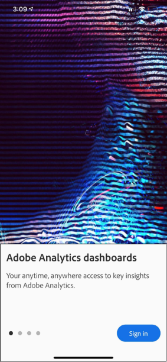
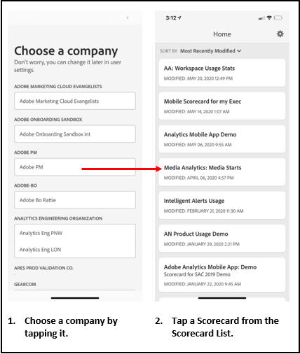
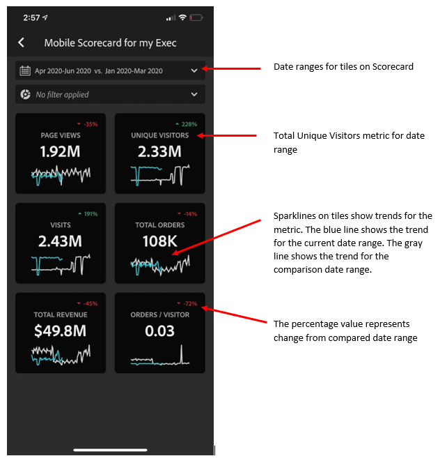
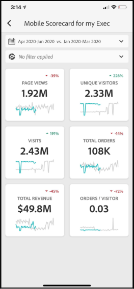
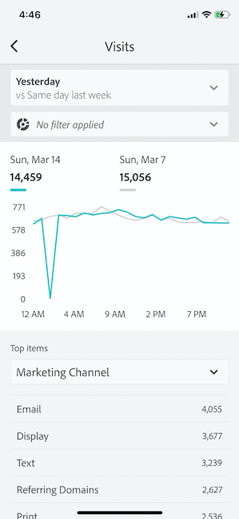
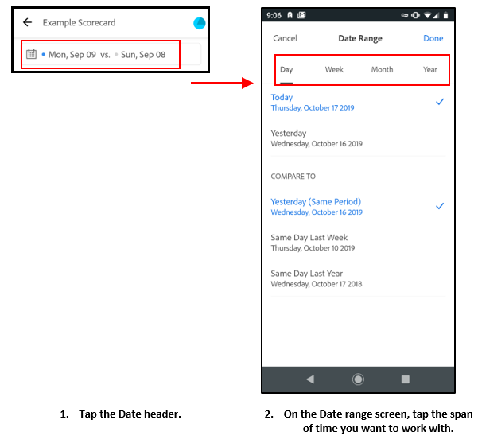
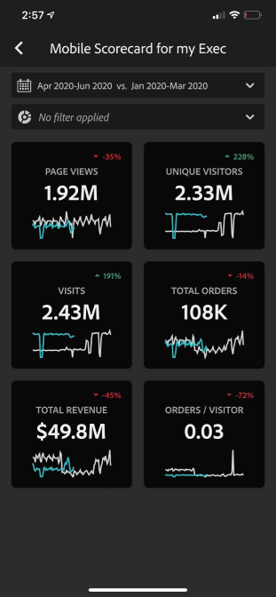
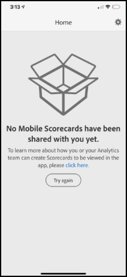

# Impostare gli utenti direzionali per l’utilizzo delle dashboard

In alcuni casi, gli utenti direzionali potrebbero aver bisogno di ulteriore assistenza per accedere all’app e utilizzarla. Questa sezione offre informazioni per aiutare i curatori a fornire tale assistenza.

## Assicurarsi che gli utenti dell’app abbiano accesso ad Adobe Analytics

1. Configurare nuovi utenti in [CX Enterprise Admin Console](https://experienceleague.adobe.com/docs/analytics/admin/admin-console/permissions/product-profile.html?lang=it).

1. Per poter condividere le scorecard, devi concedere agli utenti dell’app le autorizzazioni di accesso ai componenti delle scorecard come Analysis Workspace, alle visualizzazioni dati su cui sono basate le scorecard, nonché ai segmenti, alle metriche e alle dimensioni.

## Prerequisiti di sistema per gli utenti dell’app

Per garantire che gli utenti direzionali possano accedere alle scorecard nell’app, assicurati che:

* Il sistema operativo per dispositivi mobili sui loro dispositivi sia iOS versione 10 o superiore o Android versione 4.4 (KitKat) o superiore.
* Abbiano un accesso valido a Customer Journey Analytics.
* Le scorecard per dispositivi mobili a essi destinate siano state correttamente create e condivise.
* Abbiano accesso ai Componenti che la scorecard include. Tieni presente che puoi selezionare un&#39;opzione quando condividi le scorecard per **[!UICONTROL Condividere componenti incorporati]**.

## Aiutare i dirigenti a scaricare e installare l’app

>[!NOTE]
>
>Anche se l’app mobile è denominata dashboard di Adobe Analytics nell’app store, può essere utilizzata in egual misura con le scorecard per dispositivi mobili Customer Journey Analytics.

**Per gli utenti direzionali su iOS:**

Fare clic sul seguente collegamento (disponibile anche in Customer Journey Analytics in **[!UICONTROL Strumenti]** > **[!UICONTROL Dashboard di Analytics (opp mobile)]**) e seguire le istruzioni per scaricare, installare e aprire l&#39;app:

`[iOS link](https://apple.co/2zXq0aN)`

**Per gli utenti direzionali su Android:**

Fare clic sul seguente collegamento (disponibile anche in Customer Journey Analytics in **[!UICONTROL Strumenti]** > **[!UICONTROL Dashboard di Analytics (app mobile)]**) e seguire le istruzioni per scaricare, installare e aprire l&#39;app:

`[Android link](https://bit.ly/2LM38Oo)`

Una volta scaricata e installata, gli utenti esecutivi possono accedere all’app utilizzando le loro credenziali esistenti di Customer Journey Analytics; supportiamo sia gli ID Adobe che Enterprise ID e Federated ID.

## Aiutare i dirigenti ad accedere alla scorecard

1. Chiedi agli utenti direzionali di accedere all’app.

   Viene visualizzata la schermata **[!UICONTROL Scegli un&#39;azienda]**. Questa schermata elenca le aziende di accesso a cui appartiene l’utente direzionale.

1. Chiedi loro di toccare il nome della società di accesso o dell’organizzazione CX Enterprise applicabile alla scorecard condivisa.

   Vengono quindi elencate tutte le scorecard che sono state condivise con l’utente direzionale per l’azienda con cui è stato eseguito l’accesso.

1. Chiedi loro di ordinare l&#39;elenco in base a **[!UICONTROL Modificato più di recente]**, se applicabile.

1. Chiedi loro di toccare il nome della scorecard per visualizzarla.

   

### Spiegare l’interfaccia utente della scorecard

Spiega all’utente direzionale come appaiono le sezioni nelle scorecard condivise.

Ulteriori informazioni sulle sezioni:

* La granularità dei grafici sparkline dipende dalla lunghezza dell’intervallo date:
* Un giorno mostra una tendenza oraria
   * Più di un giorno e meno di un anno mostra una tendenza giornaliera.
   * Un anno o più mostra una tendenza settimanale.
   * La formula della variazione percentuale del valore è metrica totale (intervallo date attuale) – metrica totale (intervallo date di confronto)/metrica totale (intervallo date di confronto).
   * È possibile trascinare lo schermo verso il basso per aggiornare la scorecard.

1. Tocca una sezione per mostrare come funziona un raggruppamento dettagliato della sezione.

   

   * Tocca un punto qualsiasi di una sparkline per visualizzare i dati associati a tale punto sulla linea.

   * È inclusa una tabella per visualizzare i dati delle dimensioni aggiunte alla sezione. Tocca la freccia giù per selezionare le dimensioni. Se non è stata aggiunta alcuna dimensione alla sezione, nella tabella vengono visualizzati i dati relativi al grafico.

1. Per modificare gli intervalli di date per la scorecard, tocca l’intestazione Data e seleziona la combinazione di intervalli di date principali e di confronto che desideri visualizzare.

   

## Modificare le preferenze dell’app

Per modificare le preferenze, tocca l’opzione **[!UICONTROL Preferences]** mostrata sopra. Nelle preferenze, puoi attivare l’accesso biometrico oppure la modalità scura dell’app come illustrato di seguito:

## Risoluzione dei problemi

Se l’utente direzionale effettua l’accesso e vede un messaggio che dice che non è stato condiviso nulla:

* L’utente direzionale potrebbe aver selezionato la sandbox di Customer Journey Analytics sbagliata oppure
* la scorecard potrebbe non essere stata condivisa con l’utente direzionale.

Verifica che l’utente manageriale possa accedere alla sandbox Customer Journey Analytics corretta e che la scorecard sia stata condivisa.
