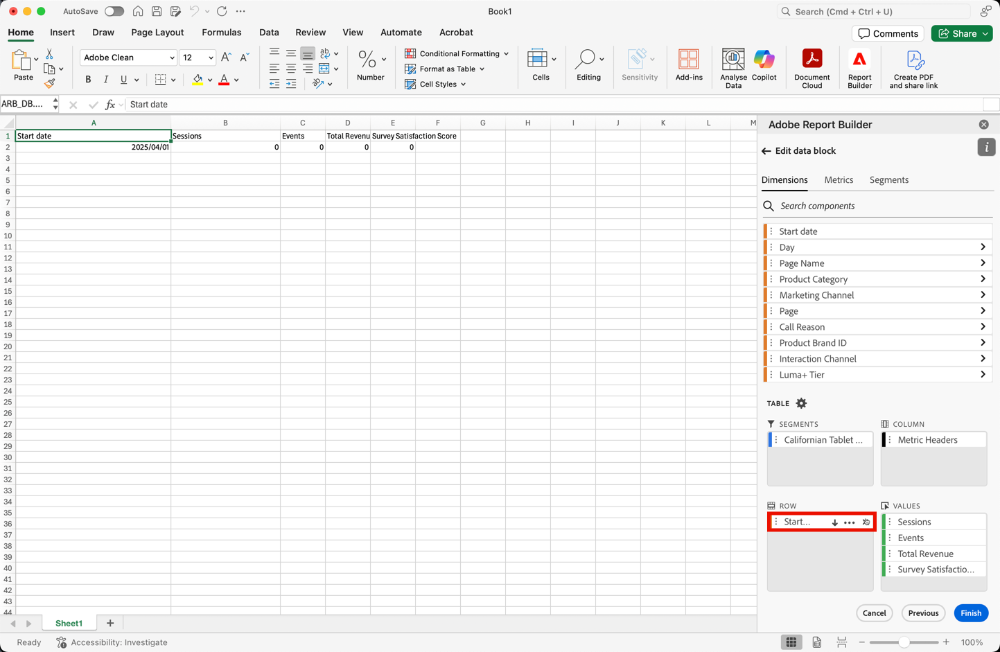
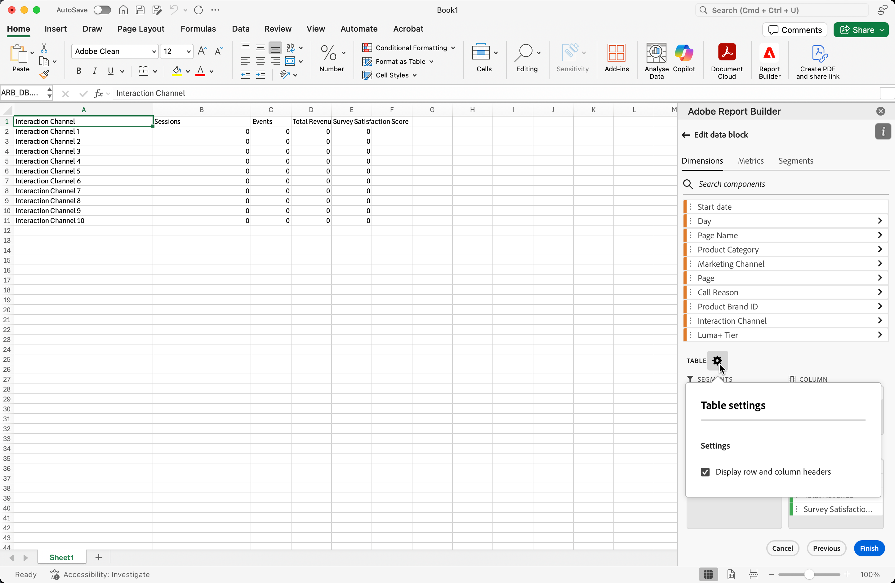

# Creare un blocco di dati

Un *blocco di dati* è la tabella di dati creata da una singola richiesta di dati. Una cartella di lavoro di Report Builder può contenere più blocchi di dati. Quando crei un blocco di dati, configura prima il blocco di dati e quindi lo genera.

## Configurare il blocco di dati

Configura i parametri iniziali dei blocchi di dati per la posizione del blocco di dati, le visualizzazioni dati e un intervallo di date.

1. Seleziona  **[!UICONTROL Crea]**.

   {zoomable="yes"}

1. Imposta il **[!UICONTROL percorso blocco dati]**.

   L&#39;opzione Posizione blocco dati definisce la posizione del foglio di lavoro in cui Report Builder aggiunge i dati al foglio di lavoro.

   Per specificare il percorso del blocco di dati, selezionare una singola cella nel foglio di lavoro o immettere un indirizzo di cella, ad esempio `a3`, `\\\$a3`, `a\\\$3` o `sheet1!a2`. La cella specificata diventa l&#39;angolo superiore sinistro del blocco di dati quando i dati vengono recuperati.

   Utilizza  per scegliere una posizione di blocco di dati dalla cella selezionata corrente nel foglio.

1. Scegli le **[!UICONTROL Visualizzazioni dati]**.

   L’opzione Visualizzazioni dati consente di scegliere una visualizzazione dati da un menu a discesa o di fare riferimento a una visualizzazione dati da una posizione cella.

   Selezionare  per creare una visualizzazione dati da una cella.

1. Imposta l&#39;**[!UICONTROL intervallo di date]**.

   L&#39;opzione **[!UICONTROL Intervallo date]** consente di scegliere un intervallo di date. Gli intervalli di date possono essere fissi o continui.

   Seleziona **[!UICONTROL Calendario]** per scegliere un intervallo di dati utilizzando  oppure immetti manualmente un intervallo di date. È possibile scegliere un predefinito dal menu a discesa **[!UICONTROL _Predefiniti di ricerca_]**.

   Selezionare **[!UICONTROL Dalla cella]** per definire i dati iniziali e finali in base a una cella del foglio corrente.

   Per informazioni sulle opzioni dell&#39;intervallo di date, vedere [Selezionare un intervallo di date](select-date-range.md).

1. Seleziona **[!UICONTROL Avanti]**.

   

   Dopo aver configurato il blocco di dati, puoi selezionare dimensioni, metriche e segmenti per crearlo. Le schede **[!UICONTROL Dimensioni]**, **[!UICONTROL Metriche]** e **[!UICONTROL Segmenti]** sono visualizzate sopra il riquadro **[!UICONTROL Tabella]**.

## Creare il blocco di dati

Per creare il blocco di dati, seleziona i componenti del rapporto, quindi personalizza il layout.

1. Aggiungi i componenti **[!UICONTROL Dimensioni]**, **[!UICONTROL Metriche]** e **[!UICONTROL Segmenti]**.

   Scorrere gli elenchi dei componenti o utilizzare il campo  **[!UICONTROL _Cerca componenti_]** per individuare i componenti. Trascina i componenti nel riquadro [!UICONTROL Tabella] oppure seleziona due volte il nome di un componente nell&#39;elenco per aggiungerlo al riquadro [!UICONTROL Tabella].

   Selezionate due volte un componente per aggiungerlo a una sezione di default della tabella.

   - I componenti Dimension vengono aggiunti alla sezione  **[!UICONTROL Row]** o alla sezione  **[!UICONTROL Column]** se è già presente una dimensione nelle colonne.
   - Componenti data aggiunti alla sezione  **[!UICONTROL Column]**.
   - I componenti del segmento vengono aggiunti alla sezione  **[!UICONTROL Segmenti]**.
   - I componenti delle metriche vengono aggiunti alla sezione  **[!UICONTROL Values]**.

1. Disporre gli elementi nel riquadro Tabella per personalizzare il layout del blocco di dati.

   Trascina e rilascia i componenti all&#39;interno di ogni elenco nel riquadro Tabella per riordinare i componenti o seleziona  e seleziona  Sposta su,  Sposta giù e altro per spostare i componenti all&#39;interno di un elenco.

   Quando si aggiungono componenti alla tabella, nella posizione del blocco di dati nel foglio di lavoro viene visualizzata un&#39;anteprima del blocco di dati. Il layout dell’anteprima dei blocchi di dati viene aggiornato automaticamente quando aggiungi, sposti o rimuovi elementi nella tabella.

   

1. È possibile impostare **[!UICONTROL Data inizio]** come dimensione per identificare la data di inizio del blocco di dati. L’aggiunta di dati di inizio come dimensione è utile se disponi di un rapporto pianificato regolarmente con un intervallo di date continuo. Oppure, se hai un intervallo di date non convenzionale e devi essere esplicito sulla data di inizio.

   

1. È possibile visualizzare o nascondere le intestazioni di riga e di colonna. A tale scopo, effettua le seguenti operazioni:

   1. Selezionare l&#39;icona Impostazioni **[!UICONTROL Tabella]** .

      

   1. Selezionare o deselezionare l&#39;opzione **[!UICONTROL Visualizza intestazioni di riga e di colonna]**. Le intestazioni vengono visualizzate per impostazione predefinita.

1. Facoltativamente, puoi anche nascondere o mostrare le etichette delle dimensioni e le intestazioni delle metriche. A tale scopo, effettua le seguenti operazioni:

   1. Seleziona  nell&#39;etichetta della dimensione o nell&#39;intestazione della colonna per visualizzare il menu di scelta rapida.

      

   1. Seleziona  **[!UICONTROL Hide]** o  **[!UICONTROL Show]** per attivare/disattivare l&#39;etichetta della dimensione o l&#39;intestazione della colonna. Tutte le etichette sono visualizzate per impostazione predefinita.

1. Seleziona **[!UICONTROL Fine]** per completare la configurazione del blocco di dati.

1. Durante il recupero dei dati di analisi viene visualizzato un messaggio di elaborazione **[!UICONTROL #BUSY]**.

   

1. Report Builder recupera i dati e visualizza il blocco di dati completato nel foglio di lavoro.

   

>[!MORELIKETHIS]
>
>[Selezionare una visualizzazione dati](select-data-view.md)
>[Seleziona un intervallo di date](select-date-range.md)
>[Filtra dimensioni](filter-dimensions.md)
>[Operazioni con i segmenti](work-with-filters.md)
>
