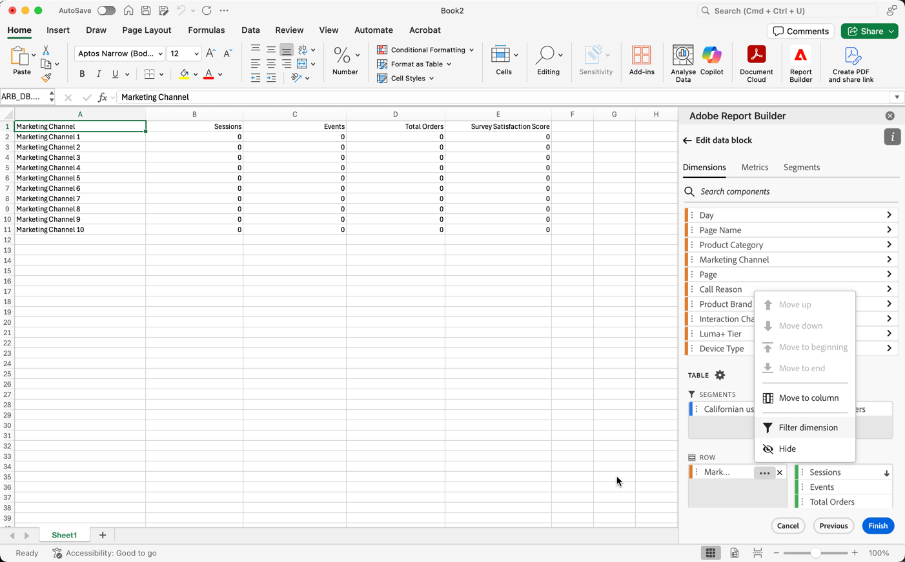
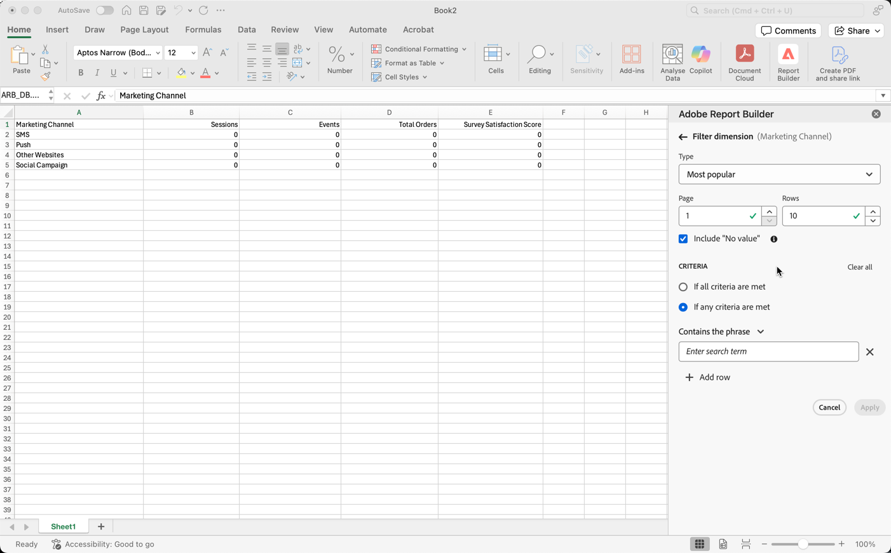
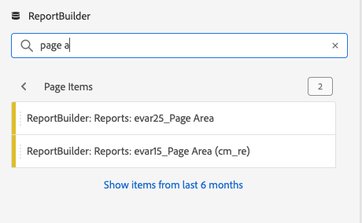
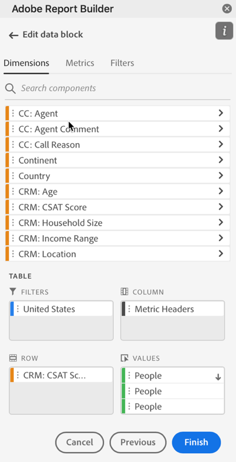

# Dimension filtro

Per impostazione predefinita, ogni elemento dimensionale nella tabella restituisce i primi 10 elementi per tale dimensione.

Per modificare gli elementi dimensionali restituiti per ogni dimensione

1. Selezionare un blocco di dati e fare clic su Modifica blocco di dati nel pannello COMANDI.

1. Fare clic su Avanti per visualizzare la scheda Dimension.

1. Fai clic su **...Icona** accanto al nome di un componente nella tabella.

   

1. Selezionare **Filtra dimensione** nel menu a comparsa per visualizzare il riquadro **Filtra dimensione**.

1. Seleziona **Più popolare** o **Specifico**.

   

1. Selezionare le opzioni appropriate in base al tipo di filtro scelto.

1. Fai clic su **Applica** per aggiungere il filtro.

   In Report Builder viene visualizzata una notifica per confermare il filtro aggiunto.

Per visualizzare i filtri applicati, passa il cursore del mouse su una dimensione. I Dimension con filtri applicati visualizzano un’icona di filtro a destra del nome del Dimension.

## Tipo filtro

Esistono due modi per filtrare gli elementi dimensionali: Più popolare e specifico.

## Più popolari

L’opzione Più comune consente di filtrare dinamicamente gli elementi dimensionali in base ai valori delle metriche. Il filtro più comune restituisce gli elementi dimensionali con classificazione più elevata in base ai valori delle metriche. Per impostazione predefinita, sono elencati i primi 10 elementi dimensionali, ordinati per la prima metrica aggiunta al blocco di dati.

### Opzioni Pagina e righe

Utilizza i campi **Pagina** e **Righe** per suddividere i dati in gruppi o pagine sequenziali. Questo ti consente di inserire nel rapporto valori di riga classificati diversi dai valori principali. Questa funzione è particolarmente utile per richiamare dati oltre il limite di 50.000 righe.

#### Valori predefiniti per pagina e righe

- Pagina = 1
- Righe = 10

Le impostazioni predefinite Pagina e Righe identificano che ogni pagina contiene 10 righe di dati. La pagina 1 restituisce i primi 10 elementi, la pagina 2 restituisce i successivi 10 elementi e così via.

Nella tabella seguente sono riportati alcuni esempi di valori di pagina e riga e dell’output risultante.

| Pagina | Riga | Uscita |
|------|--------|----------------------|
| 1 | 10 | Primi 10 elementi |
| 2 | 10 | Voci da 11 a 20 |
| 1 | 100 | Primi 100 elementi |
| 2 | 100 | Voci 101-200 |
| 2 | 50.000 | Articoli 50.001-100.000 |

#### Valori minimi e massimi

- Pagina iniziale: Min = 1, Max: 50 milioni
- Numero di righe: Min = 1, Max: 50.000

### Includi &quot;Nessun valore&quot;

Al Customer Journey Analytics, alcune dimensioni raccolgono una voce &quot;nessun valore&quot;. Questo filtro ti consente di escludere questi valori dai rapporti. Ad esempio, puoi creare una classificazione come la classificazione Nome prodotto in base al codice SKU del prodotto. Se uno SKU di prodotto specifico non è stato impostato con la sua classificazione specifica Nome prodotto, il suo valore Nome prodotto è impostato su &quot;nessun valore&quot;.

Include &quot;**Nessun valore**&quot; è selezionato per impostazione predefinita. Deseleziona questa opzione per escludere le voci prive di valore.

### Filtra per criterio

Puoi filtrare gli elementi dimensionali in base al fatto che siano soddisfatti tutti i criteri o se siano soddisfatti eventuali criteri.

Per impostare criteri di filtro

1. Seleziona un operatore dall’elenco a discesa.

   

1. Immetti un valore nel campo di ricerca.

1. Fai clic su Aggiungi riga per confermare la selezione e aggiungere un altro elemento di criteri.

1. Fai clic sull’icona Elimina per rimuovere un elemento del criterio.

   Puoi includere fino a 10 elementi di criteri.

### Modificare il filtro e l’ordinamento

Accanto alla metrica utilizzata per filtrare e ordinare il blocco di dati viene visualizzata una freccia. La direzione della freccia indica se la metrica è ordinata dal valore maggiore al valore minore o minore al valore maggiore.

Per modificare l’ordinamento, fai clic sulla freccia accanto alla metrica. 

Per modificare la metrica utilizzata per filtrare e ordinare il blocco di dati,

1. Passa il puntatore del mouse sul componente di metrica desiderato nel Generatore di tabelle per visualizzare altre opzioni.

2. Fai clic sulla freccia sulla metrica preferita. 

   

## Filtro specifico

L’opzione Specifica consente di creare un elenco fisso di elementi dimensionali per ogni dimensione. Utilizza il tipo di filtro **Specifico** per specificare gli elementi dimensionali esatti da includere nel filtro. È possibile selezionare gli elementi da un elenco o da un intervallo di celle.

### Dall’elenco

1. Selezionare l&#39;opzione **Dall&#39;elenco** per cercare e selezionare gli elementi dimensionali.

   Quando selezioni l’opzione **Dall’elenco**, l’elenco viene compilato con gli elementi dimensionali con il maggior numero di eventi.

   

   L’elenco **Elementi disponibili** è ordinato dagli elementi dimensionali con il maggior numero di eventi a quelli con il minor numero di eventi.

1. Immetti un termine di ricerca nel campo **Aggiungi elemento** per cercare l&#39;elenco.

1. Per cercare un elemento non incluso negli ultimi 90 giorni di dati, fai clic su **Mostra elementi per gli ultimi 6 mesi** per estendere la ricerca.

   

   Dopo il caricamento dei dati degli ultimi sei mesi, il Report Builder aggiorna il collegamento a **Mostra elementi per gli ultimi 18 mesi**.

1. Seleziona un elemento della dimensione.

   Gli elementi dimensionali selezionati vengono aggiunti automaticamente all&#39;elenco **Elementi selezionati** .

   

   Per eliminare un elemento dall’elenco, fare clic sull’icona Elimina per rimuoverlo dall’elenco.

   Per spostare un elemento nell’elenco, trascinalo o fai clic su ... per visualizzare il menu di spostamento.

   

1. Fai clic su **Applica**

   Il Report Builder aggiorna l’elenco per mostrare il filtro specifico applicato.

### Da intervallo di celle

Selezionare l&#39;opzione **Dall&#39;intervallo di celle** per scegliere un intervallo di celle contenente l&#39;elenco di elementi dimensionali da abbinare.

Quando selezioni un intervallo di celle, considera le seguenti restrizioni:

- L&#39;intervallo deve avere almeno una cella.
- L&#39;intervallo non può avere più di 50.000 cellule.
- L&#39;intervallo deve trovarsi in una singola riga o colonna ininterrotta.

La selezione può contenere celle vuote o celle con valori che non corrispondono a un elemento dimensione specifico.

### Dalla scheda Dimension nel Generatore di tabelle

Dalla scheda **Dimension** , fai clic sull’icona freccia accanto al nome di una dimensione per visualizzare l’elenco degli elementi dimensionali.

Puoi trascinare e rilasciare elementi nella tabella **Tabella** oppure fare doppio clic sul nome di un elemento per aggiungerlo al generatore **Tabella**.
