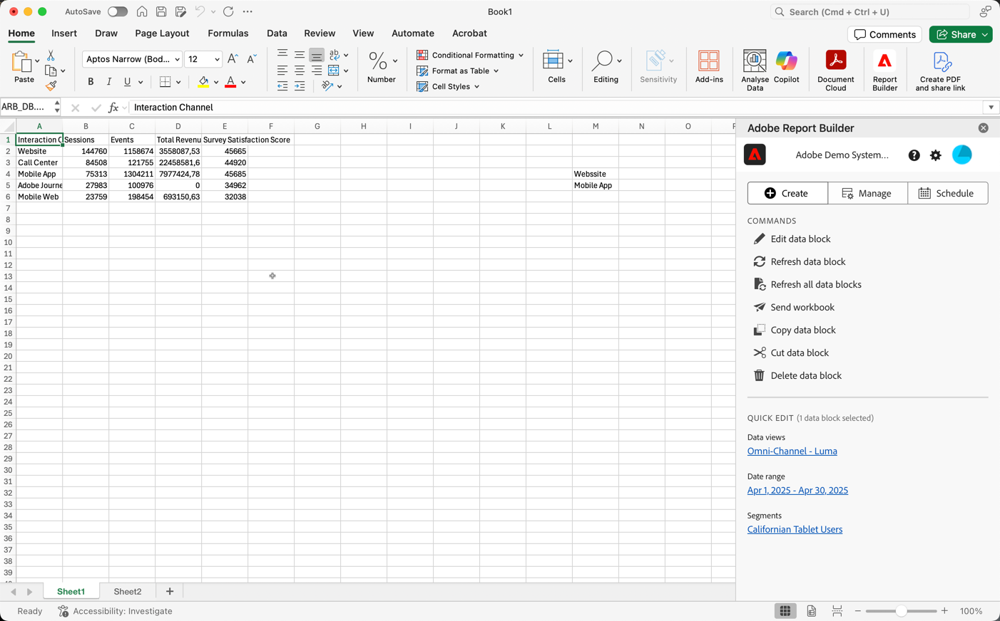

# Hub Report Builder

L&#39;hub Report Builder è il riquadro destro visualizzato nella cartella di lavoro di Excel quando si seleziona  **[!UICONTROL Report Builder]** dalla barra multifunzione di Excel.

Utilizza l’hub Report Builder per creare, aggiornare, eliminare e gestire i blocchi di dati.

L&#39;hub Report Builder contiene i pulsanti  **[!UICONTROL Create]**,  **[!UICONTROL Manage]** e  **[!UICONTROL Schedule]**, il pannello **[!UICONTROL Commands]** e il pannello **[!UICONTROL Quick edit]**.

{zoomable="yes"}

Seleziona

*  **[!UICONTROL Crea]** per [creare nuovi blocchi di dati](create-a-data-block.md).
*  **[!UICONTROL Manage]** per [gestire blocchi di dati esistenti](manage-reportbuilder.md).
*  **[!UICONTROL Pianifica]** per [gestire le pianificazioni per inviare la cartella di lavoro tramite e-mail](schedule-reportbuilder.md).

## Pannello Comandi

Utilizza il pannello **[!UICONTROL Comandi]** per accedere a comandi compatibili con le celle selezionate o con un&#39;azione precedente.

| Comandi | Quando è disponibile | Finalità |
|------|------------------|--------|
|  **[!UICONTROL Modifica blocco dati]** | La cella o l’intervallo di celle selezionato fa parte di un solo blocco di dati. | Utilizza per modificare un blocco di dati. |
|  **[!UICONTROL Aggiorna blocco dati]** | La selezione contiene almeno un blocco di dati. Il comando aggiorna solo i blocchi di dati nella selezione. | Utilizza per aggiornare uno o più blocchi di dati. |
|  **[!UICONTROL Aggiorna tutti i blocchi di dati]** | La cartella di lavoro contiene uno o più blocchi di dati. | Utilizzare per aggiornare tutti i blocchi di dati nella cartella di lavoro |
|  **[!UICONTROL Invia cartella di lavoro]** | La cartella di lavoro contiene uno o più blocchi di dati. | Utilizza per [inviare la cartella di lavoro come file tramite e-mail](schedule-reportbuilder.md). |
|  **[!UICONTROL Copia blocco di dati]** | La cella o l’intervallo di celle selezionato fa parte di uno o più blocchi di dati. | Utilizza per copiare un blocco di dati. |
|  **[!UICONTROL Taglia blocco dati]** | La cella o l’intervallo di celle selezionato fa parte di uno o più blocchi di dati. | Utilizza per tagliare un blocco di dati. |
|  **[!UICONTROL Elimina blocco di dati]** | La cella o l’intervallo di celle selezionato fa parte di un solo blocco di dati. | Utilizzare per eliminare un blocco di dati |

## Pannello Quick edit (Modifica rapida)

Quando selezioni uno o più blocchi di dati in un foglio di calcolo, Report Builder visualizza il pannello **[!UICONTROL Modifica rapida]**. Puoi utilizzare il pannello **[!UICONTROL Modifica rapida]** per modificare i parametri in uno o più blocchi di dati contemporaneamente.

Le modifiche apportate quando si utilizzano le sezioni **[!UICONTROL Modifica rapida]** vengono applicate a tutti i blocchi di dati selezionati.

### Visualizzazioni dati

I blocchi di dati estraggono i dati da una visualizzazione dati selezionata. Se più blocchi di dati sono selezionati in un foglio di lavoro e non estraggono dati dalla stessa visualizzazione dati, il collegamento **Visualizzazioni dati** visualizza **[!UICONTROL _Multiple_]**.

Quando modifichi la visualizzazione dati, tutti i blocchi di dati nella selezione adottano la nuova visualizzazione dati. I componenti nel blocco di dati vengono associati alla nuova visualizzazione dati in base all’ID. Se un componente non viene trovato in un blocco di dati, il componente viene rimosso e sostituito con **[!UICONTROL Valore non valido]** oppure viene visualizzato un  per il componente specifico.

Per modificare la visualizzazione dati, selezionare una nuova visualizzazione dati dal menu a discesa **[!UICONTROL Visualizzazione dati]**.

### Intervallo date

**Intervallo date** mostra l’intervallo di date per i blocchi di dati selezionati. Se sono selezionati più blocchi di dati con più intervalli di date, il collegamento **[!UICONTROL Intervallo di date]** visualizza **[!UICONTROL _Multiplo_]**.

### Segmenti

Il collegamento **Segmenti** visualizza un elenco di riepilogo dei segmenti utilizzati dai blocchi di dati selezionati. Se sono selezionati più blocchi di dati con più segmenti applicati, il collegamento **Segmenti** visualizza **[!UICONTROL _Multipli_]**.

>[!MORELIKETHIS]
>
>[Selezionare una visualizzazione dati](select-data-view.md)
>[Selezionare un intervallo di date](select-date-range.md)
>[Utilizzare i filtri](work-with-filters.md)
>
