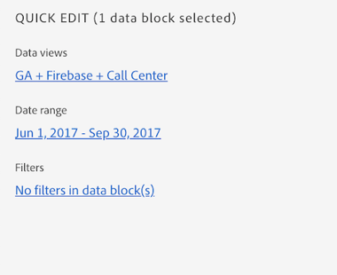

# Hub Report Builder

Utilizza l’hub di Report Builder per creare, aggiornare o eliminare blocchi di dati.

L&#39;hub di Report Builder contiene i pannelli COMANDI e MODIFICA RAPIDA.


## Pannello COMANDI

Utilizzare il pannello COMANDI per accedere ai comandi compatibili con le celle selezionate o con un&#39;azione precedente.


### Comandi

| Comandi visualizzati | Disponibile quando.. | Finalità |
|------|------------------|--------|
| Crea blocco dati | Nella cartella di lavoro è selezionata una o più celle. | Utilizzato per creare un blocco di dati |
| Modifica blocco dati | L’intervallo di celle o celle selezionato fa parte di un solo blocco di dati. | Utilizzato per modificare un blocco di dati |
| Aggiorna blocco dati | La selezione contiene almeno un blocco di dati. Il comando aggiorna solo i blocchi di dati nella selezione. | Utilizzato per aggiornare uno o più blocchi di dati |
| Aggiorna tutti i blocchi di dati | La cartella di lavoro contiene uno o più blocchi di dati. | Utilizzato per aggiornare TUTTI i blocchi di dati nella cartella di lavoro |
| Copia blocco dati | L’intervallo di celle o celle selezionato fa parte di uno o più blocchi di dati. | Utilizzato per copiare un blocco di dati |
| Elimina blocco dati | L’intervallo di celle o celle selezionato fa parte di un solo blocco di dati. | Utilizzato per eliminare un blocco di dati |

## Pannello EDIT rapido

Quando selezioni uno o più blocchi di dati in un foglio di calcolo, in Report Builder viene visualizzato il pannello MODIFICA RAPIDA . Puoi usare il pannello EDIT RAPIDA per modificare i parametri in un singolo blocco di dati o per modificare i parametri in più blocchi di dati contemporaneamente.



Le modifiche apportate utilizzando le sezioni Modifica rapida si applicano a tutti i blocchi di dati selezionati.

### Visualizzazioni dati

I blocchi di dati estraggono i dati da una visualizzazione dati selezionata. Se più blocchi di dati sono selezionati in un foglio di lavoro e non estraggono dati dalla stessa visualizzazione dati, il **Visualizzazioni dati** visualizzazioni di collegamento *Multipli*.

Quando si modifica la visualizzazione dati, tutti i blocchi di dati nella selezione adottano la nuova visualizzazione dati. I componenti nel blocco dati vengono associati alla nuova visualizzazione dati in base, ad esempio, all’ID corrispondente ```evars```). Se un componente non viene trovato in un blocco di dati, viene visualizzato un messaggio di avviso e il componente viene rimosso dal blocco di dati.

Per modificare la visualizzazione dati, selezionare una nuova visualizzazione dati dal menu a discesa.


### Intervallo date

**Intervallo date** mostra l’intervallo di date per i blocchi di dati selezionati. Se sono selezionati più blocchi di dati con più intervalli di date, il **Intervallo date** visualizzazioni di collegamento *Multipli*.

### Filtri

La **Filtri** visualizza un elenco riepilogativo dei filtri utilizzati dai blocchi di dati selezionati. Se sono selezionati più blocchi di dati con più filtri applicati, il **Filtri** visualizzazioni di collegamento *Multipli*.
