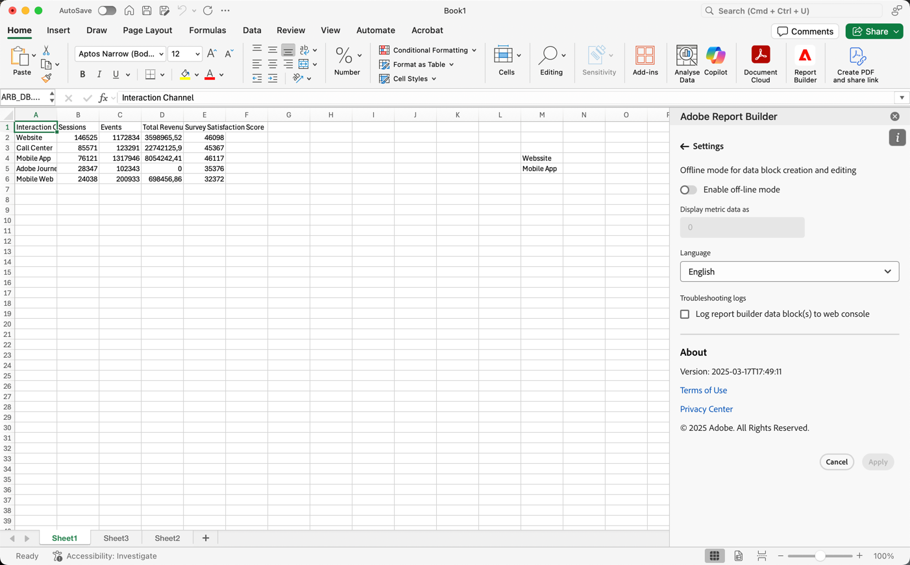

# Impostazioni di Report Builder

Utilizza il riquadro **Impostazioni** per configurare le impostazioni a livello di applicazione, ad esempio la lingua visualizzata dall&#39;interfaccia utente o se utilizzare o meno la modalità offline. Le impostazioni vengono applicate immediatamente e vengono impostate per tutte le sessioni future fino a quando non vengono modificate.

Per modificare le impostazioni di Report Builder

1. Seleziona l&#39;icona **Impostazioni**.

1. Apportare modifiche a [attivazione della modalità offline](#off-line-mode), [selezione di una lingua](#language) o [attivazione della risoluzione dei problemi](#troubleshooting).

1. Seleziona **[!UICONTROL Applica]**.

   {zoomable="yes"}

## Modalità offline

Quando crei e modifichi un blocco di dati in modalità offline, i dati non vengono recuperati. Al contrario, i dati di simulazione vengono utilizzati in modo da poter lavorare rapidamente senza attendere l’esecuzione della richiesta. Quando sei di nuovo online, seleziona  **[!UICONTROL Aggiorna blocco dati]** o  **[!UICONTROL Aggiorna tutti i blocchi dati]** per aggiornare i blocchi dati con i dati effettivi.

Per attivare la modalità offline

1. Seleziona .

1. Attiva **[!UICONTROL Attiva modalità offline]**.

1. Immetti un numero intero positivo nel campo **[!UICONTROL Visualizza dati metrica]** come.

1. Seleziona **[!UICONTROL Applica]**.

## Lingua

È possibile scegliere la lingua per l&#39;interfaccia di Report Builder. Sono disponibili tutte le lingue di Customer Journey Analytics supportate.

Per selezionare la lingua utilizzata nell&#39;interfaccia di Report Builder:

1. Selezionare una lingua dal menu a discesa **[!UICONTROL Lingua]**.

1. Seleziona **Applica.**

## Risoluzione dei problemi

L&#39;impostazione **[!UICONTROL Troubleshooting logs]** registra tutti i dati client/server in un file locale. Utilizza questa opzione per risolvere i ticket di supporto.

Per abilitare la risoluzione dei problemi dei registri, selezionare **[!UICONTROL Registra la richiesta di Report Builder nel file locale]**.
