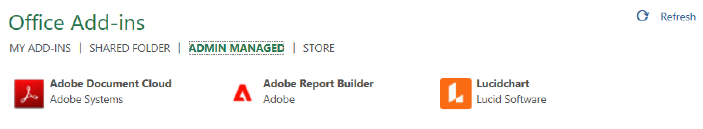
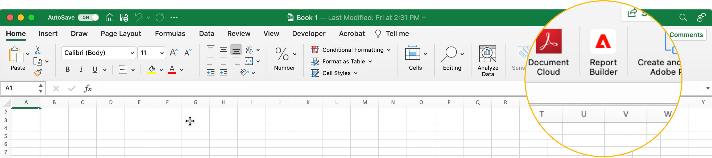
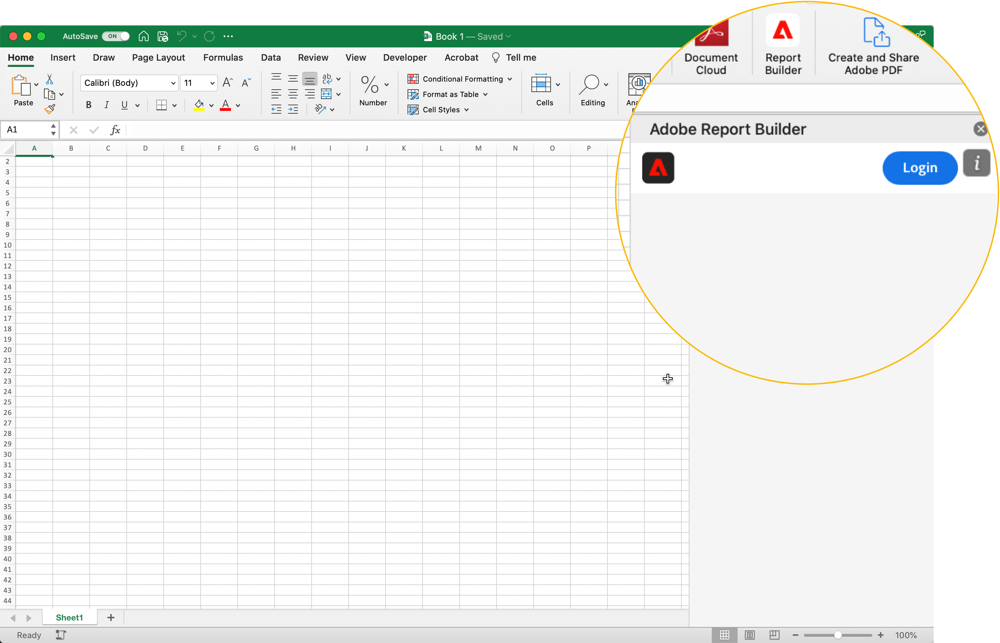
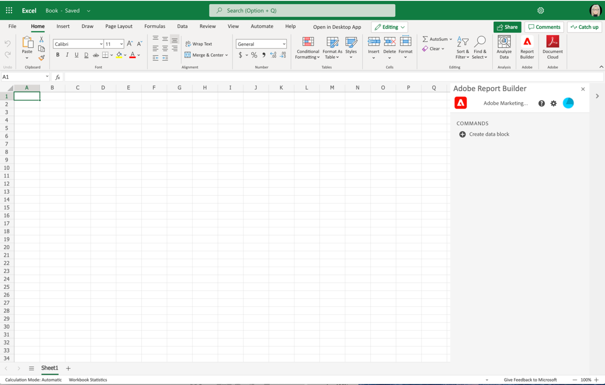
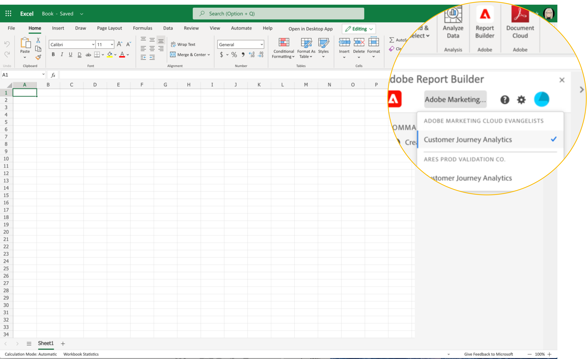
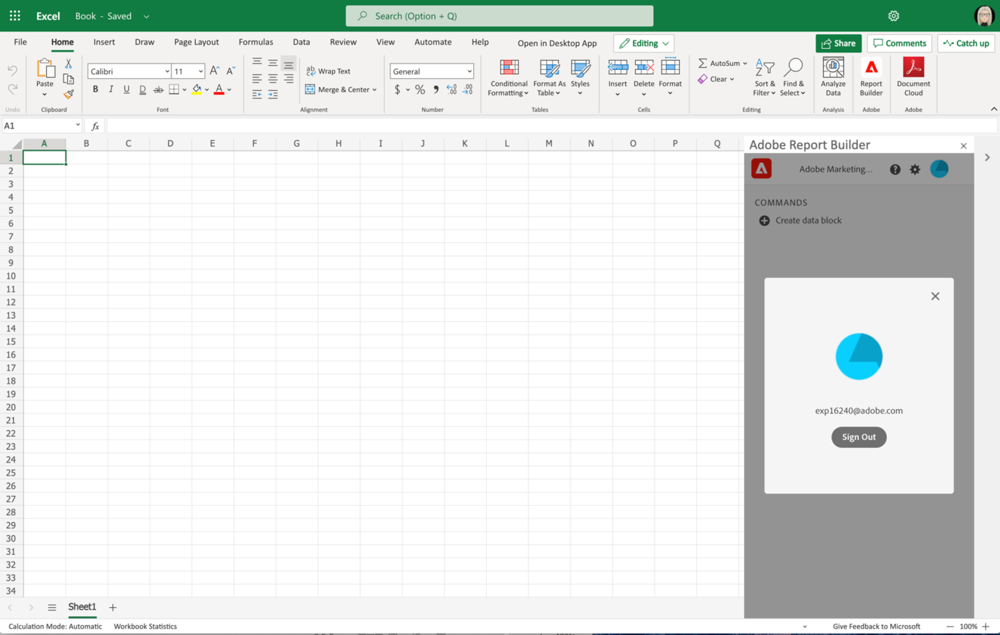

# Configurazione di Report Builder

Questo articolo illustra i requisiti per utilizzare Report Builder for Customer Journey Analytics in Microsoft Excel. Come installare e configurare il componente aggiuntivo.

## Requisiti

Report Builder per Customer Journey Analytics è supportato nei seguenti sistemi operativi e browser Web.

### macOS

- macOS versione 10.x o successiva
- Tutte le versioni di Excel

### Windows

- Windows 10, versione 1904 o successiva
- Excel versione 2106 o successiva

  Per utilizzare il componente aggiuntivo, tutti gli utenti di Windows Desktop Excel devono installare Microsoft Edge Webview2. Per installare:

  1. Vai a <https://developer.microsoft.com/en-us/microsoft-edge/webview2/>.
  1. Selezionare e scaricare la versione appropriata di **[!UICONTROL Evergreen Standalone Installer]** per la piattaforma.
  1. Eseguire il programma di installazione e seguire le istruzioni di installazione.

### Ufficio web

- Supporta tutti i browser e le versioni.

## Componente aggiuntivo Report Builder Excel

Installare il componente aggiuntivo Report Builder Excel per utilizzare Report Builder for Customer Journey Analytics. Dopo aver installato il componente aggiuntivo di Report Builder Excel, è possibile accedere a Report Builder da una cartella di lavoro di Excel aperta.

### Scaricare e installare il componente aggiuntivo Report Builder

Per scaricare e installare il componente aggiuntivo Report Builder

1. Avviare Excel e aprire una nuova cartella di lavoro.

1. Selezionare **[!UICONTROL Inserisci]** > **[!UICONTROL Componenti aggiuntivi]** > **[!UICONTROL Ottieni componenti aggiuntivi]** dal menu principale.

1. Nella finestra di dialogo Componenti aggiuntivi di Office selezionare la scheda **[!UICONTROL Archivia]**.

1. Cerca `Report Builder` e seleziona **[!UICONTROL Aggiungi]**.

1. Nella finestra di dialogo Condizioni di licenza e informativa sulla privacy, seleziona **[!UICONTROL Continua]**.

Se la scheda **[!UICONTROL Store]** non è visualizzata:

1. In Excel, selezionare **[!UICONTROL File]** > **[!UICONTROL Account]** > **[!UICONTROL Gestione impostazioni]** dal menu principale.

1. Selezionare la casella accanto a **[!UICONTROL Abilita esperienze connesse facoltative]**.

1. Riavviare Excel.

Se l’organizzazione blocca l’accesso a Microsoft Store:

- Rivolgiti al tuo team IT o di sicurezza per richiedere l’approvazione per il componente aggiuntivo Report Builder. Dopo aver concesso l&#39;approvazione, nella finestra di dialogo **[!UICONTROL Componenti aggiuntivi]** di Office, selezionare la scheda **[!UICONTROL Amministratore gestito]**.

  {zoomable="yes"}

Dopo aver installato il componente aggiuntivo Report Builder, l&#39;icona  **[!UICONTROL Report Builder]** viene visualizzata nella barra multifunzione di Excel nella scheda **[!UICONTROL Home]**.

{zoomable="yes"}

## Accedi a Report Builder

Dopo aver installato il componente aggiuntivo Report Builder for Excel per la piattaforma operativa o il browser in uso, eseguire la procedura seguente per accedere a Report Builder.

1. Aprire una cartella di lavoro di Excel.

1. Seleziona  **[!UICONTROL Report Builder]** per avviare Report Builder.

1. Dalla barra degli strumenti di Adobe Report Builder, seleziona **[!UICONTROL Accesso]**.

   {zoomable="yes"}

1. Immetti le informazioni del tuo account Adobe. Le informazioni sull&#39;account devono corrispondere alle credenziali Customer Journey Analytics.

   {zoomable="yes"}

Dopo aver effettuato l’accesso, l’icona di accesso e l’organizzazione vengono visualizzate nella parte superiore del pannello

## Cambiare organizzazione

La prima volta che accedi, accedi all’organizzazione predefinita assegnata al tuo profilo o a quella selezionata come parte del flusso di accesso.

1. Selezionare il nome dell&#39;organizzazione visualizzata all&#39;accesso.

1. Seleziona un’organizzazione dall’elenco delle organizzazioni disponibili. Vengono elencate solo le organizzazioni a cui hai accesso.

   {zoomable="yes"}

## Uscire

Per uscire da Report Builder:

1. Salvare le modifiche apportate alle cartelle di lavoro aperte.

1. Seleziona l’icona dell’avatar per visualizzare il profilo utente.

   {zoomable="yes"}

1. Seleziona **[!UICONTROL Disconnetti]**.
