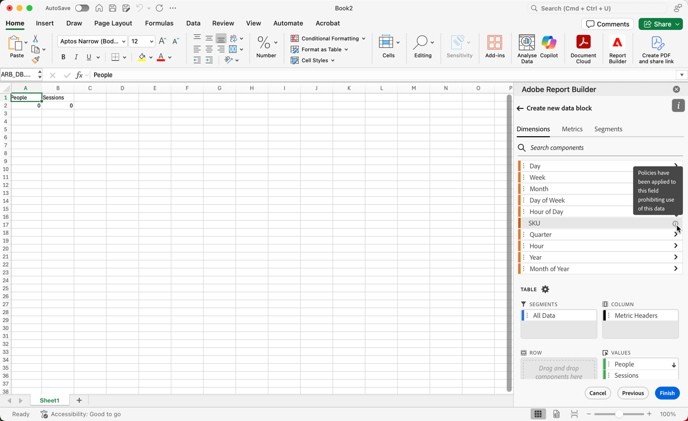

# Etichette per limitazioni in Report Builder

In genere, le impostazioni relative alla governance dei dati in Customer Journey Analytics vengono ereditate da Experience Platform. L’integrazione tra Customer Journey Analytics e Governance dei dati di Experience Platform consente l’etichettatura dei dati Customer Journey Analytics sensibili e l’applicazione delle politiche sulla privacy.

Le etichette per la privacy e i criteri creati sui set di dati utilizzati da Experience Platform possono essere visualizzati nel flusso di lavoro delle visualizzazioni dati di Customer Journey Analytics. Queste etichette interrompono o avvisano gli utenti che creano metriche e dimensioni da campi sensibili. Per informazioni sui set di dati, consulta [Panoramica sui set di dati](https://experienceleague.adobe.com/en/docs/experience-platform/catalog/datasets/overview)

Inoltre, quando i dati vengono esportati da Customer Journey Analytics (tramite reporting, esportazione, API ecc.), vengono aggiunti avvisi o etichette per avvisare gli utenti che un report contiene informazioni sensibili che devono essere trattate in un modo specifico.

Questa integrazione consente di gestire la conformità. Gli amministratori di dati della tua organizzazione possono impostare criteri per limitare l’utilizzo. Di conseguenza, gli utenti di Customer Journey Analytics possono utilizzare i dati in modo più affidabile, sapendo che sono conformi ai criteri definiti dagli amministratori dei dati.

Per ulteriori informazioni, consulta [Customer Journey Analytics e governance dei dati](https://experienceleague.adobe.com/en/docs/analytics-platform/using/cja-privacy/privacy-overview)

## Visualizza dati con restrizioni

In Customer Journey Analytics vengono visualizzati due criteri definiti da Adobe che influiscono su reporting, download e condivisione:

* Criterio Enforce Analytics (Applica analisi)
* Criterio Enforce Download (Applica download)

I componenti soggetti a questi criteri sono disattivati e dispongono di un&#39;icona . Quando passi il cursore sull&#39;icona delle informazioni, viene visualizzata una nota per indicare che a questo campo sono stati applicati **[!UICONTROL criteri che impediscono l&#39;utilizzo di questi dati]**.

Per ulteriori informazioni, vedere [Etichette e criteri](https://experienceleague.adobe.com/en/docs/analytics-platform/using/cja-dataviews/data-governance).

{zoomable="yes"}

## Aggiornare i rapporti che contengono dati con restrizioni

Nei casi in cui un utente abbia creato in Report Builder un rapporto con elementi dati a cui sono state successivamente applicate delle limitazioni, quando il rapporto viene aggiornato viene visualizzato un messaggio di errore.

{width="100%" zoomable="yes"}
