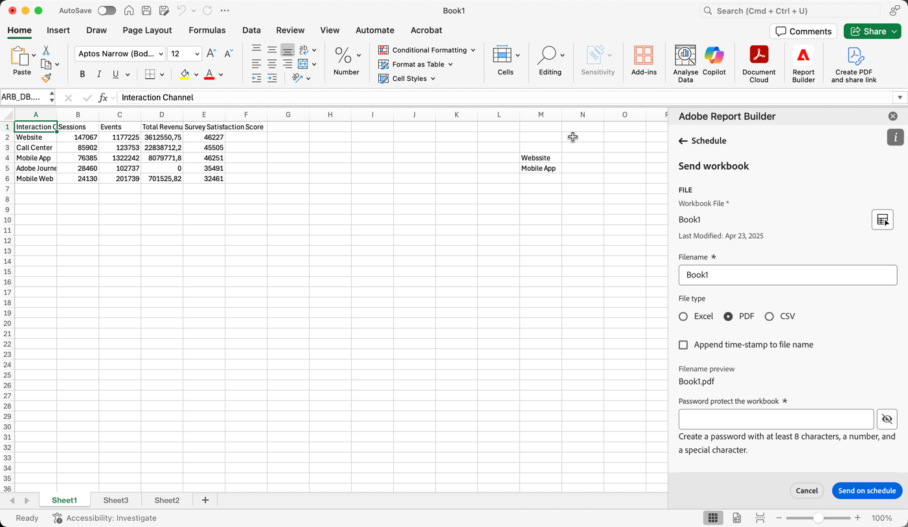
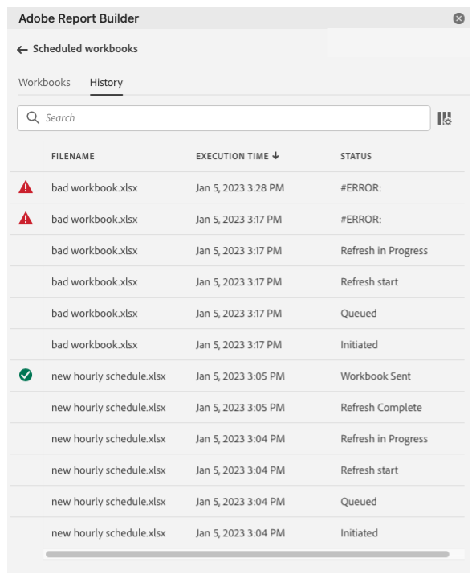

# Pianificare cartelle di lavoro

Dopo aver salvato la cartella di lavoro e completato l&#39;analisi, è possibile condividere facilmente la cartella di lavoro con altri membri del team utilizzando la funzione di pianificazione. La funzione Pianificazione consente di creare una pianificazione che aggiorna automaticamente i dati nella cartella di lavoro ed invia un messaggio e-mail al file .xlsx della cartella di lavoro di Excel come allegato al pubblico specificato in una data e in un&#39;ora specifiche. L’impostazione di una pianificazione fornisce ai destinatari regolari aggiornamenti automaticamente. È inoltre possibile utilizzare la funzione di pianificazione per inviare la cartella di lavoro una volta senza pianificare gli aggiornamenti automatici.

È possibile creare più pianificazioni per una singola cartella di lavoro. Ad esempio, è possibile inviare una cartella di lavoro al team su base giornaliera e inviare la cartella di lavoro al proprio responsabile una volta alla settimana creando due pianificazioni diverse.

La funzione Pianificazione consente inoltre di impostare la protezione tramite password per una cartella di lavoro e di modificare le cartelle di lavoro pianificate in precedenza.

>[!VIDEO](https://video.tv.adobe.com/v/3413079/?quality=12&learn=on)

## Pianificare una cartella di lavoro

Utilizzare il pulsante Attività di pianificazione nell&#39;hub di Report Builder per creare rapidamente una pianificazione in modo da poter distribuire automaticamente un file Excel della cartella di lavoro (.xlsx) a un singolo utente o a un gruppo.

1. Fare clic sul pulsante Pianificazione nell&#39;hub del Report Builder.

   {width="55%"}

1. Fare clic su Pianifica cartella di lavoro o sul pulsante più in alto a sinistra per creare una nuova cartella di lavoro pianificata.

   {width="55%"}

   Nel riquadro di pianificazione vengono visualizzate alcune informazioni predefinite sulla cartella di lavoro, ad esempio il nome della cartella di lavoro e l&#39;ultima data di modifica della cartella di lavoro.

   {width="55%"}

1. (Facoltativo) Immetti un nome file.

   Il nome del file della cartella di lavoro viene impostato automaticamente sul nome della cartella di lavoro, ma è possibile modificarlo se lo si desidera. Se invii la stessa cartella di lavoro a più tipi di pubblico e vuoi assegnargli un nome un po&#39; più descrittivo per un determinato pubblico, puoi modificare il nome.

1. (Facoltativo) Seleziona **Aggiungi timestamp al nome del file**.

   È possibile aggiungere una marca temporale al nome del file per identificare la data di aggiornamento della cartella di lavoro. È utile per vedere rapidamente quale versione di una cartella di lavoro è stata inviata in una data specifica. La **Anteprima nome file** mostra come verrà visualizzato il nome del file della cartella di lavoro nell&#39;e-mail quando la cartella di lavoro viene distribuita. Il formato della marca temporale è AAAA-MM-GG.

1. (Facoltativo) Seleziona **compressione .zip** per comprimere il file e impostare la protezione tramite password sul file.

   Quando si effettua questa selezione, viene richiesto di immettere una password per aprire il file. Questa opzione è utile se hai dei dubbi sulla sicurezza dei dati e desideri proteggere la cartella di lavoro tramite password. Per proteggere il file con una password è necessario selezionare **compressione .zip**. La password deve contenere almeno 8 caratteri e un numero e un carattere speciale.

   {width="55%"}

1. Invio **Destinatari**. Puoi immettere il nome di una persona riconosciuta nell’organizzazione oppure l’indirizzo e-mail di una persona all’interno o all’esterno dell’organizzazione.

1. Inserisci il **Oggetto** dell’e-mail e una descrizione per i destinatari. L&#39;oggetto viene impostato automaticamente sul nome del file della cartella di lavoro, ma è possibile modificarlo se necessario. Puoi aggiungere dettagli nella sezione descrizione .

   {width="55%"}

1. Impostare le opzioni di pianificazione per impostare la data e l&#39;ora in cui si desidera inviare la cartella di lavoro ai destinatari tramite e-mail.

   Scegli l’intervallo di date e ore di inizio e fine. Può essere la data odierna o una data futura.

   Scegli la **Frequenza** dal menu a discesa. Puoi impostare la frequenza in modo che sia ogni ora, giorno, settimana, mese o anno in un giorno specifico. Ad esempio, puoi impostare una pianificazione per l’invio della cartella di lavoro la prima domenica notte del mese in modo che i destinatari dispongano dell’e-mail nella casella in entrata il lunedì mattina.

   {width="55%"}

1. Dopo aver impostato la pianificazione, fai clic su **Invia secondo programma**.

   {width="55%"}

   Nella parte inferiore dell&#39;hub del Report Builder viene visualizzato un avviso di conferma e la cartella di lavoro pianificata viene elencata nella scheda Cartelle di lavoro.

   {width="55%"}

## Invia la cartella di lavoro una sola volta

È inoltre possibile inviare la cartella di lavoro una sola volta.

1. Deselezionare **Mostra opzioni di pianificazione**

   {width="40%"}

1. Fai clic su **Invia subito**.

## Visualizzare e modificare le cartelle di lavoro pianificate

È possibile visualizzare e gestire tutte le cartelle di lavoro pianificate in un&#39;unica posizione nella scheda Cartelle di lavoro.

1. Nella sezione Pianificazione dell&#39;hub del Report Builder, fare clic sulla scheda Cartelle di lavoro. Utilizzare questa visualizzazione per visualizzare un elenco di tutte le cartelle di lavoro pianificate.

1. Selezionare una cartella di lavoro. Vengono visualizzati diversi strumenti che consentono di modificare la cartella di lavoro, modificare la pianificazione, mettere in pausa e riavviare la pianificazione o eliminare la pianificazione.

   {width="55%"}

* (Facoltativo) Fai clic sull’icona a forma di matita per modificare la pianificazione della cartella di lavoro.

* (Facoltativo) Fai clic sull&#39;icona dell&#39;orologio per visualizzare la cronologia di ciascuna attività pianificata.

* (Facoltativo) Fai clic sull’icona di pausa per mettere in pausa e riavviare la pianificazione di distribuzione. Questa opzione è utile se è necessario modificare la cartella di lavoro prima di inviarla. Fai nuovamente clic sull’icona di pausa per riavviare la distribuzione.

* (Facoltativo) Fai clic sul cestino per eliminare la pianificazione.

## Rivedere lo stato delle attività programmate

La visualizzazione della cronologia consente di controllare lo stato di ogni attività pianificata. È disponibile una riga separata che documenta la modifica dello stato per ogni attività pianificata. Nell’esempio riportato di seguito, la variabile *Nuova pianificazione oraria* è stato avviato il 5 gennaio alle 15.04. Entro le 15:05 è stato aggiornato con successo ed è stato inviato ai destinatari. La cartella di lavoro successiva, *Cartella di lavoro non valida*, si è verificato un errore durante il processo di aggiornamento. Se una cartella di lavoro non è stata inviata, la scheda della cronologia consente di risolvere i problemi mostrando dove si è verificato l&#39;errore nel processo. In questo caso, è probabile che sia dovuto ad alcuni errori del blocco di dati, ad esempio un componente mancante, che hanno impedito l&#39;aggiornamento della cartella di lavoro.

Un segno di spunta verde indica che la cartella di lavoro è stata inviata correttamente. Un punto esclamativo in un triangolo rosso indica che si è verificato un errore.

Per scegliere le colonne da visualizzare nella scheda Cronologia, fai clic sull’icona delle impostazioni delle colonne a destra della barra di ricerca.

{width="55%"}

È possibile filtrare la cronologia per visualizzare solo quella di una singola cartella di lavoro pianificata andando alla scheda cartelle di lavoro, selezionando la cartella di lavoro e facendo clic sull&#39;icona della cronologia.

È inoltre possibile visualizzare la cronologia di una cartella di lavoro specifica dalla scheda Cartelle di lavoro. Nella scheda Cartelle di lavoro selezionare la cartella di lavoro, quindi fare clic sull&#39;icona della cronologia.

{width="55%"}

Il filtro della cartella di lavoro verrà quindi visualizzato nella parte superiore della cronologia. Per visualizzare nuovamente la cronologia di tutte le attività pianificate, fare clic sulla x accanto al filtro.

{width="55%"}

