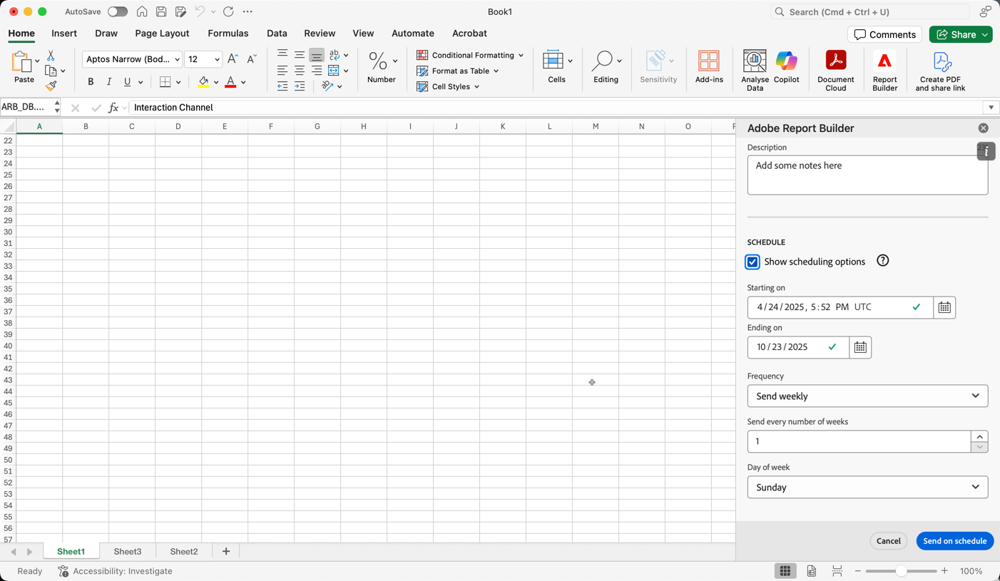

# Pianificare le cartelle di lavoro condividendo tramite e-mail

Dopo aver salvato la cartella di lavoro e completato l&#39;analisi, è possibile condividerla con altri utenti del team utilizzando la funzionalità di pianificazione. La funzione di pianificazione consente di creare una pianificazione che aggiorna automaticamente i dati nella cartella di lavoro. E invia tramite e-mail il file della cartella di lavoro di Excel come allegato al pubblico specificato in una data e un’ora specifiche. L’impostazione di una pianificazione fornisce automaticamente ai destinatari aggiornamenti regolari. Puoi anche utilizzare la funzione di pianificazione per inviare la cartella di lavoro una volta senza pianificare gli aggiornamenti automatici.

Puoi creare più pianificazioni per una singola cartella di lavoro. Ad esempio, si creano due pianificazioni per inviare una cartella di lavoro al team ogni giorno e al manager una volta alla settimana.

La funzione di pianificazione consente inoltre di impostare la protezione tramite password per una cartella di lavoro e di modificare le cartelle di lavoro pianificate in precedenza.

>[!BEGINSHADEBOX]

Consulta  [Pianifica cartelle di lavoro](https://video.tv.adobe.com/v/3413079/?quality=12&learn=on){target="_blank"} per un video dimostrativo.

>[!ENDSHADEBOX]

## Pianificare una cartella di lavoro

Per pianificare una cartella di lavoro:

1. Selezionare **[!UICONTROL Schedule]** nell&#39;hub di Report Builder per creare una pianificazione che consenta di distribuire automaticamente un file di Excel della cartella di lavoro (con estensione xlsx) a un singolo utente o a un gruppo.

   {zoomable="yes"}

1. Selezionare **[!UICONTROL Schedule Workbook]** o  per creare una nuova cartella di lavoro pianificata.

   {zoomable="yes"}

   Il riquadro di pianificazione mostra alcune informazioni predefinite sulla cartella di lavoro, ad esempio il nome e l’ultima data di modifica della cartella di lavoro.

### File

Nella sezione **[!UICONTROL File]**, è possibile fornire dettagli sul tipo di file, il nome e una password per proteggere il file.

{zoomable="yes"}

1. Utilizza  per selezionare la cartella di lavoro corrente, se non è già selezionata.

1. (Facoltativo) Immetti **[!UICONTROL File name]**.

   Per impostazione predefinita, il nome del file della cartella di lavoro corrisponde al nome della cartella di lavoro, ma è possibile modificare il nome del file in base alle proprie esigenze.

1. Seleziona **[!UICONTROL File type]**.

   * **[!UICONTROL Excel]**
   * **[!UICONTROL PDF]**
   * **[!UICONTROL CSV]**

   Quando selezioni **[!UICONTROL CSV]**, tieni presente che la cartella di lavoro pianificata viene inviata come allegato zip. Alcune amministrazioni e-mail aziendali potrebbero bloccare le e-mail con allegati zip. Di conseguenza viene visualizzato un avviso.

1. (Facoltativo) Selezionare **[!UICONTROL Append time-stamp to file name]**.

   Puoi aggiungere una marca temporale al nome del file per identificare la data di aggiornamento della cartella di lavoro. Una marca temporale è utile per vedere quale versione di una cartella di lavoro è stata inviata in una data specifica. Se selezionata, puoi scegliere tra:

   * **[!UICONTROL ISO Date format]**, con conseguente aggiunta di `YYYY-MM-DD` al nome file.
   * **[!UICONTROL ISO Date format + time stamp]**, con conseguente aggiunta di `YYYY-MM-DD_HH-MM-SS` al nome file.

<!-- Does no longer seem to be an option? 
1. (Optional) Select **.zip compression** to compress the file and set up password protection on the file.

    When you make this selection, you're prompted to enter a password to open the file. This is helpful if you have concerns about data security and you want to password protect the workbook. Protecting the file with a password requires you to select **.zip compression**. The password must be at least 8 characters and contain a number and a special character.

    {zoomable="yes"}{width="55%"}
-->

1. Immettere una password in **[!UICONTROL Password protect the workbook]**. Una password valida richiede almeno 8 caratteri, un numero e un carattere speciale. Seleziona  per visualizzare la password e  per nascondere la password (impostazione predefinita).

### E-mail

Nella sezione **[!UICONTROL Email]**, è possibile fornire i destinatari, l&#39;oggetto e la descrizione dell&#39;e-mail.

{zoomable="yes"}

1. Inserisci i destinatari in **Recipients** (Destinatari). È possibile immettere il nome di una persona riconosciuta nell&#39;organizzazione. Oppure puoi immettere un indirizzo e-mail di una persona esterna alla tua organizzazione.

1. Inserisci l’oggetto dell’e-mail in **Subject** (Oggetto) e una descrizione per i destinatari. L’oggetto viene impostato automaticamente sul nome del file della cartella di lavoro, ma puoi modificarlo se necessario. Puoi aggiungere i dettagli nella sezione della descrizione.

1. Facoltativamente, è possibile immettere una descrizione nell&#39;area di testo **[!UICONTROL Description]**.

### Pianificazione

Nella sezione **[!UICONTROL Schedule]** è possibile definire la pianificazione per l&#39;invio delle e-mail con la cartella di lavoro ai destinatari.

{zoomable="yes"}

1. Selezionare **[!UICONTROL Show scheduling options]** per definire una pianificazione.

1. Immettere una data di inizio in **[!UICONTROL Starting on]**. In alternativa, selezionare  per scegliere una data di inizio dal calendario.

1. Immettere una data di fine in **[!UICONTROL Ending on]**. In alternativa, selezionare  per scegliere una data di fine dal calendario.

1. Seleziona una **[!UICONTROL Frequency]**. A seconda della frequenza selezionata, sono disponibili opzioni aggiuntive. Vedi la tabella seguente.

   | Frequenza | Opzioni |
   |---|---|
   | **[!UICONTROL Send hourly]** | Immettere un valore per **[!UICONTROL Send every number of hours]**. |
   | **[!UICONTROL Send daily]** | Selezionare un **[!UICONTROL Daily frequency]**: **[!UICONTROL Send every day]**, **[!UICONTROL Send every weekday]** o **[!UICONTROL Custom frequency]**. Se si seleziona **[!UICONTROL Custom frequency]**, immettere un valore per **[!UICONTROL Send every number of days]**. |
   | **[!UICONTROL Send weekly]** | Immettere un valore per **[!UICONTROL Send every number of weeks]**. E seleziona un **[!UICONTROL Day of week]**. |
   | **[!UICONTROL Send monthly by day of the week]** | Selezionare **[!UICONTROL Day of week]** e **[!UICONTROL Week of month]**. |
   | **[!UICONTROL Send monthly by day of the month]** | Selezionare un valore da **[!UICONTROL Send on this day of the month]**. |
   | **[!UICONTROL Send yearly by day of the month]** | Selezionare un **[!UICONTROL Day of week]**, selezionare un **[!UICONTROL Week of month]** e selezionare un **[!UICONTROL Monthly of year]**. |
   | **[!UICONTROL Send yearly by specific date]** | Selezionare un **[!UICONTROL Month of year]** e un valore da **[!UICONTROL Send on this day of the month]**. |

### Invia

Per inviare la cartella di lavoro:

* Se non è stata definita una pianificazione utilizzando **[!UICONTROL Show scheduling options]**, selezionare **[!UICONTROL Send now]** per inviare immediatamente la cartella di lavoro tramite e-mail.
* Se è stata definita una pianificazione utilizzando **[!UICONTROL Show scheduling options]**, selezionare **[!UICONTROL Send on schedule]** per inviare la cartella di lavoro tramite e-mail utilizzando la pianificazione definita.

In entrambi i casi, nella parte inferiore dell’hub Report Builder viene visualizzato un avviso popup di conferma.

Per annullare l&#39;invio della cartella di lavoro, selezionare **[!UICONTROL Cancel]**.

## Gestire le cartelle di lavoro pianificate

Per informazioni sulla gestione delle cartelle di lavoro già pianificate, vedere [Gestione delle cartelle di lavoro pianificate](/help/report-builder/manage-schedules-reportbuilder.md).

