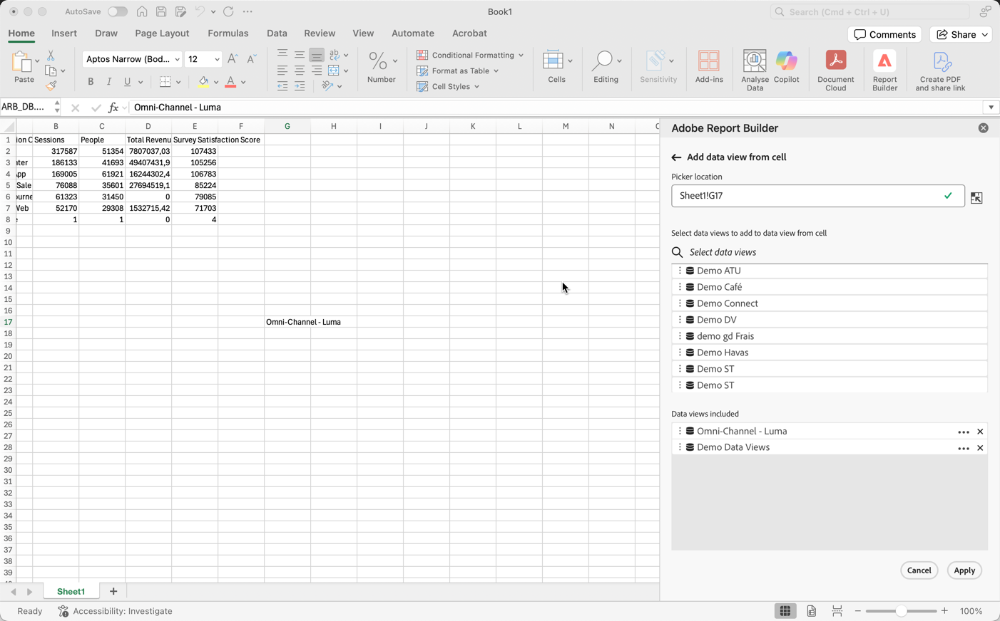

# Seleziona una visualizzazione dati

Puoi selezionare una visualizzazione dati dall’elenco a discesa oppure selezionare una visualizzazione dati da una cella e aggiornare automaticamente il blocco di dati con una nuova visualizzazione dati.

## Selezionare una visualizzazione dati da una cella

La selezione di una visualizzazione dati da una cella semplifica l’aggiornamento dei blocchi di dati utilizzando diverse visualizzazioni dati. Invece di creare rapporti completamente nuovi con blocchi di dati separati, puoi aggiornare i blocchi di dati con una visualizzazione dati selezionata da una cella.

La selezione di una visualizzazione dati da una cella è utile quando:

* Visualizzazioni dati multiple simili o identiche nella struttura.
* Formati di blocchi di dati complessi che includono componenti e layout personalizzati.

Per selezionare una visualizzazione dati da una cella, crea innanzitutto un blocco di dati e assegna più visualizzazioni dati a una cella all’esterno del blocco di dati. Quindi, utilizza il pannello **[!UICONTROL Data view from cell]** per aggiornare i blocchi di dati da diverse visualizzazioni dati.

1. Crea un blocco di dati. Per informazioni sulla creazione di un blocco di dati, vedere [Creare un blocco di dati](/help/report-builder/create-a-data-block.md).

1. Selezionare  in **[!UICONTROL Data views]**.

1. Selezionare una cella utilizzando  all&#39;esterno del blocco di dati.

1. Aggiungere una o più visualizzazioni dati da **[!UICONTROL Select data views to add to data view from cell]** tramite trascinamento della selezione. In alternativa, è possibile selezionare una visualizzazione dati per aggiungerla all&#39;elenco **[!UICONTROL Data views included]**.

   * Puoi usare  **[!UICONTROL _Seleziona visualizzazioni dati_]** per cercare le visualizzazioni dati.
   * Utilizza  per aprire un menu di scelta rapida in modo da poter spostare le visualizzazioni dati verso l&#39;alto o verso il basso nell&#39;elenco **[!UICONTROL Data views included]**.
   * Utilizzare  per eliminare una visualizzazione dati dall&#39;elenco **[!UICONTROL Data views included]**.

   {zoomable="yes"}

1. Selezionare **[!UICONTROL Apply]** per applicare le visualizzazioni dati selezionate alla cella selezionata.

## Modificare la visualizzazione dati da una cella

1. Selezionare la posizione della cella della visualizzazione dati nel foglio.
1. Nell&#39;hub Report Builder selezionare il collegamento **[!UICONTROL Data views from cell]** in **[!UICONTROL Quick edit]**.
1. Selezionare una visualizzazione dati dal menu a discesa **[!UICONTROL Data view]**.

   {zoomable="yes"}
1. Facoltativo, selezionare **[!UICONTROL Refresh data block(s) upon change]**.

1. Seleziona **[!UICONTROL Apply]**. Report Builder aggiorna il blocco di dati in base alla visualizzazione dati selezionata.
