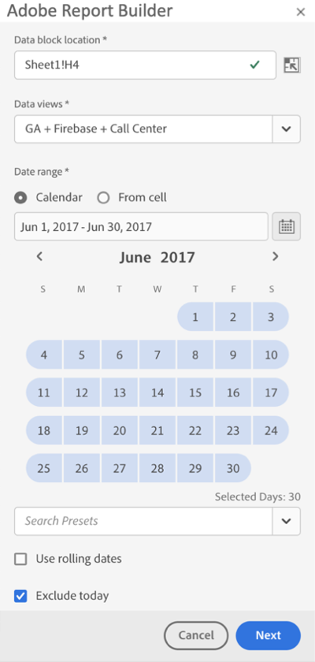
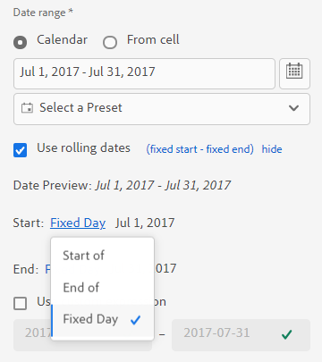
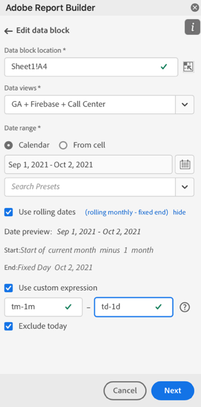

# Selezionare un intervallo di date

Per modificare l’intervallo di date di un blocco di dati esistente, selezionare Modifica un blocco di dati o utilizzare il pannello MODIFICA RAPIDA.

Utilizza le seguenti opzioni per modificare un intervallo di date per un blocco di dati.

**Calendario**

Il Calendario consente di creare date statiche o continue utilizzando le seguenti opzioni:

- Campo intervallo date
- Calendario
- Menu a discesa Predefinito
- Modalità data di rotazione
- Personalizzare le espressioni


**Da cella**

L&#39;opzione Da cella consente di fare riferimento alle date inserite nelle celle del foglio di lavoro.

Puoi escludere oggi qualsiasi intervallo di date selezionato.


## Utilizzare il calendario

Quando utilizzi il **Calendario**, il campo intervallo di date visualizza l&#39;intervallo di date corrente per la richiesta di blocco di dati. È possibile inserire le date direttamente nel campo intervallo di date o utilizzare un’opzione di selezione dell’intervallo di dati.

### Campo intervallo date

Per inserire le date direttamente nel campo intervallo di date

1. Fai clic sul campo dell’intervallo di date accanto all’icona del calendario.

1. Immetti le date di inizio e di fine per l’intervallo di date.

### Calendario

Per selezionare le date utilizzando il calendario

1. Fai clic sull’icona del calendario per visualizzare un calendario mensile.

1. Fai clic su una data di inizio.

1. Fai clic su una data di fine.

Per impostare un intervallo di date in senso inverso, fare clic prima sulla data di fine e quindi sulla data di inizio.



### Menu a discesa Predefinito

Il menu a discesa predefinito include un set standard di intervalli di date preimpostati e componenti dell’intervallo di date per una visualizzazione dati salvata o una visualizzazione dati condivisa con te.

### Date di rotazione

L’opzione date continue consente di selezionare un intervallo di date utilizzando date continue.

1. Seleziona **Usa date continue**.

1. Selezionare un&#39;espressione continua per la data di inizio e/o di fine.

   

   **Inizio di** : consente di selezionare l’inizio di un giorno, una settimana, un mese, un trimestre o un anno.

   **Fine di** : consente di selezionare la fine di un giorno, una settimana, un mese, un trimestre o un anno.

   **Giorno**  fisso: consente di correggere una data di inizio o di fine mentre l&#39;altra data è in continuo.

1. Scegliere il giorno, la settimana, il mese, il trimestre o l&#39;anno come periodo continuo.

   

1. Aggiungi o sottrai giorni, settimane, mesi, trimestri o anni dalla data continua.

   

1. Fai clic su Avanti per definire l’intervallo di dati.

   Utilizza l’anteprima della data per confermare che l’intervallo di date risultante sia l’intervallo desiderato.

### Espressioni personalizzate

L’opzione di espressione personalizzata consente di modificare l’intervallo di date creando un’espressione personalizzata oppure è possibile immettere una formula aritmetica.

1. Seleziona **Usa date continue**.

1. Selezionare **Usa espressione personalizzata**.

   Quando si seleziona l’opzione **Usa espressione personalizzata**, i controlli standard dell’intervallo di date continue sono disabilitati.

   

1. Immetti un’espressione personalizzata.

   Per un elenco di esempi di espressioni personalizzate, consulta **Espressioni data**.

1. Utilizza l’anteprima della data per verificare che l’intervallo di date risultante sia l’intervallo desiderato.

#### Creare un’espressione personalizzata

1. Inserisci un **Riferimento data**.

1. Aggiungi **operatori di data** per spostare la data nel passato o nel futuro.

È possibile immettere un&#39;espressione data personalizzata che includa più operatori, ad esempio ```tm-11m-1d```.

#### Riferimenti date

Nella tabella seguente sono riportati alcuni esempi di riferimento per le date.

| Riferimento data | Tipo | Descrizione |
|----------------|--------------|----------------------------|
| 01/01/10 | Data statica | Inserito in formato data ISO |
| td | Data di rotazione | Inizio del giorno corrente |
| tw | Data di rotazione | Inizio della settimana corrente |
| tm | Data di rotazione | Inizio del mese corrente |
| tq | Data di rotazione | Inizio trimestre corrente |
| ty | Data di rotazione | Inizio dell&#39;anno corrente |

#### Operatori data

Nella tabella seguente sono riportati alcuni esempi di operatori di data.

| Operatori data | Unità | Descrizione |
|----------------|---------|--------------------|
| +6 d | Giorno | Aggiungi 6 giorni al riferimento data |
| +1 w | Settimana | Aggiungi una settimana intera al riferimento data |
| -2 m | Mese | Sottrai 2 mesi interi alla data di riferimento |
| -4 q | Trimestre | Sottrai 4 trimestri alla data di riferimento |
| -1 anno | Anno | Sottrai un anno al riferimento data |

#### Espressioni data

Nella tabella seguente sono riportati alcuni esempi di espressione data.

| Espressione data | Significato |
|-----------------|--------------------------------------|
| td-1w | Primo giorno della settimana scorsa |
| tm-1d | Ultimo giorno del mese precedente |
| td-52w | Stesso giorno, 52 settimane fa |
| tm-11m-1d | Ultimo giorno dello stesso mese dello scorso anno |
| &quot;2020-09-06&quot; | 9 settembre 2020 |

## Intervallo di date dalla cella

L&#39;intervallo di date può essere specificato nelle celle del foglio di lavoro. Utilizza l&#39;opzione **Intervallo date dalla cella** per scegliere la data di inizio e di fine del blocco dati dalle celle selezionate. Quando selezioni l’opzione **Da cella**, nel pannello vengono visualizzati i campi **Da** e **A** in cui puoi inserire una posizione cella.


## Escludi oggi

Scegli l’opzione **Escludi oggi** per escludere oggi da un intervallo di date selezionato. La scelta di includere oggi può estrarre dati incompleti per oggi.

Se selezionata, l’opzione **Escludi oggi** esclude il giorno corrente da tutte le modalità dell’intervallo di date, tra cui calendario, date continue o espressioni personalizzate.

## Intervalli di date validi

Nell&#39;elenco seguente sono descritti i formati validi dell&#39;intervallo di date.

- Le date di inizio e di fine devono essere nel seguente formato: AAAA-MM-GG

- La data di inizio deve essere precedente o uguale alla data di fine. Entrambe le date possono essere impostate sul futuro.

- Quando si utilizzano date continue, la data di inizio deve essere odierna o passata. Deve essere passato se è selezionato **Escludi oggi** .

- Puoi creare un set di date statico per il futuro. Ad esempio, potrebbe essere necessario impostare una data futura per l’avvio di una campagna di marketing la settimana prossima. Questa opzione consente di creare in anticipo un monitoraggio della cartella di lavoro per una campagna.

## Modificare l’intervallo date

È possibile modificare l&#39;intervallo di date di un blocco di dati esistente selezionando Modifica blocco di dati nel pannello COMANDI o selezionando il collegamento dell&#39;intervallo di date nel pannello EDIT RAPIDO.

**Modifica blocco**  dati: consente di modificare più parametri del blocco dati, compreso l&#39;intervallo di date, per un singolo blocco dati.

**Modifica rapida: Intervallo di date** : consente di modificare l’intervallo di date di uno o più blocchi di dati.

Per modificare l’intervallo di date dal pannello MODIFICA RAPIDA

1. Selezionare celle all&#39;interno di uno o più blocchi di dati in un foglio di lavoro.

1. Fai clic sul collegamento **Intervallo date** nel pannello EDIT RAPIDO .

1. Seleziona l’intervallo di date utilizzando una delle opzioni di selezione della data.

1. Fai clic su **Applica**.


Report Builder applica il nuovo intervallo di date a tutti i blocchi di dati nella selezione.
