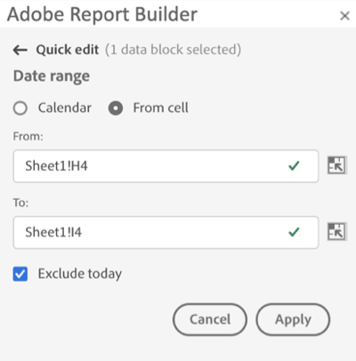

# Selezionare un intervallo di date

Per modificare l’intervallo di date di un blocco di dati esistente, seleziona Modifica un blocco di dati o utilizza il pannello QUICK EDIT (MODIFICA RAPIDA).

Utilizza le seguenti opzioni per modificare un intervallo di date per un blocco di dati.

**Calendario**

Il calendario consente di creare date statiche o continue utilizzando le seguenti opzioni:

- Campo intervallo di date
- Calendario
- Menu a discesa Predefinito
- Modalità data continua
- Personalizzare le espressioni


**Da cella**

L&#39;opzione Da cella consente di fare riferimento alle date immesse nelle celle del foglio di lavoro.

Hai la possibilità di escludere oggi in qualsiasi intervallo di date selezionato.


## Utilizzare il calendario

Quando si utilizza **Calendario**, nel campo intervallo di date viene visualizzato l’intervallo di date corrente per la richiesta di blocco di dati. È possibile immettere le date direttamente nel campo dell’intervallo di date o utilizzare un’opzione di selezione dell’intervallo di dati.

### Campo intervallo di date

Per immettere le date direttamente nel campo di intervallo date

1. Fai clic sul campo dell’intervallo di date accanto all’icona del calendario.

1. Inserire le date di inizio e fine per l&#39;intervallo di date.

### Calendario

Per selezionare le date utilizzando il calendario

1. Fai clic sull’icona del calendario per visualizzare un calendario mensile.

1. Fai clic su una data di inizio.

1. Fai clic su una data di fine.

Per impostare un intervallo di date in ordine inverso, fare clic prima sulla data di fine e quindi sulla data di inizio.


### Menu a discesa Predefinito

Il menu a discesa dei predefiniti include un set standard di intervalli di date predefiniti e componenti per intervalli di date per una visualizzazione dati salvata o condivisa con te.

### Date di rotazione

L’opzione Rollout date consente di selezionare un intervallo di date utilizzando date continue.

1. Seleziona **Utilizzare date continue**.

1. Seleziona un’espressione continua per la data di inizio e/o di fine.

   

   **Inizio di** — Consente di selezionare l&#39;inizio di un giorno, una settimana, un mese, un trimestre o un anno.

   **Fine di** — consente di selezionare la fine di un giorno, una settimana, un mese, un trimestre o un anno.

   **Giorno fisso** — consente di correggere una data di inizio o di fine mentre l&#39;altra data è continua.

1. Scegliere giorno, settimana, mese, trimestre o anno come periodo continuo.

   

1. Aggiungere o sottrarre giorni, settimane, mesi, trimestri o anni dalla data di rotazione.

   

1. Fai clic su Successivo per definire l’intervallo di dati.

   Utilizza l’anteprima della data per confermare che l’intervallo di date risultante sia quello desiderato.

### Espressioni personalizzate

L’opzione di espressione personalizzata consente di modificare l’intervallo di date creando un’espressione personalizzata oppure di immettere una formula aritmetica.

1. Seleziona **Utilizzare date continue**.

1. Seleziona **Usa espressione personalizzata**.

   Quando selezioni il **Usa espressione personalizzata** , i controlli standard dell&#39;intervallo di date continuo sono disattivati.

   

1. Immetti un’espressione personalizzata.

   Per un elenco di esempi di espressioni personalizzate, vedi **Espressioni data**.

1. Utilizza l’anteprima della data per verificare che l’intervallo di date risultante corrisponda all’intervallo desiderato.

#### Creare un’espressione personalizzata

1. Immetti un **Riferimento data**.

1. Aggiungi **Operatori di data** per spostare la data nel passato o nel futuro.

È possibile immettere un&#39;espressione data personalizzata che includa più operatori, ad esempio ```tm-11m-1d```.

#### Riferimenti data

Nella tabella seguente sono elencati alcuni esempi di riferimenti di date.

| Riferimento data | Tipo | Descrizione |
|----------------|--------------|----------------------------|
| 1/1/10 | Data statica | Immesso in formato data ISO |
| td | Data continua | Inizio del giorno corrente |
| due | Data continua | Inizio della settimana corrente |
| tm | Data continua | Inizio del mese corrente |
| tq | Data continua | Inizio del trimestre corrente |
| ty | Data continua | Inizio dell&#39;anno corrente |

#### Operatori di data

Nella tabella seguente sono elencati alcuni esempi di operatori di date.

| Operatori data | Unità | Descrizione |
|----------------|---------|--------------------|
| +6d | Giorno | Aggiungi 6 giorni alla data di riferimento |
| +1w | Settimana | Aggiungi una settimana intera alla data di riferimento |
| -2m | Mese | Sottrarre 2 mesi interi alla data di riferimento |
| -4q | Trimestre | Sottrarre 4 trimestri alla data di riferimento |
| -1y | Anno | Sottrai un anno alla data di riferimento |

#### Espressioni data

Nella tabella seguente sono elencati alcuni esempi di espressioni di data.

| Espressione data | Significato |
|-----------------|--------------------------------------|
| td-1w | Primo giorno della settimana scorsa |
| tm-1d | Ultimo giorno del mese precedente |
| td-52w | Lo stesso giorno, 52 settimane fa |
| tm-11m-1d | Ultimo giorno dello stesso mese lo scorso anno |
| “2020-09-06” | 9 settembre 2020 |

## Intervallo di date dalla cella

L&#39;intervallo di date può essere specificato nelle celle del foglio di lavoro. Utilizza il **Intervallo di date dalla cella** per scegliere la data di inizio e di fine del blocco di dati dalle celle selezionate. Quando selezioni il **Da cella** , il pannello viene visualizzato **Da** e **A** campi in cui è possibile immettere una posizione cella.



## Escludi oggi

Scegli la **Escludi oggi** opzione per escludere oggi da un intervallo di date selezionato. La scelta di includere oggi potrebbe estrarre dati incompleti per oggi.

Se selezionata, la **Escludi oggi** Questa opzione esclude il giorno corrente da tutte le modalità intervallo di date, inclusi calendario, date continue o espressioni personalizzate.

## Intervalli di date validi

Nell’elenco seguente sono descritti i formati di intervalli di date validi.

- Le date di inizio e fine devono essere nel formato seguente: AAAA-MM-GG

- La data di inizio deve essere precedente o uguale alla data di fine. Entrambe le date possono essere impostate sul futuro.

- Quando si utilizzano date continue, la data di inizio deve essere oggi o nel passato. Deve essere nel passato se **Escludi oggi** è selezionato.

- Puoi creare un intervallo di date statico impostato per il futuro. Ad esempio, potrebbe essere necessario impostare una data futura per il lancio di una campagna di marketing la prossima settimana. Questa opzione crea in anticipo un monitoraggio della cartella di lavoro per una campagna.

## Modificare l’intervallo date

Puoi modificare l’intervallo di date di un blocco di dati esistente selezionando Modifica blocco di dati nel pannello COMANDI o selezionando il collegamento dell’intervallo di date nel pannello QUICK EDIT (MODIFICA RAPIDA).

**Modifica blocco di dati** — consente di modificare più parametri dei blocchi di dati, incluso l&#39;intervallo di date, per un singolo blocco di dati.

**Modifica rapida: intervallo di date** — consente di modificare l&#39;intervallo di date di uno o più blocchi di dati.

Per modificare l’intervallo di date dal pannello QUICK EDIT (MODIFICA RAPIDA)

1. Selezionare le celle all&#39;interno di uno o più blocchi di dati in un foglio di lavoro.

1. Fai clic su **Intervallo di date** nel pannello QUICK EDIT.

1. Seleziona l’intervallo di date utilizzando una qualsiasi delle opzioni di selezione della data.

1. Fai clic su **Applica**.


Il nuovo intervallo di date viene applicato dal Report Builder a tutti i blocchi di dati della selezione.
