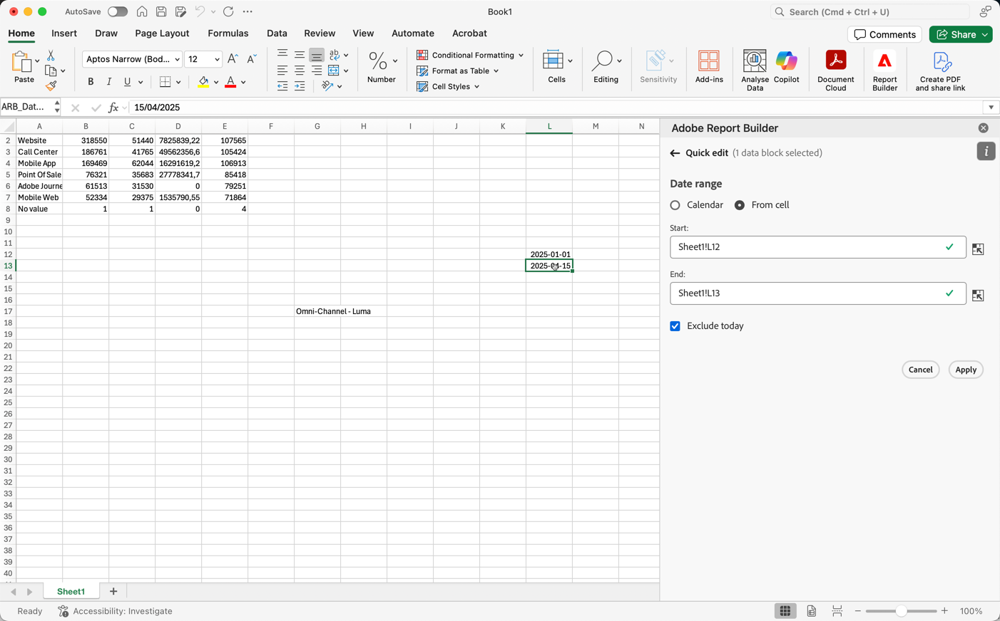

# Selezionare un intervallo di date

Per modificare l’intervallo di date di un blocco di dati esistente:

- Seleziona **[!UICONTROL Edit a data block]**, oppure
- Selezionare il collegamento **[!UICONTROL Date range]** in **[!UICONTROL Quick edit]**.

Utilizza le seguenti opzioni per modificare un intervallo di date per un blocco di dati.

## Calendario

L&#39;opzione **[!UICONTROL Calendar]** consente di creare date statiche o continue utilizzando le opzioni seguenti:

### Intervallo date

Nel campo intervallo di date viene visualizzato l’intervallo di date corrente per la richiesta di blocco di dati. Puoi immettere le date direttamente oppure utilizzare  per specificare un intervallo di date.

{zoomable="yes"}

### Predefiniti

Utilizza il menu a discesa dei predefiniti per selezionare un predefinito. Potete anche immettere del testo per cercare dei predefiniti.

{zoomable="yes"}

Il menu a discesa dei predefiniti include un set standard di intervalli di date predefiniti e componenti per intervalli di date per una visualizzazione dati salvata o condivisa con te.

### Date di rotazione

Per definire le date di rotazione:

{zoomable="yes"}

1. Selezionare **[!UICONTROL Use rolling dates]** per definire la logica per una definizione di data continua. È possibile selezionare il testo tra parentesi (ad esempio **[!UICONTROL fixed start - rolling daily]**) per estendere il pannello e specificare i dettagli per **[!UICONTROL Start]** e **[!UICONTROL End]**.

1. Seleziona **[!UICONTROL Start of]**, **[!UICONTROL End of]**, or **[!UICONTROL Fixed day]**.

   - Dopo aver selezionato **[!UICONTROL Start of]** o **[!UICONTROL End of]**, è possibile creare un’espressione completa. Ad esempio: **[!UICONTROL End of]** **[!UICONTROL current year]** **[!UICONTROL plus]** `1` **[!UICONTROL day]**. Seleziona il valore appropriato per ogni singola parte dell’espressione.

      - Seleziona un valore corrente. Ad esempio: **[!UICONTROL current year]**.
      - Selezionare un valore per un calcolo aggiuntivo facoltativo. Ad esempio: **[!UICONTROL plus]**.
      - Dopo aver specificato un calcolo aggiuntivo, specifica un valore. Ad esempio: `1`.
      - Dopo aver specificato un calcolo aggiuntivo, seleziona il periodo di tempo da utilizzare per il calcolo. Ad esempio: **[!UICONTROL day]**.

   - Dopo aver selezionato **[!UICONTROL Fixed Day]**, specificare un giorno fisso o utilizzare il selettore per selezionare un giorno.

1. Seleziona **[!UICONTROL hide]** per nascondere i dettagli del calcolo delle date continue.

### Espressioni personalizzate

L’opzione di espressione personalizzata consente di modificare l’intervallo di date creando un’espressione personalizzata oppure di immettere una formula aritmetica.

{zoomable="yes"}

1. Seleziona **[!UICONTROL Use rolling dates]** (Aggiungi set di dati).

1. Seleziona **[!UICONTROL Use custom expression]** (Salva).

   Quando si seleziona **[!UICONTROL Use custom expression]**, i controlli standard dell&#39;intervallo di date continuo sono disabilitati.

1. Immetti un&#39;[espressione personalizzata](#create-a-custom-expression).

1. Utilizza **[!UICONTROL Date preview]** per verificare l&#39;intervallo di date risultante.

#### Creare un’espressione personalizzata

1. Immetti un [riferimento data](#date-references).

1. Aggiungi un operatore [date](#date-operators) facoltativo per spostare la data nel passato o nel futuro.

È possibile immettere un&#39;espressione personalizzata che includa più operatori, ad esempio `tm-11m-1d`.

#### Riferimenti data

Nella tabella seguente sono elencati alcuni esempi di riferimenti di date.

| Riferimento data | Tipo | Descrizione |
|----------------|--------------|----------------------------|
| `1/1/10` | Data statica | Immesso in formato data ISO |
| `td` | Data continua | Inizio del giorno corrente |
| `tw` | Data continua | Inizio della settimana corrente |
| `tm` | Data continua | Inizio del mese corrente |
| `tq` | Data continua | Inizio del trimestre corrente |
| `ty` | Data continua | Inizio dell&#39;anno corrente |

#### Operatori di data

Nella tabella seguente sono elencati alcuni esempi di operatori di date.

| Operatore data | Unità | Descrizione |
|----------------|---------|--------------------|
| `+6d` | Giorno | Aggiungi 6 giorni alla data di riferimento |
| `+1w` | Settimana | Aggiungi una settimana intera alla data di riferimento |
| `-2m` | Mese | Sottrarre 2 mesi interi alla data di riferimento |
| `-4q` | Trimestre | Sottrarre 4 trimestri alla data di riferimento |
| -`1y` | Anno | Sottrai un anno alla data di riferimento |

#### Espressioni data

Nella tabella seguente sono elencati alcuni esempi di espressioni di data.

| Espressione data | Significato |
|-----------------|--------------------------------------|
| `td` | Oggi |
| `td-1w` | Primo giorno della settimana scorsa |
| `tm-1d` | Ultimo giorno del mese precedente |
| `td-52w` | Lo stesso giorno, 52 settimane fa |
| `tm-11m-1d` | Ultimo giorno dello stesso mese lo scorso anno |
| `"2020-09-06"` | Data specifica, 9 settembre 2020 |

## Intervallo di date dalla cella

L&#39;intervallo di date può essere specificato nelle celle del foglio di lavoro. Utilizzare l&#39;opzione **[!UICONTROL Date range from cell]** per scegliere la data di inizio e di fine del blocco di dati dalle celle selezionate. Quando selezioni l&#39;opzione **[!UICONTROL From cell]**, nel pannello vengono visualizzati **[!UICONTROL From]** e **[!UICONTROL To]** campi in cui puoi immettere la posizione di una cella o utilizzare  per scegliere la cella selezionata corrente.

{zoomable="yes"}

## Escludi oggi

Seleziona **[!UICONTROL Exclude today]** per escludere oggi da un intervallo di date selezionato. Il giorno corrente è escluso da tutte le modalità utilizzate per definire un intervallo di date: calendario, date continue o espressioni personalizzate.

## Intervalli di date validi

Nell’elenco seguente sono descritti i formati di intervalli di date validi.

- Le date di inizio e fine devono essere nel formato seguente: AAAA-MM-GG

- La data di inizio deve essere precedente o uguale alla data di fine. Entrambe le date possono essere impostate sul futuro.

- Quando si utilizzano date continue, la data di inizio deve essere oggi o nel passato. Il giorno di inizio deve essere nel passato se si seleziona **[!UICONTROL Exclude today]**.

- Puoi creare un intervallo di date statico impostato per il futuro. Ad esempio, potrebbe essere necessario impostare una data futura per il lancio di una campagna di marketing la prossima settimana. Questa opzione crea in anticipo un monitoraggio della cartella di lavoro per una campagna.

## Modificare l’intervallo di date

Puoi modificare l’intervallo di date di un blocco di dati esistente.

1. Seleziona una cella nel blocco di dati.

- Selezionare **[!UICONTROL Edit data block]** nel pannello **[!UICONTROL Commands]**, oppure
- Selezionare il collegamento **[!UICONTROL Date range]** nel pannello **[!UICONTROL Quick edit]**.

1. Modifica l’intervallo di date utilizzando una qualsiasi delle opzioni di selezione della data disponibili.

1. Seleziona **[!UICONTROL Apply]**.

Report Builder applica il nuovo intervallo di date a tutti i blocchi di dati della selezione.
