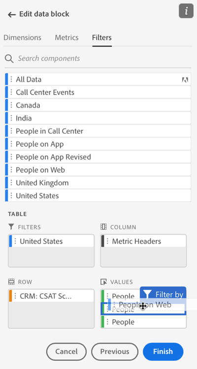

# Utilizzare i filtri nel Report Builder

Puoi applicare i filtri quando crei un nuovo blocco di dati o quando selezioni **Modifica blocco dati** dal pannello COMANDI.

## Applicazione di filtri a un blocco di dati

Per applicare un filtro all’intero blocco di dati, fai doppio clic su un filtro o trascina e rilascia i filtri dall’elenco dei componenti nella sezione Filtri della tabella.

## Applicazione di filtri alle singole metriche

Per applicare filtri a singole metriche, trascina e rilascia un filtro su una metrica nella tabella. Puoi anche fare clic sul pulsante **...** a destra di una metrica nel riquadro Tabella , quindi seleziona **Metrica del filtro**. Per visualizzare i filtri applicati, passa il puntatore del mouse su una metrica nel riquadro Tabella o selezionala. Le metriche con filtri applicati presentano un’icona di filtro.

<!--  -->

## Filtri di modifica rapida

Puoi usare il pannello Modifica rapida per aggiungere, rimuovere o sostituire i filtri per i blocchi di dati esistenti.

Quando selezioni un intervallo di celle nel foglio di calcolo, il **Filtri** nel pannello Modifica rapida viene visualizzato un elenco di riepilogo dei filtri utilizzati dai blocchi di dati in tale selezione.

Per modificare i filtri utilizzando il pannello di modifica rapida

1. Seleziona un intervallo di celle da uno o più blocchi di dati.

   

1. Fai clic sul collegamento Filtri per avviare il pannello Modifica rapida - Filtri .

   

### Aggiungere o rimuovere un filtro

È possibile aggiungere o rimuovere filtri utilizzando le opzioni Aggiungi/Rimuovi.

1. Seleziona la **Aggiungi/Rimuovi** nel pannello Filtri di modifica rapida .

   Tutti i filtri applicati ai blocchi di dati selezionati sono elencati nel pannello Filtri di modifica rapida . I filtri applicati a tutti i blocchi di dati nella selezione sono elencati nella **Applicato a tutti i blocchi di dati selezionati** intestazione. I filtri applicati ad alcuni blocchi di dati ma non a tutti sono elencati nella **Applicato a uno o più blocchi di dati selezionati** intestazione.

   Quando sono presenti più filtri nei blocchi di dati selezionati, puoi cercare filtri specifici utilizzando la funzione **Aggiungi filtro** campo di ricerca.

   

1. Aggiungi i filtri selezionando i filtri dal **Aggiungi filtro** menu a discesa.

   L’elenco dei filtri ricercabili include tutti i filtri accessibili alle visualizzazioni dati presenti in uno o più blocchi di dati selezionati, nonché tutti i filtri disponibili a livello globale nell’organizzazione.

   L’aggiunta di un filtro applica il filtro a tutti i blocchi di dati nella selezione.

1. Per rimuovere i filtri, fai clic sull’icona Elimina **x** a destra dei filtri **Filtri applicati** elenco.

1. Fai clic su **Applica** per salvare le modifiche e tornare al pannello hub.

   In Report Builder viene visualizzato un messaggio per confermare le modifiche al filtro applicato.

### Sostituire un filtro

Puoi sostituire un filtro esistente con un altro filtro per modificare il modo in cui i dati vengono filtrati.

1. Seleziona la **Sostituisci** nel pannello Filtri di modifica rapida .

   

1. Utilizza la **Elenco ricerche** campo di ricerca per individuare filtri specifici.

1. Scegli uno o più filtri da sostituire.

1. Cerca uno o più filtri nel campo Sostituisci con .

   Quando si seleziona un filtro, questo viene aggiunto al **Sostituisci con**... elenco.

   

1. Fai clic su **Applica**.

   Il Report Builder aggiorna l’elenco dei filtri per riflettere la sostituzione.
