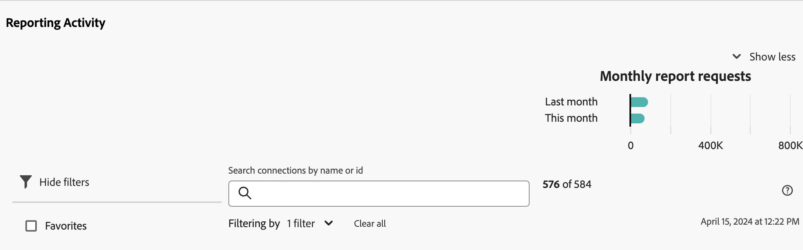

# Visualizzare l’attività di reporting {#view-reporting-activity}

[!UICONTROL Reporting Activity Manager] consente agli amministratori di diagnosticare e risolvere rapidamente i problemi di capacità di reporting durante i periodi in cui si verificano picchi di reporting.

Per ulteriori informazioni su Reporting Activity Manager, inclusi i vantaggi chiave e i requisiti delle autorizzazioni, vedere [Panoramica di Reporting Activity Manager](/help/reporting-activity-manager/reporting-activity-overview.md).

## Per tutte le connessioni {#view-all-report-suites}

<!-- markdownlint-disable MD034 -->

>[!CONTEXTUALHELP]
>id="cja_tools_reportingactivitymanager_connections"
>title="Connessioni"
>abstract="Questa tabella mostra le connessioni per le quali si dispone dei diritti per gestire l’attività di reporting. Le informazioni su ciascuna connessione sono disponibili in ogni colonna della tabella."

<!-- markdownlint-enable MD034 -->

<!-- markdownlint-disable MD034 -->

>[!CONTEXTUALHELP]
>id="tools_reportingactivitymanager_connections"
>title="Connessioni"
>abstract="Questa tabella mostra le connessioni per le quali si dispone dei diritti per gestire l’attività di reporting. Le informazioni su ciascuna connessione sono disponibili in ogni colonna della tabella."

<!-- markdownlint-enable MD034 -->

1. In Customer Journey Analytics, vai a **[!UICONTROL Tools]** > **[!UICONTROL Reporting Activity Manager]**.

   Viene visualizzato un elenco delle connessioni di base abilitate.

   

1. Per visualizzare il numero totale di richieste di report per tutte le connessioni nell&#39;organizzazione, espandi [!UICONTROL **Mostra altro**] per visualizzare il grafico [!UICONTROL **Richieste di report mensili**].

   Puoi visualizzare il numero di richieste di rapporti all’interno della tua organizzazione per il mese corrente e il mese precedente.

   

1. (Facoltativo) Puoi cercare o filtrare l’elenco delle connessioni:

   * Utilizza il campo di ricerca per cercare una connessione specifica. Inizia a digitare il nome o l’ID della connessione e l’elenco degli aggiornamenti delle connessioni durante la digitazione.

   * Seleziona  per espandere l&#39;elenco delle opzioni filtro. Puoi filtrare per [!UICONTROL **Preferiti**] o [!UICONTROL **Stato**].

     Per contrassegnare una connessione come preferita, seleziona l’icona a forma di stella a sinistra del nome della connessione.

     <!-- (does this option still exist?) 1. (Optional) Select **[!UICONTROL Refresh]** at the top-right to refresh the data. -->

1. Visualizza le informazioni sull&#39;utilizzo di ogni connessione. I dati mostrati nella tabella rappresentano l’attività di reporting per la connessione al momento dell’ultimo caricamento della pagina.

   Sono disponibili le seguenti colonne:

   | Elemento nell’interfaccia utente | Descrizione |
   | --- | --- |
   | **[!UICONTROL Connection]** | La connessione di cui si sta monitorando l’attività di reporting. |
   | **[!UICONTROL Data Views]** | Mostra tutte le visualizzazioni dati che utilizzano la connessione. La configurazione della visualizzazione dati può aggiungere complessità alle richieste di reporting. |
   | **[!UICONTROL Capacity utilization]** | Percentuale della capacità di reporting della connessione utilizzata, in tempo reale. 
**Nota** Una capacità di utilizzo pari al 100% non indica necessariamente che è necessario avviare immediatamente l&#39;annullamento delle richieste di reporting. La capacità di utilizzo del 100% può essere integra se il tempo medio di attesa è ragionevole. D’altra parte, una capacità di utilizzo del 100% potrebbe indicare un problema se anche il numero di richieste in coda è in crescita.
 |
   | **[!UICONTROL Queued requests]** | Numero di richieste in attesa di elaborazione. <!-- ??? --> |
   | **[!UICONTROL Queue wait time]** | Tempo medio di attesa prima dell’elaborazione delle richieste. <!-- ???? --> |
   | **[!UICONTROL Status]** | I possibili stati sono: <ul><li>[!UICONTROL **Attivo**] (blu): i rapporti sulla connessione sono stati eseguiti nelle ultime 2 ore. I dati mostrati nella tabella rappresentano la capacità di reporting per la connessione al momento dell’ultimo caricamento della pagina.</li><li>[!UICONTROL **Inattivo**] (grigio): non sono mai stati eseguiti report sulla connessione nelle ultime 2 ore, quindi non vengono visualizzati dati per la connessione.</li></ul> |

   {style="table-layout:auto"}

## Per una singola connessione

1. In Customer Journey Analytics, selezionare [!UICONTROL **Strumenti**] > [!UICONTROL **Gestione attività di reporting**].

1. Selezionare il titolo collegato della connessione per la quale si desidera visualizzare i dettagli.

   I dati dell’attività di reporting vengono visualizzati per la connessione selezionata.

1. (Facoltativo) Quando una connessione viene caricata per la prima volta in Reporting Activity Manager, i dati visualizzati rappresentano le metriche di utilizzo correnti. Per visualizzare le metriche aggiornate dopo il caricamento iniziale, selezionare il pulsante [!UICONTROL **Aggiorna**] per aggiornare manualmente la pagina.

   <!-- Need to update this screenshot:  -->

1. Utilizza i grafici e la tabella disponibili per comprendere l’attività di reporting nella connessione.

   * [Visualizzare grafici](#view-graphs)

   * [Visualizza tabella](#view-table)

### Visualizzare grafici

I seguenti grafici sono disponibili per aiutarti a comprendere meglio l’attività che si verifica nella connessione.

Se i grafici non sono visibili, selezionare il pulsante [!UICONTROL **Mostra grafici**].

#### Grafico Utilizzo {#utilization}

Il grafico Utilizzo mostra l&#39;utilizzo dei rapporti per la connessione selezionata nelle ultime 2 ore.

Passa il cursore del mouse sul grafico per visualizzare i punti nel tempo in cui la percentuale di capacità di utilizzo era più alta per quel minuto.

* **Asse X**: la capacità di utilizzo del reporting nelle ultime 2 ore.
* **Asse Y**: percentuale della capacità di utilizzo del reporting, in minuti.

  

#### Grafico Utenti distinti

Il grafico Utenti distinti mostra l’attività di reporting per la connessione selezionata nelle ultime 2 ore.

Passa il cursore del mouse sul grafico per visualizzare i punti nel tempo in cui il numero massimo di utenti era più alto per quel minuto.

* **Asse X**: l&#39;attività di reporting nell&#39;ultimo intervallo di tempo di 2 ore.
* **Asse Y**: numero di utenti che hanno effettuato richieste di reporting, per minuto.

  

#### Grafico Richieste

Il grafico Richieste mostra il numero di richieste elaborate e in coda per la connessione selezionata nelle ultime 2 ore.

Passa il cursore del mouse sul grafico per visualizzare i punti nel tempo in cui il numero massimo di richieste era più alto per quel minuto.

* **Asse X**: numero di richieste elaborate e in coda negli ultimi due ore.
* **Asse Y**: numero di richieste elaborate (in verde) e di richieste in coda (in viola) in base al minuto.

  

#### Grafico in coda

Il grafico di accodamento mostra il tempo medio di attesa della coda (in secondi) per le richieste di reporting per la connessione selezionata nelle ultime 2 ore.

Passa il cursore del mouse sul grafico per visualizzare i punti nel tempo in cui il tempo medio di attesa massimo era più alto per quel minuto.

* **Asse X**: tempo medio di attesa della coda per le richieste di reporting nell&#39;ultimo intervallo di tempo di 2 ore.
* **Asse Y**: tempo medio di attesa (in secondi).

  

### Visualizza tabella {#view-table}

Quando visualizzi la tabella, considera quanto segue:

* Puoi scegliere di visualizzare i dati scegliendo una delle seguenti schede nella parte superiore della tabella dati: [!UICONTROL **Richiesta**], [!UICONTROL **Utente**], [!UICONTROL **Progetto**] o [!UICONTROL **Applicazione**].

* Puoi cercare o filtrare l’elenco delle connessioni:

   * Utilizza il campo di ricerca per cercare una connessione specifica. Inizia a digitare il nome o l’ID della connessione e l’elenco degli aggiornamenti delle connessioni durante la digitazione.

   * Seleziona l&#39;icona [!UICONTROL **Filtro**]  per espandere l&#39;elenco delle opzioni filtro. Puoi filtrare per [!UICONTROL **Stato**], [!UICONTROL **Complessità**], [!UICONTROL **Applicazione**], [!UICONTROL **Utente**] o [!UICONTROL **Progetto**].

   * È possibile selezionare [!UICONTROL **Nascondi grafici**] per visualizzare solo la tabella.

#### Visualizza dati per richiesta

Quando si seleziona la scheda [!UICONTROL **Richiesta**], nella tabella sono disponibili le colonne seguenti:

| Colonna | Descrizione |
| --- | --- |
| [!UICONTROL **ID richiesta**] | ID univoco che può essere utilizzato a scopo di risoluzione dei problemi. Per copiare l&#39;ID, selezionare la richiesta, quindi selezionare l&#39;opzione [!UICONTROL **Copia ID richiesta**]. |
| [!UICONTROL **Esecuzione**] | Da quanto tempo la richiesta è in esecuzione. |
| [!UICONTROL **Ora di inizio**] | Quando la richiesta ha iniziato l’elaborazione (in base all’ora locale dell’amministratore). |
| [!UICONTROL **Tempo di attesa**] | Tempo di attesa della richiesta prima dell’elaborazione. Questo valore è generalmente a &quot;0&quot; quando la capacità è sufficiente. |
| [!UICONTROL **Applicazione**] | Le applicazioni supportate dalla [!UICONTROL Reporting Activity Manager] sono: <ul><li>Interfaccia utente di Analysis Workspace</li><li>Progetti pianificati in Workspace</li><li>Report Builder</li><li>Interfaccia utente di Builder: segmento, metriche calcolate, annotazioni, pubblico e così via.</li><li>Chiamate API dall&#39;API 2.0</li><li>Avvisi<li>Esportazione tabella completa</li><li>Condividi con qualsiasi collegamento</li><li>Analisi guidata</li><li>Qualsiasi altra applicazione che esegue query sul motore di reporting di Analytics</li></li></ul>
**Nota:** se il valore di questa colonna è [!UICONTROL **Sconosciuto**], i metadati della richiesta non sono disponibili per l&#39;utente.
 |
| [!UICONTROL **Utente**] | Utente che ha avviato la richiesta. 
**Nota:** se il valore di questa colonna è [!UICONTROL **Sconosciuto**], i metadati della richiesta non sono disponibili per l&#39;utente.
 |
| [!UICONTROL **Progetto**] | Nomi di progetto Workspace, ID di report API e così via salvati. (I metadati possono variare tra le varie applicazioni).
**Nota:** se il valore di questa colonna è [!UICONTROL **Sconosciuto**], il progetto non è stato salvato o i metadati della richiesta non sono disponibili per l&#39;utente.
 |
| [!UICONTROL **Stato**] | Indicatori di stato: <ul><li>**In esecuzione**: richiesta in fase di elaborazione.</li><li>**In sospeso**: richiesta in attesa di elaborazione.</li></ul> |
| [!UICONTROL **Complessità**] | Non tutte le richieste richiedono la stessa quantità di tempo per essere elaborate. La complessità delle richieste può essere utile per avere un’idea generale sul tempo necessario per elaborarle. 
Possibili valori:
 <ul><li>[!UICONTROL **Basso**]</li><li>[!UICONTROL **Medium**]</li><li>[!UICONTROL **Alta**]</li></ul>Questo valore è influenzato dai valori delle colonne seguenti:<ul><li>[!UICONTROL **Limiti del mese**]</li><li>[!UICONTROL **Colonne**]</li><li>[!UICONTROL **Segmenti**]</li></ul> |
| [!UICONTROL **Limiti del mese**] | Il numero di mesi inclusi in una richiesta. L’aumento dei limiti di mese aggiunge complessità alla richiesta. |
| [!UICONTROL **Colonne**] | Il numero di metriche e raggruppamenti nella richiesta. Più colonne aumenta la complessità della richiesta. |
| [!UICONTROL **Segmenti**] | Il numero di segmenti applicati alla richiesta. Altri segmenti aumentano la complessità della richiesta. |

{style="table-layout:auto"}

#### Visualizza dati per utente

Quando si seleziona la scheda [!UICONTROL **Utente**], nella tabella sono disponibili le colonne seguenti:

| Colonna | Descrizione |
| --- | --- |
| [!UICONTROL **Utente**] | Utente che ha avviato la richiesta. Se il valore di questa colonna è [!UICONTROL **Non riconosciuto**], significa che l&#39;utente si trova in una società di accesso per la quale non si dispone di autorizzazioni amministrative. |
| [!UICONTROL **Numero di richieste**] | Numero di richieste avviate dall&#39;utente. |
| [!UICONTROL **Numero di progetti**] | Il numero di progetti associati all’utente. <!-- ??? --> |
| [!UICONTROL **Applicazione**] | Le applicazioni supportate dalla [!UICONTROL Reporting Activity Manager] sono: <ul><li>Interfaccia utente di Analysis Workspace</li><li>Progetti pianificati in Workspace</li><li>Report Builder</li><li>Interfaccia utente di Builder: segmento, metriche calcolate, annotazioni, pubblico e così via.</li><li>Chiamate API dall&#39;API 2.0</li><li>Avvisi<li>Esportazione tabella completa</li><li>Condividi con qualsiasi collegamento</li><li>Analisi guidata</li><li>Qualsiasi altra applicazione che esegue query sul motore di reporting di Analytics</li></li></ul> |
| [!UICONTROL **Complessità media**] | La complessità media delle richieste avviate dall’utente. 
Non tutte le richieste richiedono la stessa quantità di tempo per essere elaborate. La complessità delle richieste può essere utile per avere un’idea generale sul tempo necessario per elaborarle.

Il valore di questa colonna si basa su un punteggio determinato dai valori delle colonne seguenti:
<ul><li>[!UICONTROL **Limiti medi mese**]</li><li>[!UICONTROL **Colonne medie**]</li><li>[!UICONTROL **Segmenti medi**]</li></ul> |
| [!UICONTROL **Limiti medi mese**] | Numero medio di mesi inclusi nelle richieste. L’aumento dei limiti di mese aggiunge complessità alla richiesta. |
| [!UICONTROL **Colonne medie**] | Il numero medio di metriche e raggruppamenti nelle richieste incluse. Più colonne aumenta la complessità della richiesta. |
| [!UICONTROL **Segmenti medi**] | Numero medio di segmenti applicati alle richieste incluse. Altri segmenti aumentano la complessità della richiesta. |

{style="table-layout:auto"}

#### Visualizza dati per progetto

Quando si seleziona la scheda [!UICONTROL **Progetto**], nella tabella sono disponibili le colonne seguenti:

| Colonna | Descrizione |
| --- | --- |
| [!UICONTROL **Progetto**] | Progetto in cui sono state avviate le richieste. |
| [!UICONTROL **Numero di richieste**] | Il numero di richieste associate al progetto. |
| [!UICONTROL **Numero di utenti**] | Il numero di utenti associati al progetto. <!-- ??? --> |
| [!UICONTROL **Applicazione**] | Le applicazioni supportate dalla [!UICONTROL Reporting Activity Manager] sono: <ul><li>Interfaccia utente di Analysis Workspace</li><li>Progetti pianificati in Workspace</li><li>Report Builder</li><li>Interfaccia utente di Builder: segmento, metriche calcolate, annotazioni, pubblico e così via.</li><li>Chiamate API dall&#39;API 2.0</li><li>Avvisi<li>Esportazione tabella completa</li><li>Condividi con qualsiasi collegamento</li><li>Analisi guidata</li><li>Qualsiasi altra applicazione che esegue query sul motore di reporting di Analytics</li></li></ul> |
| [!UICONTROL **Complessità media**] | La complessità media delle richieste incluse nel progetto. 
Non tutte le richieste richiedono la stessa quantità di tempo per essere elaborate. La complessità delle richieste può essere utile per avere un’idea generale sul tempo necessario per elaborarle.

Il valore di questa colonna si basa su un punteggio determinato dai valori delle colonne seguenti:
<ul><li>[!UICONTROL **Limiti medi mese**]</li><li>[!UICONTROL **Colonne medie**]</li><li>[!UICONTROL **Segmenti medi**]</li></ul> |
| [!UICONTROL **Limiti medi mese**] | Numero medio di mesi inclusi nelle richieste. L’aumento dei limiti di mese aggiunge complessità alla richiesta. |
| [!UICONTROL **Colonne medie**] | Il numero medio di metriche e raggruppamenti nelle richieste incluse. Più colonne aumenta la complessità della richiesta. |
| [!UICONTROL **Segmenti medi**] | Numero medio di segmenti applicati alle richieste incluse. Altri segmenti aumentano la complessità della richiesta. |

{style="table-layout:auto"}

#### Visualizza dati per applicazione

Quando si seleziona la scheda [!UICONTROL **Applicazione**], nella tabella sono disponibili le colonne seguenti:

| Colonna | Descrizione |
| --- | --- |
| [!UICONTROL **Applicazione**] | L’applicazione in cui sono state avviate le richieste. |
| [!UICONTROL **Numero di richieste**] | Il numero di richieste associate all’applicazione. |
| [!UICONTROL **Numero di utenti**] | Il numero di utenti associati all’applicazione. <!--???--> |
| [!UICONTROL **Numero di progetti**] | Numero di progetti associati all&#39;applicazione. <!--???--> |
| [!UICONTROL **Complessità media**] | La complessità media delle richieste associate all’applicazione. 
Non tutte le richieste richiedono la stessa quantità di tempo per essere elaborate. La complessità delle richieste può essere utile per avere un’idea generale sul tempo necessario per elaborarle.

Il valore di questa colonna si basa su un punteggio determinato dai valori delle colonne seguenti:
Il valore di questa colonna si basa su un punteggio determinato dai valori delle colonne seguenti:<ul><li>[!UICONTROL **Limiti medi mesi**]</li><li>[!UICONTROL **Colonne medie**]</li><li>[!UICONTROL **Segmenti medi**]</li></ul> |
| [!UICONTROL **Limiti medi mese**] | Numero medio di mesi inclusi nelle richieste. L’aumento dei limiti di mese aggiunge complessità alla richiesta. |
| [!UICONTROL **Colonne medie**] | Il numero medio di metriche e raggruppamenti nelle richieste incluse. Più colonne aumenta la complessità della richiesta. |
| [!UICONTROL **Segmenti medi**] | Numero medio di segmenti applicati alle richieste incluse. Altri segmenti aumentano la complessità della richiesta. |

{style="table-layout:auto"}

<!-- 

## Frequently asked questions {#faq}

| Question | Answer |
| --- | --- |
| | |

{style="table-layout:auto"}

-->
