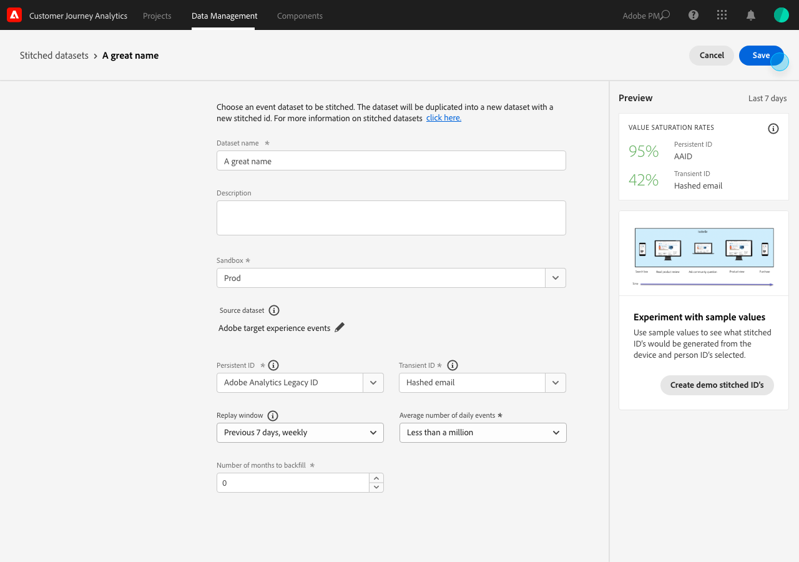
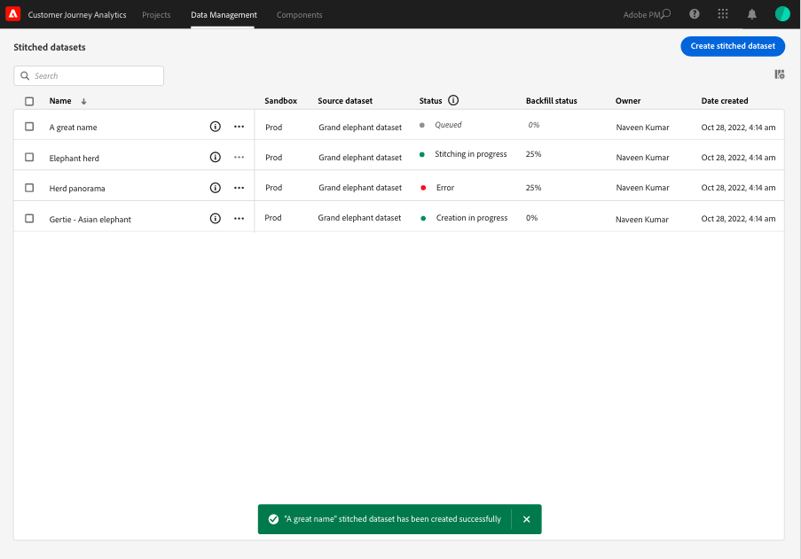

# Creare e gestire set di dati uniti

{{select-package}}

L’unione consente agli amministratori di unire le identità sui set di dati disponibili nel Customer Journey Analytics. L’unione dei set di dati aumenta la precisione della rappresentazione di un profilo, con conseguente miglioramento dell’analisi e del reporting.

Il processo di unione consente di definire un **ID persistente** in un set di dati. Quindi unisci l’identificatore persistente per una specifica finestra di ripetizione (giornaliera, settimanale) con il più accurato **ID transitorio** (persona o identificatore autenticato) disponibile per tale set di dati. Esempi di identificatori transitori sono e-mail, numero di telefono, ID del sistema di gestione delle relazioni con i clienti o altre identità memorizzate nel grafico. Consulta [Panoramica](overview.md) per ulteriori informazioni sull&#39;unione.

## Creazione

Per avviare l’unione, puoi creare uno o più set di dati uniti. Per creare un set di dati uniti:

1. Seleziona **[!UICONTROL ** Stitching **]** da **[!UICONTROL ** Gestione dati **]** nella barra superiore.

2. In [!UICONTROL Stitched datasets] schermata, seleziona **[!UICONTROL ** Creare un set di dati uniti **]**.

   Viene visualizzata una finestra di dialogo in cui vengono illustrate le proprie responsabilità.

3. Seleziona **[!UICONTROL ** Continua **]** se accetti queste responsabilità.

   >[!NOTE]
   >
   >    Se si seleziona **[!UICONTROL ** Annulla **]**, non è possibile creare un set di dati uniti.

4. Nella schermata [!UICONTROL Stitched datasets > Untitled stitched dataset] (Schema senza titolo):

   1. Definisci un **[!UICONTROL ** Nome set di dati **]** e (facoltativo) **[!UICONTROL ** Descrizione **]**,

   2. Seleziona la sandbox da **[!UICONTROL ** Sandbox **]** elenco in cui viene memorizzato il set di dati dell’evento.

      

   3. Seleziona la **[!UICONTROL ** Seleziona set di dati sorgente **]** pulsante.

      In [!UICONTROL Select one dataset to stitch] finestra popup:

      

      - Seleziona un set di dati e seleziona **[!UICONTROL ** Seleziona **]** per continuare.

   4. Seleziona un identificatore persistente dalla sezione **[!UICONTROL ** ID persistente **]** elenco.

   5. Seleziona un identificatore transitorio dalla **[!UICONTROL ** ID transitorio **]** elenco.

      Viene visualizzato un pannello di anteprima per calcolare i tassi di saturazione (il numero di volte in cui è presente un valore per ciascuno degli identificatori specificati rispetto al numero di eventi) per gli ultimi sette giorni. Al termine del calcolo, il pannello visualizza con colori se le condizioni minime per l’unione sono soddisfatte (verde) o meno (rosso).

      

      Le condizioni minime sono:

      - saturazione dell’identificatore persistente: tasso >= 95%

      - saturazione identificatore transitorio: tasso >= 5%

        Se vengono soddisfatte le condizioni minime, puoi provare con valori di esempio.

      - Seleziona **[!UICONTROL ** Crea ID di unione demo **]**.

        In [!UICONTROL Experiment with sample values] viene visualizzata una tabella con un valore di esempio per [!UICONTROL timestamp], [!UICONTROL Persistent ID], [!UICONTROL Transient ID], [!UICONTROL Stitched ID (Live)], [!UICONTROL Stitched ID (1-day replay)], e [!UICONTROL Stitched ID (7-day replay)].

            
            
            1.  Immetti un valore per il **[!UICONTROL **Persistent ID**]**.
            
            2.  Seleziona **[!UICONTROL **Refresh stitched IDs**]** visualizzare l’effetto del processo di unione sui dati nel set di dati.
            
            3.  Seleziona **[!UICONTROL **Close**]** al termine della sperimentazione con i valori dei campioni.
        

        Torna in [!UICONTROL Stitched datasets > _Nome set di dati_] schermata:

   6. Selezionare un&#39;opzione per la frequenza e il periodo di aggiornamento dei dati storici dal **[!UICONTROL ** Finestra Riproduci **]** elenco.

      Puoi scegliere tra il valore predefinito **[!UICONTROL ** Giorno precedente, giornaliero **]** o **[!UICONTROL ** 7 giorni precedenti, settimanale **]**.

   7. Seleziona un valore da **[!UICONTROL ** Numero medio di eventi giornalieri **]** elenco.

   8. Inserisci un valore (tra `0` e `12`) in **[!UICONTROL ** Numero di mesi per la retrocompilazione **]**.

   9. Seleziona **[!UICONTROL ** Salva **]** per salvare il set di dati uniti e avviare l’unione.

## Visualizza stato

Puoi visualizzare lo stato dell’unione in [!UICONTROL Stitched datasets] elenco.

- Seleziona **[!UICONTROL ** Stitching **]** da **[!UICONTROL ** Gestione dati **]** nella barra superiore.

  Viene visualizzato un elenco di set di dati uniti, ciascuno identificato con [!UICONTROL Sandbox], [!UICONTROL Source dataset], [!UICONTROL Status], [!UICONTROL Backfill status], [!UICONTROL Owner], e [!UICONTROL Date created].

  

  Valori possibili per [!UICONTROL Status] sono:

  | Valore | Spiegazione |
  |-----|-----|
  | **[!UICONTROL ** In coda **]** | La richiesta viene ricevuta ed elaborata a breve. |
  | **[!UICONTROL ** Creazione **]** in corso | Le risorse e il set di dati appena uniti sono in fase di creazione. |
  | **[!UICONTROL ** Unione in corso **]** | Esistono risorse e set di dati uniti e l’unione è in corso |
  | **[!UICONTROL ** Errore **]** | Si è verificato un problema con l’unione. È possibile che uno schema sia cambiato tra il set di dati di origine e il set di dati uniti, che il volume giornaliero sia troppo grande o che... (_**ulteriori informazioni qui...**_) |

  >[!INFO]
  >
  >    Ogni volta che cambia lo stato, viene inviata una notifica con il messaggio **[!UICONTROL ** Set di dati uniti _nome del set di dati_ è cambiato in stato _nome dello stato _**]**.

  Il [!UICONTROL Backfill status] può avere i seguenti valori: 0%, 25%, 50%, 75% o 100%.

  Puoi selezionare l’icona delle informazioni per visualizzare una finestra a comparsa con ulteriori dettagli sul set di dati uniti selezionato.

## Eliminazione

>[!NOTE]
>
>È possibile eliminare solo i set di dati con lo stato [!UICONTROL Stitching in progress], [!UICONTROL Error], o [!UICONTROL Queued].

Per eliminare un singolo set di dati uniti:

- Seleziona **[!UICONTROL **...**]** per il set di dati uniti e seleziona **[!UICONTROL ** Elimina **]** dal menu.

  

Per eliminare più dati uniti:

- Seleziona più set di dati uniti utilizzando la casella di controllo all’inizio di ciascun set di dati elencato.

- Seleziona **[!UICONTROL **...**]** da uno dei set di dati uniti selezionati e seleziona **[!UICONTROL ** Elimina **]** dal menu.
